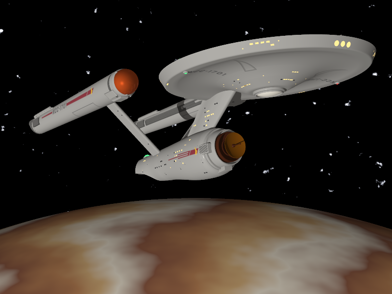

# The Ray Tracer Challenge

This repo contains the result of me working through the book, ["The Ray Tracer Challenge:
A Test Driven Guide to Your First 3D Renderer"](https://www.amazon.com/Ray-Tracer-Challenge-Test-Driven-Renderer/dp/1680502719/ref=sr_1_1?crid=9PKWGDG8TT44&keywords=the+ray+tracer+challenge&qid=1697901294&sprefix=The+Ray%2Caps%2C149&sr=8-1)
by Jamis Buck.

This is complete up through the end of the book.  The rest will be stuff I want to add
(see the to-do lists below).

From the time I completed the book, I've added many more features and improvements.  There
are also many, many more tests to ensure the engine is working as expected.  Here is a (no
pun intended) flagship scene from the gallery, fully CSG modeled, no tessellation or texture
trickery.  The ship was built using Franz Joseph's *Star Trek Blueprints* (1975), Booklet of
General Plans, and, where the plans and the original model disagree, from photographs of the
[Star Trek Starship Enterprise Studio Model](https://airandspace.si.edu/collection-objects/model-starship-enterprise-television-show-star-trek/nasm_A19740668000)
(A19740668000, gift of Paramount Pictures Inc.) in the Smithsonian's National Air and Space
Museum:

## Documentation

The scene language and everything the renderer can do are documented in full under
[`docs/`](docs/README.md).  Start there to learn how to write a scene, render it, and use
every surface, material, pattern, light and camera the engine offers.

The following are improvements I want to make.  Most of the ones relating to patterns come
from the "Putting It Together" section of chapter 10, plus some things that POVRay has that
I want to add.  Once an item is checked, you can assume it's done.

### General To-Dos:

- [x] Motion blur.

### To-Dos for Lights:
- [x] Area lights/soft shadows.
- [x] Spotlights.

### To-Dos for Cameras:
- [x] Focal blur.

### To-Dos for Surfaces:
- [x] Normal perturbation.
- [ ] Other surfaces

More to come...
