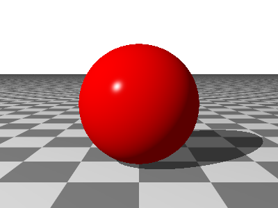

## Ray Tracer Documentation

This ray tracer renders images from scenes you *write* rather than model.  A scene is a text
file — the extension is `.igl` — describing what the world contains, how it is lit and where
it is viewed from, and the renderer turns that into a picture.  There is no user interface
to learn and nothing to click; a scene is source, and it can be kept under version control,
diffed, generated by a script, and included into other scenes like any other source file.

The engine began as a working-through of Jamis Buck's *The Ray Tracer Challenge* and has
carried on well past the end of that book.  Much of what it has grown since — the surface
types, the pattern library, the finish model, the camera's lens and shutter — follows
POV-Ray's lead, so anyone who has written a POV-Ray scene will find a good deal here
familiar, including the names things go by.

Here is the whole of a scene:

```
// Where we are looking from, and at.
camera {
    location [0, 1.5, -5]
    look at [0, 1, 0]
}

// A lamp, up and to the left.  Leave this out and the picture comes back black.
point light {
    location [-10, 10, -10]
    color White
}

// The ground.  A plane with no transform lies flat at the origin.
plane {
    material {
        pigment checker { White, Gray30 }
    }
}

// And something to look at.  A sphere is written as though it sat at the origin with a
// radius of one, then moved where it is wanted.
sphere {
    material {
        pigment color Red
        specular 0.9
        shininess 200
    }
    translate [0, 1, 0]
}
```

Render it with:

```bash
RayTracer -i first.igl
```

And that is the picture:



That is the whole path, from what you wrote to what you got.  The scene is
[`docs/examples/getting-started/first.igl`](examples/getting-started/first.igl), so you can
render it yourself and start changing things.

### Reading this documentation

The chapters below are meant to be read in order the first time through; each assumes what
came before it.  Afterwards they stand well enough on their own to be dipped into.

Throughout, the syntax of the language is given in railroad diagrams that you follow from
left to right: any path you can trace through one is something you are allowed to write.
Where a diagram loops back on itself, whatever the loop encloses may be repeated, and where
it branches, any one of the branches will do.

- [Getting Started](getting-started.md)
  - [Installing and Building](getting-started.md#installing-and-building)
  - [Rendering a Scene](getting-started.md#rendering-a-scene)
  - [Command Line Options](getting-started.md#command-line-options)
  - [Your First Scene](getting-started.md#your-first-scene)
- [Scene Files](scene-files.md)
  - [The Shape of a File](scene-files.md#the-shape-of-a-file)
  - [Scenes and Cameras](scene-files.md#scenes-and-cameras)
  - [The `render` Command](scene-files.md#the-render-command)
  - [Comments](scene-files.md#comments)
  - [Numbers, Points, Vectors and Colors](scene-files.md#numbers-points-vectors-and-colors)
  - [Variables](scene-files.md#variables)
  - [Expressions](scene-files.md#expressions)
  - [Including Other Files](scene-files.md#including-other-files)
- [The Context Block](context.md)
  - [Image Information](context.md#image-information)
  - [Angles](context.md#angles)
  - [Gamma](context.md#gamma)
  - [Scanners](context.md#scanners)
  - [Anti-Aliasing](context.md#anti-aliasing)
  - [Image Size](context.md#image-size)
- [Cameras](cameras.md)
  - [Placing a Camera](cameras.md#placing-a-camera)
  - [Field of View](cameras.md#field-of-view)
  - [Depth of Field](cameras.md#depth-of-field)
  - [Motion Blur](cameras.md#motion-blur)
- [Lights](lights.md)
  - [Point Lights](lights.md#point-lights)
  - [Distant Lights](lights.md#distant-lights)
  - [Spotlights](lights.md#spotlights)
  - [Area Lights](lights.md#area-lights)
- [Surfaces](surfaces.md)
  - [What Every Surface Has](surfaces.md#what-every-surface-has)
  - [The Primitives](surfaces.md#the-primitives)
  - [Groups](surfaces.md#groups)
  - [Combining Surfaces](surfaces.md#combining-surfaces)
  - [Bounding](surfaces.md#bounding)
- [Transforms](transforms.md)
  - [Order Matters](transforms.md#order-matters)
  - [Translate](transforms.md#translate)
  - [Scale](transforms.md#scale)
  - [Rotate](transforms.md#rotate)
  - [Shear](transforms.md#shear)
  - [Naming a Transform](transforms.md#naming-a-transform)
  - [Transforming a Group](transforms.md#transforming-a-group)
  - [Setting a Surface Moving](transforms.md#setting-a-surface-moving)
- [Materials](materials.md)
  - [The Color](materials.md#the-color)
  - [The Finish](materials.md#the-finish)
  - [Transparency and Interiors](materials.md#transparency-and-interiors)
  - [Roughening the Surface](materials.md#roughening-the-surface)
  - [Naming and Reusing](materials.md#naming-and-reusing)
  - [Materials on a Group](materials.md#materials-on-a-group)
- [Managing Fonts](fonts.md)
  - [The Font Catalog](fonts.md#the-font-catalog)
  - [Adding Font Faces](fonts.md#adding-font-faces)
  - [Inspecting a Face](fonts.md#inspecting-a-face)
  - [Kerning](fonts.md#kerning)

The chapters below are still to be written.

- Advanced Surfaces — extrusions, lathes, sweeps, text, height fields and L-systems
- Pigments and Patterns — where a surface gets its color
- Importing from POV-Ray — the `libraries` verb and what it brings across
- Reference — the keyword index and the whole grammar

### Regenerating the syntax diagrams

The diagrams are generated from the EBNF under `docs/diagrams/` and written to
`docs/images/`, a light and a dark copy of each.  Node.js is needed, but nothing is
installed globally:

```bash
docs/generate-diagrams.sh
```
