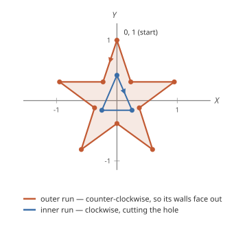
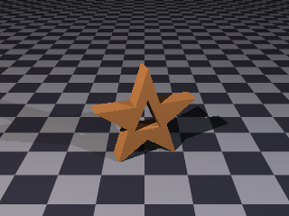
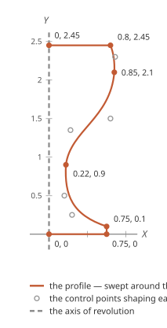
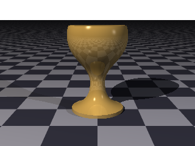
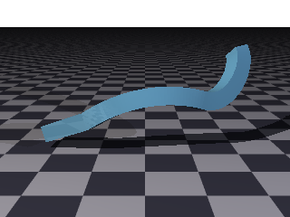
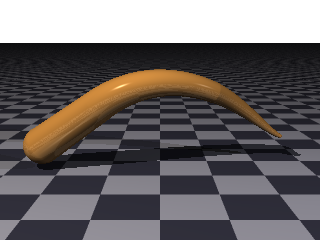
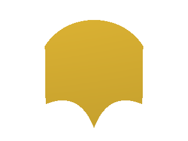
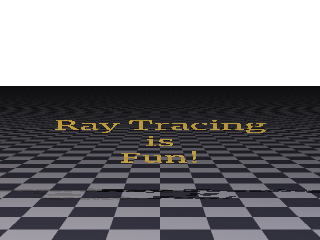
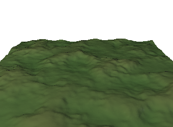
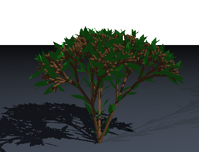

## Advanced Surfaces

The [primitives](surfaces.md) are shapes the renderer knows the equation of.  The surfaces here
are built rather than known: you describe an outline, a path or a rule, and the geometry is
worked out from it.

Everything in this chapter accepts the
[usual surface properties](surfaces.md#what-every-surface-has) — a material, transforms, a
name — and everything here can go into a [group](surfaces.md#groups) or a
[CSG](surfaces.md#combining-surfaces) like any other surface.

### Paths

Four of these surfaces are built from a **path**: a 2D outline drawn in its own plane.

<picture>
  <source media="(prefers-color-scheme: dark)" srcset="images/advanced/pathClause-dark.svg">
  <source media="(prefers-color-scheme: light)" srcset="images/advanced/pathClause.svg">
  
</picture>

| Command | What it does |
| --- | --- |
| `move to x, y` | Lift the pen and put it down somewhere new. |
| `line to x, y` | A straight segment. |
| `quad cx, cy to x, y` | A quadratic curve, bending toward one control point. |
| `curve ax, ay, bx, by to x, y` | A cubic curve, with two control points. |
| `close` | Join back to where this run of the path started. |
| `svg '…'` | The whole path as an SVG path string. |
| `icon '…'` | The outline of a [FontAwesome icon](#icons). |
| `text { … }` | The outline of a run of [text](#text-as-a-path). |

A path may hold more than one **run** — each starts with a `move to` and usually ends with a
`close`.  Whether any given spot ends up solid is decided by the **even-odd rule**: draw a
line from that spot out to infinity, count how many times it crosses the outline, and the spot
is filled when that count comes out odd.  In practice that reduces to a few things worth
remembering:

- A run on its own is solid.
- A run drawn *inside* another cuts a **hole** through it.
- A run inside that hole is solid again, and so on — each level of nesting flips fill to hole
  and back.
- Two runs side by side, with neither inside the other, are simply two solid pieces.

As far as *holes* go, the direction a run is drawn in — clockwise or counter-clockwise — makes
no difference; the only thing that counts is whether one run sits inside another.  This is the
same rule an SVG file selects with `fill-rule="evenodd"`, and it is worth noting it is *not*
SVG's default non-zero winding: a pasted `svg` outline that leaned on winding direction to
keep a hole open will come out filled here, so make sure the hole's run is genuinely nested
inside the outer one rather than trying to reverse its direction.

Direction is not entirely free, though.  When a path is given thickness — extruded, spun on
the lathe, swept along a spline — each of its segments also becomes a **wall**, and which way
that wall faces is fixed by the direction the segment was drawn.  The flat caps do not care
about winding, but the sides do.  For an outline with a hole the rule is simple: draw the
outer run **counter-clockwise** and any hole **clockwise**, and every wall faces outward, as
it should.  Reverse the outer run and its walls face inward, so the sides toward the light
come back shaded as though they were the back of the surface.  If a path solid looks oddly
dark on its lit side, a run drawn the wrong way round is the first thing to check.

The `svg` form is worth knowing about: it takes the `d` attribute out of an SVG file, so an
outline drawn in a vector editor can be pasted straight in.

#### Icons

A path may also be a [FontAwesome](https://fontawesome.com) icon, so any of its thousands of
symbols can be given thickness, spun or laid flat like any other outline:

```
extrusion {
    path { icon 'solid:star' }
    min Y 0  max Y 40
}
```


An icon is named as `style:name` — `solid:star`, `brands:github` — or as just `name`, in which
case the style is taken to be `regular`.  The name picks out the zip's `svgs/{style}/{name}.svg`
file, whose `d` outline is then handled exactly as an `svg` string is.

Icons are not built in: you install a FontAwesome zip once with the
[`libraries --fa-zip`](libraries.md#fontawesome-icons) command, and every scene draws its icons
from there.  An icon arrives at the scale and orientation SVG uses — a box some hundreds of units
across, with Y running *downward* — so, like a pasted `svg` outline, it usually wants scaling down
and flipping to sit the right way up.  `gallery/Local/icons.igl` extrudes two of them, named both
ways.

#### Text as a path

A path may also be a run of **text**.  Where the [text surface](#text) turns a string into
finished, extruded letters in one step, `text` inside a `path` gives you the letters' *outline*
instead — the glyphs laid out and folded into the path — which you can then extrude, spin on the
lathe, sweep along a spline, or carve out of another shape with a [CSG](surfaces.md#combining-surfaces):

```
extrusion {
    path {
        text {
            text 'Ray'
            font 'Merriweather'
            layout { horizontal position center }
        }
    }
    min Y 0  max Y 0.25
    rotate X -90
}
```

The block is written exactly like the [text surface](#text) — the same `text`, `font`, `layout`
and `kerning` — with one difference: because a path is not a surface, it takes *only* those, not a
surface's own grammar.  There is no `material`, no `translate` or `rotate`, no `open` inside the
`text` block here; those belong to the shape the path feeds, as in the extrusion above.  Text
comes at the font's own scale, where a line is about one unit tall — small enough to use as it is,
unlike an icon.

#### Moving a path

A path may carry **2D transforms** of its own — `translate`, `scale` and `rotate` — applied to the
whole outline once it is drawn, before it is given depth.  They are the flat, two-dimensional
counterpart of the [transforms a surface carries](transforms.md), and they read the same way, with
two-number points and a single-angle turn instead of three-number points and an axis:

| Transform | What it does |
| --- | --- |
| `translate [dx, dy]` | Move the outline.  `translate X dx` and `translate Y dy` move along one axis. |
| `scale [sx, sy]` | Resize it.  `scale s` resizes it evenly; `scale X sx` scales along one axis. |
| `rotate a` | Turn it about the origin, within its own plane (no axis — a path is flat). |

Several compose in the order written, exactly as a surface's do — the first acts on the raw
outline, the next on its result.  This is what lets an outline be placed relative to the shape that
carries it.  A [lathe](#lathe), for instance, spins a path about the Y axis and reads each point's
X as its distance from that axis, so a [text path](#text-as-a-path) — whose letters sit near the
origin — has to be moved out before it will spin into a ring rather than a blob:

```
lathe {
    path {
        text { text 'i'  font 'Merriweather' }
        translate [1.5, 0]      // out to a radius of 1.5 before it is spun
    }
}
```

`gallery/Local/text-lathe.igl` takes that further — the `i` spun into a ring, then cut down to a
quarter turn with a [CSG](surfaces.md#combining-surfaces) intersection.

### Extrusion

A path given thickness along Y.  Here is the star's path on the left — the outer run drawn
counter-clockwise and the nested run that cuts the hole drawn clockwise, so that every side
wall faces outward — beside the solid it extrudes into.

<table>
<tr>
<td width="46%" valign="middle">

<picture>
  <source media="(prefers-color-scheme: dark)" srcset="images/figures/path-extrusion-dark.svg">
  <source media="(prefers-color-scheme: light)" srcset="images/figures/path-extrusion.svg">
  
</picture>

</td>
<td width="54%" valign="middle">



</td>
</tr>
</table>

```
extrusion {
    path {
        move to 0, 1
        line to -0.23, 0.31
        // ... the rest of the star, counter-clockwise ...
        close

        // A second run, inside the first, is cut out of it.
        move to 0, 0.42
        line to 0.25, -0.16
        line to -0.25, -0.16
        close
    }

    min Y -0.18
    max Y 0.18
    rotate X -90
}
```

`min Y` and `max Y` say how thick, exactly as they do for a
[cylinder](surfaces.md#cylinder-and-conic), and `open` leaves the two ends off.  A path is
drawn flat in X and Y, so an extrusion comes out lying down; `rotate X -90` stands it up.

The complete scene is
[`docs/examples/advanced/extrusion.igl`](examples/advanced/extrusion.igl).

### Lathe

A path spun about the Y axis.  The path is the silhouette of one side of the finished object,
so it is usually drawn from the axis outward and back again.  On the left is the goblet's
profile — the points it passes through, and the control points that shape its curves — beside
the solid it sweeps out.

<table>
<tr>
<td width="42%" valign="middle">

<picture>
  <source media="(prefers-color-scheme: dark)" srcset="images/figures/path-lathe-dark.svg">
  <source media="(prefers-color-scheme: light)" srcset="images/figures/path-lathe.svg">
  
</picture>

</td>
<td width="58%" valign="middle">



</td>
</tr>
</table>

```
lathe {
    path {
        move to 0, 0                                // on the axis, at the foot
        line to 0.75, 0
        line to 0.75, 0.1
        curve 0.3, 0.25, 0.2, 0.5 to 0.22, 0.9      // drawn in for the stem
        curve 0.28, 1.35, 0.8, 1.5 to 0.85, 2.1     // flaring out into the bowl
        quad 0.86, 2.3 to 0.8, 2.45
        line to 0, 2.45                             // and back to the axis
    }
}
```

The X of each point is how far that part of the profile stands from the axis and the Y is how
high up it sits.  Anything round and symmetrical — a glass, a vase, a bottle, a chess
piece — is quicker to write this way than any other.

The complete scene is [`docs/examples/advanced/lathe.igl`](examples/advanced/lathe.igl), and
`gallery/Local/extrusions/` has several more.

### Sweep

A 2D profile carried along a 3D spline.  The profile says what the cross-section is; the
spline says where it goes.



```
sweep {
    profile {
        move to -0.22, -0.22
        line to  0.22, -0.22
        line to  0.22,  0.22
        line to -0.22,  0.22
        close
    }

    discontinuous spline {
        move to -2.6, 0.4, 0.6
        line to -1.4, 0.9, 0
        quad 0, 1.9, -0.6 to 1.4, 1.4, 0
        curve 2.1, 1.2, 0.3, 2.6, 2.2, 0.6 to 2.4, 2.6, 0.8
    }

    steps 40
}
```

<picture>
  <source media="(prefers-color-scheme: dark)" srcset="images/advanced/splineClause-dark.svg">
  <source media="(prefers-color-scheme: light)" srcset="images/advanced/splineClause.svg">
  
</picture>

A spline is written like a path, except every point is a full 3D triple rather than an X,
Y pair.  `steps` is how finely the profile is carried along it.  If there are too few, the
result is visibly faceted.  If there are too many, it costs more time to render than it
needs to.

**A changing cross-section.**  Any spline point may carry a `scale`, and the profile grows or
shrinks to match as it passes through — the sweep's answer to a [tube](#tube)'s varying radius,
but applied to whatever shape the profile is rather than to a radius.  It is interpolated
between the points that set it, so the profile eases from one size to the next rather than
jumping, and a point with no `scale` keeps the profile at its natural size (`scale 1`):

```
sweep {
    profile { ... }
    spline {
        move to 0, 0, 0  scale 1
        line to 0, 5, 0  scale 2.5     // two and a half times as big by the top
    }
}
```

**Where the spline runs through the profile.**  Because the spline is the path the profile
rides along, a sweep **centers** the profile about the 2D origin before carrying it — so the
spline threads the middle of the profile, wherever in its own plane the profile was actually
drawn.  This matters most for an outline that lives off to one side, as a pasted `svg` or an
`icon` tends to (its coordinates often fill a box with a corner at the origin); without
centering the spline would run along the profile's edge rather than down its middle.  A sweep
that means to keep the profile's own placement — to aim the spline at the profile's 2D
origin — says `no center`.

**Tangent continuity.**  A sweep expects its spline to flow smoothly from one segment into the
next, and refuses if it does not, telling you which control point is at fault and by how many
degrees it bends:

```
The sweep's spline isn't tangent-continuous at control point 1 (near [-1.400, 0.900, 0.000])
-- the segments meeting there bend by about 13.2 degrees instead of flowing smoothly into
each other.  Mark it "discontinuous" if this kink is intentional.
```

That is a genuine kindness — handwritten control points almost never line up by accident, and
a kink you did not mean is much easier to fix when something says exactly where it is.  When
you did mean it, write `discontinuous` before `spline`, as the example above does.

The complete scene is [`docs/examples/advanced/sweep.igl`](examples/advanced/sweep.igl).

### Tube

A pipe threaded through a series of points, each with a radius of its own, so it may taper
along its length.



<picture>
  <source media="(prefers-color-scheme: dark)" srcset="images/advanced/tubeClause-dark.svg">
  <source media="(prefers-color-scheme: light)" srcset="images/advanced/tubeClause.svg">
  
</picture>

```
tube {
    discontinuous

    radius 0.45 at [-2.8, 0.6, 0.5]
    radius 0.38 at [-1.4, 1.6, 0]
    quad  radius 0.3  at [-0.2, 2.5, -0.4]  radius 0.24 at [1.2, 1.9, 0.2]
    curve radius 0.18 at [1.9, 1.6, 0.6]  radius 0.1 at [2.6, 0.9, 0.9]  radius 0.05 at [3, 0.7, 1]
}
```

A bare `radius … at …` is a straight segment.  `quad` takes two such points and bends between
them; `curve` takes three.  The radius is interpolated along with the position, which is what
gives the taper.

A tube checks for tangent continuity exactly as a sweep does, and `discontinuous` says the
kinks are meant.

Where a sweep carries an arbitrary profile, a tube is always round — which makes it the right
tool for cables, pipes, handles and stems, and it is what the
[L-system](#l-systems) renderer uses to draw branches.  The complete scene is
[`docs/examples/advanced/tube.igl`](examples/advanced/tube.igl), and
`gallery/Local/power-cord.igl` is a longer one.

### Generic Shape

An arbitrary closed 2D path, left flat rather than given thickness.  Where an extrusion makes a
solid out of a path, a generic shape is the path itself — a [shape](surfaces.md#shapes), with a
front and a back and no inside.



```
generic shape {
    path {
        move to -1, 0.6
        curve -0.55, 1.3, 0.55, 1.3 to 1, 0.6     // a rounded top
        line to 1, -0.6
        quad 0.3, -0.3 to 0, -1.1                  // a notch, cut with two quadratics
        quad -0.3, -0.3 to -1, -0.6
        close
    }
}
```

The complete scene is
[`docs/examples/advanced/generic-shape.igl`](examples/advanced/generic-shape.igl).

### Text

Letters turned into real geometry.  Each glyph's outline becomes a path, and the path is
extruded — so text is lit, shadowed and reflected like anything else in the scene.



<picture>
  <source media="(prefers-color-scheme: dark)" srcset="images/advanced/textClause-dark.svg">
  <source media="(prefers-color-scheme: light)" srcset="images/advanced/textClause.svg">
  
</picture>

```
text {
    text 'Ray Tracing\nis\nFun!'
    font 'Merriweather'

    layout {
        text alignment center
        horizontal position center
        vertical position center
    }

    scale [1, 1, 0.35]
    rotate X -90
}
```

| Property | What it does |
| --- | --- |
| `text` | What to write.  `\n` starts a new line. |
| `font` | Which font face; see [Managing Fonts](fonts.md). |
| `layout` | Alignment, positioning and the gap between lines. |
| `open` | Leave the front and back faces off. |

Like an extrusion, text is built lying flat, so it wants standing up.  Scaling Z before that
is how you set how thick the letters are.

The font need not already be in your catalog — a font Google Fonts carries is fetched the
first time a scene asks for it.  [Managing Fonts](fonts.md) covers the catalog, and how to add
a face Google does not have.

The complete scene is [`docs/examples/advanced/text.igl`](examples/advanced/text.igl).

### Height Field

An image read as terrain: how bright each pixel is says how high the ground stands there.



<picture>
  <source media="(prefers-color-scheme: dark)" srcset="images/advanced/heightFieldClause-dark.svg">
  <source media="(prefers-color-scheme: light)" srcset="images/advanced/heightFieldClause.svg">
  
</picture>

```
heightfield {
    image 'terrain.png'

    material {
        pigment linear Y gradient {
            [0, [0.25, 0.4, 0.2], 0.45, [0.5, 0.45, 0.3], 1, [0.9, 0.9, 0.92]]
        }
    }

    // The field is built over the unit square, so centre it and then give it its extent.
    translate [-0.5, 0, -0.5]
    scale [7, 1.6, 7]
}
```

The field is built over the unit square in X and Z with heights from 0 to 1, so it is nearly
always translated to center it and then scaled to whatever size the scene wants.

| Property | What it does |
| --- | --- |
| `image` | The picture to read.  A path or a web address. |
| `clip` | Ignore anything below a given height, cutting the terrain off. |
| `open` | Leave the sides and underside off. |

The image may be a **web address**, as it may for an
[image pigment](pigments-and-patterns.md#image-pigments), and `uncached` before `image` works
here too.

A height field cannot make an overhang or a cave: there is exactly one height for each point
on the ground, because there is exactly one pixel.  That is the limit of the technique rather
than of this renderer.

The map in the picture above was itself rendered by this ray tracer — a plane wearing a bozo
pattern, seen from straight above — so the example needs nothing from outside.  The complete
scene is
[`docs/examples/advanced/height-field.igl`](examples/advanced/height-field.igl).

### Object Files

A mesh loaded from a Wavefront `.obj` file, which is how you bring in geometry modeled
somewhere else:

```
object file {
    source 'model.obj'
}
```

The triangles become [smooth triangles](surfaces.md#triangle-and-smooth-triangle) where the
file carries normals, and plain ones where it does not.

### L-Systems

An L-system is a short set of rewriting rules.  A starting string is rewritten by the rules,
over and over, and the result is read as instructions for a turtle that draws in 3D.  A handful
of rules produces something no one would write out by hand.



```
bush = lsystem {
    axiom '$A'

    productions {
        'A' -> '[&FL!A]/////[&FL!A]///////[&FL!A]'
        'F' -> 'S/////F'
        'S' -> 'FL'
        'L' -> '[C^^{-f+f+f-|-f+f+f}]'
    }

    materials {
        'C' -> blade
    }

    controls {
        tubes
        angle 22.5
        length 1
        diameter 0.5
        factor 0.9
    }
}

lsystem bush {
    generations 6
    material stem
    scale 0.15
}
```

That bush is from Prusinkiewicz and Lindenmayer's *The Algorithmic Beauty of Plants*, and
every stem and leaf in the picture comes from the four rules above.

| Part | What it is |
| --- | --- |
| `axiom` | The string the rewriting starts from. |
| `productions` | The rules.  Each replaces one character with a longer run. |
| `materials` | Binds a character to a material, so parts can differ in color. |
| `controls` | How the turtle draws: the turn angle, the stem diameter, and so on. |
| `generations` | How many times to apply the rules. |

The definition and the use are separate on purpose.  A named L-system may be drawn several
times at different generation counts, which is how you show a thing growing.

Some of the characters a production may use:

| Character | What the turtle does |
| --- | --- |
| `F` | Draw forward. |
| `f` | Move forward without drawing. |
| `+` `-` | Turn left, turn right. |
| `&` `^` | Pitch down, pitch up. |
| `\` `/` | Roll left, roll right. |
| `[` `]` | Remember where you are; go back there.  This is what makes a branch. |
| `{` `}` | Begin and end a filled polygon — a leaf. |
| `\|` | Turn right around. |
| `!` | Narrow the stem. |
| `$` | Turn to face straight up. |
| `~` | Stamp a leaf — a surface of your own, or the built-in blade. |
| `%` | Cut off the rest of this branch. |

There are a few more, and `Geometry/LSystems/LSystemShapeRenderer.cs` has the full table.

A production may be given a probability, in which case several rules may compete for the same
character and one is chosen at random each time:

```
productions {
    'F' (0.34) -> 'F[+F]F[-F]F'
    'F' (0.33) -> 'F[+F]F'
    'F' (0.33) -> 'F[-F]F'
}
```

That is what keeps a stand of trees from looking like one tree copied.  The choice is made
from a seed, so a scene still renders the same way twice; `with seed` on the L-system changes
which stand of trees you get.

`controls` chooses `pipes` or `tubes` for the stems — `tubes` taper into one another and leave
no shoulder at a joint, `pipes` are cheaper where the diameter never changes.

The complete scene is [`docs/examples/advanced/lsystem.igl`](examples/advanced/lsystem.igl),
and `gallery/Local/l-systems/` has a dozen more, from a Hilbert curve to a berry tree.
