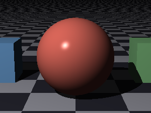
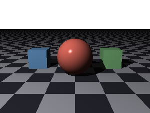
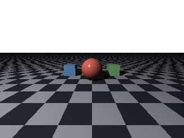

## Cameras

The camera is where the picture is taken from.  Every scene needs one; a scene with no camera
has no point of view to render from and is refused.  A scene may hold several, which is how a
file offers a choice of viewpoints — see
[Scenes and Cameras](scene-files.md#scenes-and-cameras) for how more than one is named and
chosen.  This chapter is about a single camera and everything you can say about it.

<picture>
  <source media="(prefers-color-scheme: dark)" srcset="images/cameras/cameraClause-dark.svg">
  <source media="(prefers-color-scheme: light)" srcset="images/cameras/cameraClause.svg">
  
</picture>

The properties fall into three groups: where the camera stands and what it looks at, how much
of the world it takes in, and — the two that cost extra rays — the lens and the shutter.

### Placing a Camera

```
camera {
    location [0, 2.5, -7]
    look at [0, 1, 0]
}
```

`location` is where the camera stands and `look at` is the point it is aimed at.  Between
them they settle everything about the view except which way is up and how wide it is.

`up` gives the direction the top of the image should point, and defaults to `[0, 1, 0]`.  It
does not have to be perpendicular to the way the camera looks; only the part of it that is
gets used, so an approximate up vector works.  Change it to roll the camera:

```
camera {
    location [0, 2.5, -7]
    look at [0, 1, 0]
    up [0.2, 1, 0]      // tipped a little to one side
}
```

There is one arrangement to avoid: an `up` that points along the direction of view.  With
nothing left over after the parallel part is removed, there is no "up" to be had and the view
comes out degenerate.  Looking straight down, give an `up` of `[0, 0, 1]` rather than
`[0, 1, 0]` — the light tests in this repository do exactly that.

### Field of View

How much of the world the camera takes in, as an angle.





Those three are the same scene from the same place — 30°, 60° and 100°.  The camera has not
moved; only how much it takes in has changed.

```
camera {
    location [0, 2.5, -7]
    look at [0, 1, 0]
    field of view 45
}
```

The angle is read in whatever unit the [context block](context.md#angles) names, and degrees
are the default.  Said nothing, the field of view is 50°, which sits in the range — roughly
40° to 60° — that usually looks most natural; a fair bit wider than that starts to exaggerate
the scene, and a fair bit narrower starts to flatten it.

A narrow angle does more than crop.  It flattens the picture — near and far things come out
closer in size — while a wide one exaggerates depth and bows straight lines near the edges.
Moving the camera closer and narrowing the angle are therefore *not* interchangeable, even
though both make the subject bigger.

The angle is measured across the wider of the image's two dimensions.

The three examples are in
[`docs/examples/cameras/`](examples/cameras/).

### Depth of Field

By default the camera is a pinhole: every ray leaves a single point, so everything is in
focus at every distance.  No real lens behaves that way.  Giving the camera an `aperture`
makes it gather light across a disc instead, so only what lies at the focal distance stays
sharp.

```
camera {
    location [1.6, 3.4, -7.5]
    look at [-0.97, 0.09, 1.5]
    aperture 0.25
    focal point [-0.2, 0.9, 1.5]
    blur samples 32
}
```

| Property | What it means |
| --- | --- |
| `aperture` | The **radius** of the lens, in the scene's own units.  Zero is a pinhole. |
| `focal point` | A point in space — an `[x, y, z]` — at which focus is sharpest. |
| `focal distance` | How far ahead the plane of sharp focus lies. |
| `blur samples` | How many places across the lens each ray is taken from. |
| `seed` | The seed the lens's scatter is drawn from. |

The aperture is a real radius rather than an uncalibrated knob, so how much a thing blurs
follows from where it stands.  Wider means shallower depth of field.

Say where the focus lies either way round.  `focal point` is exactly that — a point in space,
written as coordinates, where focus should be sharpest:

```
focal point [-0.2, 0.9, 1.5]
```

It is a coordinate and not the name of a surface, but the coordinate of a surface is usually
just what you want: give the focal point the same position you placed something at, and that
thing comes out sharp.  The camera then works out for itself how far ahead the point lies, so
the focus stays on it even if the camera later moves.  `focal distance` instead states that
distance outright — a single number — for when nothing sits at the plane of focus to borrow a
position from.  Said neither way, the camera focuses on whatever it was aimed at.

Two things worth knowing.  **Blur samples alone do nothing without an aperture** — there is
no width to gather across, so such a camera stays on the single-ray path rather than firing
the same ray many times over.  And the cost is real: 32 samples means at least 32 rays per
pixel, more with anti-aliasing on top.

`gallery/Local/focal-blur.igl` is a scene built around this.

### Motion Blur

The shutter is the other half of the same idea.  By default it does not linger: every ray is
fired at the same instant, so a thing crossing the frame is drawn as sharply as one standing
still.  Let it stay open and whatever moves while it is open comes out smeared along its
path.

```
camera {
    shutter 1
    blur samples 32
}

sphere {
    translate [-2.4, 0.5, 0]
    motion { translate [0.55, 0, 0] }
}
```

`shutter` is how much of a surface's motion is caught while the shutter is open: at `1` a
moving thing runs the whole of its motion, at `0.5` it gets half way, and at `0` — the
default — nothing smears however it is set moving.

What actually moves is a property of the *surface*, not the camera; `motion { }` takes the
same transforms a surface is placed with.  That is covered under *Transforms*.  Keeping the
two apart means a scene can leave its motions in place and simply shut the shutter to get a
still picture out.

The lens and the shutter **share one set of samples**, so asking for both costs no more rays
than asking for either.  `blur samples` sets the count for both.

`gallery/Local/motion-blur.igl` is a scene built around this.

### What is still to come

Every camera here is a perspective camera — the ordinary sort, which is what a pinhole gives
you.  Other kinds of projection, such as orthographic and fisheye, are planned but not yet
implemented.
