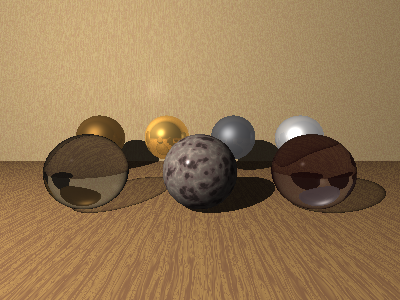

## Using Libraries

A **library** is a file of ready-made, named definitions — materials, pigments, interiors and
the colors and numbers they lean on — that a scene may draw from without carrying the
definitions itself.  A scene reaches into one with `import`:

```
import 'golds' { Gold3CMaterial }

sphere { material Gold3CMaterial }
```

Where [`include`](scene-files.md#including-other-files) brings in everything a file has, an
`import` brings in only the names you list and leaves the rest of the library out of scope —
which matters, because a library may hold a hundred materials and a scene will almost never
want more than a few.  The `import` statement itself is covered in
[Scene Files](scene-files.md#importing-from-a-library); this chapter is about the `libraries`
verb, which makes, lists and removes the libraries you import from.

The one you are most likely to want holds the textures POV-Ray ships with, converted and
brought across:



Every material in that scene — the woods, the metals, the glass and the stone — came from a
library and was named, not written.  The whole scene is
`gallery/POVRay/library-textures.igl`.

### Libraries That Come With It

Some libraries ship with the ray tracer.  They are not there until you ask for them:

```bash
dotnet run -- libraries --install
```

That copies them into your library set, and says which it wrote.  It is a thing to ask for rather than
something that happens the first time you render, because writing into your home directory unbidden is
a surprise that is hard to undo — and because a verb can be run again after an update, which a
once-only step at first run cannot.

**A library you already have is left alone.**  If a name is taken, the install keeps yours and says so;
`--overwrite` replaces it.  So a sky you have tuned to your liking survives a new release of the ray
tracer, and the shipped ones are a starting point rather than something imposed.

#### Daylight

The one that ships today is `daylight`, and it exists because the sky in this ray tracer is a real
one — it works out the color of every part of the dome from the way air scatters sunlight.  That is
what makes it look right, and it is also what makes it awkward, because the numbers it wants are the
ones nobody can guess.  Nobody knows what turbidity they want.  Everybody knows what a clear morning
looks like.

```
import 'daylight' { GoldenHour, GoldenHourLight }

background GoldenHour
light GoldenHourLight
```

| | |
| --- | --- |
| `ClearMorning` | Mid-morning, sun well up, air washed clean. |
| `ClearNoon` | Overhead and unforgiving; shadows fall almost straight down. |
| `GoldenHour` | An hour before sunset, long shadows and a warmth in the light. |
| `Sunset` | The sun on the horizon, most of its light gone red on the way. |
| `HazyAfternoon` | Hot and thick, every edge softened and the blue washed out. |
| `WinterSun` | Low and cold, bright without being warm. |
| `Overcast` | Flat and shadowless, made rather than derived — see below. |
| `Dusk` | After the sun has gone, what light there is coming from everywhere. |

**Each is two names, and you want both.**  A sky is what you look at; the light it casts is a separate
thing, and taking one without the other gives a picture that disagrees with itself — a scene with no
sky light quietly keeps the flat `ambient` guess that a sky light exists to replace.  So every
`GoldenHour` has a `GoldenHourLight` beside it.

**They may be adjusted where they are used**, the same as any named thing, so a name is a starting
point and not a straitjacket:

```
light GoldenHourLight { samples 64 }
```

**Two of them are not physical skies at all.**  `Overcast` and `Dusk` are gradients, because a real sky
with the sun taken out of it is not the same thing as a cloudy one: cloud spreads the sun's light
across the whole dome rather than hiding it, so the honest way to get an overcast day is to paint one.

**Every one of these skies has its sun on the `+Z` side.**  That is worth knowing before you place a
camera, because the consequence is invisible until you render: a wall, a row of buildings or a face
of anything that points toward `-Z` is in shade under all six, and a camera sitting out at `-Z`
looking back — which is the usual place to put one — sees the shaded side of everything.  The picture
comes out a silhouette, and nothing in it says why.

The sun's direction is worked out from its `elevation` and `azimuth`, and the azimuth runs the way a
compass does with `-Z` for north:

| Azimuth | The sun lies toward |
| --- | --- |
| `0` | `-Z` |
| `90` | `+X` |
| `180` | `+Z` |
| `270` | `-X` |

The six run from `110` to `268`, which is the half of the compass between `+X` and `-X` passing
through `+Z` — morning on one side, evening on the other, and none of them behind you.  So face what
you want lit toward `+Z`, or write a sky of your own with the azimuth you need:

```
MyMorning = pigment physical sky { sun elevation 30  sun azimuth 20  turbidity 2.2  brightness 3 }
```

#### Trees

```
import 'trees' { Elm }

object Elm(9)
object Elm(7, 'autumn')          { translate X 12 }
object Elm(8, 'winter', 4)       { translate X -12 }
```

| | |
| --- | --- |
| `Elm` | Reaching, the limbs sweeping up and out. |
| `Oak` | Heavy and broad, throwing its weight sideways. |
| `Birch` | Slender, pale-barked, dividing into finer twigs than the others. |
| `Fir` | A conifer: one trunk the whole height, with rings of branches coming off it.  Evergreen, so spring, summer and autumn are the same tree -- but ask one for winter and snow gathers along its boughs. |

Three numbers, of which only the first is required: **how tall**, **what time of year**, and **which
tree of that kind**.

**Height is what you would measure** — `Elm(9)` stands about nine units high.  That is worth saying
because the obvious alternative is for the number to mean the trunk, and then nobody can picture it.

**The season is a word**: `'summer'`, `'autumn'` (or `'fall'`), `'winter'`, or anything else for
spring.  A winter tree has no leaves at all and shows the shape they were hanging on.

**The variant is which tree of that kind you want.**  The same numbers always grow the same tree, down
to the last twig — today, next year, and in every frame of an animation.  Change it and you get a
different tree of the same species, which is what a row of them needs, since three identical elms read
as a diagram rather than a hedge:

```
for tree in [0, 5] {
    object Elm(8 + random(tree) * 3, 'summer', tree) { translate X tree * 7 - 17 }
}
```

The library keeps its own workings.  A scene that imports `Elm` does not also inherit the dozen
functions and primitives an elm is built from — see
[Importing from a library](scene-files.md#importing-from-a-library) for the rule, and for the one
exception: the barks are materials, and a material is looked up where it is *used*, so `TreeElmBark`
and its siblings do arrive.  They carry the prefix so they will not collide with anything of yours.

#### Undergrowth

```
import 'undergrowth' { Grass, Boxwood, Lavender }

object Grass(10)
object Boxwood(1.2, 'winter')    { translate X 3 }
object Lavender(0.8, 'summer', 4) { translate X -3 }
```

The `trees` library gives a scene its trees and leaves them standing on a flat green plane.  This one
is the rest of it — the grass underfoot and the shrubs between, which is most of what separates a
picture of some trees from a picture of somewhere.

| | |
| --- | --- |
| `Grass` | An area of it, covered edge to edge.  The first number is how far across, not how tall. |
| `Tuft` | One clump on its own, for putting somewhere in particular. |
| `Boxwood` | A dense clipped dome.  Evergreen, so like the fir it takes snow rather than ignoring winter. |
| `Bramble` | Arching canes with leaves along them; berries in autumn, bare canes in winter. |
| `Lavender` | A mound of fine stems, in flower through the summer and cut back by winter. |

**The first three numbers mean what they mean everywhere else** — how big, what time of year, and
which one of that kind — so a scene that has planted an autumn stand can plant autumn undergrowth
beneath it without learning a second set of habits.  Only the first is ever required.

**What a season does differs by plant**, as it does in a garden.  Grass goes tawny and then to pale
straw, and lies down as well as changing color.  A bramble turns, fruits, and finally stands as bare
canes.  Lavender flowers, fades, and is cut back.  A boxwood is evergreen and does what the fir does:
three of its four seasons look alike, and in winter it takes snow.

**Height is the setting that matters most**, and not for the reason you would guess.  A blade of grass
is about a fortieth of its length across, which is right — and it means ankle-high grass seen from
across a field has blades a third of a pixel wide.  A blade thinner than its pixel does not draw as a
blade; it draws as a speck, and a field of specks draws as wire wool.  Knee-high grass in the same
picture reads immediately, and costs *less*, since taller tufts stand further apart.  If a patch looks
like static, make it taller before you make it denser.

**Grass is the one thing here that can make a scene slow**, and it is worth saying so plainly rather
than leaving it to be discovered.  A blade is two tubes, a tuft is a dozen blades, and an area of it
is a tuft every fifth of a unit in both directions — so `Grass(8)` is on the order of twenty thousand
surfaces.  That is a number this ray tracer handles perfectly well, but it is twenty thousand rather
than twenty, and the reason it is affordable is worth knowing: the tufts are gathered into blocks of
sixty-four and the blocks into one group.  A group that a ray gets inside asks *every* child, so one
flat list of two thousand tufts is two thousand questions per ray; two layers makes it thirty-odd.
Measured on one patch, flattening it is the same picture and **four times the wait**.

A [sky light](materials.md) is the other half of any grass bill.  It works by looking at the dome from
many directions at every point it lights, and every one of those looks has to get out through the
grass, so the sample count is most of the render time in a scene like that.  Turning it down where it
is used costs less than it sounds — grass has no large flat surface for the grain to show on.

`Grass` takes two more numbers after the usual three, and they come *after* rather than among them
precisely so the first three keep their meaning:

```
object Grass(8, 'summer', 1, 0.3, 0.5)     // half as many tufts, a quarter the surfaces
```

Halving the last one quarters the count, since the tufts thin out in both directions at once.  Grass
seen from across a field does not need what grass seen from a foot away needs.

#### Rocks

```
import 'rocks' { Boulder, Scree }

object Boulder(1.2)
object Scree(6, 'winter')        { translate Z 4 }
```

The other two libraries grow things.  This one is what they grow among, and it is the last thing a
piece of ground needs before it stops looking swept.

| | |
| --- | --- |
| `Boulder` | One big weathered stone, lumpy all over.  The expensive one — see below. |
| `Cobble` | A smaller stone with flat faces, knocked off something bigger.  Cheap. |
| `Scree` | An area of cobbles, thrown down thickly.  The first number is how far across. |

**The season does one thing here, and it is winter.**  A rock is not deciduous, so three seasons of
the four are the same stone; in winter snow lies on top of it, as it gathers on the fir and the
boxwood.  That is all the word does, and it is asked for anyway so a scene that sets its season in one
place gets rock agreeing with the grass around it.

**There are two kinds of stone for a reason.**  A rock is a shape problem before it is anything else:
what gives one away instantly is a silhouette that is too regular.  A sphere reads as a ball from
every angle and no amount of coloring the surface repairs it, because the outline is what the eye
checks.

So a `Boulder` is an [isosurface](advanced-surfaces.md#isosurface) — a ball with noise subtracted from
its radius, which gives an outline irregular in the way stone is.  That is the real thing at the real
price: an isosurface is *marched* along the ray rather than solved for, and sixty-four of them
measured about twenty times what sixty-four spheres cost.  A `Cobble` is a sphere with flat faces cut
off it by a couple of turned cubes — all analytic, nothing marched — which reads as broken stone
rather than weathered stone, and measured about four times a sphere rather than twenty.

That is the same division `undergrowth` makes between `Tuft` and `Grass`: the careful expensive one
for the few you look at, the cheap one for the many you do not.  A picture wants some of each.

#### Fire

```
import 'fire' { Campfire }

object Campfire(1.4) { translate [3, 0, -2] }
```

| | |
| --- | --- |
| `Flame` | One flame on its own.  The first number is how tall it stands. |
| `Campfire` | Logs, coals between them, and flames over the lot.  The number is how far across. |
| `Torch` | A shaft with a flame at the top of it. |
| `Embers` | Coals with no flame left, for a fire going out. |

**These take two numbers, not three.**  Everything else in these libraries takes a season second, and
fire does not, because fire does not have one.  A word taken and ignored is worse than a word not
asked for: it says the library thought about the question when it did not.

**Put a fire in a scene and the scene is lit.**  There is nothing to place beside it and nothing to
keep in step: the stuff a flame is made of gives off light where it is, and that light falls on the
ground, casts shadows, and carries the flame's own color with it — see
[a surface that gives light](surfaces.md#a-surface-that-gives-light).

That was not always so.  Until it was, every fire needed a lamp written beside it and moved with it,
and this library shipped `CampfireLight` and three siblings for the purpose.  **They are gone.**  A
scene that used them should delete the line.

**How bright a fire is, is not a setting.**  It follows from what the flame is made of and how big it
is, falling away as the square of the distance.  If a fire lights too much of a picture, the honest fix
is a smaller fire.

**A flame is a medium, so it is walked along**, and what it costs is how many places along each
crossing the renderer stops to ask.  That is scene-wide and the library cannot set it:

```
context { medium samples 120 }
```

Sixty does for a flame across a room; a hundred and twenty for one filling the frame.  Below about
forty a flame goes banded, and the bands are the steps of the walk showing through.

**Two glowing volumes may overlap; three may not.**  Each shell a ray crosses spends one of the four
refractions the renderer allows, and a ray that runs out comes back black wherever the stuff inside is
thin.  That is why a campfire here is one shell whose density describes the coals and all three flames
together, rather than four shells stacked — which is also cheaper, since a ray crosses one boundary
instead of eight.

#### Buildings

```
import 'buildings' { House, Row, Tower }

object House(4)
object Row(5, 'winter')       { translate X 12 }
object Tower(14, 'summer', 3) { translate X -14 }
```

| | |
| --- | --- |
| `House` | One dwelling: plinth, walls, a gabled roof, a door and windows. |
| `Row` | Several houses joined shoulder to shoulder, as a terrace. |
| `Tower` | A taller block, bay after bay, with a parapet rather than a roof. |

The three numbers mean what they mean everywhere else — **how big**, **what time of year**, and **which
one of that kind** — and only the first is required.  For a `Row` the first number is **how many
houses**, since a terrace is counted rather than measured.

**These face `-Z`**, which is the way a camera written the usual way is looking.  The windows, the door
and the sills are all on that face; the other three sides are wall.  Turn a building with `rotate Y` to
put its front where you want it.

**The season puts snow on the roofs**, and does nothing else, which is the whole of what winter does to
a building seen from outside.  A building is not deciduous; it takes the word so that a scene setting
its season once gets roofs that agree with its ground.

##### What makes a box into a building

This library exists because of a scene that failed at it.  `a-block-of-buildings` in the gallery raises
eleven towers out of one loop, and says of itself that they are *boxes with lights on, not
architecture*.  Four things do most of the difference, and all four are cheap:

**A plinth.**  A wall that meets the ground in a line reads as a sheet standing on grass.  A course at
the bottom, a little proud of the wall and a little lighter, is how a building sits down.

**Depth in the window.**  A rectangle of dark paint on a wall is a picture of a window.  What reads is
the *reveal*: glass set back, a frame standing proud around it, and a sill that overhangs and throws a
small shadow.

**An overhang.**  Eaves that reach past the wall lay a shadow line along the top of the facade.
Without it a roof looks glued on; with it the roof is clearly above and the wall clearly below.

**A top that is not a cut.**  A gable, or a parapet standing above the roof line.  A box ended flat at
the top is the strongest single tell that a thing is a box — which is why a `Tower` gets a parapet, and
why in winter its snow lies *across* that parapet rather than down inside it.  Snow inside a parapet is
invisible from any camera standing on the ground, and a season that cannot be seen is a word taken and
ignored.

#### Vehicles

```
import 'vehicles' { Car, Van, Truck }

object Car(4.4)
object Van(5.6, 'winter')      { translate X 9 }
object Truck(8.5, 'summer', 3) { translate X -11 }
```

| | |
| --- | --- |
| `Car` | A saloon: rounded body, a glasshouse under a painted roof, four wheels in cut arches. |
| `Van` | A cab with a box behind it, taller than it is wide, and higher off the ground. |
| `Truck` | A cab and a flat bed with a load on it, on six wheels. |

**The first number is a length, not a height.**  This is the one library that changes what the first
number means, and it changes it because that is how a vehicle is described — a car is four and a half
meters long, not one and a half tall.  The other two numbers mean what they always mean, and only the
length is required.

**These face `+X`**, so a vehicle drives to the right in a camera looking the usual way, and a street
running left to right needs no turning at all.  `rotate Y 180` sends one the other way.

**The season lays snow on whatever is flat and facing up** — roof, bonnet, boot, the top of a van's box
— and does nothing else.  A street whose houses are white-roofed while its cars are not is a street
that has quietly stopped making sense.

##### What makes a box into a car

The same question [the buildings](#buildings) ask, with a different answer:

**Rounded edges, and this one is not optional.**  A shape with corners never reads as a vehicle, at any
size, from any angle.  Every body panel here is a
[superellipsoid](surfaces.md#superellipsoid) held down at about a fifth — a box with its edges taken
off.  This alone does more than the other three together.

**Wheels cut into arches, not bolted to a flat side.**  The arches are cylinders taken out of the body
with a `difference`, so a wheel stands in a hole rather than against a wall.  A wheel touching a flat
slab is a toy, and no amount of tire detail repairs it.

**The glass must be capped with paint.**  A glasshouse whose top is glass reads as a suitcase left on
the roof.  What turns it into a cabin is a painted roof panel a shade *wider* than the glass, so the
glass is only ever seen as a band beneath it.

**Gloss.**  A building is matte and a vehicle is not, and the highlight sliding along a wing is most of
what says *painted metal*.  Drop these to a building's `specular 0.05` and the shape stops reading long
before the color does.

### Where Libraries Live

Libraries live under your home directory, at `.rayTracer/Libraries`, beside the
[font catalog](fonts.md#the-font-catalog) — the two are the same sort of thing: material the
ray tracer keeps for itself rather than material a scene supplies.  The directory is shared
across every scene you render, so a library need only be added once.

A library is a plain `.igl` file of `Name = definition` assignments, so you can open one and
read it like any other scene file.  A scene may also keep a library of its own right beside
it: a name is looked for next to the scene first and among the shared libraries second, with
or without the `.igl` on the end.  Looking beside the scene first means a scene can carry a
small library of its own, or put one in front of a shared one under the same name.

A library may hold anything that leaves a name behind — a value, a material, a surface, and since
scenes gained a language of their own, a [function or a primitive](scene-files.md#things-of-your-own)
as well.  It keeps its own workings: what a library writes for itself stays in the library, and only
the names a scene asks for cross over.  See
[Importing from a library](scene-files.md#importing-from-a-library) for what that means and where the
line falls.

A hand-written library is nothing more than named definitions in a file:

```
// mine.igl — a small library of my own.
Copper = material {
    pigment color [0.72, 0.45, 0.2]
    specular 0.8  shininess 120  reflective 0.3
}
Jade = material {
    pigment color [0.2, 0.6, 0.45]
    specular 0.4  shininess 60
}
```

A scene sitting beside it imports from it exactly as it would from a shared one:

```
import 'mine' { Copper, Jade }
```

### Seeing What You Have

```bash
RayTracer libraries --list
```

```
/Users/you/.rayTracer/Libraries
  Library   Definitions  Source
  --------  -----------  ----------------------
   finish             8  POV-Ray's finish.inc
   glass            138  POV-Ray's glass.inc
   golds             82  POV-Ray's golds.inc
   metals           125  POV-Ray's metals.inc
   skies              7  POV-Ray's skies.inc
   stars              6  POV-Ray's stars.inc
  stones1            87  POV-Ray's stones1.inc
  stones2            16  POV-Ray's stones2.inc
  textures           97  POV-Ray's textures.inc
   woods             46  POV-Ray's woods.inc
```

The first column is the name a scene imports by, the second is how much the library holds, and
the third is where a converted library came from — a library of your own has nothing there to
say.

### Adding a Library of Your Own

A library of your own — a file like `mine.igl` above — can be installed for every scene to
share, rather than kept beside one scene, by importing it:

```bash
RayTracer libraries --import mine.igl
```

This copies the file into the library directory under its own name, so `mine.igl` becomes the
library `mine`.  Before it copies anything it reads the file through, so a file that will not
parse is turned away here rather than the first time a scene reaches for it.

A library may hold **only definitions** — `Name = …` assignments.  A file that also carries a
surface, a camera, a light or a `render` command is refused, since an import is meant to bring
across named definitions and nothing else; anything else would be dragged into every scene that
imported it.  Use `--dry-run` to check a file and see what it would bring without writing
anything, and `--overwrite` to replace a library of the same name that is already there.

### Bringing POV-Ray's Textures Across

POV-Ray ships a large collection of finishes, metals, glasses, stones and woods in its
`include` directory, and `--import` can convert them all at once when you add `--povray`:

```bash
RayTracer libraries --import /path/to/povray/include --povray
```

`--povray` says the thing being imported is a whole POV-Ray distribution to convert rather than
one `.igl` file to copy, so `--import` is pointed at the `include` directory of a distribution —
the one holding `glass.inc`, `metals.inc` and the rest.  From a stock distribution it writes ten
libraries holding a little over six hundred definitions, and reports what each became:

```
  Library    Materials  Pigments  Interiors  Values
  ---------  ---------  --------  ---------  ------
  woods             34        12          0       0
  golds             55         0          0      27
  metals           105         0          0      20
  glass             17         0         13     108
  stones1           83         0          0       4
  ...
```

The exact counts depend on which distribution you point it at.  A **material** is a full
surface finish; a **pigment** is a color or pattern on its own; an **interior** carries the
index of refraction that makes glass bend light; and the **values** are the named colors and
numbers the rest lean on.

#### Names

POV-Ray marks what a thing is with a prefix, and the converter says it in a word at the end
instead: `T_Gold_3C` comes across as `Gold3CMaterial`, `P_Silver1` as `Silver1Color`,
`I_Glass3` as `Glass3Interior`.  Each definition carries POV-Ray's own name in a comment right
above it, so you can find a thing by either name:

```
// T_Gold_1A
Gold1AMaterial = material {
    // ...
}
```

#### What does not come across

Not everything can be converted — POV-Ray's include files contain macros and constructs with
no simple equivalent here — and the verb says what it had to leave behind, grouped by reason so
that one cause standing for dozens of definitions reads as one line rather than a long list.
Each is reported with its count and an example; the reasons themselves are in plain words, like
these:

```
  This is not something a library can hold.
  A gradient runs between axes, which we cannot express.
  Only the bottom layer's finish came across; the ray tracer has one finish for a surface.
```

`--details` lists every affected definition instead of the counts.  Two of POV-Ray's files,
`colors.inc` and `consts.inc`, are read only for the names they define and are never written
out as libraries of their own.  `ior.inc` is left out on purpose: its indices of refraction are
worth having, but they are already available as
[named indices](materials.md#transparency-and-interiors) — `ior Glass`, `ior Diamond` and the
rest — with no import at all, and a second copy under different names would be a trap rather
than a convenience.

#### Names in more than one library

A few names are declared by more than one library — POV-Ray defines some metal finishes in both
`golds` and `metals`, and defines glass in both `glass` and `textures` — and the verb points
these out at the end, naming each one and where it comes from.  A scene that imports from only
one of the two is unaffected; the warning is there for the scene that reaches into both, since
it gets whichever was read last.

#### Trying it first, and doing it again

`--dry-run` converts and reports without writing anything, so you can see what you would get
before any of it lands on disk:

```bash
RayTracer libraries --import /path/to/povray/include --povray --dry-run
```

Importing will not quietly replace libraries already there; pass `--overwrite` when replacing
them is what you mean:

```bash
RayTracer libraries --import /path/to/povray/include --povray --overwrite
```

One thing to know: a fresh import does not remove libraries it no longer produces.  If a later
version of the ray tracer stops generating one, the old file stays until you take it out
yourself.

### Using an Imported Definition

An imported material is a material like any other, so it can be worn as it is or
[adjusted](materials.md#naming-and-reusing) on the way — named, then followed by a block
saying what to change:

```
import 'golds' { Gold3CMaterial }
import 'glass' { Glass3Material, Glass3Interior }

sphere {
    material Gold3CMaterial { reflective 0.6 }
    translate [-1.5, 1, 0]
}
sphere {
    material Glass3Material { interior Glass3Interior { clarity 7 } }
    translate [1.5, 1, 0]
}
```

Because an import brings in only what you name, the two interiors and dozens of other glasses
that `glass` also holds stay out of the way.

### Removing a Library

```bash
RayTracer libraries --remove golds
```

The name may be given with or without the `.igl`.  This only removes the library file; a scene
that still imports from it will fail to find it the next time it is rendered.

### FontAwesome Icons

The `libraries` verb also keeps the [FontAwesome](https://fontawesome.com) icons a scene can use
as [2D paths](advanced-surfaces.md#icons).  Download a FontAwesome zip and install it once:

```bash
RayTracer libraries --fa-zip fontawesome-free.zip
```

This copies the zip in beside the libraries, as the ray tracer's own, so every scene can read its
icons.  Install it exactly as downloaded — there is no need to unpack it, and the folder the
download wraps everything in does not matter.  The file must be a FontAwesome zip — one holding an
`svgs` folder of icon outlines — and installing a new one replaces the one before it.  A path then
names an icon as `style:name`, or just `name` for the `regular` style; see
[Icons](advanced-surfaces.md#icons).

### A note on the command names

Every one of these has a short form as well — `-i` for `--import`, `-p` for `--povray`, and
`-l`, `-r`, `-o`, `-d`, `-n` for the rest — so converting a POV-Ray distribution is often
written:

```bash
RayTracer libraries -i /path/to/povray/include -p
```
