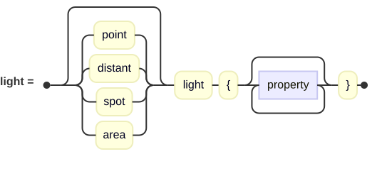
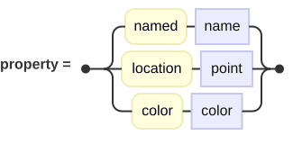
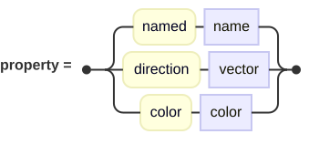
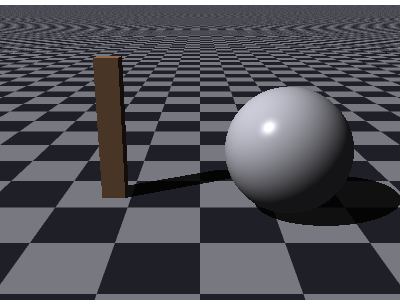
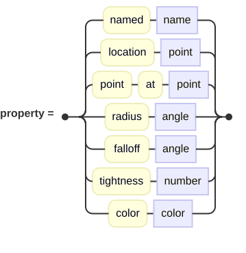
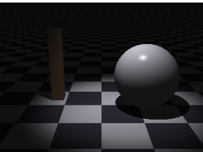
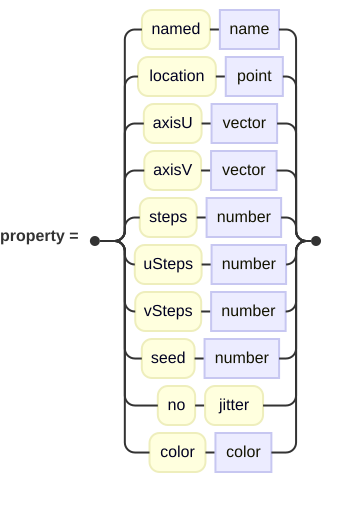
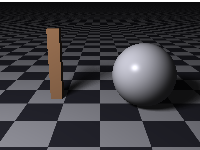

## Lights

A scene with no lights renders black.  Nothing in the world glows of its own accord — even a
surface with an ambient term needs a light present before that term counts for anything — so
a light is one of the three things every scene needs.

There are four sorts, and they differ in only two respects: where a point being lit should
look to find the light, and how much of the light is aimed that way.  Everything else about
shading is the same for all of them.

<picture>
  <source media="(prefers-color-scheme: dark)" srcset="images/lights/lightClause-dark.svg">
  <source media="(prefers-color-scheme: light)" srcset="images/lights/lightClause.svg">
  
</picture>

A bare `light` means the same thing as `point light`.  Both are accepted.  The shipped
examples all write `point light` so that they say which sort they mean.

Any number of lights, of any sort, may share a scene and their contributions add.

All light types carry a color.  If you don't specify one, `White` is the default.

### Point Lights

A lamp at a place, shining equally in every direction.  This is the light to reach for unless
you have a reason not to.

<picture>
  <source media="(prefers-color-scheme: dark)" srcset="images/lights/pointLight-dark.svg">
  <source media="(prefers-color-scheme: light)" srcset="images/lights/pointLight.svg">
  
</picture>

```
point light {
    location [-4, 6, -5]
    color White
}
```


Note the shadows: point lights cast very sharp shadows.  If you want softer, more realistic
shadows, given that nothing in the world casts a shadow that hard, you'll want the
[area light](#area-lights).

The complete example is [`docs/examples/lights/point-light.igl`](examples/lights/point-light.igl).

### Distant Lights

When the source of light is far enough away, like the sun, the light rays become essentially
parallel, rather than splaying out from a point.  Such distant lights are aimed with a direction
instead of being placed at a location.

<picture>
  <source media="(prefers-color-scheme: dark)" srcset="images/lights/distantLight-dark.svg">
  <source media="(prefers-color-scheme: light)" srcset="images/lights/distantLight.svg">
  
</picture>

```
distant light {
    direction [1, -1.2, 0.5]
    color White
}
```



The direction notes the way the light *travels*, so a sun overhead is written `[0, -1, 0]`
(or `Down`) — pointing down, the way its rays go.

Two things follow from the rays being parallel.  Shadows are all cast in the same direction
and stay the same width however far they are thrown.  Also, a flat surface facing the light
is lit evenly across the whole of itself, since every part of it faces the light at the same
angle.

The complete example is [`docs/examples/lights/distant-light.igl`](examples/lights/distant-light.igl).

### Spotlights

A cone of light: bright within an inner angle, dark outside an outer one, and easing between
the two.  It lays a pool of light with a soft rim.

<picture>
  <source media="(prefers-color-scheme: dark)" srcset="images/lights/spotLight-dark.svg">
  <source media="(prefers-color-scheme: light)" srcset="images/lights/spotLight.svg">
  
</picture>

```
spot light {
    location [0, 7, -1]
    point at [0.6, 0, 0]
    radius 14
    falloff 26
    tightness 8
    color White
}
```



| Property | What it means |
| --- | --- |
| `location` | Where the lamp stands. |
| `point at` | What it is aimed at.  The cone's axis runs from the one to the other. |
| `radius` | The half-angle of the fully lit inner cone. |
| `falloff` | The half-angle beyond which nothing is lit at all. |
| `tightness` | How hard the light gathers toward the axis. |

`radius` and `falloff` are angles, so whether you write them in degrees or radians depends on
what the [context block](context.md#angles) says.  These examples set `angles are degrees`.

Between `radius` and `falloff` the light eases off along a cubic curve.  Setting `falloff`
equal to `radius` gives a hard-edged pool; leaving a wide gap between them gives a very
gradual one.

Note in the picture that the post and the far floor are almost black.  Outside the cone
nothing arrives, so what you see there is the ambient term alone.  A dim second light is the
usual remedy, and the gallery scenes do exactly that.

The complete example is [`docs/examples/lights/spot-light.igl`](examples/lights/spot-light.igl).

### Area Lights

A lit rectangle rather than a point or direction.  This is the light that casts a shadow
with a soft edge, and it is the only one of the four that costs more than a single shadow
ray.

<picture>
  <source media="(prefers-color-scheme: dark)" srcset="images/lights/areaLight-dark.svg">
  <source media="(prefers-color-scheme: light)" srcset="images/lights/areaLight.svg">
  
</picture>

```
area light {
    location [-4, 6, -5]
    axisU [2.5, 0, 0]
    axisV [0, 0, 2.5]
    steps 8
    color White
}
```



Compare that with the point light at the top of this chapter, which stands in the same place:
the post's shadow no longer snaps from lit to dark but fades through a band of gray.  Along
the edge of a shadow, a spot on the floor can see part of the lit rectangle past the blocker
while the rest of it is hidden, and it is lit by just that fraction.  That band is the
penumbra.

| Property | What it means |
| --- | --- |
| `location` | The center of the lit rectangle. |
| `axisU`, `axisV` | The two edges, given as **full** edge vectors rather than half. |
| `steps` | The grid across the face, both ways at once. |
| `uSteps`, `vSteps` | The grid each way separately, when it should not be square. |
| `seed` | The seed the scatter is drawn from. |
| `no jitter` | Sample an exact grid instead of a scattered one. |

The light is looked at once per grid square and the results averaged, so `steps 8` costs 64
shadow rays for every point it lights.  That is the price of a soft shadow, and the reason to
ask for one only where you want it.  Too few steps show as banding across the penumbra rather
than smooth shading.

The samples are scattered slightly within their squares to break up that banding, and the
scatter is fixed rather than drawn afresh — so a render repeats exactly from one run to the
next.  `seed` changes the pattern; `no jitter` turns the scatter off altogether and samples
the bare grid.

A useful thing to know: the nearer a blocker sits to the surface it shadows, the tighter its
penumbra.  A tall post's shadow is therefore crisp at the foot and blurred at the tip, which
is exactly how a real soft shadow reads — see `gallery/Local/area-light.igl` for a scene built
around that.

The complete example is [`docs/examples/lights/area-light.igl`](examples/lights/area-light.igl).
