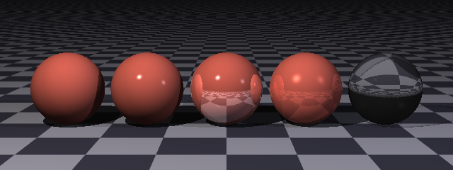

## Materials

A material says how a surface takes the light: what color it is, how glossy, whether it
mirrors its surroundings, and whether light passes through it at all.

<picture>
  <source media="(prefers-color-scheme: dark)" srcset="images/materials/materialClause-dark.svg">
  <source media="(prefers-color-scheme: light)" srcset="images/materials/materialClause.svg">
  
</picture>



Five spheres of the same color, differing only in their material: matte, glossy, reflective,
metallic and glass.  The scene is
[`docs/examples/materials/finishes.igl`](examples/materials/finishes.igl).

Every surface has a material whether you give it one or not.  The default is a white, fairly
glossy plastic — which is what an unadorned `sphere { }` looks like.

### The Color

Where a surface gets its color is the [pigment](pigments-and-patterns.md), and it has a
chapter of its own.  For now, the two forms you will use most:

```
pigment color Red                   // one color all over
pigment checker { White, Gray30 }   // a pattern
```

### The Finish

The rest of the material describes how light behaves when it arrives.

| Term | Default | What it does |
| --- | --- | --- |
| `ambient` | 0.1 | How lit the surface is regardless of any light reaching it. |
| `diffuse` | 0.9 | How much it takes from light striking it square-on. |
| `specular` | 0.9 | The strength of the highlight. |
| `shininess` | 200 | How tight that highlight is. |
| `reflective` | 0 | How much of its surroundings it mirrors. |
| `transparency` | 0 | How much light passes through it. |
| `metallic` | 0 | Whether the highlight takes the surface's color. |
| `brilliance` | 1 | How sharply the diffuse term falls off toward the edges. |
| `grain` | 0 | Roughens the diffuse falloff. |

#### Ambient, diffuse and specular

These three are the heart of how light is determined, and they add up to what you see.

**`ambient`** stands in for light that has bounced around the scene rather than arriving
straight from a lamp.  This renderer does not trace those bounces, so the ambient term is the
fudge that keeps shadows from being perfectly black.  It is the one term a shadow does not take
away — which is also why a surface in deep shadow still shows a little of its color.

Raise it and the surface looks flat and self-lit; drop it to zero and anything unlit goes
completely black.

**`diffuse`** is the ordinary business of a surface catching light: brightest where it faces
the light square-on, falling away as it turns aside.  This is what gives a sphere its
roundness.

**`specular` and `shininess`** are the highlight — the bright spot where the surface reflects
the light source directly.  `specular` is how bright, `shininess` is how tight:

```
specular 0        // no highlight: chalk, unglazed clay, paper
specular 0.9      // a highlight
shininess 20      // broad and soft
shininess 300     // small and hard, like polished glass
```

A common mistake is to reach for `reflective` when you wanted a highlight.  A highlight costs
nothing and shows the *light*; a reflection is a whole extra ray and shows the *scene*.

#### Reflective

How much of the surroundings the surface mirrors, from 0 to 1.

```
material {
    pigment color [0.75, 0.35, 0.3]
    reflective 0.5
}
```

Reflections are traced, so they cost time, and they are limited in depth — a ray bounces only
so many times before the renderer gives up, which is what keeps two facing mirrors from
running forever.

#### Metallic

Ordinarily a highlight is the color of the *light*: a white lamp on a red ball gives a white
highlight.  Metals do not behave that way — their highlights take the color of the metal.
`metallic` switches that on:

```
material {
    pigment color [0.75, 0.35, 0.3]
    specular 0.9
    shininess 60
    metallic 1
    reflective 0.4
}
```

Written bare, `metallic` means fully metallic; give it a number between 0 and 1 to blend.
Gold, copper and brass all want this, and all want a reflection too — a metal that mirrors
nothing looks like painted plastic.

#### Brilliance and grain

Two adjustments to how the diffuse term falls off.  `brilliance` above 1 makes a surface hold
its brightness further round toward its edge before falling away, which is how a polished
metal reads; `grain` roughens that falloff, for a surface that is not perfectly smooth.  Both
are worth leaving alone until a surface does not look quite right in a way you can name.

### Transparency and Interiors

Making a surface see-through takes two things: how much light gets past it, and what it is
made of.

```
material {
    pigment color White
    specular 0.9
    shininess 300
    transparency 0.95
    reflective 0.1
    interior { ior 1.5 }
}
```

`transparency` is the *how-much*, from 0 to 1.  The `interior` block is the *what-it's-made-of*:

<picture>
  <source media="(prefers-color-scheme: dark)" srcset="images/materials/interiorClause-dark.svg">
  <source media="(prefers-color-scheme: light)" srcset="images/materials/interiorClause.svg">
  
</picture>

| Property | Default | What it does |
| --- | --- | --- |
| `ior` | 1 (vacuum) | The index of refraction: how sharply light bends entering it. |
| `filter` | 0 | How much the substance colors what passes through. |
| `clarity` | infinite | How far light travels through it before fading. |

`ior` may also be written out as `index of refraction`, which reads better in a scene meant to
be shown to someone else.

Glass is about 1.5, water about 1.33, diamond about 2.4.  But you need not remember any of
them, because they already have names:

```
interior { ior Glass }
interior { ior Water }
interior { ior Diamond }
```

Those names live alongside the color names, and a few are both.  `Turquoise` is a color *and*
an index of refraction, and which one is meant is settled by where you write it — see
[Variables](scene-files.md#a-name-holds-one-value-per-type).

An index on its own does not bend anything, though: what bends a ray is the *ratio* between the
two sides of the surface it crosses.  The other side is the space the scene sits in, which is a
vacuum unless the scene says otherwise with
[`environment ior`](scene-files.md#the-space-between-things).  So a glass marble in water bends
light far less than the same marble in air, the glass being unchanged.

**`clarity`** is how far light gets through the substance before it is absorbed.  Left alone
it is infinite, so a thick piece of glass is as clear as a thin one — which is not how glass
behaves.  Set it and thickness starts to matter, which is what makes a solid glass object look
solid rather than like a soap bubble.

**`filter`** colors what passes through, so a green bottle casts a green light on the table
beneath it.  Note that transparency and filter are different questions: transparency is *how
much* gets through, filter is *what color* it comes out.

### Roughening the Surface

A `normal` block tilts the surface normal from point to point, so a smooth surface catches the
light as though it were rough — without adding any geometry.

```
material {
    pigment color [0.72, 0.70, 0.66]
    normal granite { depth 0.5  scale 0.4 }
    specular 0.5
    shininess 40
}
```

It takes any of the [patterns](pigments-and-patterns.md), with `depth` saying how strongly to
tilt.  It is written beside the pigment rather than inside it because the two are different
concepts: a marble's veins and the roughness of its surface have nothing to do with
one another, and each wants its own scale.

Because it only tilts the normal, the surface's *outline* stays perfectly smooth.  A rough
sphere still has a circular silhouette.  For roughness that shows on the edge you need real
geometry.

`gallery/Local/normals.igl` shows the range of it.

### Naming and Reusing

A material may be assigned to a variable and reused like any other value:

```
brass = material {
    pigment color [0.78, 0.57, 0.11]
    specular 0.9
    shininess 60
    metallic 1
    reflective 0.4
}

sphere { material brass  translate [-2, 1, 0] }
cube   { material brass  translate [ 2, 1, 0] }
```

A material variable may also be referenced and adjusted, which is what makes the
[libraries](libraries.md) useful — you can import a texture and change just its
reflectance:

```
import 'golds' { Gold3CMaterial }

sphere {
    material Gold3CMaterial {
        reflective 0.6
    }
}
```

### Materials on a Group or CSG

A material given to a [group](surfaces.md#groups) or [csg](surfaces.md#combining-surfaces)
is handed down to every child that does not have one of its own:

```
group {
    material { pigment color [0.8, 0.7, 0.5] }

    cube { scale [1, 0.1, 1]  translate [0, 2, 0] }
    cylinder { min Y 0  max Y 2  scale [0.15, 1, 0.15] }

    // This one keeps its own.
    sphere { material { pigment color Red }  translate [0, 2.4, 0] }
}
```

This saves a great deal of repetition in anything built of many pieces, and it is how a whole
assembly gets one consistent look.
