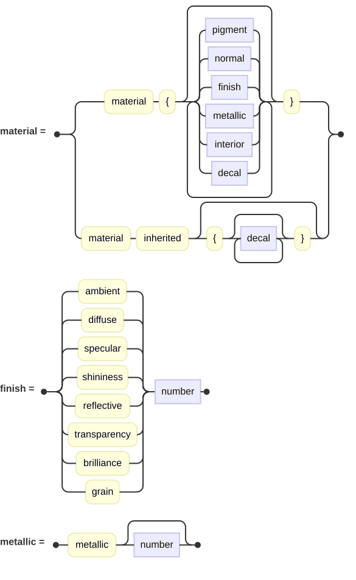
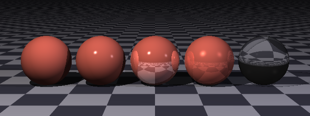
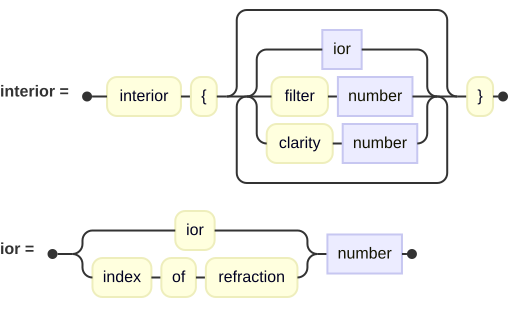
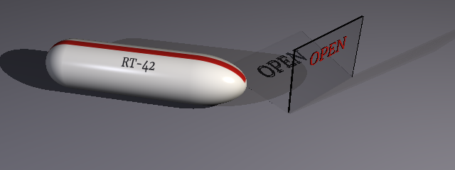
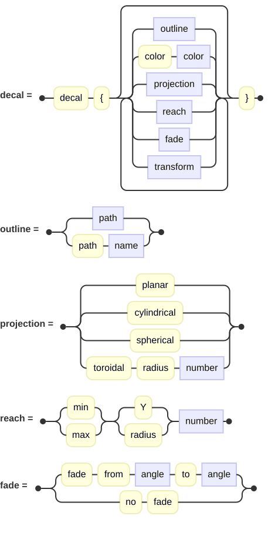
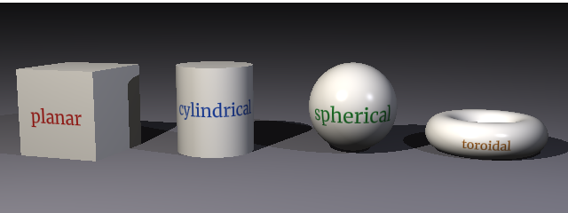

## Materials

A material says how a surface takes the light: what color it is, how glossy, whether it
mirrors its surroundings, and whether light passes through it at all.

<picture>
  <source media="(prefers-color-scheme: dark)" srcset="images/materials/materialClause-dark.svg">
  <source media="(prefers-color-scheme: light)" srcset="images/materials/materialClause.svg">
  
</picture>



Five spheres of the same color, differing only in their material: matte, glossy, reflective,
metallic and glass.  The scene is
[`docs/examples/materials/finishes.igl`](examples/materials/finishes.igl).

Every surface has a material whether you give it one or not.  The default is a white, fairly
glossy plastic — which is what an unadorned `sphere { }` looks like.

### The Color

Where a surface gets its color is the [pigment](pigments-and-patterns.md), and it has a
chapter of its own.  For now, the two forms you will use most:

```
pigment color Red                   // one color all over
pigment checker { White, Gray30 }   // a pattern
```

### The Finish

The rest of the material describes how light behaves when it arrives.

| Term | Default | What it does |
| --- | --- | --- |
| `ambient` | 0.1 | How lit the surface is regardless of any light reaching it. |
| `diffuse` | 0.9 | How much it takes from light striking it square-on. |
| `specular` | 0.9 | The strength of the highlight. |
| `shininess` | 200 | How tight that highlight is. |
| `reflective` | 0 | How much of its surroundings it mirrors. |
| `fresnel` | off | Mirrors more at a slant, as every real surface does. |
| `transparency` | 0 | How much light passes through it. |
| `metallic` | 0 | Whether the highlight takes the surface's color. |
| `brilliance` | 1 | How sharply the diffuse term falls off toward the edges. |
| `grain` | 0 | Roughens the diffuse falloff. |

#### Ambient, diffuse and specular

These three are the heart of how light is determined, and they add up to what you see.

**`ambient`** stands in for light that has bounced around the scene rather than arriving
straight from a lamp.  This renderer does not trace those bounces, so the ambient term is the
fudge that keeps shadows from being perfectly black.  It is the one term a shadow does not take
away — which is also why a surface in deep shadow still shows a little of its color.

Raise it and the surface looks flat and self-lit; drop it to zero and anything unlit goes
completely black.

A scene may turn every material's ambient up or down at once with
`context { scale ambient by ... }`, which is how a scene lit by lamps of its own gets out from
under a fudge sized for daylight — including the ambient named by materials it imported from a
library.  See [The Context Block](context.md#ambient).

**`diffuse`** is the ordinary business of a surface catching light: brightest where it faces
the light square-on, falling away as it turns aside.  This is what gives a sphere its
roundness.

**`specular` and `shininess`** are the highlight — the bright spot where the surface reflects
the light source directly.  `specular` is how bright, `shininess` is how tight:

```
specular 0        // no highlight: chalk, unglazed clay, paper
specular 0.9      // a highlight
shininess 20      // broad and soft
shininess 300     // small and hard, like polished glass
```

A common mistake is to reach for `reflective` when you wanted a highlight.  A highlight costs
nothing and shows the *light*; a reflection is a whole extra ray and shows the *scene*.

#### Reflective

How much of the surroundings the surface mirrors, from 0 to 1.

```
material {
    pigment color [0.75, 0.35, 0.3]
    reflective 0.5
}
```

Reflections are traced, so they cost time, and they are limited in depth — a ray bounces only
so many times before the renderer gives up, which is what keeps two facing mirrors from
running forever.

#### Fresnel

Left alone, a surface mirrors the same share of its surroundings from every angle.  No real
one does.  Varnish, paint, plastic and still water give back a few percent of the light meeting
them square-on and nearly all of it at a graze.  That is why a polished floor is dark at your feet
and a mirror toward the far wall, and why a wet road shines toward the horizon.  `fresnel` turns
that on:

```
material {
    pigment color [0.30, 0.16, 0.08]
    reflective 0.04
    fresnel
}
```

With it, `reflective` is how much is mirrored square-on, and the share climbs from there toward
all of it as the surface is seen more and more edge-on.  Most of the climb comes late: the share
has barely moved at sixty degrees from square-on and is past a half by eighty-five.  It follows
Schlick's approximation to Fresnel's equations, which transparent surfaces already follow.

`gallery/Local/materials/fresnel.igl` lays the same polished floor down twice, with it and without.

What a surface mirrors never reaches its pigment, so the color it shows of its own is turned down
by as much.  Square-on that is only the few percent it mirrors; at a graze it is nearly all of
it, and the surface stops being a colored thing with a reflection on it and becomes a mirror.
The highlight is left as it is.

The square-on share is small for anything that is not a metal, and much the same from one
material to the next:

| Surface | `reflective` |
| --- | --- |
| Water | 0.02 |
| Glass, plastic, paint, varnish, lacquer | 0.04 |
| Diamond | 0.17 |
| Iron, chrome | 0.55 |
| Gold, copper | 0.6 to 0.95, best colored with `metallic` |
| Aluminum, silver | 0.9 to 0.95 |

A `reflective` value chosen for a surface without `fresnel` is usually far too high with it.
Such values were set to give a surface some gloss head-on, and with `fresnel` the edges supply
that gloss themselves.  A transparent surface already shares its light between what it mirrors
and what it lets through by its index of refraction, so `fresnel` changes nothing there.  Nor
does it change a surface that mirrors nothing.

#### Metallic

Ordinarily a highlight is the color of the *light*: a white lamp on a red ball gives a white
highlight.  Metals do not behave that way — their highlights take the color of the metal.
`metallic` switches that on:

```
material {
    pigment color [0.75, 0.35, 0.3]
    specular 0.9
    shininess 60
    metallic 1
    reflective 0.4
}
```

Written bare, `metallic` means fully metallic; give it a number between 0 and 1 to blend.
Gold, copper and brass all want this, and all want a reflection too — a metal that mirrors
nothing looks like painted plastic.

#### Brilliance and grain

Two adjustments to how the diffuse term falls off.  `brilliance` above 1 makes a surface hold
its brightness further round toward its edge before falling away, which is how a polished
metal reads; `grain` roughens that falloff, for a surface that is not perfectly smooth.  Both
are worth leaving alone until a surface does not look quite right in a way you can name.

### Transparency and Interiors

Making a surface see-through takes two things: how much light gets past it, and what it is
made of.

```
material {
    pigment color White
    specular 0.9
    shininess 300
    transparency 0.95
    reflective 0.1
    interior { ior 1.5 }
}
```

`transparency` is the *how-much*, from 0 to 1.  The `interior` block is the *what-it's-made-of*:

<picture>
  <source media="(prefers-color-scheme: dark)" srcset="images/materials/interiorClause-dark.svg">
  <source media="(prefers-color-scheme: light)" srcset="images/materials/interiorClause.svg">
  
</picture>

| Property | Default | What it does |
| --- | --- | --- |
| `ior` | 1 (vacuum) | The index of refraction: how sharply light bends entering it. |
| `filter` | 0 | How much the substance colors what passes through. |
| `clarity` | infinite | How far light travels through it before fading. |
| `dispersion` | none | How much it spreads colors, as an Abbe number; see [Dispersion](#dispersion). |
| `glass` | none | A real optical glass by name, bringing its own index at every wavelength. |

`ior` may also be written out as `index of refraction`, which reads better in a scene meant to
be shown to someone else.

Glass is about 1.5, water about 1.33, diamond about 2.4.  But you need not remember any of
them, because they already have names:

```
interior { ior Glass }
interior { ior Water }
interior { ior Diamond }
```

Those names live alongside the color names, and a few are both.  `Turquoise` is a color *and*
an index of refraction, and which one is meant is settled by where you write it — see
[Variables](scene-files.md#a-name-holds-one-value-per-type).

An index on its own does not bend anything, though: what bends a ray is the *ratio* between the
two sides of the surface it crosses.  The other side is the space the scene sits in, which is a
vacuum unless the scene says otherwise with
[`environment ior`](scene-files.md#the-space-between-things).  So a glass marble in water bends
light far less than the same marble in air, the glass being unchanged.

**`clarity`** is how far light gets through the substance before it is absorbed.  Left alone
it is infinite, so a thick piece of glass is as clear as a thin one — which is not how glass
behaves.  Set it and thickness starts to matter, which is what makes a solid glass object look
solid rather than like a soap bubble.

**`filter`** colors what passes through, so a green bottle casts a green light on the table
beneath it.  Note that transparency and filter are different questions: transparency is *how
much* gets through, filter is *what color* it comes out.

#### Dispersion

Real glass bends blue light a little more than red.  It is why a prism splits white light into a
rainbow and why a cut diamond throws flashes of color.  A substance can be told to do it in either
of two ways:

```
interior { ior Diamond  dispersion 55 }
interior { glass 'SF11' }
```

**`dispersion`** is the Abbe number glass catalogs give, and it reads backwards from what you might
expect: the *lower* the number, the more the colors spread.  Crown glass is about 60, flint about
35, diamond about 55, water about 56; anything under 30 is a very dense flint, and the rainbow
gets wide.  The index you give is the one at the middle of the visible range, and the rest follows
from the two numbers.

**`glass`** names a real optical glass, measured at every wavelength rather than described by two
numbers: `'BK7'`, the everyday crown glass of lenses and windows; `'FK51A'`, a fluor crown that
hardly spreads colors at all; `'BAF10'` and `'LASF9'`, dense glasses that bend light hard; and
`'SF5'`, `'SF10'` and `'SF11'`, the heavy flints a prism is made from when the rainbow is the
point.  A glass brings its own index, so there is no `ior` to give with it.  The measurements are
from [refractiveindex.info](https://refractiveindex.info).

Dispersion only shows in a [spectral](context.md#spectral-light) render.  In red, green and blue
every color bends alike, by the index at the middle of the range, so a scene renders as it would
without it.  A spectral ray that crosses into such a substance splits into one ray per band, each
going its own way; that costs more wherever there is dispersive glass in view, and nothing
anywhere else.

What dispersion shows is what an eye looking through the glass sees: edges fringed with color, and a
bright slit drawn out into a full spectrum —
`gallery/Local/materials/a-rainbow-through-a-prism.igl` is built around that.  What it does not show
is the rainbow a prism casts on a wall when a beam is shone through it.  That is a caustic, light
carried forward from a lamp, through the glass, onto a surface, and this renderer traces backward
from the eye: when a point on the wall asks whether it can see the lamp, the question goes in a
straight line and does not bend through the glass.

### Filling a Surface

An interior may also hold a `medium`: not what the boundary is made of, but what fills the space
inside it.  It is the same thing that can fill a scene's
[surroundings](scene-files.md#filling-that-space), bounded by the surface rather than running on
forever, and it takes the same three properties.

```
sphere {
    material {
        pigment White
        ambient 0  diffuse 0  transparency 1
        interior {
            medium {
                emission [1.35, 0.72, 0.2]
                absorption [0.55, 0.85, 1.4]
            }
        }
    }
}
```

That is a ball of glowing gas.  It is brighter through the middle, where a ray crosses more of it,
and oranger there too, since the longer path absorbs proportionally more blue.  Nothing about the
sphere itself is visible: the pigment shows nothing, being fully transmitting, so every bit of what
is seen came from what is inside.

Two things follow from a medium being *inside* something.  The surface has to let light through —
a ray that cannot get in never crosses what is in there, exactly as with `clarity`.  And being
bounded, such a medium may emit without absorbing; its light stops at the far wall.

A medium inside a surface may [scatter](scene-files.md#scattering) as well, in which case it gathers
light from the scene's lamps just as one filling the surroundings does — so a glass globe of smoke
lights up where a lamp shines into it.

`clarity` and a medium overlap on purpose rather than one replacing the other.  Clarity is the
one-number form of the same idea, and stays the easier thing to reach for when fading with depth is
all a surface needs.  A medium is the richer form: it fades color by color, and it can glow.  A
surface may carry both, in which case both are charged, there being nothing odd about two things
absorbing light in the same place.

### Roughening the Surface

A `normal` block tilts the surface normal from point to point, so a smooth surface catches the
light as though it were rough — without adding any geometry.

```
material {
    pigment color [0.72, 0.70, 0.66]
    normal granite { depth 0.5  scale 0.4 }
    specular 0.5
    shininess 40
}
```

It takes any of the [patterns](pigments-and-patterns.md), with `depth` saying how strongly to
tilt.  It is written beside the pigment rather than inside it because the two are different
concepts: a marble's veins and the roughness of its surface have nothing to do with
one another, and each wants its own scale.

Because it only tilts the normal, the surface's *outline* stays perfectly smooth.  A rough
sphere still has a circular silhouette.  For roughness that shows on the edge you need real
geometry.

`gallery/Local/materials/normals.igl` shows the range of it.

### Naming and Reusing

A material may be assigned to a variable and reused like any other value:

```
brass = material {
    pigment color [0.78, 0.57, 0.11]
    specular 0.9
    shininess 60
    metallic 1
    reflective 0.4
}

sphere { material brass  translate [-2, 1, 0] }
cube   { material brass  translate [ 2, 1, 0] }
```

A material variable may also be referenced and adjusted, which is what makes the
[libraries](libraries.md) useful — you can import a texture and change just its
reflectance:

```
import 'golds' { Gold3CMaterial }

sphere {
    material Gold3CMaterial {
        reflective 0.6
    }
}
```

### Materials on a Group or CSG

A material given to a [group](surfaces.md#groups) or [csg](surfaces.md#combining-surfaces)
is handed down to every child that does not have one of its own:

```
group {
    material { pigment color [0.8, 0.7, 0.5] }

    cube { scale [1, 0.1, 1]  translate [0, 2, 0] }
    cylinder { min Y 0  max Y 2  scale [0.15, 1, 0.15] }

    // This one keeps its own.
    sphere { material { pigment color Red }  translate [0, 2.4, 0] }
}
```

This saves a great deal of repetition in anything built of many pieces, and it is how a whole
assembly gets one consistent look.

### Decals

A decal is a marking painted over the pigment: inside an outline it is one color, and outside
it the surface keeps its own.  Registration numbers, stripes, lettering on a sign, a logo on a
hull — anything flat that is painted on rather than built.



A stripe and a registration painted across a body made of three parts, and lettering painted on
a pane of clear glass, which shows again in its shadow.  The scene is
[`docs/examples/materials/decals.igl`](examples/materials/decals.igl).

<picture>
  <source media="(prefers-color-scheme: dark)" srcset="images/materials/decalClause-dark.svg">
  <source media="(prefers-color-scheme: light)" srcset="images/materials/decalClause.svg">
  
</picture>

```
material {
    pigment color White

    decal {
        path { text { text 'RT-42'  font 'Merriweather' } }
        color [0.08, 0.08, 0.1]
        planar
        min Y 0  max Y 1
        scale 0.3
        translate [0.4, 0, -0.4]
    }
}
```

The outline is any [path](advanced-surfaces.md#paths) — lines and curves, an SVG, an icon or a
run of text — written out in place or named.  The projection says how it is carried onto the
surface, and the reach says how far it goes.  The transforms place the decal: scale it, turn it
to face another way, and move it to where it belongs.

#### Projections



Each projection labeled with its own name.  The scene is
[`docs/examples/materials/decal-projections.igl`](examples/materials/decal-projections.igl).

A decal has the same four projections an [image map](pigments-and-patterns.md#image-pigments)
has.  `planar` is what you get if you name none.

| Projection | How the outline is laid on | Its reach is measured |
| --- | --- | --- |
| `planar` | Flat in the decal's X–Z plane, as a path is for an extrusion, and carried straight down its Y axis onto whatever it meets. | along Y, with `min Y` and `max Y` |
| `cylindrical` | Wrapped around the decal's Y axis: across runs around the axis, and up runs along it. | out from the axis, with `min radius` and `max radius` |
| `spherical` | Wrapped over a sphere about the decal's origin: across runs along the equator, and up runs along a meridian. | out from the center, likewise |
| `toroidal radius` *R* | Wrapped over a ring of radius *R* about the decal's Y axis: across runs around the ring, and up runs around the tube. | out from the ring, likewise |

The wrapped projections measure across and up as lengths along the surface, at the point's own
distance from the axis, center or ring.  So an outline lands at its true size whatever the radius
of what it is wrapped on — a word two units wide is two units of arc on a thin cylinder and on a
fat one alike — and you never have to say that radius, except for the ring of a `toroidal` one,
which, like a torus's own, has to be given.  Each is centered on the decal's +X side, reading left
to right as seen from outside, with up toward +Y; turn the decal to put it somewhere else.

#### Reach

**The reach is required.**  A projection goes on forever, so without one a decal on the top of
something would come out on the bottom as well, backwards, and a wrapped one would paint every
surface in its path however near or far.  Set it to take in the face you want painted and nothing
beyond it.

A planar decal's reach is measured along its projection from where it is placed; a wrapped one's
is how far out from its axis, center or ring.  Both are in the units of the surface the decal is
on, and so is a toroidal decal's ring: a `scale` written in the decal sizes the outline, and
leaves them alone.

Several decals may be written in one material.  They are painted in the order they are written,
each on top of those before it.  A color with an alpha below 1 lets the surface show through.

**A decal is placed in the space of the surface whose material it is in.**  That is not the
same as a pattern.  A material on a group is handed down to each part, and a pattern is read in
the space of whichever part the ray met — so a scaled part shows its pattern scaled.  A decal
written on the group is read in the group's space on every part of it, which is what lets one
stripe run straight across a cylinder and the two squashed spheres capping it.  It also means
that a decal written on a scaled shape is read before that scale, the same as a pattern is.  On
`sphere { scale 1.5 }`, the sphere in its own space still has a radius of 1, so 1 is the radius
its decal's reach must take in.  To place a decal in the units you built in, put the material on
a group around the shape.

The edge of a decal stays crisp at any distance, without needing antialiasing to find it, since
the outline is drawn rather than looked up in an image.

Paint on glass stops the light, and casts a shadow, provided the glass is clear by way of its
pigment — `pigment color [1, 1, 1, 0]` — rather than its `transparency`.  A surface's
`transparency` lets light through whatever its color says, paint included.

#### Fading

A decal fades out where the surface turns away from it.  It is carried straight along its
projection, so on a face it meets at a steep slant — a planar decal on the side of a box, or a
cylindrical one on the end of a can — it would otherwise be smeared out across that face, and a
reach cannot help when the face stands inside it, as a box's sides stand inside the reach of
paint on its top.  So a decal is at full strength until the surface turns 60° from square to its
projection, and gone by 75°, fading smoothly in between: paint over a rounded edge thins away
round the curve, and stops short of a wall.  For a wrapped decal, square means facing straight
out from its axis, center or ring.  Like the rest of a decal, the angle is measured in the space
of the surface the material is written on.

Both angles may be moved, and the fade may be turned off:

```
fade from 30 to 45     // full strength to 30°, gone by 45°
fade from 45 to 45     // a clean cut at 45°
no fade                // paint every face the reach takes in, however it is turned
```

The angles are in the scene's own units, as a `rotate` is, and lie between 0 (square on) and
90 (edge on).  Turning the fade off is for a decal that is meant to wrap a sharp corner, where the
smear down the far face is the point.

#### Markings that survive a repaint

A part that has a material of its own is passed over when a group hands its material down —
which is what lets one part of an assembly keep its color while the rest is painted together.  It
also means that markings written in a part's material would stop that part being repainted from
outside: a model in a library could carry its lettering, or let a scene choose its paint, but not
both.

`material inherited` with decals in it is the way to have both:

```
EnterpriseSaucer = union {
    material inherited {
        decal { path { text { text 'NCC-1701'  font 'Federation Starfleet Hull 23rd', 'Orbitron' } }
                color [0.06, 0.06, 0.07]  planar  min Y 0  max Y 0.6  scale 1.35 }
    }
    lathe { … }
    …
}

object Enterprise(289) {
    material { pigment color [0.78, 0.79, 0.80] }    // repaints the hull, lettering and all
}
```

On its own, `material inherited` gives a surface no material, so it takes whatever is handed down to
it.  With decals, it takes whatever is handed down *and paints its decals on top*.  Each decal is
still read in the space of the surface it was written on, and if the material handed down has decals
of its own, those stay where they were and the inherited ones go over them.  Handed nothing at all,
the surface is given what any surface with no material is given, with its decals on top.

Only decals may be written in an inherited material: its color and finish come from above, so a
pigment or a finish written in one would be thrown away, and is refused instead.
