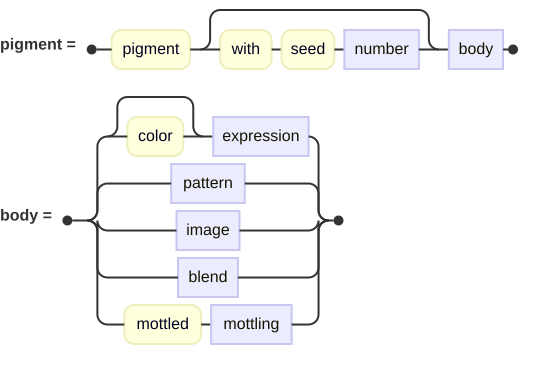
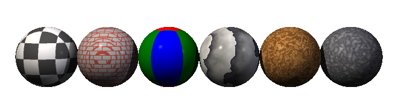
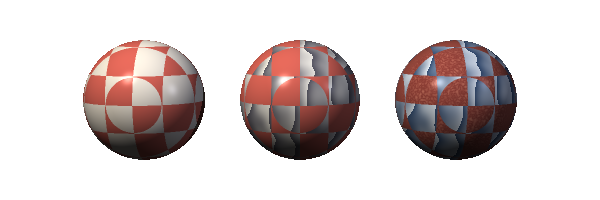
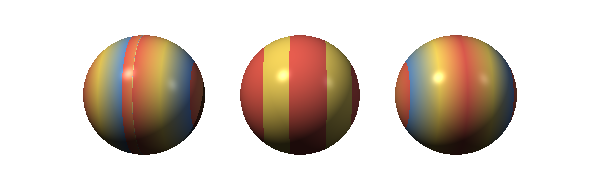
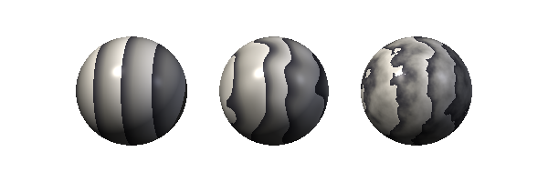
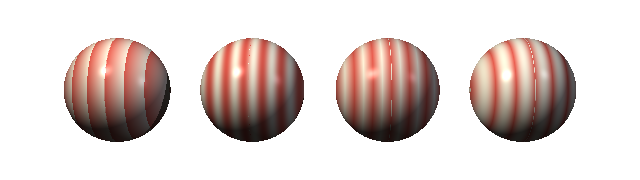
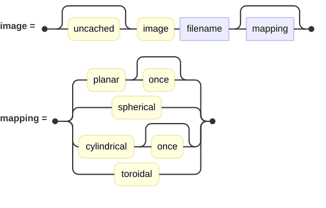
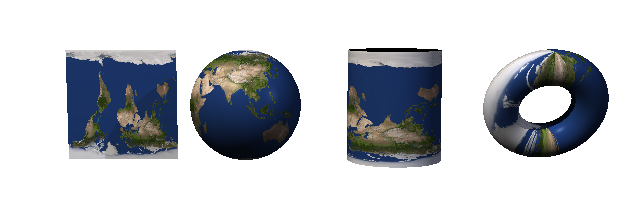
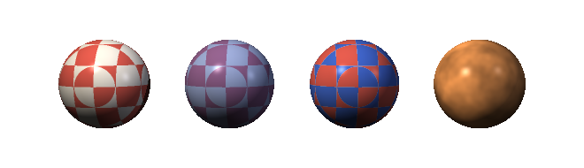

## Pigments and Patterns

A pigment is where a surface gets its color.  The simplest is one color everywhere, but a
pigment can just as easily be a checkerboard, a slab of marble, a photograph, or several of
those combined together.

<picture>
  <source media="(prefers-color-scheme: dark)" srcset="images/pigments/pigmentClause-dark.svg">
  <source media="(prefers-color-scheme: light)" srcset="images/pigments/pigmentClause.svg">
  
</picture>

A pigment lives inside a [material](materials.md), and every material has one whether you
write it or not; the default is plain white.



Six patterns on the same ball under the same light: checker, brick, hexagon, marble, wood and
granite.  The scene is
[`docs/examples/pigments/patterns.igl`](examples/pigments/patterns.igl).

### Solid Color

The everyday case:

```
pigment color Red
pigment color [0.8, 0.3, 0.25]
```

The word `color` may be left off when what follows is unambiguous, so `pigment Red` means the
same thing.  Writing it is the clearer habit.

### Patterns

A pattern is a function of position.  For each intersection point the renderer finds, the
surface's pattern hands back either a number or a choice among colors, and the pigment
turns that into the color at that point.

That "either" is the important division, and it decides how you write a pattern.

#### Discrete patterns

These pick among a fixed number of sub-patterns (yes, patterns can be nexted).  You give
exactly as many as the pattern needs, separated by commas:

| Pattern | Colors |
| --- | --- |
| `checker` | 2 |
| `linear stripes`, `cylindrical stripes`, `spherical stripes` | 2 |
| `brick` | 2 |
| `hexagon` | 3 |
| `square` | 4 |
| `cubic` | 6 |
| `triangular` | 6 |

```
pigment checker { White, Gray30 }
pigment hexagon { Red, Green, Blue }
pigment linear X stripes { Red, Blue }
```

Give the wrong number and the render stops and says so.

A plain color is simply the simplest sub-pattern there is, so anywhere one of these entries may
take a color, it may take a whole pattern instead:

```
pigment checker {
    color [0.85, 0.4, 0.35],
    marble {
        turbulence 0.5
        [0, [0.35, 0.35, 0.4], 1, [0.95, 0.95, 0.92]]
        scale 0.7
    }
    scale 0.45
}
```



A checker of two plain colors, a checker with marble in one of its squares, and a checker with
a pattern in both.  Each nested pattern keeps its own scale and turbulence, so the two need
have nothing to do with one another.  The scene is
[`docs/examples/pigments/nested.igl`](examples/pigments/nested.igl).

`brick` takes two extra settings, and they must be written **before** the colors:

```
pigment brick {
    brick size [0.5, 0.25, 0.25]
    mortar size 0.04
    color [0.7, 0.3, 0.25], Gray70
}
```

#### Continuous patterns

These produce a number rather than a choice, so instead of a list of colors you give a *color
map*: pairs of a position and the color at that position, in square brackets.

| Pattern | What it looks like |
| --- | --- |
| `linear gradient`, `cylindrical gradient`, `spherical gradient` | A smooth ramp. |
| `marble` | Veins running through stone. |
| `wood` | Growth rings. |
| `granite` | Fine speckle, noise at every scale. |
| `agate` | Wandering bands. |
| `bozo` | Broad, smooth noise. |
| `crackle` | A web of cracks between cells. |
| `dents`, `wrinkles` | Noise meant chiefly for roughening. |
| `leopard` | Spots. |
| `ripples`, `waves` | Rings spreading from scattered sources. |
| `radial` | The angle about the Y axis. |
| `planar`, `spherical`, `cylindrical`, `boxed` | Distance from a plane, point, axis or box. |

```
pigment marble {
    [0, [0.2, 0.2, 0.24], 0.4, [0.6, 0.6, 0.58], 1, [0.9, 0.9, 0.88]]
}
```

The map reads as position, color, position, color, and so on.  Positions run from 0 to 1, and
the color between two entries is blended from them.  A map need not stop at 1; whatever the
pattern hands back is wrapped, which is exactly what turns a marching value into repeated
veins.

Adding `banded` before the opening bracket turns the blending off, so each entry holds until
the next rather than fading into it.

#### Adding a bounce

`gradient` may be written `bouncing`, which makes it run up and back down again rather than
snapping from the end of the map to its start:

```
pigment linear bouncing gradient { [0, Red, 1, Blue] }
```



The same three-color map read three ways: blended, which is the default; `banded`, which holds
each color until the next; and `bouncing`, which runs the map up and back down so there is no
seam where it would otherwise wrap.  The scene is
[`docs/examples/pigments/maps.igl`](examples/pigments/maps.igl).

### Turbulence

Most of the interesting patterns are dull without turbulence.  It stirs the points before the
pattern sees them, so straight bands become wandering ones:

```
pigment marble {
    turbulence { amplitude 0.6  octaves 4 }
    [0, [0.2, 0.2, 0.24], 1, [0.9, 0.9, 0.88]]
}
```

| Setting | What it does |
| --- | --- |
| `amplitude` | How far points are pushed about. |
| `octaves` | How many scales of detail to pile up. |
| `finer` | How much smaller each successive octave is. |
| `fainter` | How much weaker each successive octave is. |
| `with seed` | Fixes the randomness, so the result repeats. |

A bare number is shorthand for the amplitude alone, which is the common case:

```
pigment marble { turbulence 0.6  [0, Red, 1, Blue] }
```



The same marble three times: no turbulence, a little, and a lot.  Without it the veins are
straight bands; with a little they wander; with a lot they break up into something much closer
to real stone.  The scene is
[`docs/examples/pigments/turbulence.igl`](examples/pigments/turbulence.igl).

Turbulence goes **before** the color map.  It belongs only to continuous patterns; a checker
has no value to stir.

### Shaping the Value

Between the pattern and the color map, the number a pattern produces can be reshaped:

| Setting | What it does |
| --- | --- |
| `frequency` | Multiplies the value, so the map repeats more often. |
| `phase` | Slides the value along, so the map starts somewhere else. |
| `<name> wave` | Bends the value along a curve. |

The waves are `ramp`, `sine`, `triangle`, `scallop`, `cubic` and `poly`.  A ramp is the plain
sawtooth you get by default; a sine eases in and out; a triangle runs up and back down.

```
pigment bozo {
    sine wave
    frequency 2
    [0, Red, 1, Blue]
}
```



One gradient bent four ways: `ramp`, `sine`, `triangle` and `scallop`.  The pattern, the map
and the frequency are the same in all four.  A ramp snaps back at the end of each repeat; a
sine eases in and out of it; a triangle mirrors the map rather than repeating it, so there is
no snap at all.  The scene is
[`docs/examples/pigments/waves.igl`](examples/pigments/waves.igl).

Like turbulence, these are written **before** the map.

### Seeding

Any pattern that draws on randomness — `bozo`, `crackle`, `dents`, `granite`, `wrinkles` —
may be given a seed, so that the same scene renders the same way every time.  The seed goes
on the pattern name, **before** the opening brace:

```
pigment granite with seed 5 {
    [0, [0.25, 0.25, 0.28], 1, [0.85, 0.85, 0.82]]
}
```

A seed may also be put on the pigment as a whole, in which case it reaches everything inside
that has not been given one of its own.

### Patterns Live in the Surface's Space

A pattern is evaluated in the surface's own coordinates, which has two consequences worth
knowing.

**A pattern may be transformed on its own.**  Write transforms inside the pattern, after the
colors, and they move the pattern rather than the surface:

```
pigment checker {
    White, Gray30
    scale 0.4
    rotate Y 30
}
```

**Transforming the surface transforms the pattern with it.**  Squash a sphere and whatever is
painted on it squashes too.  That is usually what you want, and occasionally a nuisance — a
brushed-metal look is made exactly this way, by squashing a pattern along two axes so its
slopes all run one direction.

### Image Pigments

A pigment may be a picture.

<picture>
  <source media="(prefers-color-scheme: dark)" srcset="images/pigments/imageClause-dark.svg">
  <source media="(prefers-color-scheme: light)" srcset="images/pigments/imageClause.svg">
  
</picture>

```
pigment image 'earth.png' spherical
```

The mapping says how the flat picture is wrapped onto the surface:

| Mapping | Wraps the image…                                  |
| --- |---------------------------------------------------|
| `planar` | Flat, along one plane.                            |
| `spherical` | Around a ball, the way a world map wraps a globe. |
| `cylindrical` | Around an axis, like a label on a can.            |
| `toroidal` | Around a ring.                                    |



The same picture wrapped four ways, each onto the surface its mapping suits.  The scene is
[`docs/examples/pigments/image-maps.igl`](examples/pigments/image-maps.igl).

`planar` and `cylindrical` may be followed by `once`, which draws the image a single time
rather than repeating it.  Without it the image tiles, so a surface larger than one unit gets
the picture over and over.

Worth knowing about `planar`: it maps the surface's **X and Z**, so it belongs on something
lying flat.  Put it on an upright face — where Z barely changes — and you get a single row of
the image smeared into stripes.  The panel in the picture above is the unit square in X and Z,
stood upright afterward, so the mapping still lands on it square.

The file name may be a **web address** rather than a path:

```
pigment image 'https://example.com/texture.jpg' spherical
```

A downloaded image is held in memory for the run that needs it, but it is not saved anywhere,
so it is fetched again the next time you render.  See
[Installing and Building](getting-started.md#installing-and-building).

`uncached` before `image` skips the in-memory cache as well, so the file is re-read for every
surface that names it.  You want this only when the file may change under you.

`gallery/Local/solar-system/` is built almost entirely from image pigments.

### Blending and Layering

Two or more pigments may be combined:

```
pigment blend { checker { Red, Blue }, color Green }
pigment layer { color Red, checker { White, Black } }
```

`blend` averages them: every point is the mean of what each pigment would give.

`layer` stacks them instead, and **the first one written is the topmost**.  Where the upper
pigment is transparent the one beneath shows through, which is how you put a decal or a stain
over something patterned.  A fully opaque pigment written first hides everything after it, so
the transparency has to be in the upper one:

```
pigment layer {
    checker { color [0.85, 0.35, 0.3], color [1, 1, 1, 0]  scale 0.45 },
    color [0.25, 0.4, 0.8]
}
```

The checker's second color has an alpha of zero, so those squares are holes.



A plain checker; the same checker blended with a solid blue, which pulls every square halfway
toward it; the same checker layered over that blue, where the transparent squares let it
through untouched; and a solid color mottled.  The scene is
[`docs/examples/pigments/combining.igl`](examples/pigments/combining.igl).

### Mottling

`mottled` takes another pigment and dims it by noise, so a flat color gains an uneven,
weathered look:

```
pigment mottled {
    noise { octaves 3 }
    leopard {
        [0, Orange, 1, Brown]
        scale 0.5
    }
}
```

The `noise` block takes `octaves`, `finer`, `fainter` and `with seed` — the same settings
turbulence takes, minus the amplitude, since mottling dims a color rather than pushing points
about.

The rightmost ball in the picture above is a single flat color mottled, which is all it takes
to keep a large plain surface from looking painted on.

This is not the same thing as the material's `grain`, which roughens how light falls on a
surface.  Mottling varies the color itself.

### A Physical Sky

Every pigment above says what color something *is*.  This one works out what color the sky
**actually comes out**, from what the air does to sunlight:

```
background physical sky {
    sun elevation 22
    sun azimuth 35
    turbidity 2.6
    brightness 8
}
```

You say where the sun stands.  Everything else follows and none of it is a setting: the blue overhead,
the pale band at the horizon, the ring of glare around the sun, the reddening as it sets.  Those are
what falls out of air scattering short wavelengths some six times more readily than long ones, of haze
throwing light forward, and of the two thinning with height at quite different rates.

| Property | Means |
| --- | --- |
| `sun elevation` | How high the sun stands above the horizon, in degrees.  90 is overhead, 0 is on the horizon. |
| `sun azimuth` | Which way round it lies, in degrees, measured from -Z and turning toward +X. |
| `turbidity` | How hazy the air is.  1 is perfectly clean air, which happens nowhere; 2-3 is a clear day; 6 and beyond loses the horizon in white. |
| `height` | How far above sea level the scene stands, in metres.  Mostly it changes the haze, nearly all of which sits in the lowest kilometre or two -- which is why a mountain sky is a deeper, cleaner blue. |
| `brightness` | What the whole sky is multiplied by.  See below. |
| `rows`, `columns` | How finely the sky is worked out and kept.  Rarely worth touching. |

**It is a pigment, and that is the point.**  A `background` is a pigment asked about a *direction*, so
writing one thing gives you three: the camera sees the sky, a mirror reflects it, and a
[`sky light`](lights.md#sky-lights) gathers its light from it -- that last one for free, since a sky
light with no pigment of its own borrows the background.  A scene lit entirely and correctly by a real
sky is therefore two lines.

**The sun's disc is not in it.**  The sun subtends about half a degree, so a sky light sampling a sky
containing it would strike it perhaps once in fifty thousand samples, and that sample would be tens of
thousands of times brighter than its neighbours -- speckle that gets *worse* as you add samples.  If
you want a visible sun, place one: a sphere of the right size in the right direction, or a `disc`.

**The sun comes with it.**  A physical sky adds its own `distant light`, pointed the way the sun
lies and coloured by what is left of the sunlight after the air it has just crossed -- which is why a
low sun arrives orange without anyone saying so.  You say *where* the sun is; what colour it is
follows.  A scene wanting the sky without its sun writes `no light` inside the block:

```
background physical sky { sun elevation 30  no light }
```

You do not need that merely to add a lamp of your own -- a scene may hold as many lights as it likes,
and the sun will simply stand among them.

**About `brightness`.**  It is an exposure and deliberately a single knob, because the proportions
*within* a sky, and between a sky and its sun, are what the physics settles and nothing should be able
to disturb them.  Turning it up brightens the sun by exactly as much as it brightens the sky.

At `1` the sky and its sun stand in the proportion the air actually puts them in.  Whether that is the
right *exposure* for a picture is a separate question, and this renderer has no other exposure control,
so something between `2` and `4` is usually what makes a frame read without blowing the highlights.

**What it does not follow.**  Light is followed round every turn it takes, not merely the first, which
is what keeps the shaded side of things lit and what leaves a glow in the sky after the sun is down.
The turns after the second are treated as arriving evenly from all directions, which is a real
approximation and tells most near the horizon and near the sun.  Measured against daylight as it has
actually been recorded, the diffuse share of light falling on a level surface comes out at about 7%
with the sun high and 18% with it low, against measurements in the range of 8-20%.  Ground reflection
is not followed at all, which is the largest thing still missing: a scene over snow or pale sand has a
brighter sky than this will give.

### Naming and Reusing

If you Assign a pigment to a variable, it may be used as often as you like:

```
stone = pigment granite with seed 3 {
    [0, [0.25, 0.25, 0.28], 1, [0.8, 0.8, 0.78]]
    scale 0.5
}

sphere { material { pigment stone } }
cube   { material { pigment stone }  translate [3, 0, 0] }
```

### Patterns Elsewhere

The same patterns are used by a material's [`normal` block](materials.md#roughening-the-surface),
where the pattern's value tilts the surface normal instead of choosing a color.  Everything
here about turbulence, shaping, seeding and transforms applies there too.

A scene's [`background`](scene-files.md#background) is a pigment as well, so any of these may be
a sky.  One thing is different there: a background is asked about the direction a ray was
heading rather than a point it struck, so a pattern used as a sky works in units of a sphere of
radius one — a scale of ten, which spreads a pattern over a wide floor, all but flattens a sky.
