## Reference

This chapter is the index to everything the earlier ones explain a piece at a time: the overall
shape of a scene file, every keyword the language knows, the whole grammar as a set of diagrams,
every name a scene may use without defining it, and the command line.  It is meant to be looked
things up in rather than read straight through.

### The shape of a scene file

A scene file is any number of *items*, in almost any order (the exceptions are in
[The Shape of a File](scene-files.md#the-shape-of-a-file)).  Each item is one of these:

<picture>
  <source media="(prefers-color-scheme: dark)" srcset="images/reference/sceneFile-dark.svg">
  <source media="(prefers-color-scheme: light)" srcset="images/reference/sceneFile.svg">
  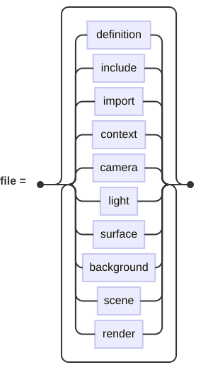
</picture>

- a **definition** — a name given to a value, surface, material, pigment or transform, for reuse ([Variables](scene-files.md#variables))
- an **include** — another file, read in place ([Including Other Files](scene-files.md#including-other-files))
- an **import** — named definitions taken from a library ([Using Libraries](libraries.md))
- a **context** block — the render-wide settings ([The Context Block](context.md#the-context-block))
- a **camera** — where the scene is viewed from ([Cameras](cameras.md#placing-a-camera))
- a **light** — a point, distant, spot or area light ([Lights](lights.md#lights))
- a **surface** — anything solid or flat the world contains ([Surfaces](surfaces.md#the-primitives))
- a **background** — the sky seen where nothing is hit ([Background](scene-files.md#background))
- a **scene** — a camera, lights and surfaces wrapped up and named ([Scenes and Cameras](scene-files.md#scenes-and-cameras))
- a **render** command — which scene and camera to draw ([The `render` Command](scene-files.md#the-render-command))

### Keyword index

Every word the language reserves, what it is for, and the chapter that explains it in full.

| Keyword | Meaning | Documented in |
| --- | --- | --- |
| `X` | Names the X axis, in a transform, a linear gradient or an axis value. | [Transforms](transforms.md#rotate) |
| `Y` | Names the Y axis, in a transform, a linear gradient or an axis value. | [Transforms](transforms.md#rotate) |
| `Z` | Names the Z axis, in a transform, a linear gradient or an axis value. | [Transforms](transforms.md#rotate) |
| `absorption` | Medium: how much light it takes out per unit of distance. | [Scene Files](scene-files.md#filling-that-space) |
| `accuracy` | Isosurface: how closely a crossing is pinned down. | [Advanced Surfaces](advanced-surfaces.md#isosurface) |
| `agate` | Pattern: turbulent, wandering bands. | [Pigments & Patterns](pigments-and-patterns.md#patterns) |
| `alignment` | Text layout: left/center/right justification. | [Advanced Surfaces](advanced-surfaces.md#text) |
| `ambient` | Finish: color shown with no light on it. | [Materials](materials.md#ambient-diffuse-and-specular) |
| `amplitude` | Turbulence: how far it stirs. | [Pigments & Patterns](pigments-and-patterns.md#turbulence) |
| `and` | True when both conditions are; the same operator as `&&`.  Also joins `ignore commands and '…'` in an L-system. | [Scene Files](scene-files.md#expressions) |
| `angle` | L-system control: the turn angle. | [Advanced Surfaces](advanced-surfaces.md#l-systems) |
| `angles` | `angles are degrees`/`radians`. | [Context](context.md#angles) |
| `anisotropy` | Medium: which way it prefers to turn light. | [Scene Files](scene-files.md#scattering) |
| `aperture` | Camera: lens radius; larger blurs more. | [Cameras](cameras.md#depth-of-field) |
| `apply` | Context: `apply gamma`. | [Context](context.md#gamma) |
| `are` | The second word of `angles are …`. | [Context](context.md#angles) |
| `area` | An `area light` (soft-edged). | [Lights](lights.md#area-lights) |
| `at` | Follows `look at`, `point at`, `radius … at`, parallelogram `at`. | [Cameras](cameras.md#placing-a-camera) |
| `author` | Info: who made it. | [Context](context.md#image-information) |
| `axiom` | L-system: the starting string. | [Advanced Surfaces](advanced-surfaces.md#l-systems) |
| `axisU` | Area light: one edge of the panel. | [Lights](lights.md#area-lights) |
| `axisV` | Area light: the other edge of the panel. | [Lights](lights.md#area-lights) |
| `azimuth` | `physical sky`: which way round the sun lies, in degrees. | [Pigments & Patterns](pigments-and-patterns.md#a-physical-sky) |
| `background` | Sets the sky, a pigment, seen where no ray hits a surface. | [Scene Files](scene-files.md#background) |
| `banded` | Pigment map qualifier: step between entries rather than blend. | [Pigments & Patterns](pigments-and-patterns.md#patterns) |
| `baseline` | Text layout: sit the block on the first line's baseline. | [Advanced Surfaces](advanced-surfaces.md#text) |
| `black` | Font weight; also the color black. | [Advanced Surfaces](advanced-surfaces.md#text) |
| `blend` | Pigment: average several pigments together. | [Pigments & Patterns](pigments-and-patterns.md#blending-and-layering) |
| `blob` | Surface: metaballs that melt together. | [Surfaces](surfaces.md#blob) |
| `blur` | Camera: `blur samples`, rays per pixel for the lens. | [Cameras](cameras.md#depth-of-field) |
| `bold` | Font weight. | [Advanced Surfaces](advanced-surfaces.md#text) |
| `bottom` | Text layout: align the block by its bottom. | [Advanced Surfaces](advanced-surfaces.md#text) |
| `bouncing` | Pattern qualifier: a gradient that ramps up then back down. | [Pigments & Patterns](pigments-and-patterns.md#patterns) |
| `bounces` | Medium: how many further turns of a light's path are followed. | [Scene Files](scene-files.md#multiple-scattering) |
| `bounded` | `bounded by`: a box the renderer may use to skip the surface. | [Surfaces](surfaces.md#bounding) |
| `boxed` | Pattern: nested square boxes. | [Pigments & Patterns](pigments-and-patterns.md#patterns) |
| `bozo` | Pattern: smooth value noise. | [Pigments & Patterns](pigments-and-patterns.md#patterns) |
| `brick` | Pattern: running-bond brickwork. | [Pigments & Patterns](pigments-and-patterns.md#patterns) |
| `brightness` | `physical sky`: what the whole sky and its sun are multiplied by. | [Pigments & Patterns](pigments-and-patterns.md#a-physical-sky) |
| `brilliance` | Finish: sharpens or softens the diffuse falloff. | [Materials](materials.md#brilliance-and-grain) |
| `by` | Follows `bounded by`, and a group's `interval … by`. | [Surfaces](surfaces.md#bounding) |
| `camera` | Where the scene is viewed from. | [Cameras](cameras.md#placing-a-camera) |
| `center` | Text layout: center the block or a line; also `no center` on a sweep. | [Advanced Surfaces](advanced-surfaces.md#text) |
| `checker` | Pattern: a checkerboard of two colors. | [Pigments & Patterns](pigments-and-patterns.md#patterns) |
| `clarity` | Interior: how far light travels before fading. | [Materials](materials.md#transparency-and-interiors) |
| `clip` | Height field: drop ground below a height. | [Advanced Surfaces](advanced-surfaces.md#height-field) |
| `close` | Path: join back to where the run began. | [Advanced Surfaces](advanced-surfaces.md#paths) |
| `color` | A solid pigment, or a light's color. | [Materials](materials.md#the-color) |
| `columns` | `physical sky`: how many ways round the sky is worked out and kept. | [Pigments & Patterns](pigments-and-patterns.md#a-physical-sky) |
| `commands` | L-system: maps characters to turtle moves. | [Advanced Surfaces](advanced-surfaces.md#l-systems) |
| `comment` | Info: a free-form comment. | [Context](context.md#image-information) |
| `completeBranch` | L-system turtle: pop back to it. | [Advanced Surfaces](advanced-surfaces.md#l-systems) |
| `conic` | Surface: a cone or frustum. | [Surfaces](surfaces.md#cylinder-and-conic) |
| `context` | The block of render-wide settings. | [Context](context.md#angles) |
| `controls` | L-system: how the string is drawn (pipes, tubes, sizes). | [Advanced Surfaces](advanced-surfaces.md#l-systems) |
| `copyright` | Info: a copyright notice. | [Context](context.md#image-information) |
| `crackle` | Pattern: cracked-cell (Worley) noise. | [Pigments & Patterns](pigments-and-patterns.md#patterns) |
| `csg` | Combines surfaces by a named set operation. | [Surfaces](surfaces.md#combining-surfaces) |
| `cube` | Surface: a unit cube. | [Surfaces](surfaces.md#cube) |
| `cubic` | Pattern (and wave shape): cubic-interpolated. | [Pigments & Patterns](pigments-and-patterns.md#patterns) |
| `curve` | Path/spline/tube: a cubic (two control point) segment. | [Advanced Surfaces](advanced-surfaces.md#paths) |
| `cylinder` | Surface: a cylinder (also a blob component). | [Surfaces](surfaces.md#cylinder-and-conic) |
| `cylindrical` | Pattern/image map: value around a cylinder; also image mapping. | [Pigments & Patterns](pigments-and-patterns.md#patterns) |
| `degrees` | Angle unit: degrees. | [Context](context.md#angles) |
| `density` | Medium: how much of the stuff there is — evenly, as a `density function`, or shaped by a [pattern](scene-files.md#shaping-a-medium-with-a-pattern). | [Scene Files](scene-files.md#giving-a-medium-a-shape) |
| `dents` | Pattern: pitted noise, for a battered surface. | [Pigments & Patterns](pigments-and-patterns.md#patterns) |
| `depth` | Normal: how deep the roughening bites; also an L-system material depth. | [Materials](materials.md#roughening-the-surface) |
| `description` | Info: a description. | [Context](context.md#image-information) |
| `diameter` | L-system control: the edge thickness. | [Advanced Surfaces](advanced-surfaces.md#l-systems) |
| `difference` | CSG: the first child with the rest carved out. | [Surfaces](surfaces.md#combining-surfaces) |
| `diffuse` | Finish: strength of plain matte lighting. | [Materials](materials.md#ambient-diffuse-and-specular) |
| `direction` | Distant light: the way its rays travel. | [Lights](lights.md#distant-lights) |
| `disc` | Shape: a flat disc, optionally with a hole. | [Surfaces](surfaces.md#disc) |
| `disclaimer` | Info: a disclaimer. | [Context](context.md#image-information) |
| `discontinuous` | Sweep/tube: the kinks between segments are meant. | [Advanced Surfaces](advanced-surfaces.md#sweep) |
| `distance` | Camera: `focal distance`; also spotlight falloff distance. | [Cameras](cameras.md#depth-of-field) |
| `distant` | A `distant light` (parallel rays, like the sun). | [Lights](lights.md#distant-lights) |
| `drawLine` | L-system turtle: draw forward. | [Advanced Surfaces](advanced-surfaces.md#l-systems) |
| `east` | Superellipsoid: its east-west roundness. | [Surfaces](surfaces.md#superellipsoid) |
| `egg` | Surface: an egg. | [Surfaces](surfaces.md#egg) |
| `elevation` | `physical sky`: how high the sun stands above the horizon, in degrees. | [Pigments & Patterns](pigments-and-patterns.md#a-physical-sky) |
| `emission` | Medium: how much light it gives off per unit of distance. | [Scene Files](scene-files.md#filling-that-space) |
| `environment` | What is true of the space between a scene's objects: its index of refraction, and what fills it. | [Scene Files](scene-files.md#the-space-between-things) |
| `extrusion` | Surface: a path given thickness along Y. | [Advanced Surfaces](advanced-surfaces.md#extrusion) |
| `factor` | L-system control: how thickness shrinks with depth. | [Advanced Surfaces](advanced-surfaces.md#l-systems) |
| `fade` | Light: `fade distance` names where the light is worth its color; `fade power` how fast it thins past there. | [Lights](lights.md#fading-with-distance) |
| `fainter` | Turbulence/noise: dims each successive layer. | [Pigments & Patterns](pigments-and-patterns.md#turbulence) |
| `falloff` | Spotlight: the outer cone where light fades out. | [Lights](lights.md#spotlights) |
| `false` | Boolean literal. | [Scene Files](scene-files.md#numbers-points-vectors-and-colors) |
| `field` | Camera: `field of view`. | [Cameras](cameras.md#field-of-view) |
| `file` | The second word of `object file`. | [Advanced Surfaces](advanced-surfaces.md#object-files) |
| `filter` | Interior: how much the substance colors light passing through. | [Materials](materials.md#transparency-and-interiors) |
| `finer` | Turbulence/noise: shrinks each successive layer. | [Pigments & Patterns](pigments-and-patterns.md#turbulence) |
| `fisheye` | Camera projection: a circular, very wide view. | [Cameras](cameras.md#projections) |
| `flatness` | Patch: how flat before dicing stops. | [Surfaces](surfaces.md#patch) |
| `focal` | Camera: `focal point`/`focal distance` for depth of field. | [Cameras](cameras.md#depth-of-field) |
| `font` | Text: which font face to use. | [Advanced Surfaces](advanced-surfaces.md#text) |
| `frequency` | Shaping: scales a pattern's value before the wave. | [Pigments & Patterns](pigments-and-patterns.md#shaping-the-value) |
| `from` | Blob cylinder: its start point (also reads in an import). | [Surfaces](surfaces.md#blob) |
| `function` | Isosurface: the arithmetic whose value makes the surface.  Also a medium's `density function`. | [Advanced Surfaces](advanced-surfaces.md#isosurface) |
| `gamma` | Context: the display gamma to correct for. | [Context](context.md#gamma) |
| `gap` | Text layout: `line gap`, the space between lines. | [Advanced Surfaces](advanced-surfaces.md#text) |
| `generations` | L-system: how many times to rewrite. | [Advanced Surfaces](advanced-surfaces.md#l-systems) |
| `generic` | `generic shape`: a flat surface from a 2D path. | [Advanced Surfaces](advanced-surfaces.md#generic-shape) |
| `gradient` | Pattern: a smooth ramp of color. | [Pigments & Patterns](pigments-and-patterns.md#patterns) |
| `grain` | Finish: adds a fine sparkle to the diffuse term. | [Materials](materials.md#brilliance-and-grain) |
| `granite` | Pattern: layered noise, like stone. | [Pigments & Patterns](pigments-and-patterns.md#patterns) |
| `group` | Gathers surfaces so a transform moves them together. | [Surfaces](surfaces.md#groups) |
| `height` | Context: image height; also a height field. | [Context](context.md#image-size) |
| `heightfield` | Surface: an image read as terrain. | [Advanced Surfaces](advanced-surfaces.md#height-field) |
| `hexagon` | Pattern: a three-color hexagonal tiling. | [Pigments & Patterns](pigments-and-patterns.md#patterns) |
| `horizontal` | Text layout: horizontal placement of the block. | [Advanced Surfaces](advanced-surfaces.md#text) |
| `icon` | Path: a FontAwesome icon's outline. | [Advanced Surfaces](advanced-surfaces.md#paths) |
| `ignore` | L-system: characters or commands to skip. | [Advanced Surfaces](advanced-surfaces.md#l-systems) |
| `image` | Pigment: paint a surface from an image file. | [Pigments & Patterns](pigments-and-patterns.md#image-pigments) |
| `import` | Reads named definitions from a library. | [Scene Files](scene-files.md#importing-from-a-library) |
| `include` | Reads another file in place, as if pasted. | [Scene Files](scene-files.md#including-other-files) |
| `index` | Interior: `index of refraction`, written out. | [Materials](materials.md#transparency-and-interiors) |
| `info` | Context: descriptive fields stored with the image. | [Context](context.md#image-information) |
| `inherited` | Material: hand the surrounding material down unchanged. | [Materials](materials.md#naming-and-reusing) |
| `inner` | Disc: `inner radius`, making a washer. | [Surfaces](surfaces.md#disc) |
| `interior` | What a surface is made of: its index of refraction and clarity. | [Materials](materials.md#transparency-and-interiors) |
| `intersection` | CSG: only where all children overlap. | [Surfaces](surfaces.md#combining-surfaces) |
| `ior` | Interior: index of refraction (short form). | [Materials](materials.md#transparency-and-interiors) |
| `isosurface` | A surface made by a function of x, y and z rather than by a shape. | [Advanced Surfaces](advanced-surfaces.md#isosurface) |
| `italic` | Font style: slanted. | [Advanced Surfaces](advanced-surfaces.md#text) |
| `jitter` | Area light: `no jitter` turns off sample dithering. | [Lights](lights.md#area-lights) |
| `kern` | Text: one kerning pair. | [Advanced Surfaces](advanced-surfaces.md#text) |
| `kerning` | Text: a block of kerning pairs. | [Advanced Surfaces](advanced-surfaces.md#text) |
| `lathe` | Surface: a profile spun about the Y axis. | [Advanced Surfaces](advanced-surfaces.md#lathe) |
| `layer` | Pigment: stack pigments, the front ones showing through where clear. | [Pigments & Patterns](pigments-and-patterns.md#blending-and-layering) |
| `layout` | Text: alignment, positioning and line gap. | [Advanced Surfaces](advanced-surfaces.md#text) |
| `leaf` | L-system: the surface drawn for a leaf. | [Advanced Surfaces](advanced-surfaces.md#l-systems) |
| `left` | Text layout: left-align; also an L-system turn. | [Advanced Surfaces](advanced-surfaces.md#text) |
| `length` | L-system control: the step length. | [Advanced Surfaces](advanced-surfaces.md#l-systems) |
| `leopard` | Pattern: rounded spots. | [Pigments & Patterns](pigments-and-patterns.md#patterns) |
| `light` | Font weight; also a light source. | [Advanced Surfaces](advanced-surfaces.md#text) |
| `line` | Path/spline: a straight segment; also `line gap` and the line scanner. | [Advanced Surfaces](advanced-surfaces.md#paths) |
| `linear` | Pattern qualifier: a `linear` stripe or gradient along an axis. | [Pigments & Patterns](pigments-and-patterns.md#patterns) |
| `location` | Camera/light: where it sits. | [Cameras](cameras.md#placing-a-camera) |
| `look` | Camera: `look at`, the point aimed at. | [Cameras](cameras.md#placing-a-camera) |
| `lsystem` | Surface: a shape grown from an L-system. | [Advanced Surfaces](advanced-surfaces.md#l-systems) |
| `marble` | Pattern: veined, usually with turbulence. | [Pigments & Patterns](pigments-and-patterns.md#patterns) |
| `material` | A surface's whole appearance: pigment and finish. | [Materials](materials.md#the-finish) |
| `materials` | L-system: maps characters or depths to materials. | [Advanced Surfaces](advanced-surfaces.md#l-systems) |
| `matrix` | Transform: a raw 4x4 matrix. | [Transforms](transforms.md#matrix) |
| `max` | Extrusion: the high Y of the solid (`max Y`). | [Advanced Surfaces](advanced-surfaces.md#extrusion) |
| `medium` | What fills a piece of space; in a context block, `medium samples` and `medium bounces`.  Also a font weight. | [Scene Files](scene-files.md#filling-that-space) |
| `metallic` | Finish: tints the highlight with the surface color. | [Materials](materials.md#metallic) |
| `min` | Extrusion: the low Y of the solid (`min Y`). | [Advanced Surfaces](advanced-surfaces.md#extrusion) |
| `mortar` | Brick pattern: the gap between bricks (`mortar size`). | [Pigments & Patterns](pigments-and-patterns.md#patterns) |
| `motion` | Sets a surface moving, for motion blur. | [Transforms](transforms.md#setting-a-surface-moving) |
| `mottled` | Pigment: a base color mottled by noise. | [Pigments & Patterns](pigments-and-patterns.md#mottling) |
| `move` | Path/spline: lift the pen to a new point; also an L-system turtle move. | [Advanced Surfaces](advanced-surfaces.md#paths) |
| `named` | Gives the thing being defined a name. | [Materials](materials.md#naming-and-reusing) |
| `no` | Begins `no shadow`, `no shadows`, `no gamma`, `no jitter`, `no center`. | [Surfaces](surfaces.md#no-shadow) |
| `noise` | Mottling: dims a color by noise. | [Pigments & Patterns](pigments-and-patterns.md#mottling) |
| `normal` | Roughens a surface: a pattern that tilts the normal. | [Materials](materials.md#roughening-the-surface) |
| `normals` | Smooth triangle: the normal at each corner. | [Surfaces](surfaces.md#triangle-and-smooth-triangle) |
| `north` | Superellipsoid: its north-south roundness. | [Surfaces](surfaces.md#superellipsoid) |
| `not` | Negates a condition; the same operator as `!`. | [Scene Files](scene-files.md#expressions) |
| `null` | The empty value. | [Scene Files](scene-files.md#numbers-points-vectors-and-colors) |
| `number` | The kind a [function of your own](scene-files.md#functions-of-your-own) gives back. | [Scene Files](scene-files.md#functions-of-your-own) |
| `object` | `object file` (loads a mesh), or `object` (reuse by name). | [Advanced Surfaces](advanced-surfaces.md#object-files) |
| `octaves` | Turbulence/noise: how many layers of it. | [Pigments & Patterns](pigments-and-patterns.md#turbulence) |
| `of` | Follows `field of view` and `index of refraction`. | [Cameras](cameras.md#field-of-view) |
| `once` | Image map: show the image once rather than tiling it. | [Pigments & Patterns](pigments-and-patterns.md#image-pigments) |
| `open` | Leaves the end caps off a cylinder, cone, extrusion, sweep or text. | [Surfaces](surfaces.md#cylinder-and-conic) |
| `or` | True when either condition is; the same operator as `\|\|`. | [Scene Files](scene-files.md#expressions) |
| `orthographic` | Camera projection: parallel, with no perspective shrink. | [Cameras](cameras.md#projections) |
| `panoramic` | Camera projection: a cylindrical, wide horizontal view. | [Cameras](cameras.md#projections) |
| `parallel` | Context: a `parallel line`/`pixel scanner`. | [Context](context.md#scanners) |
| `parallelogram` | Shape: a flat parallelogram. | [Surfaces](surfaces.md#parallelogram) |
| `patch` | Shape: a bicubic (16-point) surface patch. | [Surfaces](surfaces.md#patch) |
| `path` | A 2D outline, for an extrusion, lathe or generic shape. | [Advanced Surfaces](advanced-surfaces.md#paths) |
| `perspective` | Camera projection: the ordinary view (the default). | [Cameras](cameras.md#projections) |
| `phase` | Medium: `phase rayleigh`, which shape of scattering it follows.  Also shaping: slides a pattern's value before the wave. | [Scene Files](scene-files.md#scattering) |
| `physical` | `physical sky`: a sky derived from what the air does to sunlight. | [Pigments & Patterns](pigments-and-patterns.md#a-physical-sky) |
| `pigment` | Material: what colors the surface. | [Materials](materials.md#the-color) |
| `pipes` | L-system control: draw edges as pipes. | [Advanced Surfaces](advanced-surfaces.md#l-systems) |
| `pitchDown` | L-system turtle: pitch down. | [Advanced Surfaces](advanced-surfaces.md#l-systems) |
| `pitchUp` | L-system turtle: pitch up. | [Advanced Surfaces](advanced-surfaces.md#l-systems) |
| `pixel` | Context: the `parallel pixel scanner`. | [Context](context.md#scanners) |
| `planar` | Pattern/image map: value from a plane; also `planar` image mapping. | [Pigments & Patterns](pigments-and-patterns.md#patterns) |
| `plane` | Surface: an infinite flat plane. | [Surfaces](surfaces.md#plane) |
| `point` | A `point light`; also `point at` and a `focal point`. | [Lights](lights.md#point-lights) |
| `points` | Patch/triangle: the control or corner points. | [Surfaces](surfaces.md#patch) |
| `poly` | Wave shape: a polynomial of a given power. | [Pigments & Patterns](pigments-and-patterns.md#shaping-the-value) |
| `position` | Text layout: `horizontal`/`vertical position`. | [Advanced Surfaces](advanced-surfaces.md#text) |
| `power` | Light: with `fade`, how quickly it thins with distance.  Two is what light really does. | [Lights](lights.md#fading-with-distance) |
| `primitive` | Declares a [thing of your own](scene-files.md#things-of-your-own) that a scene can make. | [Scene Files](scene-files.md#things-of-your-own) |
| `productions` | L-system: the rewrite rules. | [Advanced Surfaces](advanced-surfaces.md#l-systems) |
| `profile` | Sweep: the 2D cross-section carried along. | [Advanced Surfaces](advanced-surfaces.md#sweep) |
| `quad` | Path/spline/tube: a quadratic (one control point) segment. | [Advanced Surfaces](advanced-surfaces.md#paths) |
| `radial` | Pattern: wedges around an axis. | [Pigments & Patterns](pigments-and-patterns.md#patterns) |
| `radians` | Angle unit: radians. | [Context](context.md#angles) |
| `radii` | Torus/egg: the two radii. | [Surfaces](surfaces.md#torus) |
| `radius` | A radius: sphere blob, disc, spotlight, tube point. | [Surfaces](surfaces.md#disc) |
| `ramp` | Wave shape: a sawtooth. | [Pigments & Patterns](pigments-and-patterns.md#shaping-the-value) |
| `reflective` | Finish: how mirror-like the surface is. | [Materials](materials.md#reflective) |
| `rayleigh` | Medium: `phase rayleigh`, the shape that makes a sky blue. | [Scene Files](scene-files.md#scattering) |
| `refraction` | Interior: the second word of `index of refraction`. | [Materials](materials.md#transparency-and-interiors) |
| `regular` | Font weight. | [Advanced Surfaces](advanced-surfaces.md#text) |
| `render` | Names which scene and camera to render. | [Scene Files](scene-files.md#the-render-command) |
| `return` | The answer a [function of your own](scene-files.md#functions-of-your-own) gives back. | [Scene Files](scene-files.md#functions-of-your-own) |
| `right` | Text layout: right-align; also an L-system turn. | [Advanced Surfaces](advanced-surfaces.md#text) |
| `ripples` | Pattern: concentric rings. | [Pigments & Patterns](pigments-and-patterns.md#patterns) |
| `rollLeft` | L-system turtle: roll left. | [Advanced Surfaces](advanced-surfaces.md#l-systems) |
| `rollRight` | L-system turtle: roll right. | [Advanced Surfaces](advanced-surfaces.md#l-systems) |
| `rotate` | Transform: turn about an axis, or turn a 2D path in its plane. | [Transforms](transforms.md#rotate) |
| `rows` | `physical sky`: how many heights in the sky are worked out and kept. | [Pigments & Patterns](pigments-and-patterns.md#a-physical-sky) |
| `samples` | Medium: how many places along a crossing are asked about scattering.  Also camera: `blur samples` count. | [Scene Files](scene-files.md#scattering) |
| `scale` | Transform: resize (a surface or a 2D path); also a sweep spline point's cross-section size. | [Transforms](transforms.md#scale) |
| `scallop` | Wave shape: the absolute-value cusp. | [Pigments & Patterns](pigments-and-patterns.md#shaping-the-value) |
| `scanner` | Context: which scanning strategy renders the image. | [Context](context.md#scanners) |
| `scattering` | Medium: how much light it turns aside per unit of distance. | [Scene Files](scene-files.md#scattering) |
| `scene` | Groups a camera, lights and surfaces into a named scene. | [Scene Files](scene-files.md#scenes-and-cameras) |
| `seed` | Fixes the random start of a pattern, light or camera. | [Pigments & Patterns](pigments-and-patterns.md#shaping-the-value) |
| `serial` | Context: the single-threaded `serial scanner`. | [Context](context.md#scanners) |
| `shadow` | `no shadow`: the surface casts none. | [Surfaces](surfaces.md#no-shadow) |
| `shadows` | `no shadows`: the whole scene casts none. | [Surfaces](surfaces.md#no-shadow) |
| `shape` | The second word of `generic shape`. | [Advanced Surfaces](advanced-surfaces.md#generic-shape) |
| `shear` | Transform: slant one axis along another. | [Transforms](transforms.md#shear) |
| `shininess` | Finish: how tight the highlight is. | [Materials](materials.md#ambient-diffuse-and-specular) |
| `shutter` | Camera: how long the shutter is open, for motion blur. | [Cameras](cameras.md#motion-blur) |
| `sides` | Parallelogram: its two edge vectors. | [Surfaces](surfaces.md#parallelogram) |
| `sine` | Wave shape: a smooth sine. | [Pigments & Patterns](pigments-and-patterns.md#shaping-the-value) |
| `size` | Brick pattern: `brick size`/`mortar size`. | [Pigments & Patterns](pigments-and-patterns.md#patterns) |
| `sky` | `sky light`: light arriving from every direction, as the sky gives it. | [Lights](lights.md#sky-lights) |
| `smooth` | `smooth triangle`: one with per-corner normals. | [Surfaces](surfaces.md#triangle-and-smooth-triangle) |
| `software` | Info: the software field (defaults to this ray tracer). | [Context](context.md#image-information) |
| `source` | Object file: the mesh file to read; also an info field. | [Advanced Surfaces](advanced-surfaces.md#object-files) |
| `specular` | Finish: strength of the shiny highlight. | [Materials](materials.md#ambient-diffuse-and-specular) |
| `sphere` | Surface: a unit sphere (also a blob component). | [Surfaces](surfaces.md#sphere) |
| `spherical` | Pattern/image map over a sphere; also a spherical (equirectangular) camera. | [Pigments & Patterns](pigments-and-patterns.md#patterns) |
| `spline` | Sweep: the 3D path the profile follows. | [Advanced Surfaces](advanced-surfaces.md#sweep) |
| `spot` | A `spot light` (a cone). | [Lights](lights.md#spotlights) |
| `square` | Pattern: a four-color square tiling. | [Pigments & Patterns](pigments-and-patterns.md#patterns) |
| `startBranch` | L-system turtle: push a branch point. | [Advanced Surfaces](advanced-surfaces.md#l-systems) |
| `steps` | Sweep/area light: how finely it is sampled. | [Advanced Surfaces](advanced-surfaces.md#sweep) |
| `strength` | Blob component: how strongly it pulls. | [Surfaces](surfaces.md#blob) |
| `stripes` | Pattern: parallel bands. | [Pigments & Patterns](pigments-and-patterns.md#patterns) |
| `sun` | `physical sky`: introduces `sun elevation` or `sun azimuth`. | [Pigments & Patterns](pigments-and-patterns.md#a-physical-sky) |
| `superellipsoid` | Surface: a rounded box/pillow. | [Surfaces](surfaces.md#superellipsoid) |
| `surface` | The kind a `primitive` of your own gives back. | [Scene Files](scene-files.md#functions-of-your-own) |
| `surfaces` | L-system: maps characters to surfaces. | [Advanced Surfaces](advanced-surfaces.md#l-systems) |
| `svg` | Path: take the outline from an SVG path string. | [Advanced Surfaces](advanced-surfaces.md#paths) |
| `sweep` | Surface: a profile carried along a spline. | [Advanced Surfaces](advanced-surfaces.md#sweep) |
| `text` | Surface: letters turned into geometry; also a path source, text layout, and info. | [Advanced Surfaces](advanced-surfaces.md#text) |
| `thin` | Font weight. | [Advanced Surfaces](advanced-surfaces.md#text) |
| `threshold` | Blob: the field level that forms its skin. | [Surfaces](surfaces.md#blob) |
| `tightness` | Spotlight: how fast light fades across the cone. | [Lights](lights.md#spotlights) |
| `title` | Info: the image's title. | [Context](context.md#image-information) |
| `to` | Follows `move to`, `line to`, `quad … to`, blob `to`. | [Advanced Surfaces](advanced-surfaces.md#paths) |
| `toVertical` | L-system turtle: level back to vertical. | [Advanced Surfaces](advanced-surfaces.md#l-systems) |
| `top` | Text layout: align the block by its top. | [Advanced Surfaces](advanced-surfaces.md#text) |
| `toroidal` | Image map: wrap the image around a torus. | [Pigments & Patterns](pigments-and-patterns.md#image-pigments) |
| `torus` | Surface: a ring. | [Surfaces](surfaces.md#torus) |
| `transform` | Applies a named transform to a surface. | [Transforms](transforms.md#naming-a-transform) |
| `translate` | Transform: move a surface or a 2D path. | [Transforms](transforms.md#translate) |
| `transparency` | Finish: how much light passes through. | [Materials](materials.md#transparency-and-interiors) |
| `triangle` | Shape: a flat triangle (also a wave shape). | [Surfaces](surfaces.md#triangle-and-smooth-triangle) |
| `triangular` | Pattern: a three-color triangular tiling. | [Pigments & Patterns](pigments-and-patterns.md#patterns) |
| `true` | Boolean literal. | [Scene Files](scene-files.md#numbers-points-vectors-and-colors) |
| `tube` | Surface: a round tube of varying radius along a path. | [Advanced Surfaces](advanced-surfaces.md#tube) |
| `tubes` | L-system control: draw edges as tapering tubes. | [Advanced Surfaces](advanced-surfaces.md#l-systems) |
| `turbidity` | `physical sky`: how hazy the air is; 1 is clean air, 2-3 a clear day. | [Pigments & Patterns](pigments-and-patterns.md#a-physical-sky) |
| `turbulence` | Stirs a pattern with noise. | [Pigments & Patterns](pigments-and-patterns.md#turbulence) |
| `turnAround` | L-system turtle: turn 180°. | [Advanced Surfaces](advanced-surfaces.md#l-systems) |
| `turnLeft` | L-system turtle: yaw left. | [Advanced Surfaces](advanced-surfaces.md#l-systems) |
| `turnRight` | L-system turtle: yaw right. | [Advanced Surfaces](advanced-surfaces.md#l-systems) |
| `ultraWide` | Camera projection: a rectangular wide-angle view. | [Cameras](cameras.md#projections) |
| `uSteps` | Area light: samples across U. | [Lights](lights.md#area-lights) |
| `uncached` | Image pigment: re-read the image rather than share a cached copy. | [Pigments & Patterns](pigments-and-patterns.md#image-pigments) |
| `union` | CSG: everything in any child. | [Surfaces](surfaces.md#combining-surfaces) |
| `up` | Camera: which way is up. | [Cameras](cameras.md#placing-a-camera) |
| `vSteps` | Patch: how finely it is diced across V. | [Surfaces](surfaces.md#patch) |
| `vector` | Casts a tuple to a vector. | [Scene Files](scene-files.md#numbers-points-vectors-and-colors) |
| `vertical` | Text layout: vertical placement of the block. | [Advanced Surfaces](advanced-surfaces.md#text) |
| `view` | The third word of `field of view`. | [Cameras](cameras.md#field-of-view) |
| `warning` | Info: a warning. | [Context](context.md#image-information) |
| `wave` | Shaping: bends a pattern's value by a wave shape. | [Pigments & Patterns](pigments-and-patterns.md#shaping-the-value) |
| `waves` | Pattern: overlapping wave crests. | [Pigments & Patterns](pigments-and-patterns.md#patterns) |
| `width` | Context: image width in pixels. | [Context](context.md#image-size) |
| `with` | Introduces `with seed`, fixing a pattern's random start. | [Pigments & Patterns](pigments-and-patterns.md#shaping-the-value) |
| `wood` | Pattern: concentric growth rings. | [Pigments & Patterns](pigments-and-patterns.md#patterns) |
| `wrinkles` | Pattern: crumpled noise. | [Pigments & Patterns](pigments-and-patterns.md#patterns) |

### The grammar

The syntax diagrams from the earlier chapters, gathered in one place.  Follow each from left to
right: any path you can trace through one is something you are allowed to write, a loop is
something that may repeat, and a branch is a choice between the ways through it.

#### Values and variables

**An expression** — How numbers, colors, points and the rest combine. &nbsp; [_scene files_](scene-files.md#expressions)

<picture>
  <source media="(prefers-color-scheme: dark)" srcset="images/reference/expression-dark.svg">
  <source media="(prefers-color-scheme: light)" srcset="images/reference/expression.svg">
  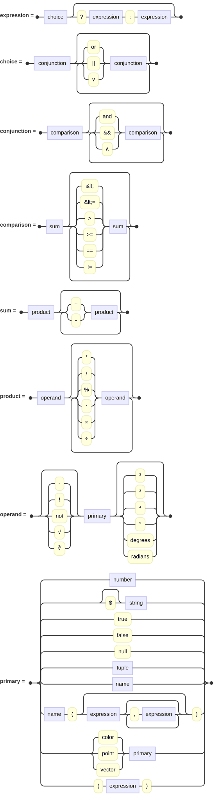
</picture>

**A tuple** — A point, vector or color, written in square brackets. &nbsp; [_scene files_](scene-files.md#numbers-points-vectors-and-colors)

<picture>
  <source media="(prefers-color-scheme: dark)" srcset="images/scene-files/tuple-dark.svg">
  <source media="(prefers-color-scheme: light)" srcset="images/scene-files/tuple.svg">
  
</picture>

**Setting a variable** — Naming a value so it can be reused. &nbsp; [_scene files_](scene-files.md#variables)

<picture>
  <source media="(prefers-color-scheme: dark)" srcset="images/scene-files/setVariableClause-dark.svg">
  <source media="(prefers-color-scheme: light)" srcset="images/scene-files/setVariableClause.svg">
  
</picture>

**Including a file** — Reading another file in place. &nbsp; [_scene files_](scene-files.md#including-other-files)

<picture>
  <source media="(prefers-color-scheme: dark)" srcset="images/scene-files/includeClause-dark.svg">
  <source media="(prefers-color-scheme: light)" srcset="images/scene-files/includeClause.svg">
  
</picture>

**Importing from a library** — Taking named definitions from a library. &nbsp; [_scene files_](scene-files.md#importing-from-a-library)

<picture>
  <source media="(prefers-color-scheme: dark)" srcset="images/scene-files/importClause-dark.svg">
  <source media="(prefers-color-scheme: light)" srcset="images/scene-files/importClause.svg">
  
</picture>

**The render command** — Choosing which scene and camera to render. &nbsp; [_scene files_](scene-files.md#the-render-command)

<picture>
  <source media="(prefers-color-scheme: dark)" srcset="images/scene-files/renderClause-dark.svg">
  <source media="(prefers-color-scheme: light)" srcset="images/scene-files/renderClause.svg">
  
</picture>

#### The context block

**The context block** — The render-wide settings. &nbsp; [_context_](context.md#the-context-block)

<picture>
  <source media="(prefers-color-scheme: dark)" srcset="images/context/contextClause-dark.svg">
  <source media="(prefers-color-scheme: light)" srcset="images/context/contextClause.svg">
  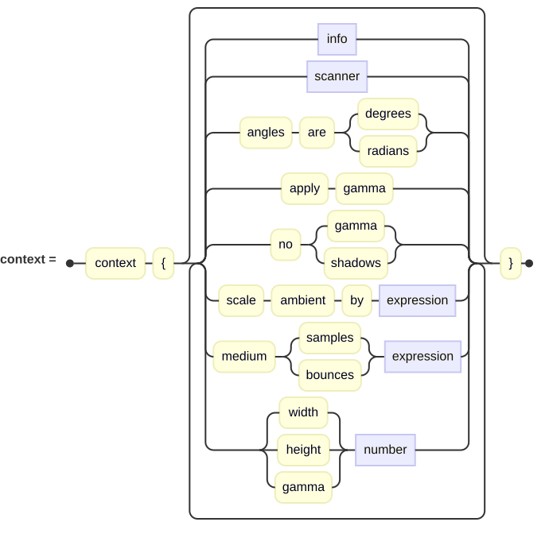
</picture>

**The info block** — The descriptive fields stored with the image. &nbsp; [_context_](context.md#image-information)

<picture>
  <source media="(prefers-color-scheme: dark)" srcset="images/context/infoClause-dark.svg">
  <source media="(prefers-color-scheme: light)" srcset="images/context/infoClause.svg">
  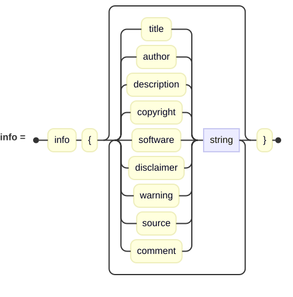
</picture>

**The scanner** — Which scanning strategy draws the image. &nbsp; [_context_](context.md#scanners)

<picture>
  <source media="(prefers-color-scheme: dark)" srcset="images/context/scannerClause-dark.svg">
  <source media="(prefers-color-scheme: light)" srcset="images/context/scannerClause.svg">
  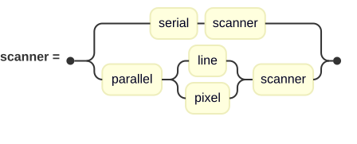
</picture>

#### Cameras

**A camera** — Where the scene is viewed from, and its lens and shutter. &nbsp; [_cameras_](cameras.md#placing-a-camera)

<picture>
  <source media="(prefers-color-scheme: dark)" srcset="images/cameras/cameraClause-dark.svg">
  <source media="(prefers-color-scheme: light)" srcset="images/cameras/cameraClause.svg">
  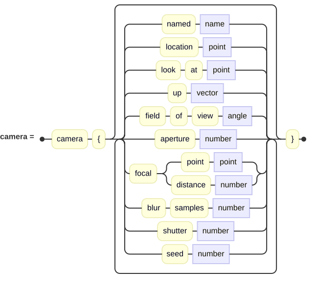
</picture>

#### Lights

**A light** — The opener that begins every kind of light. &nbsp; [_lights_](lights.md#lights)

<picture>
  <source media="(prefers-color-scheme: dark)" srcset="images/lights/lightClause-dark.svg">
  <source media="(prefers-color-scheme: light)" srcset="images/lights/lightClause.svg">
  
</picture>

**A point light** — A lamp at a single point. &nbsp; [_lights_](lights.md#point-lights)

<picture>
  <source media="(prefers-color-scheme: dark)" srcset="images/lights/pointLight-dark.svg">
  <source media="(prefers-color-scheme: light)" srcset="images/lights/pointLight.svg">
  
</picture>

**A distant light** — Parallel rays, like the sun. &nbsp; [_lights_](lights.md#distant-lights)

<picture>
  <source media="(prefers-color-scheme: dark)" srcset="images/lights/distantLight-dark.svg">
  <source media="(prefers-color-scheme: light)" srcset="images/lights/distantLight.svg">
  
</picture>

**A spotlight** — A cone of light aimed at a point. &nbsp; [_lights_](lights.md#spotlights)

<picture>
  <source media="(prefers-color-scheme: dark)" srcset="images/lights/spotLight-dark.svg">
  <source media="(prefers-color-scheme: light)" srcset="images/lights/spotLight.svg">
  
</picture>

**An area light** — A panel of light, for soft shadows. &nbsp; [_lights_](lights.md#area-lights)

<picture>
  <source media="(prefers-color-scheme: dark)" srcset="images/lights/areaLight-dark.svg">
  <source media="(prefers-color-scheme: light)" srcset="images/lights/areaLight.svg">
  
</picture>

#### Surfaces

**What a surface carries** — The material, transform and other things any surface may hold. &nbsp; [_surfaces_](surfaces.md#what-every-surface-has)

<picture>
  <source media="(prefers-color-scheme: dark)" srcset="images/surfaces/surfaceEntryClause-dark.svg">
  <source media="(prefers-color-scheme: light)" srcset="images/surfaces/surfaceEntryClause.svg">
  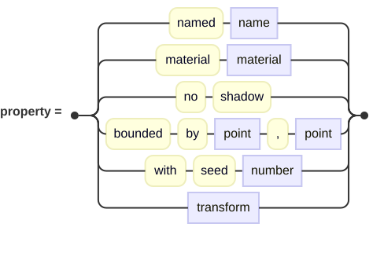
</picture>

**An extruded solid** — The `min Y`, `max Y` and `open` the cylinder, cone and extrusion share. &nbsp; [_surfaces_](surfaces.md#cylinder-and-conic)

<picture>
  <source media="(prefers-color-scheme: dark)" srcset="images/surfaces/extrudedSurface-dark.svg">
  <source media="(prefers-color-scheme: light)" srcset="images/surfaces/extrudedSurface.svg">
  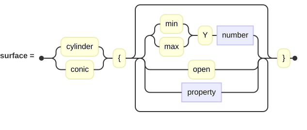
</picture>

**Combining surfaces** — Union, difference and intersection. &nbsp; [_surfaces_](surfaces.md#combining-surfaces)

<picture>
  <source media="(prefers-color-scheme: dark)" srcset="images/surfaces/csgClause-dark.svg">
  <source media="(prefers-color-scheme: light)" srcset="images/surfaces/csgClause.svg">
  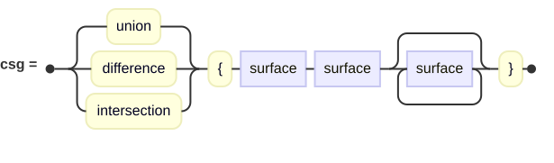
</picture>

**A group** — Gathering surfaces so one transform moves them all. &nbsp; [_surfaces_](surfaces.md#groups)

<picture>
  <source media="(prefers-color-scheme: dark)" srcset="images/surfaces/groupClause-dark.svg">
  <source media="(prefers-color-scheme: light)" srcset="images/surfaces/groupClause.svg">
  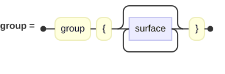
</picture>

#### Transforms

**A transform** — Translate, scale, rotate, shear and matrix. &nbsp; [_transforms_](transforms.md#order-matters)

<picture>
  <source media="(prefers-color-scheme: dark)" srcset="images/transforms/transformClause-dark.svg">
  <source media="(prefers-color-scheme: light)" srcset="images/transforms/transformClause.svg">
  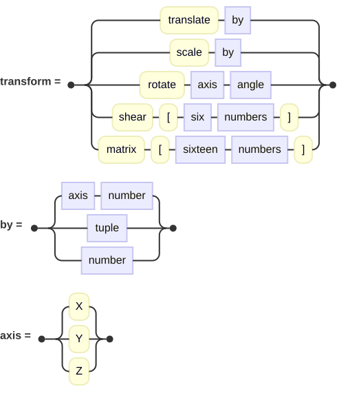
</picture>

**Motion** — Setting a surface moving, for motion blur. &nbsp; [_transforms_](transforms.md#setting-a-surface-moving)

<picture>
  <source media="(prefers-color-scheme: dark)" srcset="images/transforms/motionClause-dark.svg">
  <source media="(prefers-color-scheme: light)" srcset="images/transforms/motionClause.svg">
  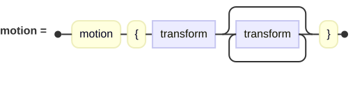
</picture>

#### Materials

**A material** — A surface's whole appearance: its pigment and finish. &nbsp; [_materials_](materials.md#the-finish)

<picture>
  <source media="(prefers-color-scheme: dark)" srcset="images/materials/materialClause-dark.svg">
  <source media="(prefers-color-scheme: light)" srcset="images/materials/materialClause.svg">
  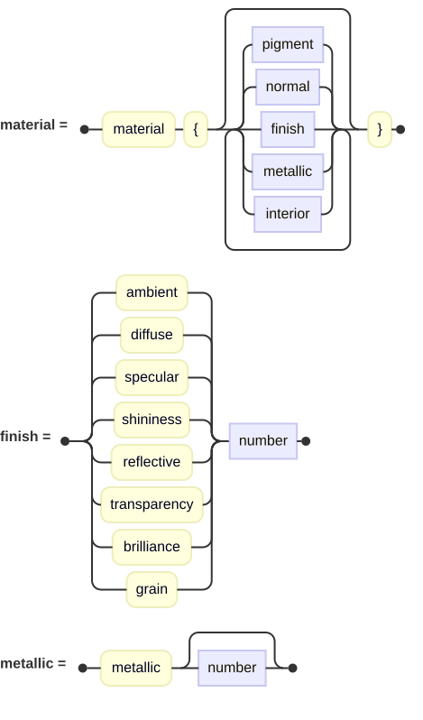
</picture>

**An interior** — What a surface is made of, and how it bends light. &nbsp; [_materials_](materials.md#transparency-and-interiors)

<picture>
  <source media="(prefers-color-scheme: dark)" srcset="images/materials/interiorClause-dark.svg">
  <source media="(prefers-color-scheme: light)" srcset="images/materials/interiorClause.svg">
  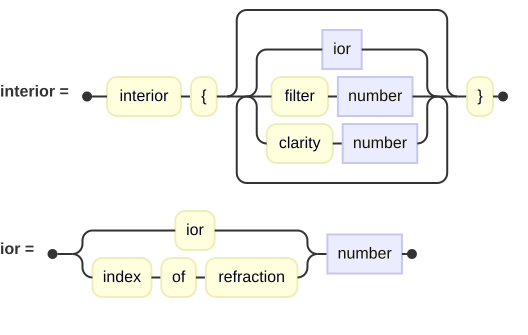
</picture>

#### Pigments and patterns

**A pigment** — What colors a surface: a solid, a pattern, or an image. &nbsp; [_pigments and patterns_](pigments-and-patterns.md#pigments-and-patterns)

<picture>
  <source media="(prefers-color-scheme: dark)" srcset="images/pigments/pigmentClause-dark.svg">
  <source media="(prefers-color-scheme: light)" srcset="images/pigments/pigmentClause.svg">
  
</picture>

**A pattern** — The spatial functions a pigment can sample. &nbsp; [_pigments and patterns_](pigments-and-patterns.md#patterns)

<picture>
  <source media="(prefers-color-scheme: dark)" srcset="images/pigments/patternClause-dark.svg">
  <source media="(prefers-color-scheme: light)" srcset="images/pigments/patternClause.svg">
  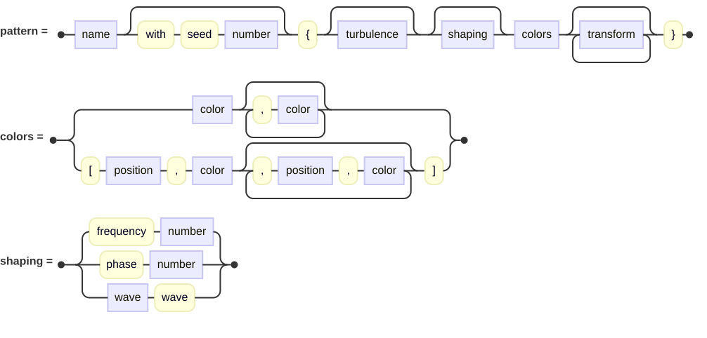
</picture>

**An image** — Reading an image, for an image pigment or a height field. &nbsp; [_pigments and patterns_](pigments-and-patterns.md#image-pigments)

<picture>
  <source media="(prefers-color-scheme: dark)" srcset="images/pigments/imageClause-dark.svg">
  <source media="(prefers-color-scheme: light)" srcset="images/pigments/imageClause.svg">
  
</picture>

#### Advanced surfaces

**A path** — The 2D outline an extrusion, lathe or generic shape is built from. &nbsp; [_advanced surfaces_](advanced-surfaces.md#paths)

<picture>
  <source media="(prefers-color-scheme: dark)" srcset="images/advanced/pathClause-dark.svg">
  <source media="(prefers-color-scheme: light)" srcset="images/advanced/pathClause.svg">
  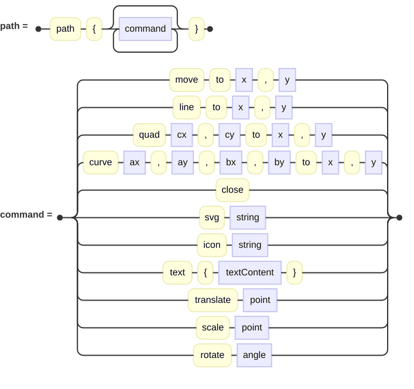
</picture>

**A spline** — The 3D path a sweep carries its profile along. &nbsp; [_advanced surfaces_](advanced-surfaces.md#sweep)

<picture>
  <source media="(prefers-color-scheme: dark)" srcset="images/advanced/splineClause-dark.svg">
  <source media="(prefers-color-scheme: light)" srcset="images/advanced/splineClause.svg">
  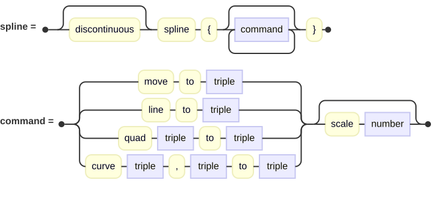
</picture>

**A tube** — A round tube of varying radius along a path. &nbsp; [_advanced surfaces_](advanced-surfaces.md#tube)

<picture>
  <source media="(prefers-color-scheme: dark)" srcset="images/advanced/tubeClause-dark.svg">
  <source media="(prefers-color-scheme: light)" srcset="images/advanced/tubeClause.svg">
  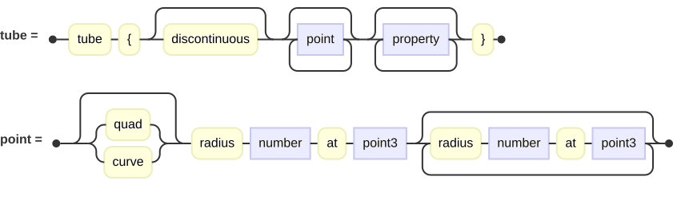
</picture>

**Text** — Letters turned into geometry. &nbsp; [_advanced surfaces_](advanced-surfaces.md#text)

<picture>
  <source media="(prefers-color-scheme: dark)" srcset="images/advanced/textClause-dark.svg">
  <source media="(prefers-color-scheme: light)" srcset="images/advanced/textClause.svg">
  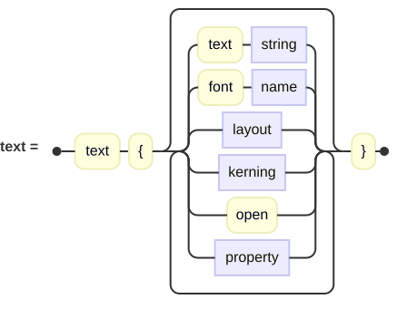
</picture>

**A height field** — An image read as terrain. &nbsp; [_advanced surfaces_](advanced-surfaces.md#height-field)

<picture>
  <source media="(prefers-color-scheme: dark)" srcset="images/advanced/heightFieldClause-dark.svg">
  <source media="(prefers-color-scheme: light)" srcset="images/advanced/heightFieldClause.svg">
  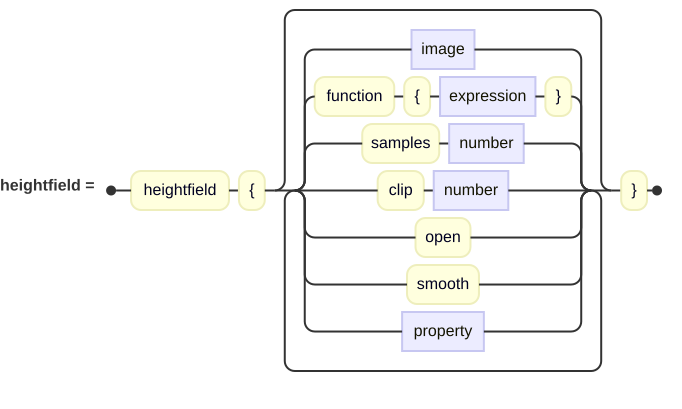
</picture>

### Built-in names

Before it reads a line of a scene, the renderer fills a pool of names that every scene inherits,
so all of these may be used without defining them first.  It holds a handful of constants, and
then three families of names: the colors, the indices of refraction, and the direction vectors.

#### Global constants

| Name | Value | What it is |
| --- | --- | --- |
| `π` | 3.14159… | Pi, for turning by a fraction of a circle. |
| `Identity` | the identity matrix | A transform that changes nothing; a starting point for `matrix`. |
| `PositiveInfinity` | the largest double | Positive infinity. |
| `NegativeInfinity` | the smallest double | Negative infinity. |
| `__software__` | this ray tracer's name and version | The default an image's software field is stamped with. |

#### Functions

Every function an [expression](scene-files.md#functions) may call.  Several take either numbers
or vectors; ask for a form that does not exist and the error names the ones that do.

| | | | |
| --- | --- | --- | --- |
| `abs` | `dot` | `magnitude` | `sign` |
| `acos` | `exp` | `max` | `sin` |
| `asin` | `floor` | `min` | `sinh` |
| `atan` | `length` | `mod` | `smoothstep` |
| `atan2` | `lerp` | `noise` | `sqrt` |
| `cbrt` | `log` | `normalize` | `tan` |
| `ceil` | `log10` | `pow` | `tanh` |
| `clamp` | `cos` | `round` | `toDegrees` |
| `cosh` | `cross` | `distance` | `trunc` |

#### Colors

The full set of named colors — the standard X11 and POV-Ray names.  Any of them may be used
wherever a color is wanted, as `color Red` or simply `Red`.

| | | | |
| --- | --- | --- | --- |
|  `AliceBlue` |  `DustyRose` |  `MediumSlateBlue` |  `SummerSky` |
|  `AntiqueWhite` |  `Feldspar` |  `MediumSpringGreen` |  `Tan` |
|  `Aqua` |  `Firebrick` |  `MediumTurquoise` |  `Teal` |
|  `Aquamarine` |  `Flesh` |  `MediumVioletRed` |  `Thistle` |
|  `Azure` |  `FloralWhite` |  `MediumWood` |  `Tomato` |
| 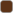 `BakersChocolate` |  `ForestGreen` |  `Mica` |  `Transparent` |
|  `Beige` |  `Fuchsia` |  `MidnightBlue` |  `Turquoise` |
|  `Bisque` |  `Gainsboro` |  `MintCream` |  `VeryDarkBrown` |
|  `Black` |  `GhostWhite` |  `MistyRose` |  `VeryLightGray` |
|  `BlanchedAlmond` |  `Gold` |  `Moccasin` |  `VeryLightGrey` |
|  `Blue` |  `Goldenrod` |  `NavajoWhite` |  `VeryLightPurple` |
|  `BlueViolet` |  `Gray` |  `Navy` |  `Violet` |
|  `Brass` |  `Green` |  `NavyBlue` |  `VioletRed` |
|  `BrightGold` |  `GreenCopper` |  `NeonBlue` |  `Wheat` |
|  `Bronze` |  `GreenYellow` |  `NeonPink` |  `White` |
|  `Bronze2` |  `Grey` |  `NewMidnightBlue` |  `WhiteSmoke` |
|  `Brown` |  `Honeydew` |  `NewTan` |  `Yellow` |
|  `BurlyWood` |  `HotPink` |  `OldGold` |  `YellowGreen` |
|  `CadetBlue` |  `HunterGreen` |  `OldLace` |  `Gray05` |
|  `Chartreuse` |  `IndianRed` |  `Olive` |  `Gray10` |
|  `Chocolate` |  `Indigo` |  `OliveDrab` |  `Gray15` |
|  `CoolCopper` |  `Ivory` |  `Orange` |  `Gray20` |
|  `Copper` |  `Khaki` |  `OrangeRed` |  `Gray25` |
|  `Coral` |  `Lavender` |  `Orchid` |  `Gray30` |
|  `CornflowerBlue` |  `LavenderBlush` |  `PaleGoldenrod` |  `Gray35` |
|  `Cornsilk` |  `LawnGreen` |  `PaleGreen` |  `Gray40` |
|  `Crimson` |  `LemonChiffon` |  `PaleTurquoise` |  `Gray45` |
|  `Cyan` |  `LightBlue` |  `PaleVioletRed` |  `Gray50` |
|  `DarkBlue` |  `LightCoral` |  `PapayaWhip` |  `Gray55` |
|  `DarkBrown` |  `LightCyan` |  `PeachPuff` |  `Gray60` |
|  `DarkCyan` |  `LightGoldenrodYellow` |  `Peru` |  `Gray65` |
|  `DarkGoldenrod` |  `LightGray` |  `Pink` |  `Gray70` |
| 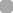 `DarkGray` |  `LightGreen` |  `Plum` |  `Gray75` |
|  `DarkGreen` | 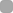 `LightGrey` |  `PowderBlue` |  `Gray80` |
|  `DarkGreenCopper` |  `LightPink` |  `Purple` |  `Gray85` |
|  `DarkGrey` |  `LightPurple` |  `Quartz` |  `Gray90` |
|  `DarkKhaki` |  `LightSalmon` |  `Red` |  `Gray95` |
|  `DarkMagenta` |  `LightSeaGreen` |  `RichBlue` |  `Grey05` |
| 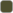 `DarkOliveGreen` |  `LightSkyBlue` |  `RosyBrown` |  `Grey10` |
|  `DarkOrange` |  `LightSlateGray` |  `RoyalBlue` |  `Grey15` |
|  `DarkOrchid` |  `LightSlateGrey` |  `SaddleBrown` |  `Grey20` |
|  `DarkPurple` | 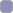 `LightSteelBlue` |  `Salmon` |  `Grey25` |
|  `DarkRed` |  `LightWood` |  `SandyBrown` |  `Grey30` |
|  `DarkSalmon` |  `LightYellow` |  `Scarlet` |  `Grey35` |
|  `DarkSeaGreen` |  `Lime` |  `SeaGreen` |  `Grey40` |
|  `DarkSlateBlue` |  `LimeGreen` |  `SeaShell` |  `Grey45` |
|  `DarkSlateGray` |  `Linen` | 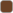 `SemiSweetChocolate` |  `Grey50` |
|  `DarkSlateGrey` |  `Magenta` |  `Sienna` |  `Grey55` |
|  `DarkTan` |  `MandarinOrange` |  `Silver` |  `Grey60` |
|  `DarkTurquoise` |  `Maroon` |  `SkyBlue` | 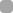 `Grey65` |
|  `DarkViolet` |  `MediumAquamarine` |  `SlateBlue` | 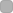 `Grey70` |
|  `DarkWood` |  `MediumBlue` |  `SlateGray` |  `Grey75` |
|  `DeepPink` |  `MediumForestGreen` |  `SlateGrey` |  `Grey80` |
|  `DeepSkyBlue` |  `MediumGoldenrod` |  `Snow` |  `Grey85` |
|  `DimGray` |  `MediumOrchid` |  `SpicyPink` |  `Grey90` |
|  `DimGrey` |  `MediumPurple` |  `SpringGreen` |  `Grey95` |
|  `DodgerBlue` |  `MediumSeaGreen` |  `SteelBlue` |  |

Names spelled with *Grey* are aliases of their *Gray* counterparts (`DarkGrey` is `DarkGray`),
and a few others double up too — `NavyBlue` is `Navy`, and `Mica` is `Black`.

#### Indices of refraction

Each of these may be used wherever an index of refraction is wanted, as `interior { ior Glass }`.
Several gemstones are also named colors; asking for the color of `Aquamarine` and asking for how
far it bends light are different questions of the same name.

**Gases, liquids and common solids**

| Name | IOR | Name | IOR |
| --- | --- | --- | --- |
| `Vacuum` | 1 | `WaterIce` | 1.31 |
| `Air` | 1.000293 | `Kerosene` | 1.39 |
| `CarbonDioxide` | 1.00045 | `Glass` | 1.52 |
| `Helium` | 1.000036 | `Amber` | 1.55 |
| `Hydrogen` | 1.000132 | `Diamond` | 2.417 |
| `Water` | 1.333 |  |  |

**Optical glasses**

| Name | IOR | Name | IOR |
| --- | --- | --- | --- |
| `CrownGlass` | 1.51673 | `FlintGlass` | 1.78446 |
| `CrownGlassBaK1` | 1.57241 | `FlintGlassF2` | 1.61989 |
| `WindowGlass` | 1.51673 | `FlintGlassLaSFN9` | 1.85002 |

**Gemstones**

| Name | IOR | Name | IOR | Name | IOR |
| --- | --- | --- | --- | --- | --- |
| `Agate` | 1.544 | `Fluorite` | 1.434 | `Peridot` | 1.654 |
| `Alexandrite` | 1.746 | `Iolite` | 1.55 | `Prehnite` | 1.64 |
| `Amazonite` | 1.53 | `Ivory` | 1.54 | `Quartz` | 1.544 |
| `Amethyst` | 1.544 | `Jadeite` | 1.67 | `RoseQuartz` | 1.544 |
| `Andalusite` | 1.64 | `Jasper` | 1.54 | `Ruby` | 1.766 |
| `Andesine` | 1.53 | `Kunzite` | 1.67 | `Sapphire` | 1.766 |
| `Apatite` | 1.63 | `Kyanite` | 1.73 | `SmokyQuartz` | 1.544 |
| `Aquamarine` | 1.58 | `Labradorite` | 1.56 | `Sphene` | 1.7 |
| `Aventurine` | 1.544 | `LapisLazuli` | 1.5 | `Spinel` | 1.712 |
| `Beryl` | 1.58 | `Malachite` | 1.655 | `Spodumene` | 1.67 |
| `Chalcedony` | 1.544 | `Moissanite` | 2.67 | `Tanzanite` | 1.7 |
| `ChromeDiopside` | 1.69 | `Moonstone` | 1.52 | `TigersEye` | 1.544 |
| `Chrysoberyl` | 1.746 | `Morganite` | 1.58 | `Topaz` | 1.62 |
| `Citrine` | 1.544 | `NephriteJade` | 1.62 | `Tourmaline` | 1.624 |
| `Coral` | 1.486 | `Onyx` | 1.544 | `Turquoise` | 1.61 |
| `Corundum` | 1.766 | `Opal` | 1.45 | `Zircon` | 1.95 |
| `CubicZirconia` | 2.16 | `Orthoclase` | 1.52 | `Zoisite` | 1.7 |
| `Emerald` | 1.58 | `Pearl` | 1.53 |  |  |

**Garnets**

| Name | IOR | Name | IOR |
| --- | --- | --- | --- |
| `AlmandineGarnet` | 1.79 | `PyropeGarnet` | 1.74 |
| `AndraditeGarnet` | 1.888 | `RhodoliteGarnet` | 1.76 |
| `DemantoidGarnet` | 1.885 | `SpessartiteGarnet` | 1.81 |
| `GrossulariteGarnet` | 1.74 | `TsavoriteGarnet` | 1.74 |

#### Direction vectors

Six unit vectors, handy wherever a direction or offset is written — a camera's `up`, a distant
light's `direction`, or a `translate`.

| Name | Vector |
| --- | --- |
| `Up` | [0,1,0] |
| `Down` | [0,-1,0] |
| `Left` | [-1,0,0] |
| `Right` | [1,0,0] |
| `In` | [0,0,1] |
| `Out` | [0,0,-1] |

### The command line

The ray tracer has three verbs.  `render` is the default — running it with no verb renders — and
[Command Line Options](getting-started.md#command-line-options) covers it at more length.  The
other two, `fonts` and `libraries`, have chapters of their own: [Managing Fonts](fonts.md) and
[Using Libraries](libraries.md).

#### render

| Option | What it does |
| --- | --- |
| `-i`, `--input-file` | The scene file to render.  This one is required. |
| `-o`, `--output-file` | Name the output image file. |
| `-d`, `--output-dir` | The directory to write the output in. |
| `-e`, `--output-extension` | Choose the output format by giving its extension. |
| `--scene` | The [scene](scene-files.md#scenes-and-cameras) to render, when the file has more than one. |
| `--camera` | The [camera](cameras.md#placing-a-camera) to render with, when the scene has more than one. |
| `-w`, `--width` | Image width; otherwise the scene's, otherwise 800. |
| `-h`, `--height` | Image height; otherwise the scene's, otherwise 600. |
| `-a`, `--antialias` | The [anti-aliasing](context.md#anti-aliasing) to apply. |
| `-g`, `--gamma` | The [gamma](context.md#gamma) to correct the output for. |
| `--no-gamma` | Apply no gamma correction. |
| `--no-shadows` | Turn shadows off everywhere. |
| `--grayscale` | Write the image in shades of gray. |
| `-c`, `--bits-per-channel` | How many bits each color channel gets in the file. |
| `-r`, `--frame-rate` | Frames per second for a series of images (default 24). |
| `-m`, `--frame` | Render one particular frame of an animation. |
| `-l`, `--output-level` | How much to print: `quiet`, `normal`, `chatty` or `verbose`. |

#### fonts

| Option | What it does |
| --- | --- |
| `-l`, `--list` | List the faces in the catalog. |
| `-f`, `--fetch` | Fetch a face from Google Fonts. |
| `-i`, `--import` | Import a face from a TrueType file. |
| `-g`, `--show-glyphs-for` | List the glyphs a face carries. |
| `-k`, `--show-kerning-for` | Show a face's stored kerning pairs. |
| `-a`, `--add-kerning-for` | Add a kerning pair (with `--pair`). |
| `-d`, `--remove-kerning-for` | Remove a kerning pair (with `--pair`). |
| `-p`, `--pair` | The pair itself, as `left:adjustment:right`. |
| `-r`, `--remove` | Remove a face. |
| `-o`, `--overwrite` | Allow an add or import to replace one already there. |

#### libraries

| Option | What it does |
| --- | --- |
| `-l`, `--list` | List the libraries the ray tracer knows about. |
| `-i`, `--import` | Import a library: an `.igl` file of definitions, or (with `--povray`) a POV-Ray include directory. |
| `-p`, `--povray` | With `--import`, convert a POV-Ray distribution's include files rather than copy one `.igl`. |
| `-r`, `--remove` | Remove a library. |
| `--fa-zip` | Install a FontAwesome zip, so scenes can use its icons as [2D paths](advanced-surfaces.md#icons). |
| `-o`, `--overwrite` | Allow an import to replace libraries already there. |
| `-d`, `--details` | List every definition that could not be converted. |
| `-n`, `--dry-run` | Convert and report, but write nothing. |
