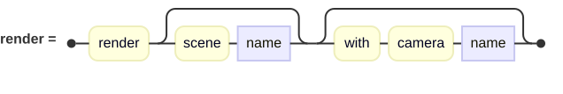
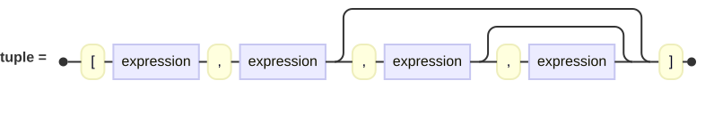
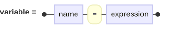
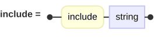
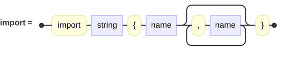

## Scene Files

A scene file is a plain text file, conventionally given the extension `.igl`.  It is read
from top to bottom, and what it contains is a series of *items* — cameras, some lights, the
surfaces of the world, whole scenes, and whatever settings you care to fix.

### The Shape of a File

Order mostly doesn't matter.  The file is not a program being executed in sequence; it is a
specification of what to render.  The renderer waits until it has read the whole thing
before it draws anything.  A light written after the surfaces lights them just the same as
one written before.

Everything in a scene file can carry a name.  For cameras and scenes, this is important
since you'll have to tell the renderer which camera in which scene to use (but only if you
have more than one of either).  The names of things must not be confused with *variables*,
which are also supported.  Variables do need to be assigned a value before they can be
referenced.  So, they must appear in the file before they are used.  The value can be as
complex an expression as you need, but it won't actually be *evaluated* until render time.
Similarly, a file must be included above the point where you rely on what is in it.  This
is the one way order matters.

Everything else — cameras, lights, surfaces — may appear in any order.  Just remember that
a file with no lights renders black, which is probably not what you want.

### Scenes and Cameras

Most of the time a file describes a single picture, and everything in it — the camera, the
lights, the surfaces — simply sits at the top level, as in every example so far.  That is a
convenience.  What is really being described is a *scene*, and a file may hold more than one
of those.

#### More than one camera

A scene may hold as many cameras as you like.  With just one, it is used without your having
to say so.  With more than one, the renderer cannot guess which you mean, so two things
become necessary: each camera must be given a name, and the file must end with a `render`
command naming the camera to use.

```
camera {
    named 'wide'
    location [0, 3, -9]
    field of view 70
}

camera {
    named 'close'
    location [0, 1.5, -3]
    field of view 40
}

// ... lights and surfaces ...

render with camera 'close'
```

Leave the `render` command off with two cameras present and the render stops with *"No camera
name specified to render, and more than one camera is defined."*  The
[`render` command](#the-render-command) is described below.

#### More than one scene

In the same way, a file may describe several whole scenes, each wrapped in a `scene { }`
block with a name of its own:

```
scene {
    named 'day'
    camera { location [0, 2, -6]  look at [0, 1, 0] }
    point light { location [-8, 10, -8]  color White }
    // ... surfaces ...
}

scene {
    named 'night'
    camera { location [0, 2, -6]  look at [0, 1, 0] }
    point light { location [-8, 10, -8]  color [0.3, 0.3, 0.5] }
    // ... surfaces ...
}

render scene 'night'
```

Not writing a `scene { }` block at all is the convenience you have been using: when nothing
is wrapped in one, the whole file is taken as a single unnamed scene.  As with cameras, one
scene is used automatically, and more than one must be named and chosen with `render`.

The two conveniences do not mix, though.  Once any part of a file is wrapped in a `scene { }`
block, *everything* must be — a surface left at the top level alongside an explicit scene
stops the render with *"... definition found outside a scene definition when explicit scenes
are being used."*

### The `render` Command

When a file holds more than one scene or more than one camera, a `render` command at the end
says which to use.

<picture>
  <source media="(prefers-color-scheme: dark)" srcset="images/scene-files/renderClause-dark.svg">
  <source media="(prefers-color-scheme: light)" srcset="images/scene-files/renderClause.svg">
  
</picture>

Both parts are optional, and either may be given on its own:

```
render                              // only meaningful with one scene and one camera
render scene 'night'                // that scene, its own single camera
render with camera 'close'          // the one scene, this camera
render scene 'night' with camera 'close'
```

The camera named is looked for in the scene being rendered, so two scenes may each have a
camera called `close` without any confusion.

A file needs a `render` command only when there is a genuine choice to make.  With a single
scene and a single camera — which is most files — you may leave it off, and that is why none
of the examples so far have needed one.

The choice can also be made from the command line, with `--scene` and `--camera`, which take
precedence over anything the file says.  That lets one file be rendered from any of its cameras,
or as any of its scenes, without editing it — and lets a file with several of either be
rendered without a `render` command at all.  See
[Command Line Options](getting-started.md#command-line-options).

### Background

A ray that strikes nothing still has to come back with *some* color.  By default that color is
transparent, so the pixels a scene does not fill come out with no color and no opacity — which
is handy when the image is to be laid over something else later.  `background` sets what is
returned there instead:

```
background Black
background [0.05, 0.06, 0.09]
```

It takes a *pigment*, not merely a color, so a sky may be patterned:

```
background linear Y bouncing gradient {
    [0, LightSkyBlue, 1, DeepSkyBlue]
}
```

A pigment must be asked about a point, and a ray that hit nothing has no point of intersection to
offer, so it is asked about the direction the ray was *heading*: the pigment is painted on a sphere
of radius one, infinitely far off.  Two things follow from that, both worth knowing.  The sky looks
the same from everywhere in the scene, which is what a sky ought to do.  And a pattern's own scale
is in units of that sphere rather than of the world — the coordinates it is handed never leave the
range -1 to 1 — so a sky wanting finer detail scales its pigment *down*, and one wanting broader
sweeps scales it up.  The gradient above needs no scaling at all: one unit of it carries you from
the horizon, where `Y` is zero, to straight overhead, where it is one.

It is also what lets a photograph serve as the sky, which is what an environment map is:

```
background image 'sky.jpg'
```

An [image pigment](pigments-and-patterns.md#image-pigments) used as a background maps
`spherical` unless told otherwise, since the sky it is being painted on is a sphere.

A background is not a surface: nothing lights it and it casts nothing.  But it is what *any* ray
returns on striking nothing, not just those from the camera, so a mirror aimed at empty sky shows
the same sky that stands over it.

`background` may sit at the top level, or inside a `scene { }` block, so that two scenes may
carry skies of their own:

```
scene {
    named 'day'
    background [0.5, 0.7, 0.95]
    camera { location [0, 2, -6]  look at [0, 1, 0] }
    // ... lights and surfaces ...
}
```

### The Space Between Things

Light travels differently through different stuff, and a scene says how a *solid* bends it with
[`interior { ior … }`](materials.md#transparency-and-interiors).  What surrounds those solids has an
index of its own, and `environment ior` is how a scene says what it is:

```
environment ior Air
```

The default is 1, a vacuum, which is what every scene has silently assumed until now.  `Air` is
1.000293 — a whisper of a difference, and it will not change a picture much.  It matters because it
is *right*, and because the difference stops being a whisper as soon as the surroundings are anything
but thin: a glass marble in water bends light far less than the same marble in air does, since what
counts at a surface is the ratio between the two sides rather than either on its own.  That ratio is
charged wherever it belongs — it bends what is seen through a solid, and it sets how much light a
boundary mirrors away rather than letting through — so the surroundings show in the shadow a glass
ball casts as much as in the view through it.

```
environment ior Water     // for a scene set beneath the surface
```

Any of the [named indices](reference.md#indices-of-refraction) may be used, or a number.  As in an
`interior` block, `ior` may be spelled out in full:

```
environment index of refraction 1.333
```

Like `background`, this may sit at the top level or inside a `scene { }` block, so two scenes in one
file may sit in different surroundings.

#### Filling that space

The surroundings can be more than empty space with an index.  When there is more than one thing to
say about them, `environment` takes a block, and what fills the space is a `medium`:

```
environment {
    ior Air
    medium {
        absorption [0.058, 0.05, 0.042]
        emission [0.035, 0.04, 0.052]
    }
}
```

A medium is something a ray passes *through* rather than strikes.  Two things happen to a ray
crossing it: light is taken out, so what lies beyond arrives dimmer; and the medium's own light is
added all along the way, each bit of it dimmed in turn by however much medium still lies between it
and the eye.  Together those are haze, fog, smoke, and the glow of a gas.

| Property | Default | What it does |
| --- | --- | --- |
| `absorption` | none | How much light the medium takes out for each unit of distance. |
| `emission` | none | How much light it gives off for each unit of distance. |
| `density` | 1 | A plain multiplier on both, so how *much* of the stuff there is can be said apart from what the stuff does. |

The first two are colors, because a haze that dims red more than blue is the whole reason far hills
are blue rather than gray.  Either may be written as a single number when all three colors are the
same, exactly as `clarity` is:

```
medium { absorption 0.04 }
```

**The sky comes out of this.**  A ray that strikes nothing crosses the surroundings forever, so
what lies beyond cannot matter at all — and what comes back settles at the emission divided by the
absorption.  An endless haze therefore both swallows the sky and *becomes* it.  In the example
above nothing paints a sky, and yet the scene has one, and its color is not a choice but a
consequence: `[0.035, 0.04, 0.052]` over `[0.058, 0.05, 0.042]` is a pale blue.  Change either line
and the sky changes with it.  A medium that absorbs without emitting turns the sky black, which is
the honest answer for a fog that has no light of its own.

Because of that, a medium filling the surroundings has to absorb wherever it emits.  One that gives
off light it never takes back has nothing to settle it over an endless span — it is infinitely
bright — so the render stops and says so.  Said of something bounded the very same medium is
perfectly reasonable; see [below](materials.md#filling-a-surface).

**A lamp is charged for its trip too.**  Fog stands between a light and what it lights just as it
stands between the eye and what it looks at, so objects deep in fog are lit dimly rather than fully.
Note where that leads for a `distant light`, whose light comes from infinitely far off: an endless
absorbing medium extinguishes it utterly.  That is the right answer to the question as asked — real
fog has a far side, and the way to describe one is a medium inside a surface.

Neither of those is sampled or stepped along.  With the density even throughout, both what survives
a crossing and what the medium adds have exact answers, so a span costs one exponential per color and
a fog of that sort renders at very nearly the speed of a clear scene.

#### Scattering

The third thing a medium may do is turn light aside: take light that arrived from somewhere else and
send it on in a new direction.  Some of what it turns aside goes toward the eye, and that is what a
shaft of light through a window is, or the cone under a street lamp, or the halo around headlights in
fog.

```
environment {
    medium {
        scattering 0.06
        anisotropy 0.3
    }
}
```

| Property | Default | What it does |
| --- | --- | --- |
| `scattering` | none | How much light the medium turns aside for each unit of distance. |
| `anisotropy` | 0 | Which way it prefers to turn light, from -1 to 1.  Above nothing favors carrying light on the way it was going; below nothing favors sending it back. |
| `phase rayleigh` | — | Uses Rayleigh's shape instead, for particles far smaller than the light's own wavelength — what makes a clear sky blue. |
| `samples` | from the context | How many places along a crossing are asked about, for this medium alone. |

**Turning light aside also takes it out of the ray**, so `scattering` dims what lies beyond it exactly
as `absorption` does — a purely scattering fog still hides a distant hillside.  The difference is
where the light goes: absorbed light is gone, while light turned aside went somewhere, and some of
that somewhere is toward you.

**Anisotropy is the one knob for the shape.**  Nearly everything real prefers to carry light on the
way it was already going, which is why fog glows brightest around a lamp you are looking *toward*, and
why a cloud's edge lights up against the sun.  At `0` the medium has no preference at all.  Values are
measured against that even spread: a medium at `0.7` sends about nineteen times as much light straight
on as an even spread would, and about a tenth as much straight back.

**This is the one term with no exact answer.**  The angle to each lamp, how far off it is, and whether
anything stands in the way all change along a ray, so it has to be gone and looked for: the crossing
is sampled in a number of places, and each place asks every lamp what it delivers there.  That is
where the cost of a scattering medium lies — roughly *samples × lamps* shadow rays for every pixel
looking through it.

The places are not spread evenly along the crossing.  They are spread by how much of what is there
could still reach the eye, so most of them land near your end of it, where scattered light actually
shows.  That is also why a crossing with no end needs no arbitrary stopping point.

#### Giving a medium a shape

Everything so far has been the same everywhere it went, which is fine for air and useless for anything
that looks like something.  A medium's density may instead be a *function of where you are*:

```
interior {
    medium {
        scattering 2.2
        density function {
            max(0, 1 - √(x² + y² + z²)) * max(0, 2.2 * noise(3.1*x, 3.1*y, 3.1*z) - 0.6)
        }
    }
}
```

That is a cloud: the ball's own falloff, times noise with its foot taken off so the density reaches
*nothing* between the billows rather than merely thinning.  Reaching nothing is what makes it read as
billows with gaps rather than as a fuzzy ball.

The function is written in the [same language](#expressions) an
[isosurface](advanced-surfaces.md#isosurface)'s is, with the same `noise`, and compiled to a real
delegate before the first ray is fired.  It is held to *less* than an isosurface's, though: an
isosurface has to be differentiated to be given a normal and refuses anything whose slope cannot be
written down, while a density is only ever asked for a value.  So `smoothstep`, which an isosurface
turns away, is welcome here.  A density that would go negative counts as empty, since a density below
nothing has no meaning.

It is read in the **container's own space**, so scaling or rotating the surface carries the shape with
it, exactly as a pattern's coordinates do.  `density` written as a plain number alongside a shape
scales the whole of it, which is how a shaped medium is thinned with one number.

**A shaped medium must fill a surface.**  Saying it of the surroundings is refused, and the reason is
arithmetic rather than taste: a crossing with no end can only be walked at all because there is a
distance past which nothing could still reach the eye, and that rests on a floor under how much stuff
is there.  A shape free to thin toward nothing takes the floor away.  A ground fog is therefore a very
large flattened box.

**Two things stop being exact.**  With the density varying, neither what survives a crossing nor what
the medium gives off has an answer that can be written down — both become integrals along the ray — so
a shaped medium is *walked*, in the same number of steps the scattering is sampled in.  A medium
without a shape is not walked, and is answered exactly as before.

**And a shape stands in its own light.**  A cloud's underside is dark because its top was in the way,
and nothing but the medium shadowing itself gives that.  So each place the walk asks about asks every
lamp what reaches it, and each of *those* answers walks the shape again — coarsely, at a quarter of the
steps, since all that is wanted is how much stuff is in the way rather than where it is.  This is the
expensive part of a shaped medium, and it is what tells a cloud from a glowing blob.

One thing worth knowing before tuning a cloud by eye: **thicker is not brighter**.  Past a point,
adding density makes a medium darker, because more of what it scatters is swallowed again on the way
out and more of it stands in its own light.

#### Shaping a medium with a pattern

A shape may also be *named* rather than written out, using any pattern from the
[pattern library](pigments-and-patterns.md#patterns):

```
interior {
    medium {
        scattering 2.4
        density granite { scale 0.4 }
    }
}
```

This is the same job as a `density function`, and the two are alternatives — a medium has one shape or
the other, never both.  Which to reach for is a question of what you are trying to say.  A function is
the way to state a shape *exactly*: a ball that fades at its rim, a slab that thins with height, a
billow with its foot taken off.  A pattern is the way to get one you would find tedious to write down
but that the library already knows — a granite's grain, a marble's veins, the cells of a `crackle`,
alternating blocks of `checker`.

**Everything the patterns offer comes along**, because it is the same pattern machinery a pigment uses:

```
density marble {
    turbulence 0.6
    frequency 3
    sine wave
    scale [0.5, 2, 0.5]
}
```

The transform is doing more work here than it looks, and leaving it out is the usual first mistake.  A
pattern is written at the scale of the space it sits in, and the things media fill are typically a
couple of units across, so most of the library at its own footing gives one blob and nothing more.
Scale it to the size of the detail you want.

Patterns built to *choose between* pigments rather than to give a fraction — `checker`, `hexagon`,
`brick`, `cubic` and the rest — hand back a whole number naming which pigment.  Those are spread back
across `0` to `1` here, so a `checker` gives nothing or all (a medium in alternating blocks) and a
`hexagon` gives nothing, a half, or all.  Without that a six-way pattern would quietly mean six times
the density.

**The pattern supplies texture; the container supplies shape.**  This is the real difference between
the two forms, and it decides which one a scene wants.  A pattern does not know where the medium ends,
so it fills its container right up to the edge — which is exactly right for smoke in a box or fog in a
room, and wrong for a cloud, whose whole character is that it fades into the air around it.  For
something that has to have an outline of its own, either write a function that reaches nothing at the
rim, or give the medium a container already shaped like the thing.

#### Multiple scattering

Everything above stops at the first turn: light goes lamp → one scattering → eye, and no further.  In
anything thick that is a small share of the light.  Most of what leaves a cloud has been turned a
dozen times or more on the way out, which is why a real cloud is white rather than grey and why its
shadowed side glows rather than going black.

```
context { medium bounces 3 }
```

That follows the light back a further three turns.  At each place along a ray, as well as asking the
lamps what reaches it, the renderer picks one direction the light might have come from — in proportion
to how much the medium favours that direction — finds where it would have been turned, asks the lamps
*there*, and carries on.

| | |
| --- | --- |
| `context { medium bounces N }` | The default for every medium in the scene. |
| `medium { bounces N }` | For one medium, whatever the context says. |

**Nothing is zero by default**, so no scene changes unless it asks.  That is deliberate: the cost is
real, roughly proportional to one plus the number of turns, and a thin haze gains almost nothing from
it — the light that has been turned twice in a light mist is a rounding error.  Thick media are where
it matters, and thick media are exactly where it costs most.

Each turn is worth the medium's **albedo**: the share of stopped light that carried on rather than
being swallowed, which is `scattering / (scattering + absorption)`.  A medium that absorbs nothing
passes all of it on and can be turned any number of times without loss; one that absorbs half of what
it stops is down to a sixteenth after four turns.  So the useful number of bounces follows from the
absorption — there is no sense asking for eight turns of a medium that has lost 99% of the light by the
third.

**One path per place, not many.**  A place could be asked about every direction at once, but each of
those would have to ask again, and the work would multiply by itself at every turn.  Following a
single direction costs one more path per turn instead of a tree of them, and since every place along
every ray does it, the picture as a whole still averages over a great many directions.  The price is
noise: the added light is an estimate, and a thin one at low sample counts.

**What this still does not give you.**  In this renderer nothing but a lamp gives off light — a
`background` is a color the eye sees, not something that illuminates.  A path that wanders out of the
medium therefore ends with nothing.  Real clouds are lit mostly by *sky*, so a cloud here is lit by
its lamps alone however many turns you follow.  Making the background light the scene is a separate
thing, and for a daylight cloud it would matter more than this does.

How many places is a question of how hard to work rather than of what the medium is made of, so it
lives with the scanner and the anti-aliasing:

```
context { medium samples 48 }
```

Sixteen is the default, which is plenty for an even haze.  A crisp shaft wants more — a spotlight's
cone is a small bright region in a long crossing, and too few places leave it speckled rather than
smooth.  A single medium may name its own count when one volume in a scene needs more care than the
rest.  Note that the speckle is the same in every render of a scene rather than shifting about, so it
will not average away over the frames of an animation; the cure is more places, not more frames.

### Comments

Comments are written as they are in C, C# or Java:

```
// Everything after two slashes, to the end of the line.

/* Or between these,
   however many lines it runs to. */
```

There is no comment syntax that survives into the rendered image; if you want a title or an
author recorded in the image file itself, that is what the
[`info` block](context.md#image-information) is for.

### Numbers, Points, Vectors and Colors

Numbers are written as you would expect: `1`, `-4`, `0.5`, `1e6`.

Everything with more than one component — a point in space, a direction, a color — is
written as a *tuple*, in square brackets:

<picture>
  <source media="(prefers-color-scheme: dark)" srcset="images/scene-files/tuple-dark.svg">
  <source media="(prefers-color-scheme: light)" srcset="images/scene-files/tuple.svg">
  
</picture>

```
[0, 1, 0]           // a point, or a vector, or a color: it depends where you write it
[1, 0.5, 0.25]      // a color, if used where a color is wanted
[1, 0.5, 0.25, 0.5] // four components: a color with an alpha
```

The same three numbers mean a point in one place and a color in another, and the renderer
tells which from where you wrote it, not from anything in the tuple itself.  Where that would
be genuinely ambiguous you can say outright, with a cast:

```
color [1, 0, 0]
point [0, 1, 0]
vector [0, 1, 0]
```

A great many colors already have names — `White`, `Black`, `Red`, `Gray30`, `Turquoise`,
and hundreds more — and they may be used anywhere a color tuple can.

### Variables

Any value may be given a name, and used afterward wherever that value would go:

<picture>
  <source media="(prefers-color-scheme: dark)" srcset="images/scene-files/setVariableClause-dark.svg">
  <source media="(prefers-color-scheme: light)" srcset="images/scene-files/setVariableClause.svg">
  
</picture>

```
radius = 1.5
shinyRed = material {
    pigment color Red
    specular 0.9
    shininess 200
}

sphere {
    material shinyRed
    scale radius
    translate [0, radius, 0]
}
```

Materials, pigments, transforms, interiors and whole surfaces can all be named this way and
reused, which is what keeps a large scene from becoming a wall of repetition.

#### A name holds one value *per type*

This is worth understanding early, because it is unusual and it is load-bearing.

A name does not hold one value; it holds one value for each *type* it has been given.  So a
color called `Turquoise` and an index of refraction called `Turquoise` can both exist, and
neither shadows the other.  Which is meant is settled by the context you write it in:

```
sphere {
    material {
        pigment color Turquoise     // the color
        interior { ior Turquoise }  // the index of refraction
    }
}
```

Both of those names come built in, along with many others, and this is how they coexist.
The same applies to names you set yourself.

### Expressions

Anywhere a value is wanted, an expression may be written instead.  The usual arithmetic
works — `+`, `-`, `*`, `/`, `%` — with the usual precedence, and parentheses to override it:

```
count = 5
spacing = 2.5

sphere { translate [(count - 1) * spacing / 2, 1, 0] }
```

Two conveniences are worth knowing: `²` and `³` square and cube what precedes them, and
variables are read *late* — an expression is evaluated when the scene is rendered, not when
the line is parsed.

#### Functions

An expression may call a function, and the arguments are expressions in their own right, so
calls nest and compose with the arithmetic around them:

```
extrusion {
    path { … }
    min Y 0  max Y sqrt(depth² + 1)
}
```

| | |
| --- | --- |
| **Powers and roots** | `sqrt` `cbrt` `pow` `exp` `log` `log10` |
| **Whole numbers** | `floor` `ceil` `round` `trunc` `sign` `abs` `mod` |
| **Ranges and blends** | `min` `max` `clamp` `lerp` `smoothstep` |
| **Angles** | `sin` `cos` `tan` `asin` `acos` `atan` `atan2` `sinh` `cosh` `tanh` `toDegrees` |
| **Vectors** | `length` (or `magnitude`) `dot` `cross` `normalize` `distance` |
| **Noise** | `noise` |

Several take either numbers or vectors, and which they mean follows from what you hand them:
`abs`, `min`, `max`, `clamp` and `lerp` all work on both, and `min` and `max` given a *single*
vector return its smallest or largest component.  Ask for something that does not exist and
the answer says what does — `dot(1, 2)` reports that `dot` takes `(vector, vector)`.

Two of them are worth a note.  `mod` is not the `%` operator: `%` takes its sign from the
number being divided, so `-1 % 4` is -1, while `mod(-1, 4)` is 3.  That is the one that tiles,
since a pattern repeating along an axis wants the same thing either side of the origin.  And
`noise` is a single layer of the same smooth, repeatable field the patterns draw on, between 0
and 1.  It takes either a point or three separate numbers, the latter being the form an
[isosurface](advanced-surfaces.md#rough-surfaces-with-noise) function uses, since a function works in
numbers throughout.  Layering it is something you can now write for yourself, which is the point of
having it as a function:

```
grain = noise(p) + noise(p * 2) / 2 + noise(p * 4) / 4
```

#### Angles are radians

The trigonometric functions work in radians, whichever way `angles are` has been set — that
setting turns the numbers written in *clauses*, and degrees are its default, so `sin(90)` is
emphatically not 1.  Say which you mean with the postfix `degrees` and `°` operators, or reach
for `π`, which is always defined:

```
sin(90°)          // 1
sin(90 degrees)   // the same thing
sin(π / 2)        // and again
1.5 radians       // says out loud what was already true
toDegrees(π)      // 180, for going back the other way
```

Take care not to write `rotate Y 45 degrees`.  A `rotate` clause already reads its angle in
whatever unit `angles are` says, so that would convert to radians and then be read as degrees
all over again.  The postfix operators belong where radians are wanted, which is inside the
functions above.

#### Mathematical symbols

So that a formula can be pasted in as it was written rather than translated first, the
mathematical symbols work as operators:

| Symbol | Means | Also accepted as |
| --- | --- | --- |
| `√` `∛` | Square and cube roots — `√(x² + y²)` | |
| `⁰` `¹` `⁴`…`⁹` | Raises to that power, as `²` and `³` do | |
| `⋅` | Dot product of two vectors, otherwise multiplication | `·` `∙` `•` |
| `×` | Cross product of two vectors, otherwise multiplication | `⨯` |
| `÷` | Division | `∕` `⁄` |
| `−` | Subtraction, or a negative sign | `–` |
| `∗` | Multiplication | `⋆` |
| `°` | The number before it is in degrees | |
| `≤` `≥` `≠` | Comparisons | `<=` `>=` `!=` |
| `∧` `∨` `¬` | And, or, not | `&&` `\|\|` `!`, or `and` `or` `not` |

The right-hand column is not a list of near-misses to be avoided: those spellings mean exactly
the same thing.  One operation reaches a page as several different characters depending on
where the page came from, and telling them apart by eye is hopeless, so they are all accepted.

A root takes only what immediately follows it, so `√4 * 40` is `(√4) * 40`; write `√(4 * 40)`
if you meant the other.  A power written straight against another — `x¹⁰` — is refused rather
than quietly read as `x` to the first and then to the zeroth; use `pow(x, 10)`, or parentheses
if you really did mean a power of a power, as in `(x²)³`.

#### Choosing between values

Comparisons produce true or false, `and`, `or` and `not` combine them, and a conditional picks
between two values:

```
sides = 6
angle = sides > 4 ? 360 / sides : 90
```

The comparisons are `<`, `<=`, `>`, `>=`, `==` and `!=`.  Numbers and text may be compared any
of the six ways; anything else may only be asked whether it is equal, since there is no order
to put two colors in.  Two numbers count as equal when they are near enough to each other,
which is how the rest of the ray tracer treats them — so `0.1 + 0.2 == 0.3` is true here, as it
ought to be and as plain floating point would not have it.

`and` binds tighter than `or`, comparisons bind tighter than either, and only the side that is
needed is evaluated: in `size != 0 && 10 / size < 1` the division is never reached when `size`
is zero.  The same is true of a conditional, which evaluates only the side it chose.

#### What binds tightest

From tightest to loosest:

1. `²` `³` and the other powers, `°`, `degrees`, `radians`
2. `√` `∛`, a negative sign, `not`
3. `*` `/` `%` `⋅` `×`
4. `+` `-`
5. `<` `<=` `>` `>=` `==` `!=`
6. `and`
7. `or`
8. `? :`

Powers binding tighter than a negative sign is what makes `-x²` mean `-(x²)`, as it does in
print, and `√x²` mean `√(x²)`.  Parentheses override all of it.

Strings are also supported and may be delimited by either a single or double quote.  Standard
character escaping is supported.  If you want to interpolate values into a string, precede
the first delimiter with the `$` operator and use the `${_name_}` style of variable notation.
When the expression is evaluated, the current value of the named variable will be substituted
into the string.  Here's an example:

```
context {
    info {
        title $'Chapter ${chapter}, ${title}'
    }
}
```

The Challenge book gallery scenes show how that is all wired together.

#### Arithmetic on tuples needs a type first

A bare tuple has no type of its own.  `[1, 0.8, 0.6]` is just three numbers until it is used
somewhere that wants a color or a point, and only then does it become one.  That is what
lets the same tuple serve as either — but it also means arithmetic on it has nothing to work
with, and this fails:

```
base = [1, 0.8, 0.6]
dim  = base * 0.5       // Error: Cannot multiply items of type NumberTuple to those of type Double
```

Say which you mean, and it works:

```
base = color [1, 0.8, 0.6]
dim  = base * 0.5       // fine: a color may be scaled
```

Colors, points, vectors and matrices can all be combined in the ways you would expect —
color by color, color by number, point plus vector, matrix by matrix, and so on.

Giving a tuple a type costs you nothing elsewhere: a point or a vector is still a tuple of
numbers, so either may be used anywhere a bare one can.  All three of these place the sphere
in the same spot:

```
a = [0, 1, 0]
b = point [0, 1, 0]
c = vector [0, 1, 0]

sphere { translate a }
sphere { translate b }
sphere { translate c }
```

So the rule of thumb is simply to say what you mean when it helps — when you need arithmetic,
or when the reader would otherwise have to guess.

### Functions of Your Own

Beyond the [built-in functions](#expressions), a scene may write its own:

```
function ringRadius(index, spacing = 1.1) -> number {
    reach = 1 + index * 0.35
    return reach * spacing
}
```

Call it wherever an expression may stand:

```
sphere { translate X ringRadius(2) }
sphere { translate X ringRadius(2, 0.8) }
```

**Two things are called functions here and they are different.** The one an
[isosurface](advanced-surfaces.md#isosurface) or a `density` is handed is arithmetic over a point in
space, compiled down so it can be asked about a place millions of times over.  This one is a scene's
own: named, taking values, worked out wherever an expression may stand.  The leading word tells them
apart.

| Part | Means |
| --- | --- |
| `(a, b = 2)` | The values it takes.  Anything with a fallback may be left out of a call, and those must come last, since a call leaves values off the end. |
| `-> number` | The kind of thing it gives back: `number`, `color` or `vector`.  Required, so that a call can be checked where it is written rather than when it runs. |
| `name = ...` | Worked out on the way to the answer.  Later ones may lean on earlier ones. |
| `return ...` | The answer.  A function must have one, and nothing may follow it. |
| `if (...) { } else { }` | Two ways out, each giving an answer of its own.  See [Choosing Inside a Body](#choosing-inside-a-body). |

**Things worked out along the way earn their place.**  A figure the body needs in three places should
be arrived at once, or the three copies drift apart the first time one is edited.

**A function may hold a smaller one of its own.**  A helper used by one function has no business
being visible to the whole scene, and a library should be able to export only the name it means to:

```
function spiral(step) -> number {
    function easedBy(amount) -> number { return step * amount }
    return 1 + easedBy(0.45)
}
```

The inner one is bound to the *call's* scope, so it sees the values the outer one was handed — which is
what makes it a helper rather than a second function that must be passed everything over again.  It is
not reachable from outside, and a function that holds one cannot be folded into a field, for the same
reason workings cannot.

**A function sees where it was written, not where it was called.**  One written in an
[included file](#including-other-files) sees what that file set up, and cannot be quietly changed by
whatever names the calling scene happens to have lying about.  That is what makes a library of them
safe to rely on.

**One restriction.**  A function may be used inside a `density function { }` or an
[isosurface](advanced-surfaces.md#isosurface) **only if its body is a single `return`** — nothing
worked out along the way, and no [choice](#choosing-inside-a-body).  Those compile their arithmetic
down and, for an isosurface, differentiate it to find surface normals — which can be done by folding a
plain expression in, and cannot be done at all once there is a small procedure to fold in instead.  You
will be told plainly if you cross that line.

### Things of Your Own

A `function` gives back a number.  A **`primitive`** gives back a *thing* — something to put in a
scene:

```
primitive lamp(height, shade = 0.55) -> group {
    reach = shade * 1.4
    return group {
        cylinder { min Y 0  max Y height  scale [0.06, 1, 0.06] }
        conic { min Y 0  max Y 1  scale [reach, 0.5, reach]  translate Y height }
    }
}
```

Call it with `object`, the same word that reuses a [named surface](#variables):

```
object lamp(1.5) { translate X -2.2 }
object lamp(2.1)
object lamp(1.2, 0.8) { translate X 2.4 }
```

Everything a function has, this has: values with fallbacks, workings on the way, `return`, and the
same rule that a body sees where it was **written** rather than where it was called.

**The kind it gives back must be named exactly** — `-> group`, not merely "a surface".  That is what
lets the block after a call take *that kind's own clauses*, exactly as reusing a named surface does.  A
call giving back a cylinder accepts `max Y`; one giving back a group accepts group clauses.  The parser
reads a call long before anything is built, so it can only know what to accept because you said.

Saying one kind and giving back another is caught while reading, not left to be discovered when a
picture looks wrong.

**What one call adds belongs to that call.**  Each call takes its own copy of the recipe, so the block
on one cannot reach another — three calls with three different `translate`s stand in three places, and
the recipe everybody else uses is left as it was written.

**A primitive may also give back a pigment:**

```
primitive banded(width, warm = 0.8) -> pigment {
    pale = [warm, warm * 0.9, warm * 0.7]
    return linear stripes { pale, [0.2, 0.22, 0.3]  scale width }
}

sphere { material { pigment banded(0.4) } }
```

A pigment is named through an expression rather than a clause of its own, so a call of one is written
wherever a pigment may be named — and takes no block after it, a pigment having no clauses that could
be laid over one already made.

**A material and an interior may be given back too:**

```
primitive glazed(hue, gloss = 0.5) -> material {
    return material { pigment hue  specular gloss  shininess 40 + gloss * 260 }
}

sphere { material glazed(Red) }
sphere { material glazed(Blue, 0.9) { shininess 5 } }
```

Both are named the way a surface is — the word, then the name — so a call is told apart by what
follows it: a parenthesis.  Both take a block afterward, laid over what the recipe made, so a call may
be adjusted where it stands without touching the recipe.

**A medium too**, which until now could not even be given a name:

```
haze = medium { absorption [0.05, 0.06, 0.08]  scattering [0.03, 0.028, 0.02] }

environment { ior Air  medium haze }

primitive smoke(thickness) -> medium {
    return medium { scattering thickness  absorption thickness * 0.1 }
}

sphere { material { interior { medium smoke(1.6) { anisotropy 0.4 } } } }
```

One thing about a named medium is worth knowing, because it is not obvious: **what a medium is allowed
to be depends on where it is used, not on the medium itself.**  The surroundings have no far side, so
a medium filling them must be one that has an answer over an endless span; a medium inside a bottle
need not.  The check therefore travels with the *use*, so the same named medium may be refused in one
place and accepted in another.

**A primitive may hold smaller ones**, and functions too — a fence knows how to make a post, and
nobody else needs to:

```
primitive fence(count, spacing = 0.8) -> group {
    primitive post(lean) -> group {
        return group { cube { scale [0.07, 0.7, 0.07]  rotate Z lean } }
    }
    return group {
        step = [0, 4]
        object post(step * 1.5) { translate X step * spacing }
    }
}
```

A `function` may hold functions but never a primitive, which would not mean anything — a function
gives back a number, and there is nowhere in a number for a thing to go.

**A call's block belongs to the caller.**  It is read among the names where the call was *written*,
not among the primitive's — which is what lets a loop place a row of them with `translate X step`.
The primitive's body, meanwhile, is still read among its own.  Two sets of names, each where it
belongs.

**Every kind of surface may be given back** — `group`, the three CSG words, and each of the shapes,
including the two-word ones (`smooth triangle`, `generic shape`, `object file`).

A call's block need not repeat what the body already said.  It is laid *over* what the primitive made,
so it holds only what that call wished to change.

### Choosing Inside a Body

A function or a primitive may **choose** which of two answers it gives:

```
function reachOf(index) -> number {
    if (index < 3) { return 1 + index * 0.35 }
    else { return 2.05 + (index - 3) * 0.12 }
}
```

A primitive chooses in the same words, and this is where it earns its keep — one name standing for a
family of things, picking among them by what it was told:

```
primitive marker(size) -> sphere {
    if (size > 1) {
        glow = size * 0.4
        return sphere { material { pigment Red  ambient glow }  scale size }
    }
    else { return sphere { material { pigment Blue }  scale size } }
}

object marker(1.8) { translate X -2.5 }
object marker(0.6) { translate X 2.5 }
```

**A choice ends the body it is written in.**  Both ways out have to give an answer, and nothing may
follow the choice — the `else` block is the last thing in the body.  That is deliberate, and it buys
two things worth having.  "Exactly one answer, on every path" becomes a matter of how the thing is
written rather than something the parser has to reason its way to: there is nowhere for a second answer
to go and nowhere for a missing one to hide.  And what an arm works out belongs to that arm, because
there is no "after the choice" for it to leak into.

**Each arm is a body in its own right**, so it may work things out, hold a smaller function or
primitive of its own, and end in a choice of its own.  A run of cases is written the way you would
expect, with `else if`:

```
function bandOf(height) -> number {
    if (height < 1) { return 0 }
    else if (height < 4) { grown = height - 1  return 1 + grown * 0.1 }
    else { return 2 }
}
```

An `else if` is exactly an `else` whose body is another choice — the same tree comes out either way —
and writing it flat saves a pair of braces and a step of indenting per case, which is the difference
between a run of cases that reads down the page and one that walks off the right of it.  The last
`else` is still required, since it is what makes every path answer.

**Only the arm taken is carried out.**  The side not taken may be one that could not be worked out at
all, which is most of what a choice is for: keeping a body away from a case it has no answer for.

**A primitive's arms are each read as the kind it promised.**  A `-> sphere` that gives back a cube in
one of its arms is refused while the file is being read, not left to be found in a picture.

**A primitive that can stop may call itself.**  This is the largest thing a choice buys, and it is
not obvious until you see it: recursion needs somewhere to stop, and a body could not stop until it
could choose.

```
primitive limb(depth, length, thickness) -> group {
    if (depth < 1) { return group { sphere { material leaves  scale 0.2 } } }
    else {
        return group {
            cylinder { min Y 0  max Y length  scale [thickness, 1, thickness]  material bark }
            object limb(depth - 1, length * 0.74, thickness * 0.62) {
                rotate Z 34  translate Y length
            }
            object limb(depth - 1, length * 0.74, thickness * 0.62) {
                rotate Z -34  translate Y length
            }
        }
    }
}

object limb(6, 1.9, 0.17)
```

That is a tree: sixty-three limbs and sixty-four clusters of leaves, none of them written down.  Mind
the depth, though — each generation multiplies what the last one made, so a small number is a large
scene.

**When a choice is the wrong tool.**  A value that merely *differs* by some condition — a size, a
color — wants the [conditional](#choosing-between-values) rather than a choice, since a choice would
make you repeat the whole answer in both arms:

```
primitive post(height) -> cube {
    return cube { scale [0.1, height, 0.1]  material { pigment height > 2 ? Red : Blue } }
}
```

Neither is available inside a `density function { }` or an
[isosurface](advanced-surfaces.md#isosurface): a field holds arithmetic on numbers and has nothing in
it to compare or to choose with.  A field that must vary by a condition has to be written as arithmetic
that comes out the same way.

### Including Other Files

A scene may be split across files, and one file pulled into another:

<picture>
  <source media="(prefers-color-scheme: dark)" srcset="images/scene-files/includeClause-dark.svg">
  <source media="(prefers-color-scheme: light)" srcset="images/scene-files/includeClause.svg">
  
</picture>

```
include 'common-materials.igl'
```

An include behaves as though the contents of the named file had been typed at that point, so
everything it defines is in scope below it.  Includes may nest.

#### Importing from a library

An import is narrower, and reads from the libraries the ray tracer keeps rather than from a
path of your own:

<picture>
  <source media="(prefers-color-scheme: dark)" srcset="images/scene-files/importClause-dark.svg">
  <source media="(prefers-color-scheme: light)" srcset="images/scene-files/importClause.svg">
  
</picture>

```
import 'woods'   { Wood7Material, Wood3Material }
import 'stones1' { Stone10Material }
import 'golds'   { Gold3CMaterial }
```

Where an include brings in everything a file has, an import brings in only the names you
list, and leaves the rest of the library out of scope.  That matters because the libraries
may be quite large.  Libraries converted from POVRay are large because of all the definitions
that POVRay ships with.  One scene will almost never want everything in a library file.

The libraries themselves are managed with the `libraries` verb, which is covered in
[Using Libraries](libraries.md).
