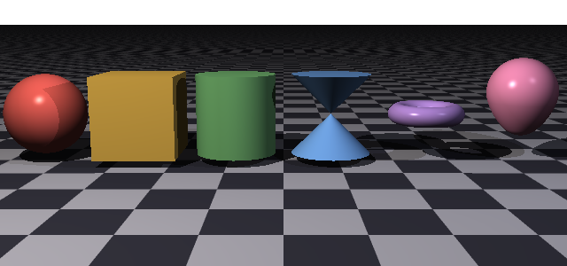
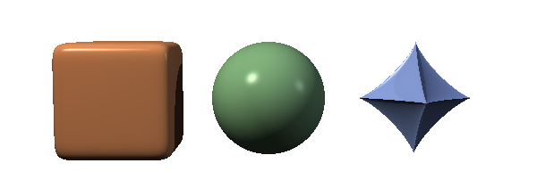
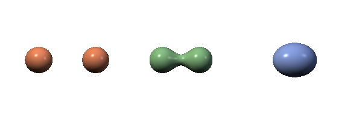
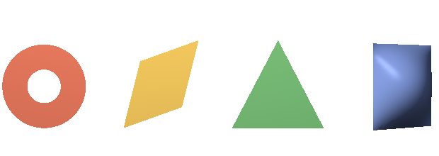
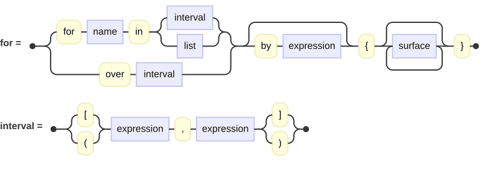
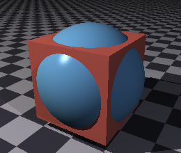
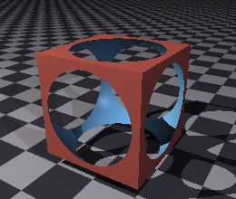
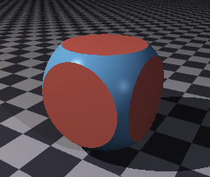
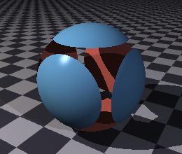

## Surfaces

A surface is a thing in the world that a ray can hit.  Everything you can see in a rendered
picture is one, or is made of several.

Every surface is written as though it sat at the origin at its own natural size, and is then
carried wherever you want it by [transforms](transforms.md).  A sphere is a unit ball at the
origin; a cube runs from −1 to 1 along each axis; a plane lies flat.  You do not place a
surface by giving it coordinates — you describe it in its own terms and then move it.



Those six are written with nothing but a material and a translation, so what you see is each
one's natural size.  Not one of them has been scaled.  The complete scene is
[`docs/examples/surfaces/primitives.igl`](examples/surfaces/primitives.igl).

### What Every Surface Has

Whatever its shape, any surface accepts these:

<picture>
  <source media="(prefers-color-scheme: dark)" srcset="images/surfaces/surfaceEntryClause-dark.svg">
  <source media="(prefers-color-scheme: light)" srcset="images/surfaces/surfaceEntryClause.svg">
  
</picture>

| Property | What it does |
| --- | --- |
| `named` | Gives the surface a name, so it can be reused. |
| `material` | How it takes the light; see [Materials](materials.md). |
| `no shadow` | The surface is visible but casts no shadow. |
| `bounded by` | A box the renderer may use to skip it cheaply. |
| `with seed` | Fixes the randomness anything about it draws on. |
| *transforms* | `translate`, `scale`, `rotate` and the rest. |

Anywhere those appear below as "the usual properties," this is what is meant.

#### Reusing a surface

If you assign a surface to a variable, it becomes a value you can place as often as you
like:

```
pillar = cylinder {
    material { pigment color [0.8, 0.75, 0.65] }
    min Y 0
    max Y 3
    scale [0.3, 1, 0.3]
}

object pillar { translate [-4, 0, 0] }
object pillar { translate [ 0, 0, 0] }
object pillar { translate [ 4, 0, 0] }
```

Each `object` is the same description placed somewhere new, and may add transforms and any
other properties of its own.

#### `no shadow`

A surface with `no shadow` is still seen, but light passes through it as though it were not
there.  It is a cheat, and a useful one: a glass pane that would otherwise darken a room, or
a light's own visible bulb that should not shade what it lights.

#### `bounded by`

Most surfaces work out a bounding box for themselves, so you can leave this alone.  It is
there for the surfaces that cannot or when you can provide a better one than the default
for a surface — see [Bounding](#bounding) below.

### The Primitives

The primitives fall into two groups.  **Solids** enclose a volume, so they have an inside and
an outside, and they are what you combine with
[union, difference and intersection](#combining-surfaces).  **Shapes** are flat: they have a
front and a back but no inside at all, and a difference cannot carve anything out of one.

Most of these need nothing at all beyond the usual properties — a `sphere { }` is a complete,
valid surface.  A few describe shapes with properties that have no sensible default.  So,
such properties must be explicit.  For example, a torus and an egg both need `radii`, a
superellipsoid needs its `east` and `north`, a disc its `center`, `normal` and `radius`,
a parallelogram its `at` and `sides`, and a triangle its three `points`.  Without these,
those surfaces could not be rendered. 

### Solids

These enclose a volume.  Six of them are in the picture at the top of this chapter; the plane
is the seventh, and it appears as the ground in almost every other picture here.

#### Plane

An infinite flat surface lying in the X–Z plane at the origin — the ground, unless you turn
it.  It has no properties of its own beyond the usual ones.

```
plane {
    material { pigment checker { White, Gray30 } }
}
```

Being infinite, a plane has no bounding box and never will; every ray is tested against it.

#### Sphere

A ball of radius one at the origin.  No properties of its own.

```
sphere {
    material { pigment color Red }
    scale 0.5
    translate [0, 0.5, 0]
}
```

Scaling it unevenly produces an ellipsoid.

#### Cube

A box running from −1 to 1 along every axis, so two units on a side.  No properties of its
own.

```
cube { scale [2, 0.2, 3] }      // a slab
```

#### Cylinder and Conic

A cylinder is a tube of radius one about the Y axis; a conic is two cones meeting point to
point at the origin, which is what you saw in the picture above.  Both are cut to length the
same way, and both share these:

<picture>
  <source media="(prefers-color-scheme: dark)" srcset="images/surfaces/extrudedSurface-dark.svg">
  <source media="(prefers-color-scheme: light)" srcset="images/surfaces/extrudedSurface.svg">
  
</picture>

| Property | What it does |
| --- | --- |
| `min Y`, `max Y` | Where to cut it off.  Left alone, both run to infinity. |
| `open` | Leave the ends as holes rather than capping them. |

```
cylinder {
    min Y 0
    max Y 3
    scale [0.3, 1, 0.3]
}
```

A cylinder given neither `min Y` nor `max Y` is an infinite pipe.  Cut it and the ends are
capped; add `open` and they are not, which matters when you are going to see inside.

#### Torus

A ring about the Y axis.  It needs two radii: how far the ring's center is from the
origin, and how thick the ring itself is.

```
torus {
    radii 1, 0.25
}
```

#### Egg

An ovoid, which also needs two radii: the radius across, and the radius along the axis.

```
egg {
    radii 0.55, 0.85
}
```

#### Superellipsoid

The family of shapes that runs from a box to a sphere to a pinched star, depending on two
exponents.

| Property | What it does |
| --- | --- |
| `east` | The exponent around the equator. |
| `north` | The exponent from pole to pole. |

```
superellipsoid {
    east 0.4
    north 0.4
}
```



Those are exponents of 0.2, 1 and 2.5.  Small values give a box with rounded edges, one gives
a sphere, and anything much above one pinches the shape inward into a star.  The two need not
match: a low `east` with a high `north` gives a square cross-section drawn to points at the
poles.  The scene is
[`docs/examples/surfaces/superellipsoids.igl`](examples/surfaces/superellipsoids.igl).

#### Blob

A set of spheres and cylinders that melt into one another rather than merely overlapping.
Each contributes a field that falls off with distance, and the surface is drawn where the
total crosses a `threshold`.

```
blob {
    threshold 0.6
    sphere { center [-0.7, 0, 0]  radius 1  strength 1 }
    sphere { center [ 0.7, 0, 0]  radius 1  strength 1 }
}
```

A component may be a cylinder instead, given `from` and `to` rather than a `center`:

```
blob {
    threshold 0.6
    cylinder { from [-1, 0, 0]  to [1, 0, 0]  radius 0.6  strength 1 }
    sphere   { center [1, 0, 0]  radius 0.9  strength 1 }
}
```



The same two components three times over, moved closer together each time.  Far apart they are
simply two balls; brought within reach of one another their fields overlap and a smooth neck
grows between them; closer still and they are one rounded mass.  Nothing but the distance
changes.  That joining is what no amount of CSG will give you — a union of two spheres meets in
a crease, not a neck.  The scene is
[`docs/examples/surfaces/blobs.igl`](examples/surfaces/blobs.igl).

`threshold` is the other half of it: it is the value the total field must reach for the surface
to be drawn there, so lowering it grows everything and makes components reach further, and
raising it shrinks them apart again.

A negative `strength` works the other way, pressing a dent into its neighbors rather than
adding to them — see `gallery/Local/surfaces/blob-negative-strength.igl`.

### Shapes

These are flat.  They have a front and a back but no inside, so a
[difference](#combining-surfaces) has nothing to carve out of one and a
[blob](#blob) cannot be built from them.



A disc with an inner radius, a parallelogram, a triangle and a bicubic patch.  The scene is
[`docs/examples/surfaces/shapes.igl`](examples/surfaces/shapes.igl).

#### Disc

A flat circle, given a center, the direction it faces, and a radius.  An `inner radius` makes
it an annulus — a washer with a hole.

```
disc {
    center [0, 0, 0]
    normal [0, 1, 0]
    radius 2
    inner radius 0.5
}
```

`center`, `normal` and `radius` are all required; only `inner radius` may be left off, and
leaving it off gives a solid disc.

#### Parallelogram

A flat four-sided patch, given one corner and the two edge vectors that leave it.  The two
edges need not be perpendicular, which is what makes it a parallelogram rather than a
rectangle.

```
parallelogram {
    at [0, 0, 0]
    sides [2, 0, 0], [0, 0, 2]
}
```

Both `at` and `sides` are required.

#### Triangle and Smooth Triangle

Three points.  A plain `triangle` is flat; a `smooth triangle` additionally takes a normal at
each corner and blends between them, so a mesh of them looks curved rather than faceted.

```
triangle {
    points [0, 1, 0], [-1, -1, 0], [1, -1, 0]
}
```

#### Patch

A bicubic patch: a curved quadrilateral pulled into shape by a four-by-four grid of control
points.  `gallery/Local/surfaces/patch.igl` is the example to read.

### Groups

A group contains surfaces so they may be transformed and, if desired, have a material applied
as a whole.

<picture>
  <source media="(prefers-color-scheme: dark)" srcset="images/surfaces/groupClause-dark.svg">
  <source media="(prefers-color-scheme: light)" srcset="images/surfaces/groupClause.svg">
  
</picture>

```
group {
    material { pigment color [0.8, 0.7, 0.5] }

    cube { scale [1, 0.1, 1]  translate [0, 2, 0] }
    cylinder { min Y 0  max Y 2  scale [0.15, 1, 0.15]  translate [-0.8, 0, -0.8] }
    cylinder { min Y 0  max Y 2  scale [0.15, 1, 0.15]  translate [ 0.8, 0, -0.8] }

    rotate Y 30
    translate [0, 0, 4]
}
```

Two things a group does for you.  A transform on the group applies to everything inside it,
after whatever transforms the children have of their own — so the table above is built at the
origin and then turned and moved as a piece.  A material on the group is handed down to
any child that does not have one; a child that names its own material keeps it.

A group is also what makes a big scene tractable.  It works out a box around its children and
tests that first, so a ray that misses the group skips every surface in it at once.

### Repeating Things

A group may make what stands in it over and over, counting through a range:

<picture>
  <source media="(prefers-color-scheme: dark)" srcset="images/surfaces/forClause-dark.svg">
  <source media="(prefers-color-scheme: light)" srcset="images/surfaces/forClause.svg">
  
</picture>


```
group {
    for step in [0, 21] {
        cube {
            scale [0.95, 0.06, 0.30]
            translate X 1.2
            rotate Y step * 24
            translate Y step * 0.3
        }
    }
}
```

That is a spiral stair: twenty-two treads, each turned a little further round and set a little
higher than the last, and none of them written down.  The count — `step` here, and it may be called
anything — takes each value in the range in turn, and is an ordinary number wherever it appears
inside the loop.

**The range is an interval.**  Square brackets take an end into the count and parentheses leave it
out, and `by` says how far to move each time:

| Written | Counts |
| --- | --- |
| `[0, 5]` | 0, 1, 2, 3, 4, 5 — six turns |
| `(0, 5]` | 1, 2, 3, 4, 5 |
| `[0, 5)` | 0, 1, 2, 3, 4 |
| `[0, 1] by 0.25` | 0, 0.25, 0.5, 0.75, 1 |

Both ends are expressions like any other, so a loop may be told how far to go by something worked
out elsewhere — which is what makes a `primitive` that takes a count possible:

```
primitive fence(posts, spacing = 0.8) -> group {
    return group {
        for post in [0, posts - 1] {
            cube { scale [0.07, 0.7, 0.07]  translate X post * spacing }
        }
    }
}

object fence(12)
object fence(5, 1.4) { translate Z 3 }
```

**When the count is not wanted, say `over`.**  It is the same loop with no name for the count, and a
word of its own so that nobody has to wonder where the name went:

```
group {
    over [0, 3] {
        cylinder { min Y 0  max Y 1.4  scale [0.05, 1, 0.05] }
    }
    rotate Y 25
}
```

Four of the same thing in the same place is rarely what anyone wants, so this is mostly for the day a
loop's turns differ by something other than a count.

**Only what stands inside the loop repeats.**  Everything else in the group is made once, so a group
may hold a run of things and a thing that stands alone, and may hold more than one loop:

```
group {
    for i in [0, 11] {
        cube { translate X 2  rotate Y i * 30 }
    }
    sphere { scale 0.5 }        // the hub, made once
    material { pigment Gray50 }
}
```

**Loops nest**, which is how a grid or a stack is written:

```
group {
    for row in [0, 7] {
        for column in [0, 7] {
            cube { scale 0.45  translate [column - 3.5, 0, row - 3.5] }
        }
    }
}
```

**The count belongs to the loop.**  It is not visible outside, and two loops one inside the other may
use the same name without treading on each other — the inner one means the inner one wherever the
inner one can be seen.  A group's *own* clauses, being outside the loop, cannot see the count either,
and would have no single value to mean if they could: a group has one transform and a loop has many
turns.

**Only surfaces may stand inside a `for`.**  A loop is a way of writing rather than a thing in the
scene, so there is nothing for a `translate` or a `material` written directly in it to be about; those
belong either to the group around the loop or to the surfaces inside it.  You will be told so where it
is written.  The same is true of the `if` below, and for the same reason.

**A loop may also stand at the top of a file, or in a `scene { }` block**, where what it makes goes
straight into the scene:

```
for tree in [0, 5] {
    object elm(2.5) { translate X tree * 6 - 15 }
}
```

The one place it may not stand is inside a [CSG](#combining-surfaces), and that is not an oversight.
The first surface in a `difference` is the one the others are taken out of, so a loop standing there
would make which surface that is depend on a number not known until the picture is drawn.  A CSG that
wants a run of things puts a group inside it, which is what was meant anyway.

### Choosing What to Make

Wherever surfaces are listed, an `if` decides whether to make some of them:

```
group {
    for post in [0, 11] {
        cube { scale [0.07, 0.7, 0.07]  translate X post * 0.8 }

        if (post % 4 == 0) {
            cylinder { min Y 0  max Y 1.1  scale [0.11, 1, 0.11]  translate X post * 0.8 }
        }
    }
}
```

That is a fence with a stouter post every fourth one.  The decision is taken afresh on every turn of
the loop, so the count — or anything worked out from it — is exactly what the condition is usually
about.

**The `else` is optional**, and that is the one way this differs from the `if` that ends a
[function's body](scene-files.md#choosing-inside-a-body).  There, both ways out must give an answer,
since a function that answered on one path and not the other would be a function with a hole in it.
Here an arm *makes things*, and making nothing at all is a perfectly good thing for it to do.  So the
fence above is complete as it stands rather than half-written.

When there is something to put in the second arm, put it there:

```
group {
    for i in [0, 7] {
        if (i % 2 == 0) {
            sphere { scale 0.4  translate X i }
        }
        else {
            cube { scale 0.35  translate X i }
        }
    }
}
```

**An `else` may carry another `if`**, which is how a run of cases is written down the page rather
than off the right of it:

```
if (height > 8) {
    object Fir(height)
}
else if (height > 4) {
    object Oak(height)
}
else {
    object Birch(height)
}
```

**An `if` may stand anywhere surfaces may** — in a group, in a loop, in another `if`, in a
`scene { }` block, or at the top of a file, where what it makes goes straight into the scene.  A loop
may stand inside one and it inside a loop.  As with a loop, the one place it may not stand is inside a
CSG, and for the same reason: a CSG's two sides are each exactly one surface, and an `if` may make any
number, including none.

The condition must work out to true or false.  A number is not a stand-in for either, and you will be
told so rather than have one quietly treated as the other.

### Working Something Out Part Way Down

A list of surfaces may name a value and go on using it:

```
group {
    for i in [0, 11] {
        lean = 6 + i * 2.5
        reach = 1.4 - i * 0.06

        cube {
            scale [reach, 0.06, 0.30]
            translate X reach
            rotate Y i * 24 + lean
            translate Y i * 0.3
        }
    }
}
```

This is the same thing a [function's body](scene-files.md#functions-of-your-own) may do,
in the same words and for the same reason: a figure wanted in more than one place should be arrived
at once rather than twice, or the two drift apart the first time one of them is edited.  Inside a
loop it earns its keep faster, since what it names usually depends on the count and so is a different
value every turn.

**The name belongs to the list it stands in.**  It is known to everything below it there, including
the insides of the surfaces, and to nothing outside — so a group that works out a spacing for its own
use does not hand that spacing to the group that holds it.  A name may stand over one from further
out for as long as its list lasts, and the outer one is untouched when the list ends.

### Combining Surfaces

Where a group merely holds surfaces side by side, a CSG operation makes a genuinely new solid
out of them.  A CSG logically treats each of its children as a *set* of points, on which you
can perform *set operations*.

<picture>
  <source media="(prefers-color-scheme: dark)" srcset="images/surfaces/csgClause-dark.svg">
  <source media="(prefers-color-scheme: light)" srcset="images/surfaces/csgClause.svg">
  
</picture>

The same cube and sphere, combined three ways:





| Operator | What you get |
| --- | --- |
| `union` | Everything in either one. |
| `difference` | The first one, with the rest carved out of it. |
| `intersection` | Only what is in both. |

```
difference {
    cube {
        material { pigment color [0.85, 0.4, 0.35] }
    }
    sphere {
        material { pigment color [0.4, 0.65, 0.85] }
        scale 1.32
    }
}
```

Order matters for `difference`, though not for the other two.  The first surface is the one
kept, and everything after it is removed from it.  Swap the two children and you get something
else entirely:




The same two surfaces both times.  On the left the cube is written first, so the sphere is
carved out of it; on the right the sphere is written first, so the cube is carved out of that
instead.

Notice in the pictures that each piece keeps its own material — the blue you can see is the
sphere's surface, exposed where it cut into the cube.  That is worth remembering: a difference
does not paint the hole it makes, it reveals the cutter.  As with groups, any children that
don't specify their own material will inherit the CSG's.

The four complete scenes are in [`docs/examples/surfaces/`](examples/surfaces/), and
`gallery/challenge-book/chapter-16/csg.igl` builds something more interesting.

CSG nests, and that is where its power is: a difference whose first surface is itself a union,
and so on down.

### Bounding

Testing a ray against every surface in a large scene is what makes rendering slow, so the
renderer wraps a box around what it can and tests the box first.  A ray that misses the box
cannot have hit anything inside it.

Most surfaces do this for themselves and you need not think about it.  Two cases are worth
knowing:

**Some surfaces cannot be bounded.**  A plane is infinite, and so are a cylinder and conic
that were never cut to length.  These have no box, and a group holding one has no box either,
since the group cannot promise a ray missing its box has missed everything within.

**You can supply one.**  `bounded by` takes the two opposite corners of a box you promise the
surface lies inside:

```
lsystem {
    // ... a plant, whose true extent is expensive to work out ...
    bounded by [-3, -1, -3], [3, 8, 3]
}
```

This is a promise the renderer trusts and does not check.  Give a box that is too small and
the surface will be quietly clipped — rays that should have hit it are turned away at the box.
That failure looks like geometry mysteriously missing, and it is worth suspecting whenever a
scene with a handwritten bound loses part of something.
