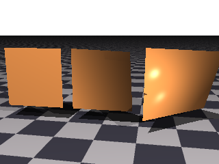
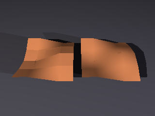

## Surfaces

A surface is a thing in the world that a ray can hit.  Everything you can see in a rendered
picture is one, or is made of several.

Every surface is written as though it sat at the origin at its own natural size, and is then
carried wherever you want it by [transforms](transforms.md).  A sphere is a unit ball at the
origin; a cube runs from −1 to 1 along each axis; a plane lies flat.  You do not place a
surface by giving it coordinates — you describe it in its own terms and then move it.


Those six are written with nothing but a material and a translation, so what you see is each
one's natural size.  Not one of them has been scaled.  The complete scene is
[`docs/examples/surfaces/primitives.igl`](examples/surfaces/primitives.igl).

### What Every Surface Has

Whatever its shape, any surface accepts these:

<picture>
  <source media="(prefers-color-scheme: dark)" srcset="images/surfaces/surfaceEntryClause-dark.svg">
  <source media="(prefers-color-scheme: light)" srcset="images/surfaces/surfaceEntryClause.svg">
  
</picture>

| Property | What it does |
| --- | --- |
| `named` | Gives the surface a name, so it can be reused. |
| `material` | How it takes the light; see [Materials](materials.md). |
| `no shadow` | The surface is visible but casts no shadow. |
| `bounded by` | A box the renderer may use to skip it cheaply. |
| `with seed` | Fixes the randomness anything about it draws on. |
| *transforms* | `translate`, `scale`, `rotate` and the rest. |

Anywhere those appear below as "the usual properties," this is what is meant.

#### Reusing a surface

If you assign a surface to a variable, it becomes a value you can place as often as you
like:

```
pillar = cylinder {
    material { pigment color [0.8, 0.75, 0.65] }
    min Y 0
    max Y 3
    scale [0.3, 1, 0.3]
}

object pillar { translate [-4, 0, 0] }
object pillar { translate [ 0, 0, 0] }
object pillar { translate [ 4, 0, 0] }
```

Each `object` is the same description placed somewhere new, and may add transforms and any
other properties of its own.

#### `no shadow`

A surface with `no shadow` is still seen, but light passes through it as though it were not
there.  It is a cheat, and a useful one: a glass pane that would otherwise darken a room, or
a light's own visible bulb that should not shade what it lights.

#### A surface that gives light

A glowing [medium](scene-files.md#filling-that-space) is seen and not felt.  It adds its light to rays
passing *through* it, so a flame is bright to look at — and nothing carries that light out to the
ground, so a fire in a dark room leaves the room dark.  `gives light` is what changes that:

```
sphere {
    material {
        pigment White  ambient 0  diffuse 0  transparency 1
        interior { medium { emission pigment FlameHeat  density function { … } } }
    }
    no shadow
    gives light samples 40
}
```

The stuff inside now lights what is around it, casts shadows, and colors them: a flame lights the
ground orange because *the flame's own color at each place* is what arrives.  There is nothing to
position and nothing to keep in step — the fire is the light.

**How bright it is, is not a setting.**  It follows from the emission, the density and the size of the
volume, falling away as the square of the distance.  A bigger fire lights more; a dimmer one lights
less.  If a fire is too bright in a scene, the honest fix is a smaller or dimmer fire, not a knob on
the light.

**`samples` is how many places inside the stuff are looked at** when a point is shaded, and it is a
cost-against-grain trade like an [area light](materials.md)'s steps.  Eight is enough for a small flame
lighting a wall a few units off; forty is what a large fire in the foreground wants.  Too few shows as
mottling on smooth surfaces, since each point is guessing at the fire's shape from a handful of looks.

The places are chosen **in proportion to how much stuff is there**, worked out once before rendering,
so a flame filling a fifth of its shell does not spend four fifths of its samples on empty air.

A surface that asks for this and has nothing to give — no medium, or one that emits nothing — is
passed over rather than refused.  A fire that has gone out is a reasonable thing to have in a scene.

#### `bounded by`

Most surfaces work out a bounding box for themselves, so you can leave this alone.  It is
there for the surfaces that cannot or when you can provide a better one than the default
for a surface — see [Bounding](#bounding) below.

### The Primitives

The primitives fall into two groups.  **Solids** enclose a volume, so they have an inside and
an outside, and they are what you combine with
[union, difference and intersection](#combining-surfaces).  **Shapes** are flat: they have a
front and a back but no inside at all, and a difference cannot carve anything out of one.

Most of these need nothing at all beyond the usual properties — a `sphere { }` is a complete,
valid surface.  A few describe shapes with properties that have no sensible default.  So,
such properties must be explicit.  For example, a torus and an egg both need `radii`, a
superellipsoid needs its `east` and `north`, a disc its `center`, `normal` and `radius`,
a parallelogram its `at` and `sides`, and a triangle its three `points`.  Without these,
those surfaces could not be rendered. 

### Solids

These enclose a volume.  Six of them are in the picture at the top of this chapter; the plane
is the seventh, and it appears as the ground in almost every other picture here.

#### Plane

An infinite flat surface lying in the X–Z plane at the origin — the ground, unless you turn
it.  It has no properties of its own beyond the usual ones.

```
plane {
    material { pigment checker { White, Gray30 } }
}
```

Being infinite, a plane has no bounding box and never will; every ray is tested against it.

#### Sphere

A ball of radius one at the origin.  No properties of its own.

```
sphere {
    material { pigment color Red }
    scale 0.5
    translate [0, 0.5, 0]
}
```

Scaling it unevenly produces an ellipsoid.

#### Cube

A box running from −1 to 1 along every axis, so two units on a side.  No properties of its
own.

```
cube { scale [2, 0.2, 3] }      // a slab
```

#### Cylinder and Conic

A cylinder is a tube of radius one about the Y axis; a conic is two cones meeting point to
point at the origin, which is what you saw in the picture above.  Both are cut to length the
same way, and both share these:

<picture>
  <source media="(prefers-color-scheme: dark)" srcset="images/surfaces/extrudedSurface-dark.svg">
  <source media="(prefers-color-scheme: light)" srcset="images/surfaces/extrudedSurface.svg">
  
</picture>

| Property | What it does |
| --- | --- |
| `min Y`, `max Y` | Where to cut it off.  Left alone, both run to infinity. |
| `open` | Leave the ends as holes rather than capping them. |

```
cylinder {
    min Y 0
    max Y 3
    scale [0.3, 1, 0.3]
}
```

A cylinder given neither `min Y` nor `max Y` is an infinite pipe.  Cut it and the ends are
capped; add `open` and they are not, which matters when you are going to see inside.

#### Torus

A ring about the Y axis.  It needs two radii: how far the ring's center is from the
origin, and how thick the ring itself is.

```
torus {
    radii 1, 0.25
}
```

#### Egg

Two spheres about the Y axis, joined by a smooth fillet.  It also takes two radii, and they are
the radii of those two spheres: the **bottom** one, centered on the origin, and the **top** one,
centered on the bottom sphere's own north pole.

```
egg {
    radii 0.55, 0.4
}
```

**Which makes it the way to get a teardrop.**  Give the top sphere a small radius and the shape
comes to a point — very nearly, since the tip is rounded at exactly that radius — and turning the
whole thing over gives a falling drop rather than a standing one:

```
egg { radii 0.42, 0.07 }                // a teardrop, point up
egg { radii 0.42, 0.07  rotate Z 180 }  // and point down
```

Two equal radii give an ordinary lopsided ovoid, which is what an egg looks like.  For a tip that is
genuinely sharp, or a drop with a waist or a shoulder partway up, draw the profile and use a
[lathe](advanced-surfaces.md#lathe) instead — a lathe meets its axis at whatever angle you draw,
where an egg's tip can only ever be as sharp as its smaller sphere.

#### Superellipsoid

The family of shapes that runs from a box to a sphere to a pinched star, depending on two
exponents.

| Property | What it does |
| --- | --- |
| `east` | The exponent around the equator. |
| `north` | The exponent from pole to pole. |

```
superellipsoid {
    east 0.4
    north 0.4
}
```


Those are exponents of 0.2, 1 and 2.5.  Small values give a box with rounded edges, one gives
a sphere, and anything much above one pinches the shape inward into a star.  The two need not
match: a low `east` with a high `north` gives a square cross-section drawn to points at the
poles.  The scene is
[`docs/examples/surfaces/superellipsoids.igl`](examples/surfaces/superellipsoids.igl).

#### Paraboloid

A bowl: the surface where `x² + z² = y`, opening upward with its nose at the origin.  Like a
cylinder it takes no numbers of its own — scaling gives every opening rate there is — only where it
starts and stops.

| Property | What it does |
| --- | --- |
| `min Y` | Where it starts.  Nought by default, which is its nose. |
| `max Y` | Where it stops.  One by default. |
| `open` | Leaves the ends off, so the bowl is a shell rather than a solid. |

```
paraboloid {
    max Y 1.6
}
```

**A paraboloid gathers everything arriving along its axis to a single point.**  That is what a dish,
a headlamp reflector, a telescope mirror and a solar collector all are, and it is why the shape is
worth having exactly rather than approximated by a [lathe](advanced-surfaces.md#lathe) of sampled
points.  It is also the shape a spun liquid settles into.

Worth being plain about what that does and does not buy you here.  A `reflective` dish shows the
world **inverted and drawn together** — point it at a landscape and you see the landscape gathered
into it, which is the focusing you can actually watch.  What this renderer does *not* do is carry
light from a lamp off a mirror and onto something else: that is a caustic, and it needs a kind of
light transport this engine deliberately does not have.  So a dish makes a convincing reflector and
will not light a room by bouncing a lamp into it.

#### Hyperboloid

A waisted surface of revolution: `x² + z² - y² = 1`, narrowest at the origin and flaring away above
and below.  It takes the same three properties a paraboloid does, and no numbers of its own.

```
hyperboloid {
    min Y -1
    max Y 1
}
```

A cooling tower is this shape, and so is a waisted stool, a wastepaper basket and the middle of a
turned baluster.  It is also what a straight line sweeps when spun about an axis it does not meet,
which is why concrete ones are built from straight reinforcing bars.

Only the one-sheet form is offered here.  The two-sheet kind — a pair of opposed bowls — is a rare
thing in a scene, and [`quadric`](#quadric) gives it to anyone who wants it.

#### Saddle

A hyperbolic paraboloid: `y = x² - z²`, rising along X and falling along Z, cut to a rectangle.

| Property | What it does |
| --- | --- |
| `width` | How far it reaches along X.  Two by default. |
| `depth` | How far it reaches along Z.  Two by default. |

```
saddle {
    width 2.2
    depth 2.2
}
```

This is the doubly-curved roof shell that reads as modern the moment it appears, and it is built
from straight members in both directions, since the surface is ruled twice over.  A crisp packet is
one, and so is the seat it is named for.

Like the other [flat shapes](#shapes) it has a front and a back and no inside, so a
[difference](#combining-surfaces) cannot carve with one.  That follows from cutting it to a
rectangle: left endless it would divide space in two, which is what [`quadric`](#quadric) gives.

#### Quadric

Any surface of the second degree, written as its ten coefficients:

    Ax² + By² + Cz² + Dxy + Exz + Fyz + Gx + Hy + Iz + J = 0

| Property | What it does |
| --- | --- |
| `squares` | The coefficients of `x²`, `y²` and `z²`. |
| `cross` | The coefficients of `xy`, `xz` and `yz`. |
| `linear` | The coefficients of `x`, `y` and `z`. |
| `constant` | The term with no variable in it. |
| `bounded by` | **Required.**  The region the surface is looked for in. |

```
quadric {
    // A two-sheet hyperboloid: x² + z² - y² = -1.
    squares [1, -1, 1]
    constant 1
    bounded by [-2, -2.4, -2], [2, 2.4, 2]
}
```

**This is the escape hatch rather than the front door.**  Ten numbers with no picture attached is a
poor way to ask for a shape, and the named forms above — along with the
[sphere](#sphere), [cylinder and conic](#cylinder-and-conic) that came long before them — are what a
scene should reach for.  What this adds is the rest of the family: the two-sheet hyperboloid, an
elliptic or hyperbolic cylinder, a cone about an axis of its own, a pair of planes.

`bounded by` is required for the reason an [isosurface](advanced-surfaces.md#isosurface) requires
it: most quadrics are endless, and nothing about ten coefficients says where to stop looking.

#### Blob

A set of spheres, cylinders and planes that melt into one another rather than merely overlapping.
Each contributes a field that falls off with distance, and the surface is drawn where the
total crosses a `threshold`.

```
blob {
    threshold 0.6
    sphere { center [-0.7, 0, 0]  radius 1  strength 1 }
    sphere { center [ 0.7, 0, 0]  radius 1  strength 1 }
}
```

A component may be a cylinder instead, given `from` and `to` rather than a `center`:

```
blob {
    threshold 0.6
    cylinder { from [-1, 0, 0]  to [1, 0, 0]  radius 0.6  strength 1 }
    sphere   { center [1, 0, 0]  radius 0.9  strength 1 }
}
```


The same two components three times over, moved closer together each time.  Far apart they are
simply two balls; brought within reach of one another their fields overlap and a smooth neck
grows between them; closer still and they are one rounded mass.  Nothing but the distance
changes.  That joining is what no amount of CSG will give you — a union of two spheres meets in
a crease, not a neck.  The scene is
[`docs/examples/surfaces/blobs.igl`](examples/surfaces/blobs.igl).

`threshold` is the other half of it: it is the value the total field must reach for the surface
to be drawn there, so lowering it grows everything and makes components reach further, and
raising it shrinks them apart again.

A negative `strength` works the other way, pressing a dent into its neighbors rather than
adding to them — see `gallery/Local/blobs/blob-negative-strength.igl`.

##### A plane component

The third sort of component is a plane, given a point it passes through and the direction it faces.
Where a sphere's influence is a ball and a cylinder's is a tube, a plane's is a *slab*: an infinite
sheet of field, thickest at the plane and falling to nothing at its `radius` on either side.

```
blob {
    threshold 0.3
    plane  { at [0, 0.4, 0]  normal [0, 1, 0]  radius 0.55  strength 1 }
    sphere { center [-1.5, 0.7, 0]  radius 1.1  strength 1 }
    sphere { center [ 1.5, 0.7, 0]  radius 1.1  strength 1 }
}
```

That is a floor with two domes settling into it, joined to it by the same smooth fillet a sphere and
a cylinder join by. It is what a plane component is *for*: giving a blob a flat side, or merging one
into a surface, without cutting it — a `difference` would leave a crease exactly where you did not
want one.

Two things to know about it. The plane is **infinite**, like the `plane` surface, so a blob holding
one is a solid slab that reaches to the horizon and hides whatever is behind it. And it costs the
blob its bounding box: every other blob works out a box from its components' reach and is skipped by
any ray that misses it, which is worth several times over on a scene holding many of them, but no
finite box holds a slab that runs to the horizon. Use one where you want the floor, not as a way of
tilting a small blob's flat side.

##### Components may be transformed

A component may carry its own transforms, which is what turns a sphere into an ellipsoid and a
cylinder into an elliptical or leaning bond:

```
blob {
    threshold 0.3
    sphere { radius 1.2  strength 1  scale [1.6, 0.5, 1]  translate [-2, 0.8, 0] }
    sphere { radius 1.2  strength 1  scale [0.6, 1.5, 1]  translate [ 2, 0.8, 0] }
}
```

**The transform moves the whole of the component's space, `center` included**, exactly as a transform
on a surface does. So the idiom is the one used everywhere else: leave the component at the origin,
shape it, and then `translate` it where it goes. Writing `center [-2, 0.8, 0]  scale [1.6, 0.5, 1]`
scales the center too, and the component lands at −3.2 rather than −2.

Any transform will do — `rotate`, `shear` and `matrix` as much as `scale`. What cannot be had this
way is a *taper*: a cone is not a stretched cylinder, and a component whose radius varies along its
length would take the field out of the polynomial the solver depends on. A chain of ellipsoids is the
way to fake one.

##### Components may carry their own pigments

A component may name a `pigment`, and where components overlap their colors mix in the proportion
each contributes to the field there:

```
blob {
    threshold 0.3
    sphere   { center [-2, 0.6, 0]  radius 1.2  strength 1      pigment Red }
    sphere   { center [ 2, 0.6, 0]  radius 1.2  strength 1      pigment Blue }
    cylinder { from [-2, 0.6, 0]  to [2, 0.6, 0]  radius 0.5  strength 1.825  pigment Yellow }
}
```

So the color changes over exactly where the shape does: a ball melting into a bond takes the bond's
color across the same fillet it takes the bond's shape across. On the components above that gradient
runs about half a unit — tight enough to read as an edge that is soft rather than as a wash.

A component that names no pigment goes on being colored by the blob's own material, so you can give
one component a color and leave the rest alone. And a component of negative `strength` shapes the
blob without voting on its color: it has no color to contribute, and letting it weigh in would mean
mixing colors in negative proportions.

You still need a `material` on the blob for everything a pigment does not cover — `specular`,
`reflective`, `transparency` and the rest are the blob's, not a component's.

##### Why a joint comes out smooth, and what `radius` and `strength` each do

Each component's field falls off as `strength * (1 - d^2 / R^2)^3`, and the **cube** is load-bearing.
It puts a triple root at the influence radius, so the field arrives there with its value, its slope
*and* its curvature all at nothing.

The obvious falloff is the *square* of that bracket, which is what most metaball implementations use
and what this one used to.  It brings value and slope to nothing but not curvature, and where one
component's influence ends part way across another, that step in curvature lands on the visible
surface.  The eye reads a step in curvature as a line, much as it reads a Mach band, so a bond met
its ball in a visible hip.  No arrangement of `radius` and `strength` removes that — widening the
bond moves the hip onto the ball, and widening the ball moves it back — because it is the falloff
and not the arrangement that is discontinuous.  A cubic is the lowest order that can put three zeros
in one place; a quadratic has only two to give.

It costs a degree.  The field along a ray is a sextic rather than a quartic, so its roots are found
rather than written down — which measured as no difference worth reporting on the gallery's own blob
scene.

**`radius` is still doing two jobs**, and it is worth knowing which.  It sets how far a component's
influence reaches, and it also — with `strength` and the blob's `threshold` — decides how big the
component comes out.  For a lone component the visible half-size is

```
d = radius * sqrt(1 - cbrt(threshold / strength))
```

so to keep a component the same size while giving it a wider reach, raise its `radius` and drop its
`strength` to

```
strength = threshold / (1 - (d / radius)^2)^3
```

That is how to make two components blend over a longer distance without either of them growing.

#### Swells

A body of water: a stretch of surface carrying one or more trains of waves, lying in the X/Z plane
with its rest level at `y = 0`.

```
swells {
    width 400  depth 400
    wave { steepness 0.22  wavelength 20  direction [0.92, 0, 0.39]  phase 1.0 }
    wave { steepness 0.14  wavelength 13  direction [-0.42, 0, 0.91]  phase 2.3 }
    wave { steepness 0.07  wavelength 4.1  direction [0.71, 0, -0.70]  phase 3.7 }
    material SeaWater
}
```

`width` and `depth` are how far the water reaches along X and Z, centered on the origin.  Make them
larger than the picture needs rather than smaller: a box costs almost nothing to enlarge, and one cut
too small ends in a straight edge in mid-water that reads as a cliff.

##### The waves are not sines, and that is the point

Each `wave` is a train: how steep it is, how far apart its crests are, which way it runs, and where in
its cycle it starts.  A handful crossing at angles is what gives water its unrepeating look; one alone
is too regular to read as anything but corrugated iron.

**The crests are drawn up and the troughs are flattened out, and neither is a knob you set.**  Water
does not go up and down as a wave passes — each piece of it travels in a *circle*, so it bunches up
under a crest and spreads out under a trough.  What that traces is a trochoid, not a sine, and the
asymmetry comes out of the motion rather than out of an exponent tuned by eye.

`steepness` is the one number that decides the shape: the height of a train against how tightly its
crests are spaced.

| `steepness` | what it looks like |
|---|---|
| 0 | a plain sine |
| 0.1 – 0.2 | an easy swell |
| 0.3 – 0.45 | a working sea; real waves break around 0.45 |
| 1.0 | the crest closes to a cusp — the wave breaking |

Past 1 the water would fold over itself and there would no longer be a single height at a place, so
that is the ceiling.  Real water never gets there: it breaks at about 0.45, so the whole useful range
sits well inside what this can draw.

You may give a `wave` an `amplitude` instead of a `steepness` if you would rather say how tall it is
outright, but not both — each says the same thing and they would disagree.  Steepness is usually the
one to write, because it means the same at every scale: a swell of 0.2 reads as the same water whether
its crests are a foot apart or fifty.

##### Against writing the same thing as a field

An [isosurface](advanced-surfaces.md#isosurface) can be given a sum of sines and will draw water of a
sort — the `water` library does exactly that, and shipped before this surface existed.  Two things are
different here.  The shape is the true one rather than a sine sharpened by a power and leaned over by
a shear, both of which have to be tuned and neither of which can flatten a trough while it draws up a
crest.  And it is *faster*: measured on the same sea at 400x300, **1.30 seconds against 3.84**, because
a surface that knows what it is can say where the water can possibly reach far more cheaply than a walk
over an arbitrary expression can.

### Shapes

These are flat.  They have a front and a back but no inside, so a
[difference](#combining-surfaces) has nothing to carve out of one and a
[blob](#blob) cannot be built from them.

Having no inside, they are lit from **either** side, and it makes no difference which way round you
write one.  That is worth saying because which way a flat shape faces is not something you choose so
much as something you fall into: a triangle faces the way the order of its three points implies, and
a generic shape the way its path runs.  Turn any of these around and it goes on looking the same.

A [plane](#plane) is flat too but is **not** one of these.  It divides space in two, and its normal
names which half is outside — so it has an inside in the way these do not, which is exactly why a
[difference](#combining-surfaces) can carve with one.


A disc with an inner radius, a parallelogram, a triangle and a bicubic patch.  The scene is
[`docs/examples/surfaces/shapes.igl`](examples/surfaces/shapes.igl).

#### Disc

A flat circle, given a center, the direction it faces, and a radius.  An `inner radius` makes
it an annulus — a washer with a hole.

```
disc {
    center [0, 0, 0]
    normal [0, 1, 0]
    radius 2
    inner radius 0.5
}
```

`center`, `normal` and `radius` are all required; only `inner radius` may be left off, and
leaving it off gives a solid disc.

#### Parallelogram

A flat four-sided patch, given one corner and the two edge vectors that leave it.  The two
edges need not be perpendicular, which is what makes it a parallelogram rather than a
rectangle.

```
parallelogram {
    at [0, 0, 0]
    sides [2, 0, 0], [0, 0, 2]
}
```

Both `at` and `sides` are required.

#### Triangle and Smooth Triangle

Three points.  A plain `triangle` is flat; a `smooth triangle` additionally takes a normal at
each corner and blends between them, so a mesh of them looks curved rather than faceted.

```
triangle {
    points [0, 1, 0], [-1, -1, 0], [1, -1, 0]
}
```

#### Patch

A bicubic patch: a curved quadrilateral pulled into shape by a four-by-four grid of control
points.  `gallery/Local/shapes/patch.igl` is the example to read.

#### Bilinear Patch

The warped quadrilateral four corners span — the one shape in this group that need not be flat.
Give it four corners **in order around the quadrilateral** and it fills in between them.



Four corners in a plane, one corner lifted, and two opposite corners lifted.  The scene is
[`docs/examples/advanced/bilinear-patch.igl`](examples/advanced/bilinear-patch.igl).

```
bilinear patch {
    points [-1, -1, 0], [1, -1, 0], [1, 1, -1.3], [-1, 1, 0]
}
```

Put all four corners in one plane and you have a flat quadrilateral, which is what a
[parallelogram](#parallelogram) already draws — and the two agree exactly where they overlap.  Lift
one corner out of that plane and the surface warps into the saddle between them, which is what makes
it worth having: a sail, a flag, a warped panel, a twisted ribbon.

**The corners go round the quadrilateral, not across it.**  Given in the wrong order they describe a
bow tie, which is a real surface but rarely the wanted one, and nothing will warn you.

##### Shading a sheet of patches

A patch may also be given a normal at each corner, in the same order, and it then shades by blending
those four rather than by its own shape — the same trick a [smooth triangle](#triangle-and-smooth-triangle) plays with
the three it carries.



The same sixteen patches over the same wave: on the left each works its normal out from its own
corners, on the right each was handed the wave's true normal at each corner.  The scene is
[`docs/examples/advanced/bilinear-patch-normals.igl`](examples/advanced/bilinear-patch-normals.igl).

```
bilinear patch {
    points  [-1, 0, -1], [1, 0, -1], [1, 0.4, 1], [-1, 0, 1]
    normals [0, 1, 0], [0, 1, 0], [-0.4, 1, 0.4], [0, 1, 0]
}
```

**What this buys is continuity between patches, not within one.**  A single patch shades perfectly
well on its own; it is a *sheet* of them that gives itself away, because each works out its normal
from its own four corners and two neighbours disagree along the edge they share.  Give the patches
meeting at a corner the same normal there and they agree all the way along, so a sail, a flag or a
piece of cloth built from several reads as one surface.

**It changes the shading and nothing else.**  The patch keeps the shape its corners give it, so
silhouettes and shadows still follow the real surface — which is the honest limit of the trick: it
smooths a seam that catches the light, not one that shows against the sky.

`normals` is optional, and a patch without it works its own out, so nothing need be said for a
single patch standing alone.

Every line of constant `u` and every line of constant `v` across a bilinear patch is **straight**,
so the surface is woven out of two families of straight lines even where no part of it is flat.
That is also why it is exact rather than approximated: writing the surface equal to a point on a ray
leaves a quadratic, so a patch is solved in one square root instead of being subdivided the way a
[bicubic patch](#patch) or a [parametric surface](advanced-surfaces.md#parametric) must be.  A ray
can meet one **twice** — a straight line can cut a saddle in two places — and both crossings are
reported.

### Groups

A group contains surfaces so they may be transformed and, if desired, have a material applied
as a whole.

<picture>
  <source media="(prefers-color-scheme: dark)" srcset="images/surfaces/groupClause-dark.svg">
  <source media="(prefers-color-scheme: light)" srcset="images/surfaces/groupClause.svg">
  
</picture>

```
group {
    material { pigment color [0.8, 0.7, 0.5] }

    cube { scale [1, 0.1, 1]  translate [0, 2, 0] }
    cylinder { min Y 0  max Y 2  scale [0.15, 1, 0.15]  translate [-0.8, 0, -0.8] }
    cylinder { min Y 0  max Y 2  scale [0.15, 1, 0.15]  translate [ 0.8, 0, -0.8] }

    rotate Y 30
    translate [0, 0, 4]
}
```

Two things a group does for you.  A transform on the group applies to everything inside it,
after whatever transforms the children have of their own — so the table above is built at the
origin and then turned and moved as a piece.  A material on the group is handed down to
any child that does not have one; a child that names its own material keeps it.

A group is also what makes a big scene tractable.  It works out a box around its children and
tests that first, so a ray that misses the group skips every surface in it at once.

### Repeating Things

A group may make what stands in it over and over, counting through a range:

<picture>
  <source media="(prefers-color-scheme: dark)" srcset="images/surfaces/forClause-dark.svg">
  <source media="(prefers-color-scheme: light)" srcset="images/surfaces/forClause.svg">
  
</picture>


```
group {
    for step in [0, 21] {
        cube {
            scale [0.95, 0.06, 0.30]
            translate X 1.2
            rotate Y step * 24
            translate Y step * 0.3
        }
    }
}
```

That is a spiral stair: twenty-two treads, each turned a little further round and set a little
higher than the last, and none of them written down.  The count — `step` here, and it may be called
anything — takes each value in the range in turn, and is an ordinary number wherever it appears
inside the loop.

**The range is an interval.**  Square brackets take an end into the count and parentheses leave it
out, and `by` says how far to move each time:

| Written | Counts |
| --- | --- |
| `[0, 5]` | 0, 1, 2, 3, 4, 5 — six turns |
| `(0, 5]` | 1, 2, 3, 4, 5 |
| `[0, 5)` | 0, 1, 2, 3, 4 |
| `[0, 1] by 0.25` | 0, 0.25, 0.5, 0.75, 1 |

Both ends are expressions like any other, so a loop may be told how far to go by something worked
out elsewhere — which is what makes a `primitive` that takes a count possible:

```
primitive fence(posts, spacing = 0.8) -> group {
    return group {
        for post in [0, posts - 1] {
            cube { scale [0.07, 0.7, 0.07]  translate X post * spacing }
        }
    }
}

object fence(12)
object fence(5, 1.4) { translate Z 3 }
```

**When the count is not wanted, say `over`.**  It is the same loop with no name for the count, and a
word of its own so that nobody has to wonder where the name went:

```
group {
    over [0, 3] {
        cylinder { min Y 0  max Y 1.4  scale [0.05, 1, 0.05] }
    }
    rotate Y 25
}
```

Four of the same thing in the same place is rarely what anyone wants, so this is mostly for the day a
loop's turns differ by something other than a count.

**Only what stands inside the loop repeats.**  Everything else in the group is made once, so a group
may hold a run of things and a thing that stands alone, and may hold more than one loop:

```
group {
    for i in [0, 11] {
        cube { translate X 2  rotate Y i * 30 }
    }
    sphere { scale 0.5 }        // the hub, made once
    material { pigment Gray50 }
}
```

**Loops nest**, which is how a grid or a stack is written:

```
group {
    for row in [0, 7] {
        for column in [0, 7] {
            cube { scale 0.45  translate [column - 3.5, 0, row - 3.5] }
        }
    }
}
```

**The count belongs to the loop.**  It is not visible outside, and two loops one inside the other may
use the same name without treading on each other — the inner one means the inner one wherever the
inner one can be seen.  A group's *own* clauses, being outside the loop, cannot see the count either,
and would have no single value to mean if they could: a group has one transform and a loop has many
turns.

**Only surfaces may stand inside a `for`.**  A loop is a way of writing rather than a thing in the
scene, so there is nothing for a `translate` or a `material` written directly in it to be about; those
belong either to the group around the loop or to the surfaces inside it.  You will be told so where it
is written.  The same is true of the `if` below, and for the same reason.

**A loop may also stand at the top of a file, or in a `scene { }` block**, where what it makes goes
straight into the scene:

```
for tree in [0, 5] {
    object elm(2.5) { translate X tree * 6 - 15 }
}
```

The one place it may not stand is inside a [CSG](#combining-surfaces), and that is not an oversight.
The first surface in a `difference` is the one the others are taken out of, so a loop standing there
would make which surface that is depend on a number not known until the picture is drawn.  A CSG that
wants a run of things puts a group inside it, which is what was meant anyway.

#### Walking a list

A range counts, which serves when the things being made differ only by *how far along* they are.
When they differ in ways a number cannot carry, write them down as a **list** and walk that
instead:

```
balls = list(
    list(-2.0, 0.5),
    list( 0.0, 0.8),
    list( 2.0, 0.4)
)

for ball in balls {
    sphere { scale item(ball, 1)  translate [item(ball, 0), 0, 0] }
}
```

`list(...)` gathers whatever it is given; `count(...)` says how many; `item(list, n)` gives one
back, counting from nought.  They are ordinary [functions](scene-files.md#lists), not syntax of
their own — a call already takes any number of values, so nothing needed adding to the language to
write one.

**A list holds lists**, and that is the point of it rather than a curiosity.  It is how the example
above writes three *things with fields* — a place and a size each — which no tuple can do:
`[x, y, z]` holds four numbers at the most and is a point by the time it is read.

`by`, which counts a range along, means nothing to a list and is refused rather than ignored.

A range and a list may begin alike, and both are still read correctly.  A range says whether each
end is in or out the way mathematics does, so `(0, 3]` opens with a parenthesis — and so does a list
written as `(balls)`.  Which one it is is not settled until the comma either arrives or does not,
and the loop waits that long before deciding.

### Choosing What to Make

Wherever surfaces are listed, an `if` decides whether to make some of them:

```
group {
    for post in [0, 11] {
        cube { scale [0.07, 0.7, 0.07]  translate X post * 0.8 }

        if (post % 4 == 0) {
            cylinder { min Y 0  max Y 1.1  scale [0.11, 1, 0.11]  translate X post * 0.8 }
        }
    }
}
```

That is a fence with a stouter post every fourth one.  The decision is taken afresh on every turn of
the loop, so the count — or anything worked out from it — is exactly what the condition is usually
about.

**The `else` is optional**, and that is the one way this differs from the `if` that ends a
[function's body](scene-files.md#choosing-inside-a-body).  There, both ways out must give an answer,
since a function that answered on one path and not the other would be a function with a hole in it.
Here an arm *makes things*, and making nothing at all is a perfectly good thing for it to do.  So the
fence above is complete as it stands rather than half-written.

When there is something to put in the second arm, put it there:

```
group {
    for i in [0, 7] {
        if (i % 2 == 0) {
            sphere { scale 0.4  translate X i }
        }
        else {
            cube { scale 0.35  translate X i }
        }
    }
}
```

**An `else` may carry another `if`**, which is how a run of cases is written down the page rather
than off the right of it:

```
if (height > 8) {
    object Fir(height)
}
else if (height > 4) {
    object Oak(height)
}
else {
    object Birch(height)
}
```

**An `if` may stand anywhere surfaces may** — in a group, in a loop, in another `if`, in a
`scene { }` block, or at the top of a file, where what it makes goes straight into the scene.  A loop
may stand inside one and it inside a loop.  As with a loop, the one place it may not stand is inside a
CSG, and for the same reason: a CSG's two sides are each exactly one surface, and an `if` may make any
number, including none.

The condition must work out to true or false.  A number is not a stand-in for either, and you will be
told so rather than have one quietly treated as the other.

### Working Something Out Part Way Down

A list of surfaces may name a value and go on using it:

```
group {
    for i in [0, 11] {
        lean = 6 + i * 2.5
        reach = 1.4 - i * 0.06

        cube {
            scale [reach, 0.06, 0.30]
            translate X reach
            rotate Y i * 24 + lean
            translate Y i * 0.3
        }
    }
}
```

This is the same thing a [function's body](scene-files.md#functions-of-your-own) may do,
in the same words and for the same reason: a figure wanted in more than one place should be arrived
at once rather than twice, or the two drift apart the first time one of them is edited.  Inside a
loop it earns its keep faster, since what it names usually depends on the count and so is a different
value every turn.

**The name belongs to the list it stands in.**  It is known to everything below it there, including
the insides of the surfaces, and to nothing outside — so a group that works out a spacing for its own
use does not hand that spacing to the group that holds it.  A name may stand over one from further
out for as long as its list lasts, and the outer one is untouched when the list ends.

### Combining Surfaces

Where a group merely holds surfaces side by side, a CSG operation makes a genuinely new solid
out of them.  A CSG logically treats each of its children as a *set* of points, on which you
can perform *set operations*.

<picture>
  <source media="(prefers-color-scheme: dark)" srcset="images/surfaces/csgClause-dark.svg">
  <source media="(prefers-color-scheme: light)" srcset="images/surfaces/csgClause.svg">
  
</picture>

The same cube and sphere, combined three ways:


| Operator | What you get |
| --- | --- |
| `union` | Everything in either one. |
| `difference` | The first one, with the rest carved out of it. |
| `intersection` | Only what is in both. |

```
difference {
    cube {
        material { pigment color [0.85, 0.4, 0.35] }
    }
    sphere {
        material { pigment color [0.4, 0.65, 0.85] }
        scale 1.32
    }
}
```

Order matters for `difference`, though not for the other two.  The first surface is the one
kept, and everything after it is removed from it.  Swap the two children and you get something
else entirely:


The same two surfaces both times.  On the left the cube is written first, so the sphere is
carved out of it; on the right the sphere is written first, so the cube is carved out of that
instead.

Notice in the pictures that each piece keeps its own material — the blue you can see is the
sphere's surface, exposed where it cut into the cube.  That is worth remembering: a difference
does not paint the hole it makes, it reveals the cutter.  As with groups, any children that
don't specify their own material will inherit the CSG's.

The four complete scenes are in [`docs/examples/surfaces/`](examples/surfaces/), and
`gallery/challenge-book/chapter-16/csg.igl` builds something more interesting.

CSG nests, and that is where its power is: a difference whose first surface is itself a union,
and so on down.

### Bounding

Testing a ray against every surface in a large scene is what makes rendering slow, so the
renderer wraps a box around what it can and tests the box first.  A ray that misses the box
cannot have hit anything inside it.

Most surfaces do this for themselves and you need not think about it.  Two cases are worth
knowing:

**Some surfaces cannot be bounded.**  A plane is infinite, and so are a cylinder and conic
that were never cut to length.  These have no box, and a group holding one has no box either,
since the group cannot promise a ray missing its box has missed everything within.

**You can supply one.**  `bounded by` takes the two opposite corners of a box you promise the
surface lies inside:

```
lsystem {
    // ... a plant, whose true extent is expensive to work out ...
    bounded by [-3, -1, -3], [3, 8, 3]
}
```

This is a promise the renderer trusts and does not check.  Give a box that is too small and
the surface will be quietly clipped — rays that should have hit it are turned away at the box.
That failure looks like geometry mysteriously missing, and it is worth suspecting whenever a
scene with a handwritten bound loses part of something.
