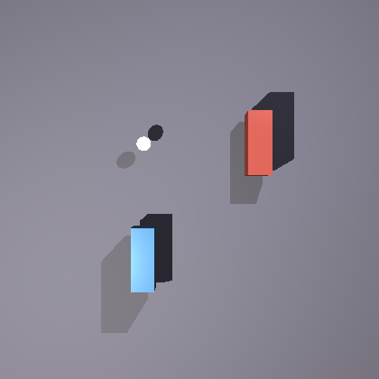

## Transforms

Every [surface](surfaces.md) is written as though it sat at the origin at its own natural
size.  Transforms are how it gets anywhere else — moved, resized, turned or leaned.

<picture>
  <source media="(prefers-color-scheme: dark)" srcset="images/transforms/transformClause-dark.svg">
  <source media="(prefers-color-scheme: light)" srcset="images/transforms/transformClause.svg">
  
</picture>

They may be written anywhere among a surface's other properties, and as many as you like:

```
cylinder {
    material { pigment color [0.8, 0.75, 0.65] }
    min Y 0
    max Y 1
    scale [0.3, 3, 0.3]
    rotate Z 15
    translate [-2, 0, 1]
}
```

### Order Matters

Transforms take effect **in the order you write them**, top to bottom.  This is the single
thing worth understanding about them, because writing the same two the other way round is a
genuinely different instruction — not a stylistic choice.



Two identical bars seen from directly above, with the small white ball marking the origin.
Both were given a 90° turn and a move four units along X; only the order differs.

```
// Red: turned where it stands, then carried out along X.
cube {
    scale [1.1, 0.5, 0.4]
    rotate Y 90
    translate X 4
}

// Blue: carried out along X first, so the turn then swings it about the origin.
cube {
    scale [1.1, 0.5, 0.4]
    translate X 4
    rotate Y 90
}
```

The red bar ends up where you would expect: out along X, turned a quarter.  The blue one is
turned by the same quarter — you can see both bars lie the same way — but it is nowhere near
where the `translate X 4` put it, because the rotation afterwards swung the whole arrangement
about the origin and carried it round to −Z.

The rule to carry away: **a rotation turns things about the origin, not about themselves.**  A
surface still sitting at the origin has no distinction between the two, which is why turning
first and moving afterwards does what you usually mean.  Move first and the rotation becomes
an orbit.

The same applies to scaling, which also works from the origin: scale after translating and
you scale the *distance* as well as the thing.

The scene is [`docs/examples/transforms/order.igl`](examples/transforms/order.igl); change one
line and re-render it to see this for yourself.

### Translate

Moves a surface.  Either give all three components at once, or name a single axis:

```
translate [2, 1, -3]
translate X 2
translate Y -1
```

### Scale

Resizes a surface, from the origin.  Three forms:

```
scale 2                 // uniformly, in every direction
scale [1, 3, 1]         // each axis separately
scale Y 3               // one axis, leaving the others alone
```

A uniform scale is the safe one.  Scaling unevenly is how you get an ellipsoid out of a
sphere or a slab out of a cube, and it is also how a pattern gets stretched — a
[pigment](pigments-and-patterns.md) is evaluated in the surface's own space, so squashing the
surface squashes what is painted on it.

### Rotate

Turns a surface about one of the three axes, and about the origin.

```
rotate Y 45
rotate X -90
```

Unlike `translate` and `scale`, `rotate` **must** name an axis — there is no `rotate [x, y, z]`
form.  Turn about more than one axis by writing more than one rotation, remembering that they
apply in order:

```
rotate X 30
rotate Y 45
```

The angle is read in whatever unit the [context block](context.md#angles) names, and degrees
are the default.

Which way a positive angle turns follows the left hand: point your left thumb along the
positive axis, and your fingers curl the way a positive angle goes.  In practice it is quicker
to write one, look, and flip the sign if it went the wrong way.

### Shear

Leans a surface, so that moving along one axis drags it along another — what turns a rectangle
into a parallelogram.  It takes six numbers, one for each ordered pair of axes:

```
shear [1, 0, 0, 0, 0, 0]
```

The six are, in order: X by Y, X by Z, Y by X, Y by Z, Z by X, Z by Y.  The example above
makes X grow with Y, so an upright cube leans to one side.

### Matrix

The transform of last resort: sixteen numbers, given row by row, used as-is.

```
matrix [1, 0, 0, 0,
        0, 1, 0, 0,
        0, 0, 1, 0,
        1, 0, 0, 1]
```

Almost nothing needs this.  It is here for transforms brought in from elsewhere, and for the
rare case that none of the others can express.

### Naming a Transform

A transform may be given a name and used as often as you like, which is worth doing whenever
the same placement recurs:

```
onEdge = transform {
    scale [1, 1, 0.15]
    rotate X 90
}

cylinder { transform onEdge  translate [-3, 1, 0] }
cylinder { transform onEdge  translate [ 0, 1, 0] }
cylinder { transform onEdge  translate [ 3, 1, 0] }
```

Three discs stood on edge in a row, each written once and placed three times.

A named transform is a value like any other, so it obeys the same ordering rule: everything
inside it happens where you write the `transform`, before anything written after.

### Transforming a Group

A transform on a [group](surfaces.md#groups) applies to everything in it, after each child's
own transforms.  That is what lets you build something at the origin, in convenient
coordinates, and then place the finished assembly:

```
group {
    cube { scale [1, 0.1, 1]  translate [0, 2, 0] }
    cylinder { min Y 0  max Y 2  scale [0.15, 1, 0.15]  translate [-0.8, 0, -0.8] }
    cylinder { min Y 0  max Y 2  scale [0.15, 1, 0.15]  translate [ 0.8, 0, -0.8] }

    rotate Y 30
    translate [0, 0, 4]
}
```

Build first, place second.  Trying to write each leg already in its final position is how
scenes become impossible to adjust.

### Setting a Surface Moving

A `motion` block takes the same transforms and means something different by them: not where
the surface is, but where it *goes* while the camera's shutter is open.

<picture>
  <source media="(prefers-color-scheme: dark)" srcset="images/transforms/motionClause-dark.svg">
  <source media="(prefers-color-scheme: light)" srcset="images/transforms/motionClause.svg">
  
</picture>

```
sphere {
    translate [-2.4, 0.5, 0]
    motion { translate [0.55, 0, 0] }
}
```

That sphere sits at −2.4 and travels 0.55 units to the right during the exposure, coming out
smeared along that path.  The motion is relative to wherever the surface already is.

Nothing happens unless the camera's shutter is open — see
[Motion Blur](cameras.md#motion-blur).  A scene may leave its motions in place and simply shut
the shutter to get a still picture out.

One thing to know about interpolation.  Each transform is worked part of the way through by
its own reckoning of doing nothing, and for `scale` that is **one**, not zero:

```
motion { scale 2 }      // grows from its own size to twice it
```

Half way through the exposure that sphere is one and a half times its size — not half of it,
which is what measuring from zero would give and would have the thing begin the exposure as a
speck.
