## Gallery of images

All the images collected from the parts of the gallery are shown below.  Clicking on each
thumbnail will show the full-sized image.  Clicking the image title will show the source
`.igl` file that generated it.

### Ray Tracer Challenge Book

<table style="width: 100%; border: none;">
  <tr style="border: none;">
    <td style="border: none;"><a href="challenge-book/chapter-6/black.png">
      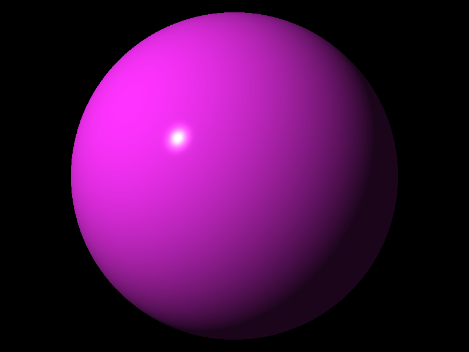
    </a></td>
    <td style="margin-left: 8px; margin-right: 8px; border: none; vertical-align: middle;">
      <a href="challenge-book/chapter-6/black.igl">'Basic Sphere, Black Background</a>
    </td>
  </tr>
  <tr style="border: none;">
    <td style="border: none;"><a href="challenge-book/chapter-6/transparent.png">
      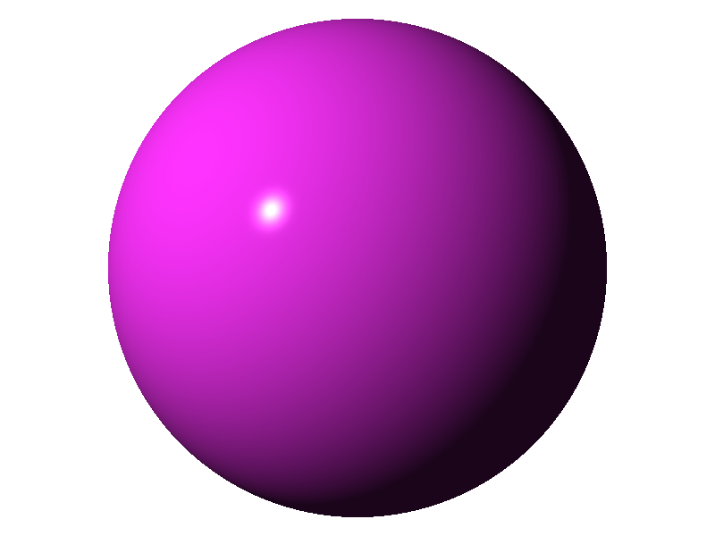
    </a></td>
    <td style="margin-left: 8px; margin-right: 8px; border: none; vertical-align: middle;">
      <a href="challenge-book/chapter-6/transparent.igl">'Basic Sphere, Transparent Background</a>
    </td>
  </tr>
  <tr style="border: none;">
    <td style="border: none;"><a href="challenge-book/chapter-7/no-shadows.png">
      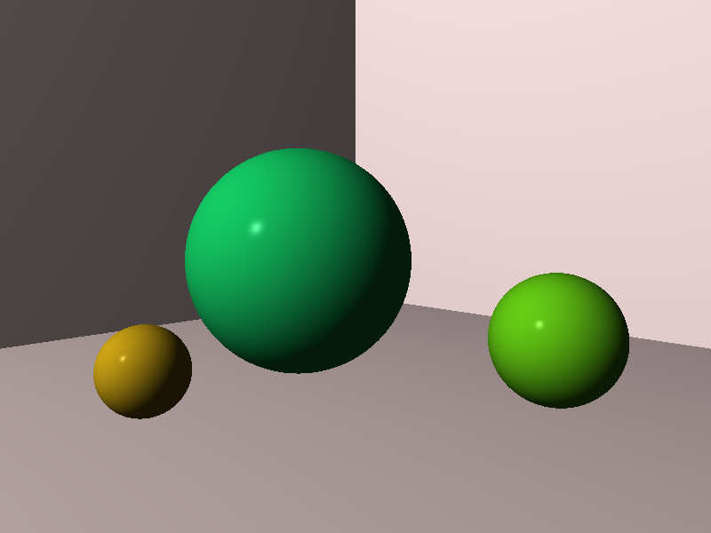
    </a></td>
    <td style="margin-left: 8px; margin-right: 8px; border: none; vertical-align: middle;">
      <a href="challenge-book/chapter-7/no-shadows.igl">'Spheres in a Box, No Shadows</a>
    </td>
  </tr>
  <tr style="border: none;">
    <td style="border: none;"><a href="challenge-book/chapter-8/shadows.png">
      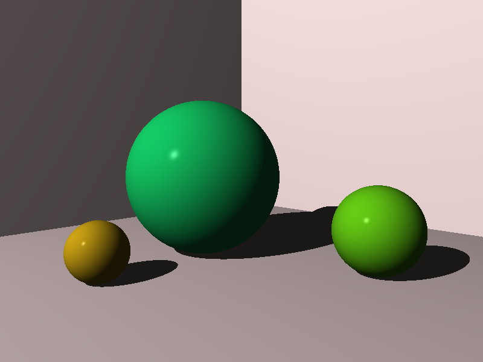
    </a></td>
    <td style="margin-left: 8px; margin-right: 8px; border: none; vertical-align: middle;">
      <a href="challenge-book/chapter-8/shadows.igl">'Spheres in a Box, Shadows</a>
    </td>
  </tr>
  <tr style="border: none;">
    <td style="border: none;"><a href="challenge-book/chapter-9/floor.png">
      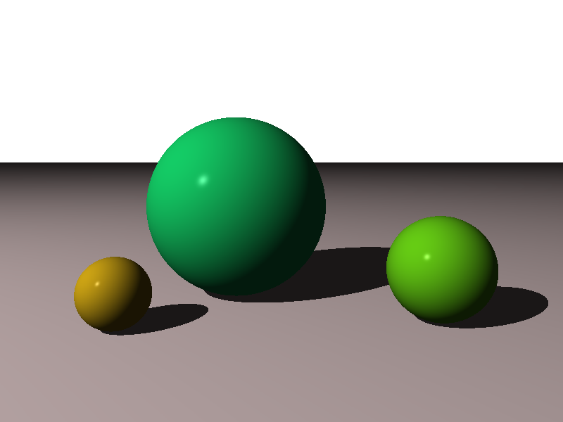
    </a></td>
    <td style="margin-left: 8px; margin-right: 8px; border: none; vertical-align: middle;">
      <a href="challenge-book/chapter-9/floor.igl">'Spheres on the Floor</a>
    </td>
  </tr>
  <tr style="border: none;">
    <td style="border: none;"><a href="challenge-book/chapter-10/blend.png">
      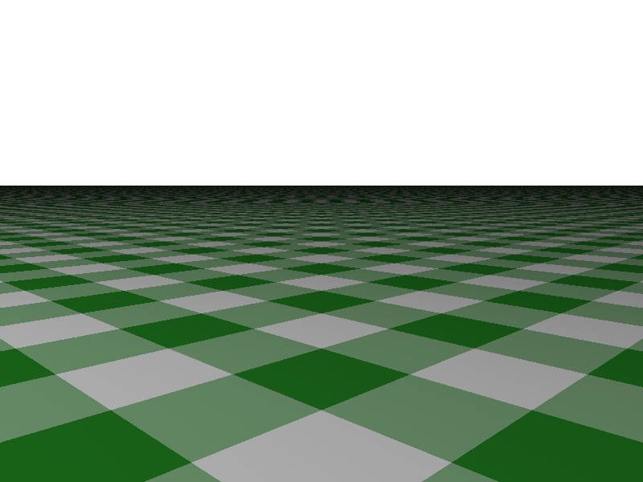
    </a></td>
    <td style="margin-left: 8px; margin-right: 8px; border: none; vertical-align: middle;">
      <a href="challenge-book/chapter-10/blend.igl">'Blended Patterns</a>
    </td>
  </tr>
  <tr style="border: none;">
    <td style="border: none;"><a href="challenge-book/chapter-10/gradients.png">
      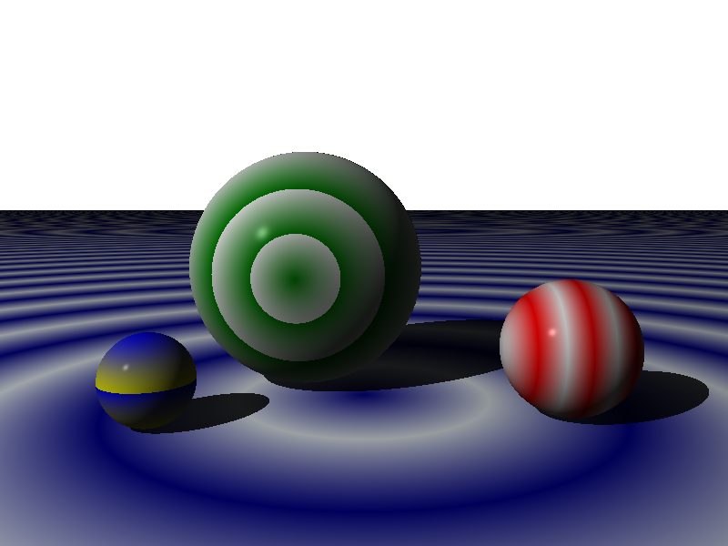
    </a></td>
    <td style="margin-left: 8px; margin-right: 8px; border: none; vertical-align: middle;">
      <a href="challenge-book/chapter-10/gradients.igl">'Things with Gradients</a>
    </td>
  </tr>
  <tr style="border: none;">
    <td style="border: none;"><a href="challenge-book/chapter-10/patterns.png">
      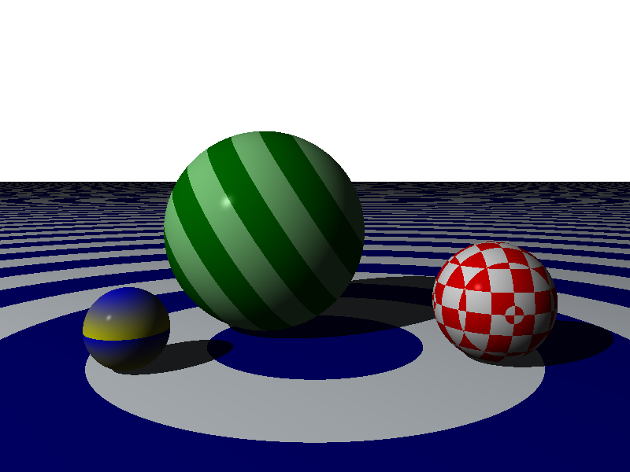
    </a></td>
    <td style="margin-left: 8px; margin-right: 8px; border: none; vertical-align: middle;">
      <a href="challenge-book/chapter-10/patterns.igl">'Things with Basic Patterns</a>
    </td>
  </tr>
  <tr style="border: none;">
    <td style="border: none;"><a href="challenge-book/chapter-10/patterns2.png">
      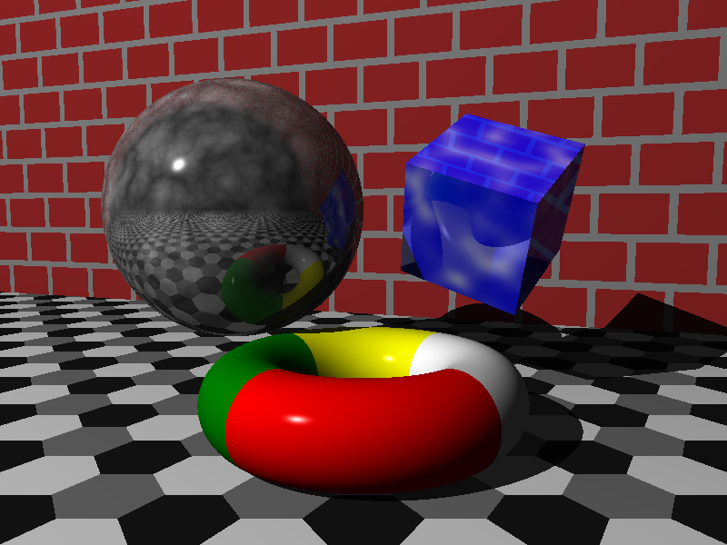
    </a></td>
    <td style="margin-left: 8px; margin-right: 8px; border: none; vertical-align: middle;">
      <a href="challenge-book/chapter-10/patterns2.igl">'Showing More Patterns</a>
    </td>
  </tr>
  <tr style="border: none;">
    <td style="border: none;"><a href="challenge-book/chapter-10/patterns3.png">
      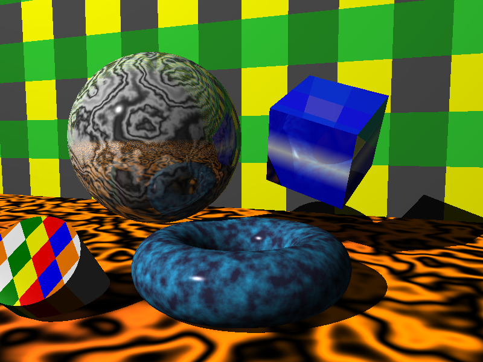
    </a></td>
    <td style="margin-left: 8px; margin-right: 8px; border: none; vertical-align: middle;">
      <a href="challenge-book/chapter-10/patterns3.igl">'Showing Even More Patterns</a>
    </td>
  </tr>
  <tr style="border: none;">
    <td style="border: none;"><a href="challenge-book/chapter-10/planet.png">
      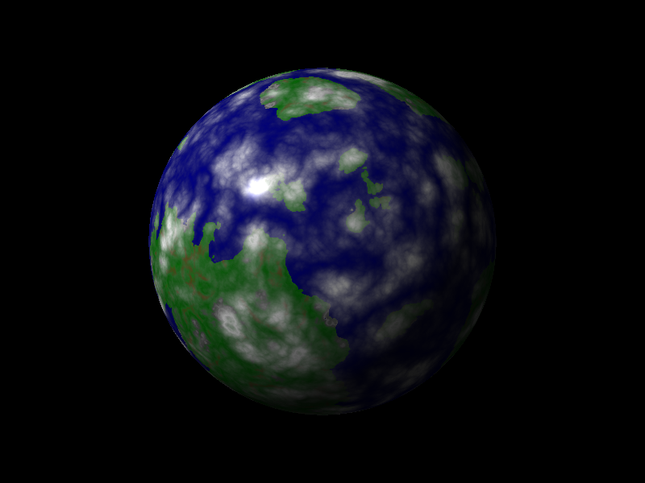
    </a></td>
    <td style="margin-left: 8px; margin-right: 8px; border: none; vertical-align: middle;">
      <a href="challenge-book/chapter-10/planet.igl">'A Planet</a>
    </td>
  </tr>
  <tr style="border: none;">
    <td style="border: none;"><a href="challenge-book/chapter-10/stripes.png">
      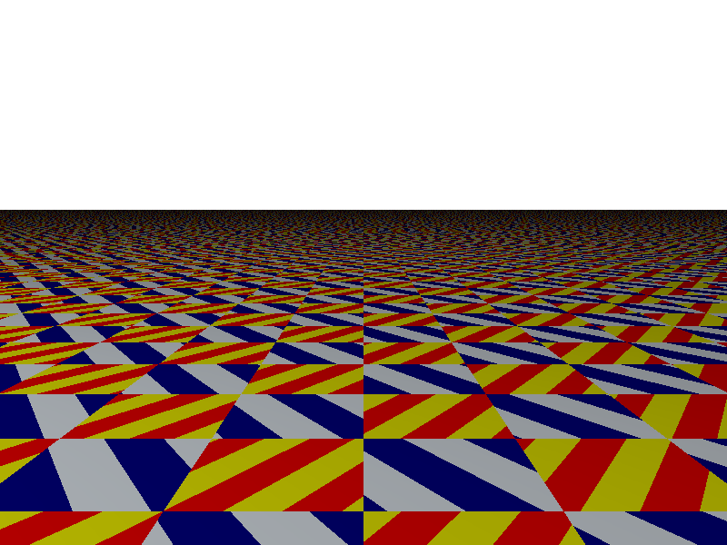
    </a></td>
    <td style="margin-left: 8px; margin-right: 8px; border: none; vertical-align: middle;">
      <a href="challenge-book/chapter-10/stripes.igl">'A Floor with Nested Striping</a>
    </td>
  </tr>
  <tr style="border: none;">
    <td style="border: none;"><a href="challenge-book/chapter-11/lake.png">
      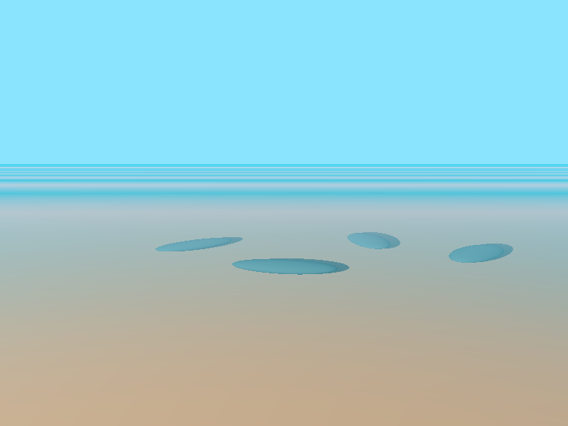
    </a></td>
    <td style="margin-left: 8px; margin-right: 8px; border: none; vertical-align: middle;">
      <a href="challenge-book/chapter-11/lake.igl">'A Lake, Kind of</a>
    </td>
  </tr>
  <tr style="border: none;">
    <td style="border: none;"><a href="challenge-book/chapter-11/reflections.png">
      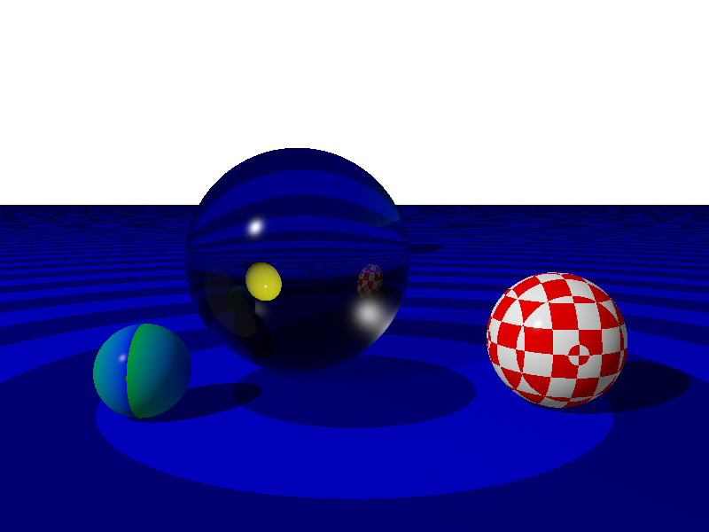
    </a></td>
    <td style="margin-left: 8px; margin-right: 8px; border: none; vertical-align: middle;">
      <a href="challenge-book/chapter-11/reflections.igl">'Glassy Reflections</a>
    </td>
  </tr>
  <tr style="border: none;">
    <td style="border: none;"><a href="challenge-book/chapter-12/cube.png">
      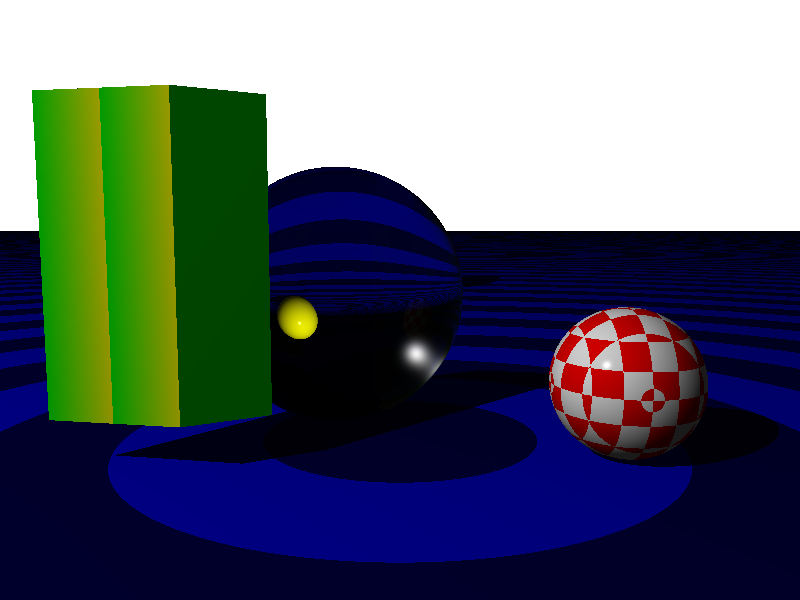
    </a></td>
    <td style="margin-left: 8px; margin-right: 8px; border: none; vertical-align: middle;">
      <a href="challenge-book/chapter-12/cube.igl">'Rectangular Solids</a>
    </td>
  </tr>
  <tr style="border: none;">
    <td style="border: none;"></td>
    <td style="margin-left: 8px; margin-right: 8px; border: none; vertical-align: middle;">
      <a href="challenge-book/chapter-12/room.igl">'A Room with a Mirror, All Rectangular Solids</a>
    </td>
  </tr>
  <tr style="border: none;">
    <td style="border: none;"><a href="challenge-book/chapter-13/circulars.png">
      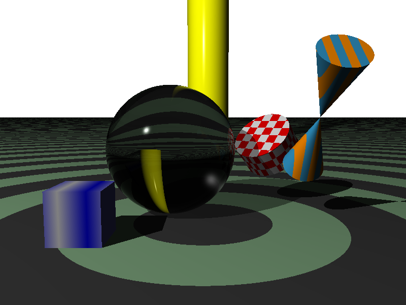
    </a></td>
    <td style="margin-left: 8px; margin-right: 8px; border: none; vertical-align: middle;">
      <a href="challenge-book/chapter-13/circulars.igl">'Cylinders and Conics</a>
    </td>
  </tr>
  <tr style="border: none;">
    <td style="border: none;"><a href="challenge-book/chapter-14/hex.png">
      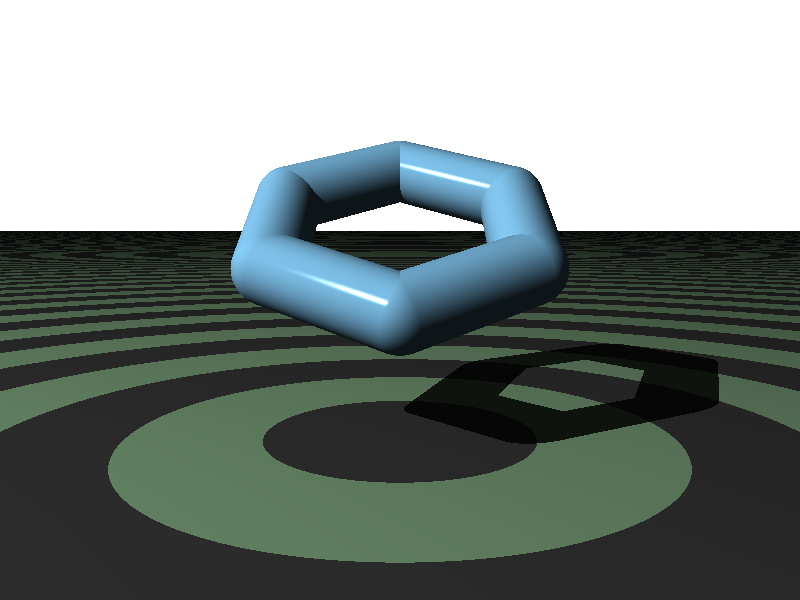
    </a></td>
    <td style="margin-left: 8px; margin-right: 8px; border: none; vertical-align: middle;">
      <a href="challenge-book/chapter-14/hex.igl">'Hexagon from a Repeating Group</a>
    </td>
  </tr>
  <tr style="border: none;">
    <td style="border: none;"><a href="challenge-book/chapter-14/pointy-thing.png">
      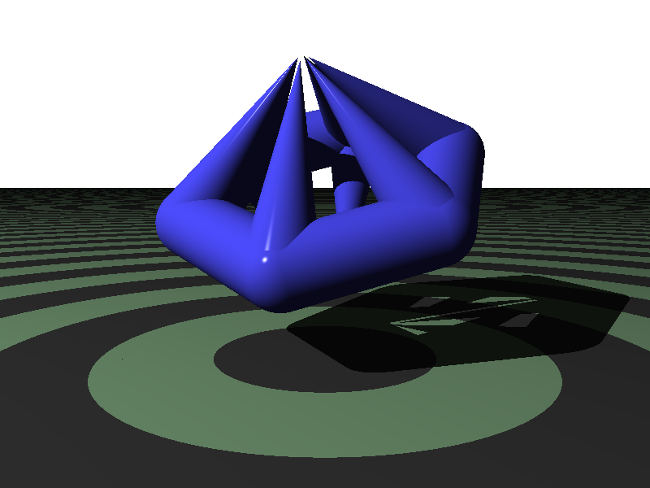
    </a></td>
    <td style="margin-left: 8px; margin-right: 8px; border: none; vertical-align: middle;">
      <a href="challenge-book/chapter-14/pointy-thing.igl">'A Pointy Thing</a>
    </td>
  </tr>
  <tr style="border: none;">
    <td style="border: none;"><a href="challenge-book/chapter-15/object-file-no-normals.png">
      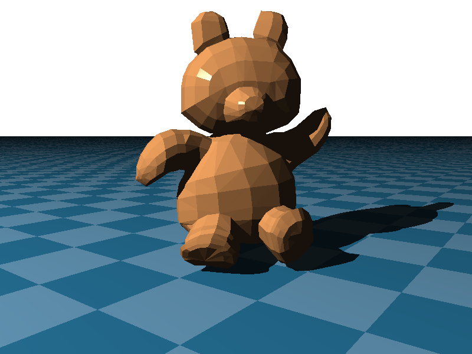
    </a></td>
    <td style="margin-left: 8px; margin-right: 8px; border: none; vertical-align: middle;">
      <a href="challenge-book/chapter-15/object-file-no-normals.igl">'A Simple Teddy Bear</a>
    </td>
  </tr>
  <tr style="border: none;">
    <td style="border: none;"><a href="challenge-book/chapter-15/object-file-with-normals.png">
      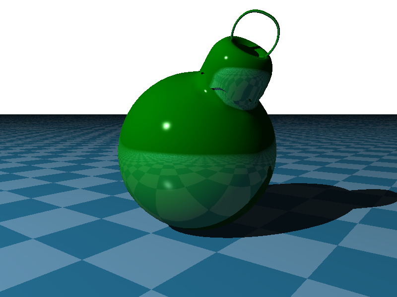
    </a></td>
    <td style="margin-left: 8px; margin-right: 8px; border: none; vertical-align: middle;">
      <a href="challenge-book/chapter-15/object-file-with-normals.igl">'A Christmas Tree Ornament</a>
    </td>
  </tr>
  <tr style="border: none;">
    <td style="border: none;"><a href="challenge-book/chapter-15/parallelogram.png">
      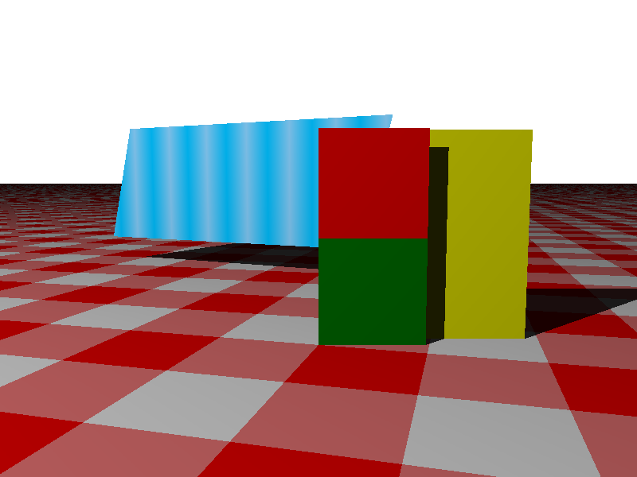
    </a></td>
    <td style="margin-left: 8px; margin-right: 8px; border: none; vertical-align: middle;">
      <a href="challenge-book/chapter-15/parallelogram.igl">'2D in 3d: Parallelograms</a>
    </td>
  </tr>
  <tr style="border: none;">
    <td style="border: none;"><a href="challenge-book/chapter-15/smooth-triangle.png">
      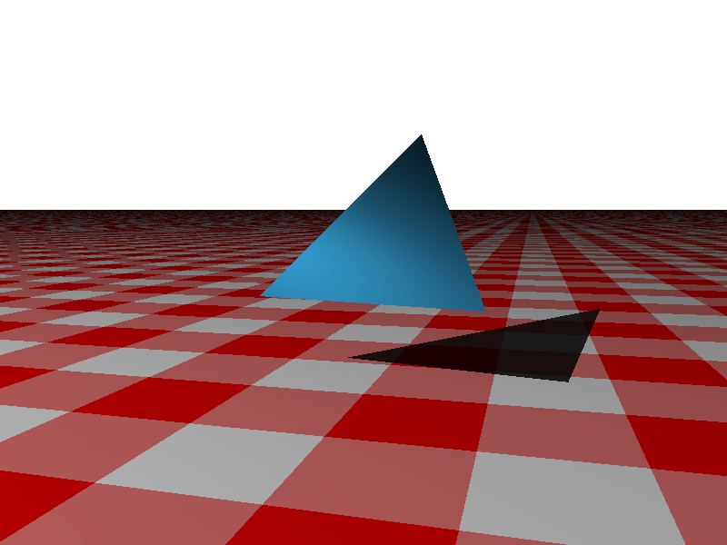
    </a></td>
    <td style="margin-left: 8px; margin-right: 8px; border: none; vertical-align: middle;">
      <a href="challenge-book/chapter-15/smooth-triangle.igl">'2D in 3d: Smooth Triangles</a>
    </td>
  </tr>
  <tr style="border: none;">
    <td style="border: none;"><a href="challenge-book/chapter-15/triangle.png">
      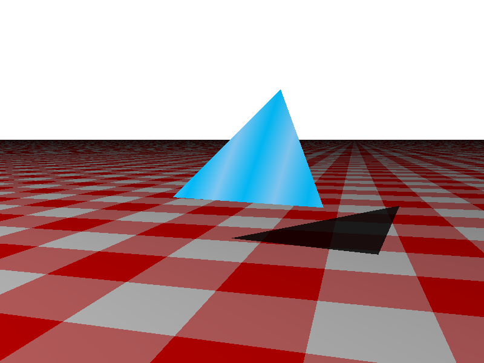
    </a></td>
    <td style="margin-left: 8px; margin-right: 8px; border: none; vertical-align: middle;">
      <a href="challenge-book/chapter-15/triangle.igl">'2D in 3d: Triangles</a>
    </td>
  </tr>
  <tr style="border: none;">
    <td style="border: none;"></td>
    <td style="margin-left: 8px; margin-right: 8px; border: none; vertical-align: middle;">
      <a href="challenge-book/chapter-16/csg.igl">'Basic CSG Examples</a>
    </td>
  </tr>
  <tr style="border: none;">
    <td style="border: none;"><a href="challenge-book/chapter-16/csg2.png">
      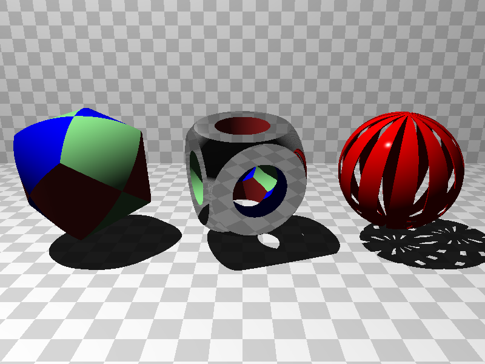
    </a></td>
    <td style="margin-left: 8px; margin-right: 8px; border: none; vertical-align: middle;">
      <a href="challenge-book/chapter-16/csg2.igl">'More CSF: A Picture from the Book</a>
    </td>
  </tr>
  <tr style="border: none;">
    <td style="border: none;"><a href="challenge-book/chapter-16/dice.png">
      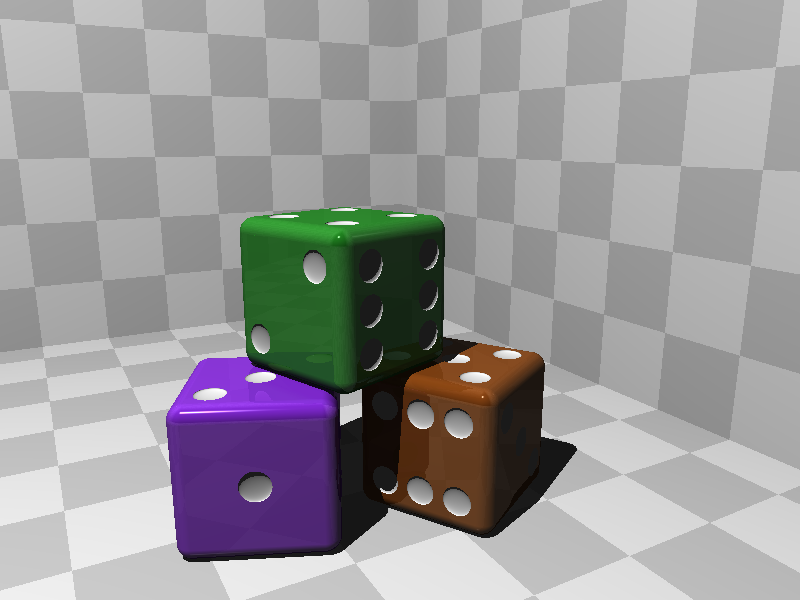
    </a></td>
    <td style="margin-left: 8px; margin-right: 8px; border: none; vertical-align: middle;">
      <a href="challenge-book/chapter-16/dice.igl">'Three Dice: Another Picture from the Book</a>
    </td>
  </tr>
  <tr style="border: none;">
    <td style="border: none;"><a href="challenge-book/cover.png">
      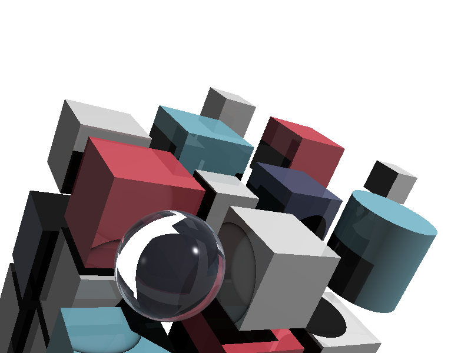
    </a></td>
    <td style="margin-left: 8px; margin-right: 8px; border: none; vertical-align: middle;">
      <a href="challenge-book/cover.igl">The Ray Tracer Challenge Cover Art</a>
    </td>
  </tr>
</table>

### Stuff Invented Here

<table style="width: 100%; border: none;">
  <tr style="border: none;">
    <td style="border: none;"><a href="Local/extrusions/extrusion.png">
      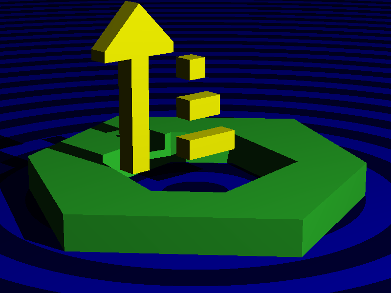
    </a></td>
    <td style="margin-left: 8px; margin-right: 8px; border: none; vertical-align: middle;">
      <a href="Local/extrusions/extrusion.igl">Extrusion Test</a>
    </td>
  </tr>
  <tr style="border: none;">
    <td style="border: none;"><a href="Local/extrusions/extrusion2.png">
      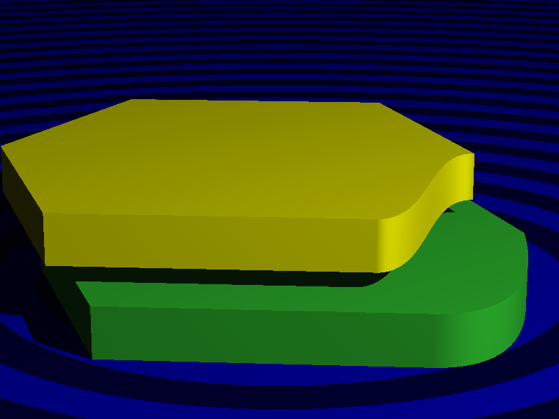
    </a></td>
    <td style="margin-left: 8px; margin-right: 8px; border: none; vertical-align: middle;">
      <a href="Local/extrusions/extrusion2.igl">Another Extrusion Test</a>
    </td>
  </tr>
  <tr style="border: none;">
    <td style="border: none;"><a href="Local/extrusions/lathe.png">
      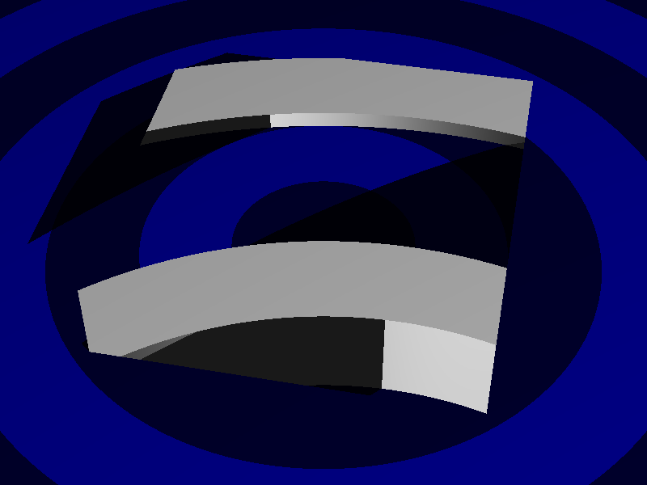
    </a></td>
    <td style="margin-left: 8px; margin-right: 8px; border: none; vertical-align: middle;">
      <a href="Local/extrusions/lathe.igl">Lathe Test</a>
    </td>
  </tr>
  <tr style="border: none;">
    <td style="border: none;"><a href="Local/extrusions/lathe-drinking-glass.png">
      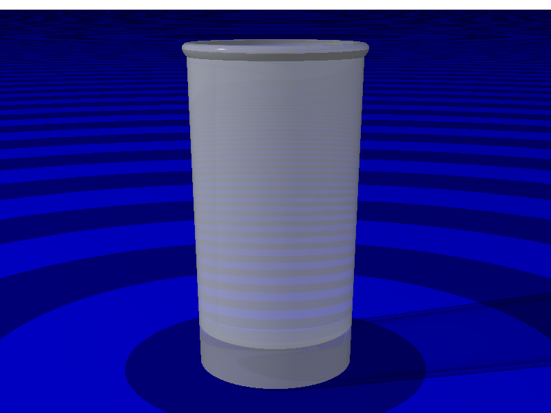
    </a></td>
    <td style="margin-left: 8px; margin-right: 8px; border: none; vertical-align: middle;">
      <a href="Local/extrusions/lathe-drinking-glass.igl">Lathe Drinking Glass Test</a>
    </td>
  </tr>
  <tr style="border: none;">
    <td style="border: none;"><a href="Local/extrusions/lathe-trophy.png">
      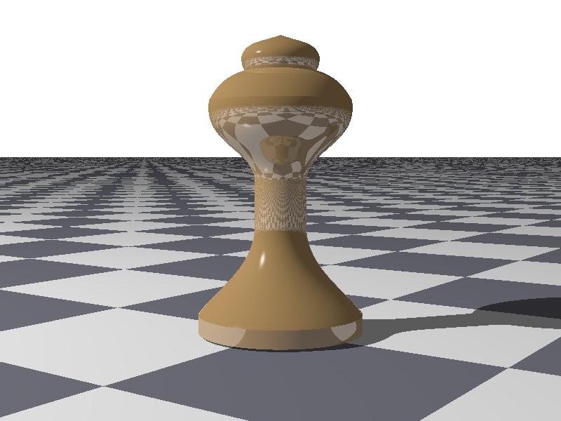
    </a></td>
    <td style="margin-left: 8px; margin-right: 8px; border: none; vertical-align: middle;">
      <a href="Local/extrusions/lathe-trophy.igl">Lathe Trophy Test</a>
    </td>
  </tr>
  <tr style="border: none;">
    <td style="border: none;"><a href="Local/heightfield.png">
      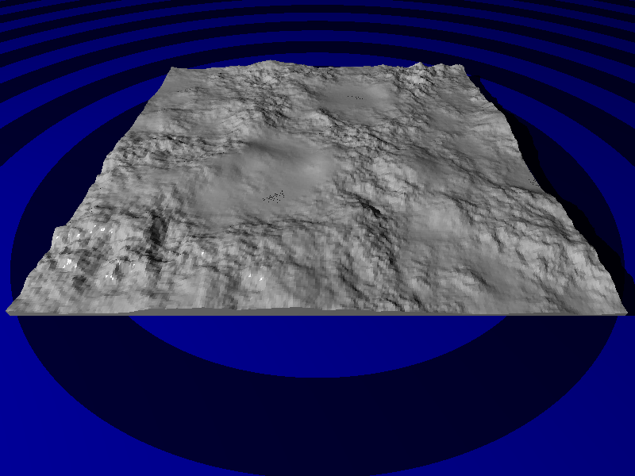
    </a></td>
    <td style="margin-left: 8px; margin-right: 8px; border: none; vertical-align: middle;">
      <a href="Local/heightfield.igl">Height Field Test</a>
    </td>
  </tr>
  <tr style="border: none;">
    <td style="border: none;"><a href="Local/image-map.png">
      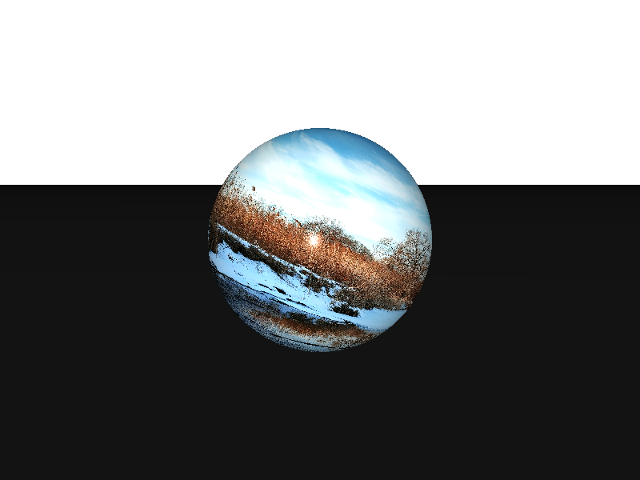
    </a></td>
    <td style="margin-left: 8px; margin-right: 8px; border: none; vertical-align: middle;">
      <a href="Local/image-map.igl">'Spherical image pigment test</a>
    </td>
  </tr>
  <tr style="border: none;">
    <td style="border: none;"><a href="Local/l-systems/axial.png">
      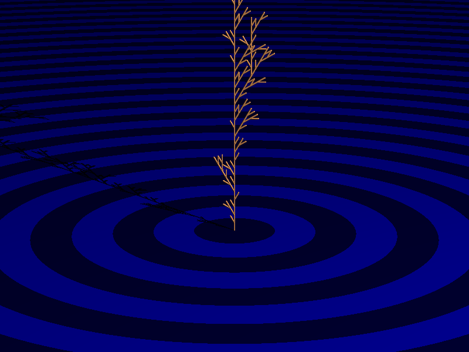
    </a></td>
    <td style="margin-left: 8px; margin-right: 8px; border: none; vertical-align: middle;">
      <a href="Local/l-systems/axial.igl">L-System Test: Axial Tree</a>
    </td>
  </tr>
  <tr style="border: none;">
    <td style="border: none;"><a href="Local/l-systems/context-sensitive.png">
      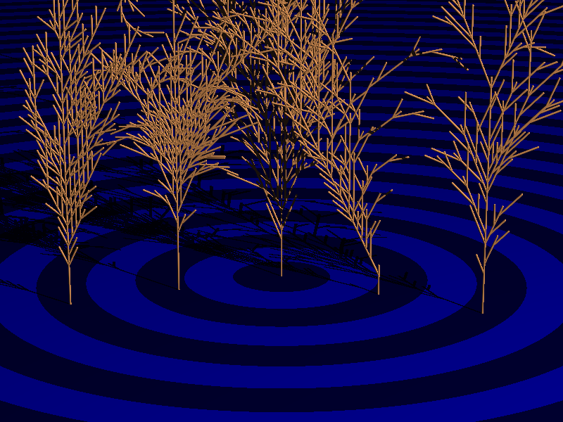
    </a></td>
    <td style="margin-left: 8px; margin-right: 8px; border: none; vertical-align: middle;">
      <a href="Local/l-systems/context-sensitive.igl">L-System Test: Context-Sensitive</a>
    </td>
  </tr>
  <tr style="border: none;">
    <td style="border: none;"><a href="Local/l-systems/hilbert.png">
      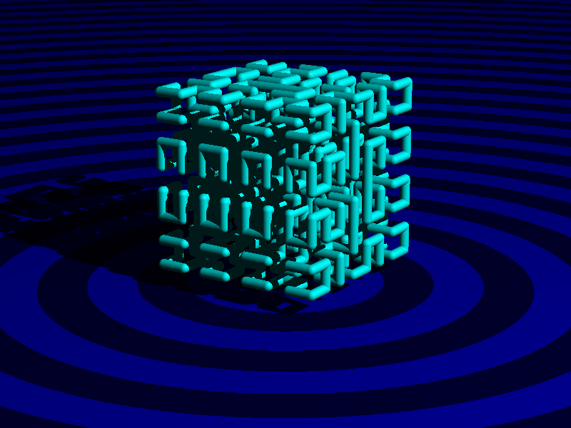
    </a></td>
    <td style="margin-left: 8px; margin-right: 8px; border: none; vertical-align: middle;">
      <a href="Local/l-systems/hilbert.igl">L-System Test: Hilbert Curve</a>
    </td>
  </tr>
  <tr style="border: none;">
    <td style="border: none;"><a href="Local/l-systems/snowflake-2.png">
      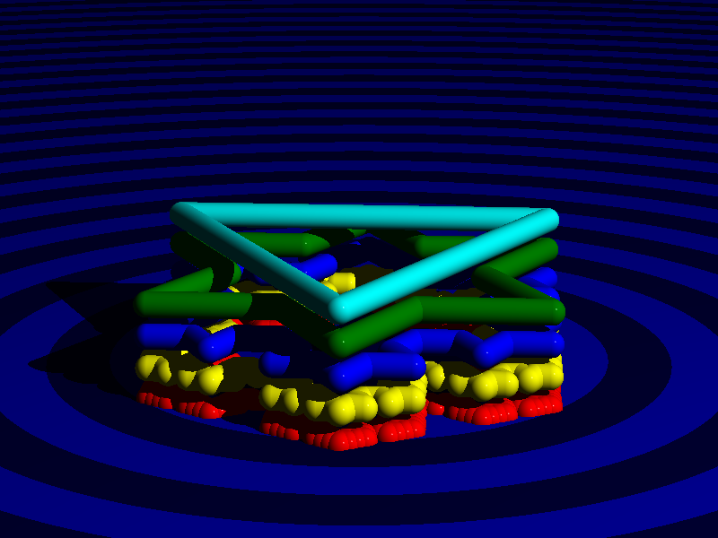
    </a></td>
    <td style="margin-left: 8px; margin-right: 8px; border: none; vertical-align: middle;">
      <a href="Local/l-systems/snowflake-2.igl">L-System Test: Snowflake Outline</a>
    </td>
  </tr>
  <tr style="border: none;">
    <td style="border: none;"><a href="Local/l-systems/snowflake.png">
      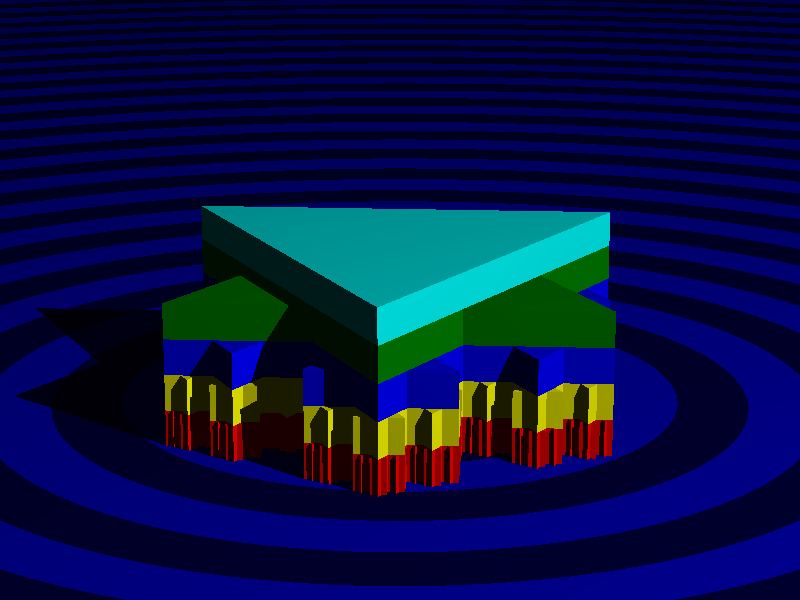
    </a></td>
    <td style="margin-left: 8px; margin-right: 8px; border: none; vertical-align: middle;">
      <a href="Local/l-systems/snowflake.igl">L-System Test: Snowflake</a>
    </td>
  </tr>
  <tr style="border: none;">
    <td style="border: none;"><a href="Local/noise.png">
      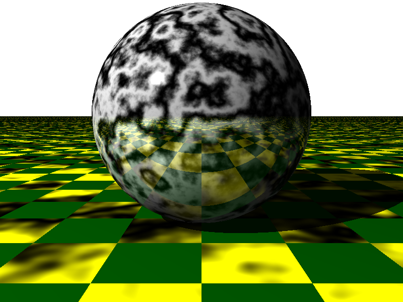
    </a></td>
    <td style="margin-left: 8px; margin-right: 8px; border: none; vertical-align: middle;">
      <a href="Local/noise.igl">Pigment Noise Test</a>
    </td>
  </tr>
  <tr style="border: none;">
    <td style="border: none;"><a href="Local/solar-system/all.png">
      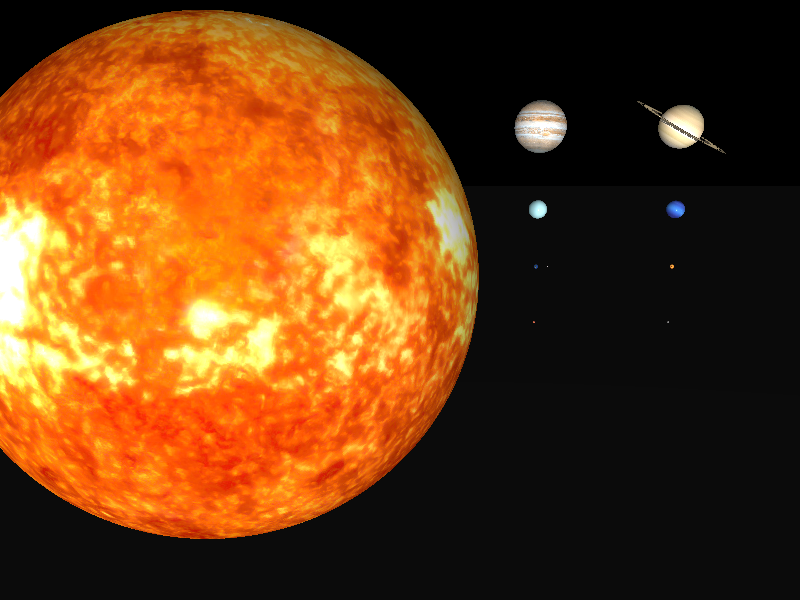
    </a></td>
    <td style="margin-left: 8px; margin-right: 8px; border: none; vertical-align: middle;">
      <a href="Local/solar-system/all.igl">'The Planets</a>
    </td>
  </tr>
  <tr style="border: none;">
    <td style="border: none;"><a href="Local/solar-system/inner.png">
      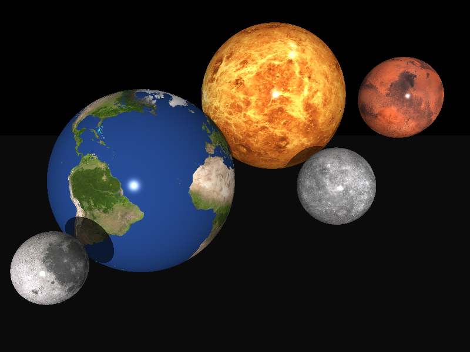
    </a></td>
    <td style="margin-left: 8px; margin-right: 8px; border: none; vertical-align: middle;">
      <a href="Local/solar-system/inner.igl">'The Inner Planets</a>
    </td>
  </tr>
  <tr style="border: none;">
    <td style="border: none;"><a href="Local/solar-system/outer.png">
      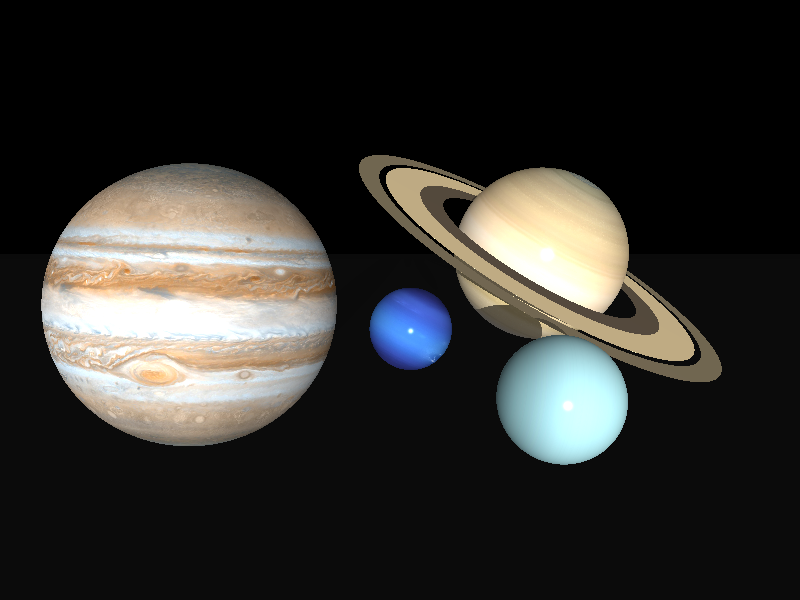
    </a></td>
    <td style="margin-left: 8px; margin-right: 8px; border: none; vertical-align: middle;">
      <a href="Local/solar-system/outer.igl">'The Outer Planets</a>
    </td>
  </tr>
  <tr style="border: none;">
    <td style="border: none;"><a href="Local/text.png">
      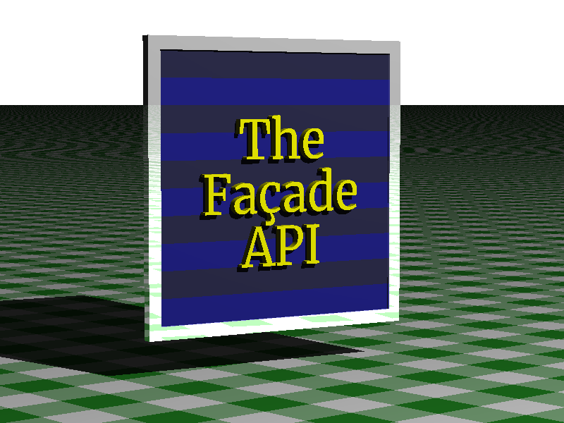
    </a></td>
    <td style="margin-left: 8px; margin-right: 8px; border: none; vertical-align: middle;">
      <a href="Local/text.igl">Text Solid Test</a>
    </td>
  </tr>
  <tr style="border: none;">
    <td style="border: none;"><a href="Local/torus.png">
      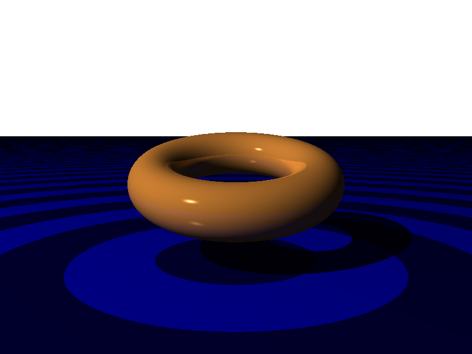
    </a></td>
    <td style="margin-left: 8px; margin-right: 8px; border: none; vertical-align: middle;">
      <a href="Local/torus.igl">Torus Test</a>
    </td>
  </tr>
  <tr style="border: none;">
    <td style="border: none;"><a href="Local/blob.png">
      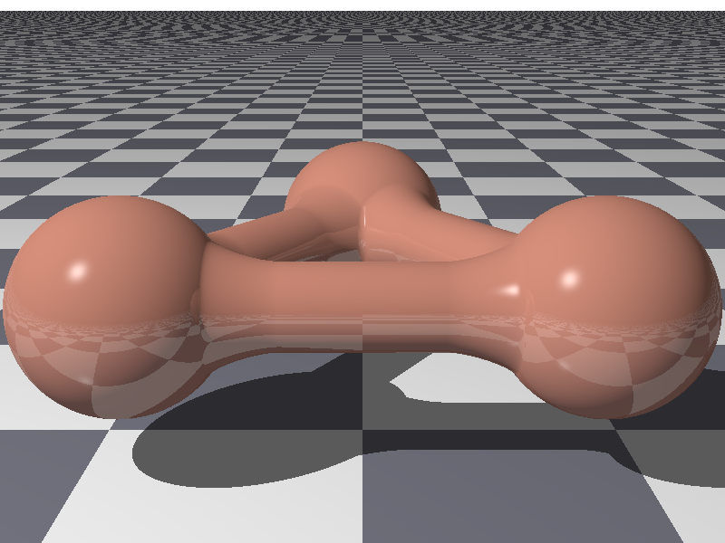
    </a></td>
    <td style="margin-left: 8px; margin-right: 8px; border: none; vertical-align: middle;">
      <a href="Local/blob.igl">Blob Test</a>
    </td>
  </tr>
  <tr style="border: none;">
    <td style="border: none;"><a href="Local/blob-negative-strength.png">
      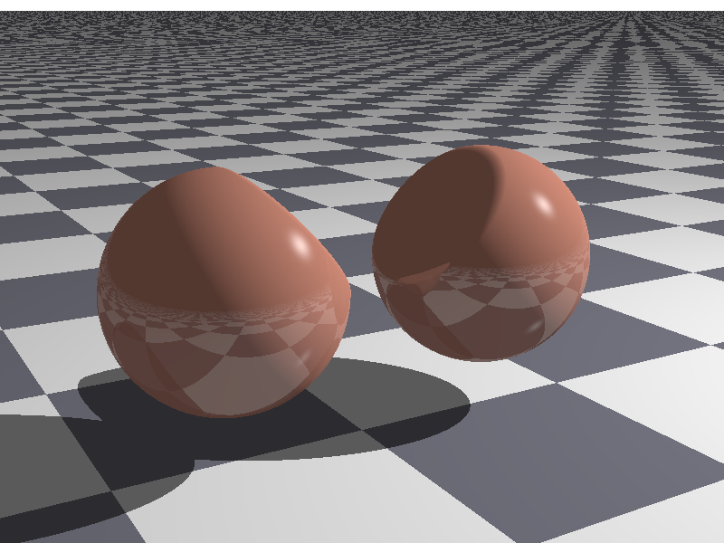
    </a></td>
    <td style="margin-left: 8px; margin-right: 8px; border: none; vertical-align: middle;">
      <a href="Local/blob-negative-strength.igl">Blob Negative Strength Test</a>
    </td>
  </tr>
  <tr style="border: none;">
    <td style="border: none;"><a href="Local/tube.png">
      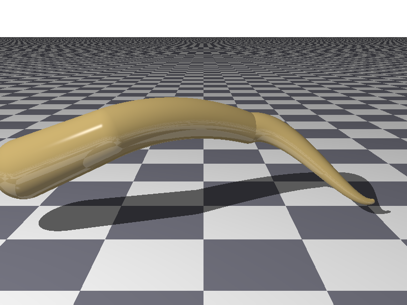
    </a></td>
    <td style="margin-left: 8px; margin-right: 8px; border: none; vertical-align: middle;">
      <a href="Local/tube.igl">Tube Test</a>
    </td>
  </tr>
  <tr style="border: none;">
    <td style="border: none;"><a href="Local/power-cord.png">
      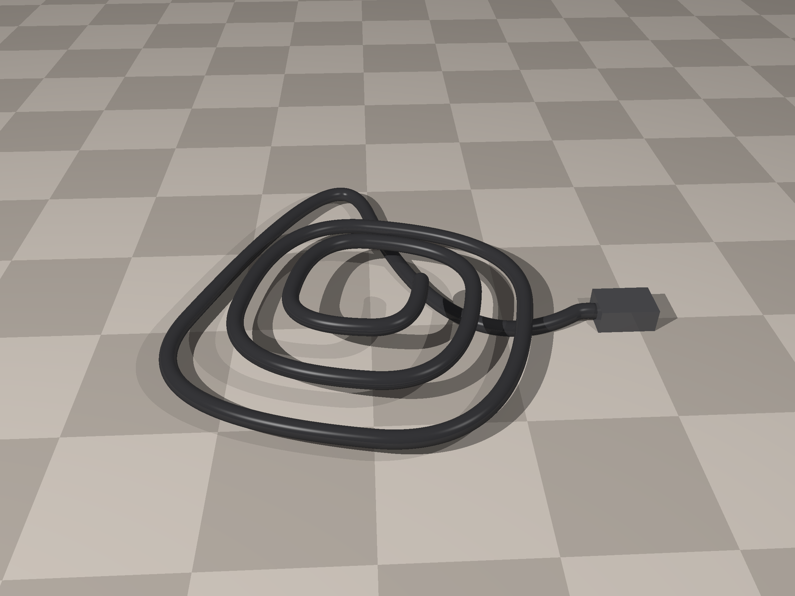
    </a></td>
    <td style="margin-left: 8px; margin-right: 8px; border: none; vertical-align: middle;">
      <a href="Local/power-cord.igl">Power Cord Test</a>
    </td>
  </tr>
  <tr style="border: none;">
    <td style="border: none;"><a href="Local/sweep.png">
      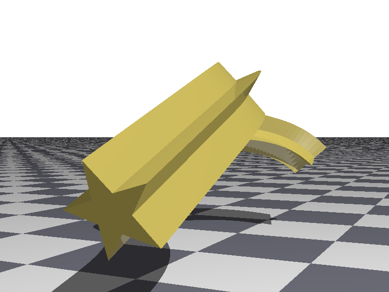
    </a></td>
    <td style="margin-left: 8px; margin-right: 8px; border: none; vertical-align: middle;">
      <a href="Local/sweep.igl">Sweep Test</a>
    </td>
  </tr>
  <tr style="border: none;">
    <td style="border: none;"><a href="Local/sweep-conduit.png">
      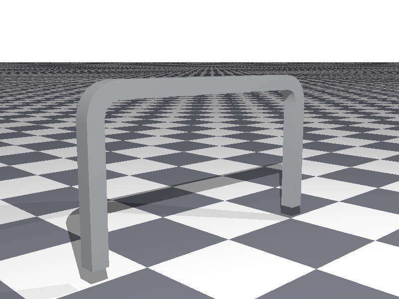
    </a></td>
    <td style="margin-left: 8px; margin-right: 8px; border: none; vertical-align: middle;">
      <a href="Local/sweep-conduit.igl">Sweep Conduit Test</a>
    </td>
  </tr>
  <tr style="border: none;">
    <td style="border: none;"><a href="Local/sweep-side.png">
      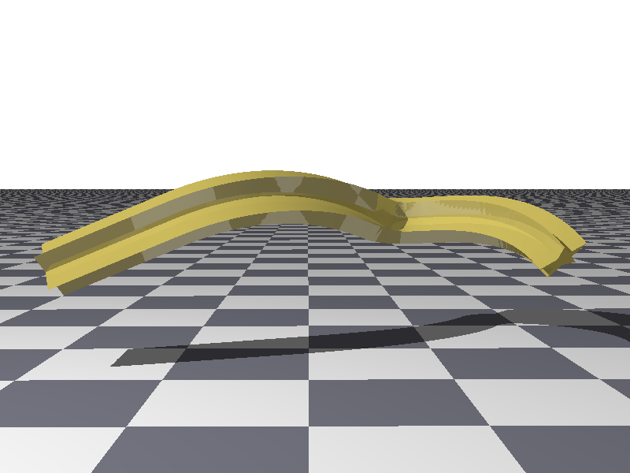
    </a></td>
    <td style="margin-left: 8px; margin-right: 8px; border: none; vertical-align: middle;">
      <a href="Local/sweep-side.igl">Sweep Test (Side View)</a>
    </td>
  </tr>
  <tr style="border: none;">
    <td style="border: none;"><a href="Local/disc.png">
      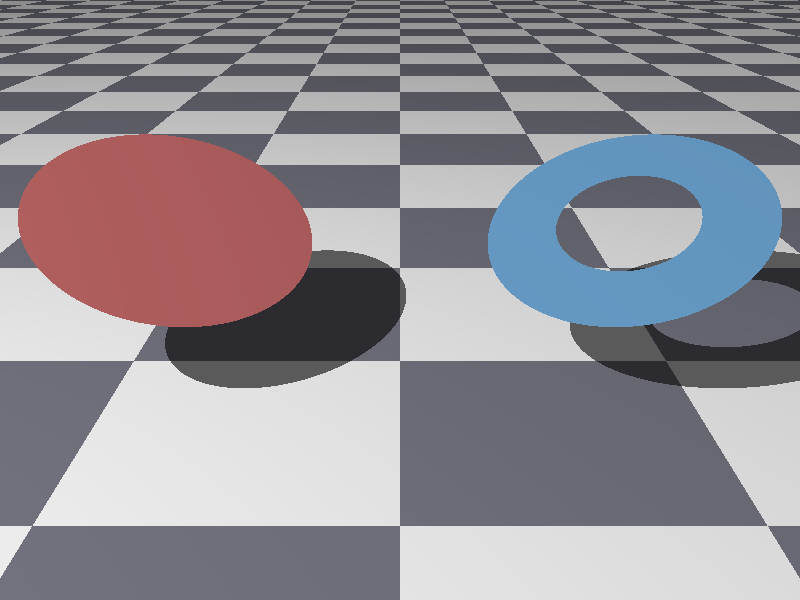
    </a></td>
    <td style="margin-left: 8px; margin-right: 8px; border: none; vertical-align: middle;">
      <a href="Local/disc.igl">Disc Test</a>
    </td>
  </tr>
  <tr style="border: none;">
    <td style="border: none;"><a href="Local/generic-shape.png">
      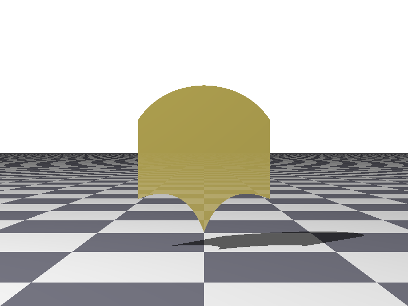
    </a></td>
    <td style="margin-left: 8px; margin-right: 8px; border: none; vertical-align: middle;">
      <a href="Local/generic-shape.igl">Generic Shape Test</a>
    </td>
  </tr>
  <tr style="border: none;">
    <td style="border: none;"><a href="Local/egg.png">
      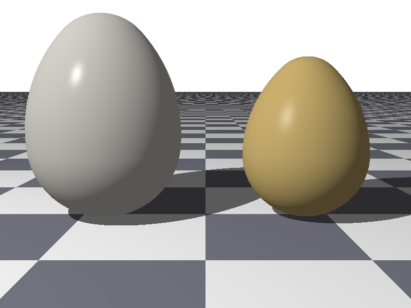
    </a></td>
    <td style="margin-left: 8px; margin-right: 8px; border: none; vertical-align: middle;">
      <a href="Local/egg.igl">Egg Test</a>
    </td>
  </tr>
  <tr style="border: none;">
    <td style="border: none;"><a href="Local/superellipsoid.png">
      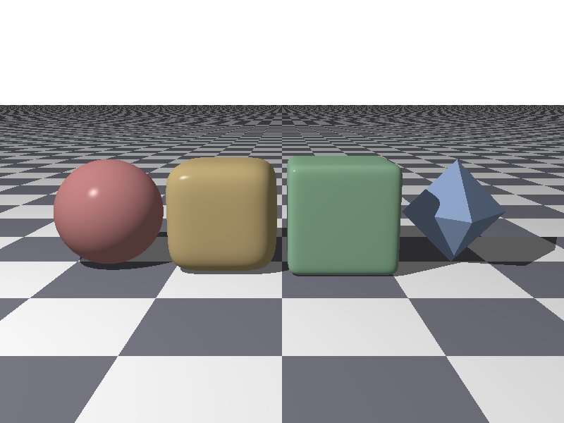
    </a></td>
    <td style="margin-left: 8px; margin-right: 8px; border: none; vertical-align: middle;">
      <a href="Local/superellipsoid.igl">Superellipsoid Test</a>
    </td>
  </tr>
  <tr style="border: none;">
    <td style="border: none;"><a href="Local/superellipsoid-concave.png">
      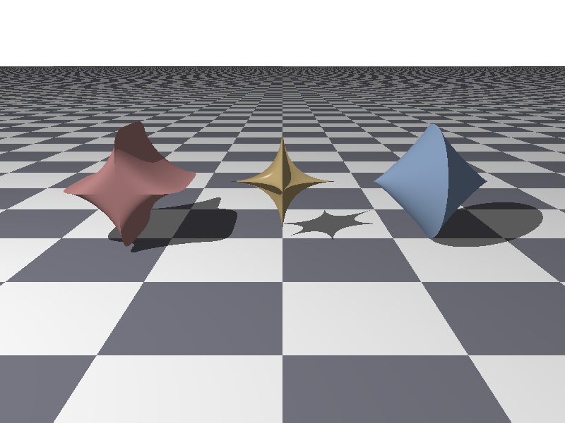
    </a></td>
    <td style="margin-left: 8px; margin-right: 8px; border: none; vertical-align: middle;">
      <a href="Local/superellipsoid-concave.igl">Superellipsoid Concave Shapes Test</a>
    </td>
  </tr>
  <tr style="border: none;">
    <td style="border: none;"><a href="Local/patch.png">
      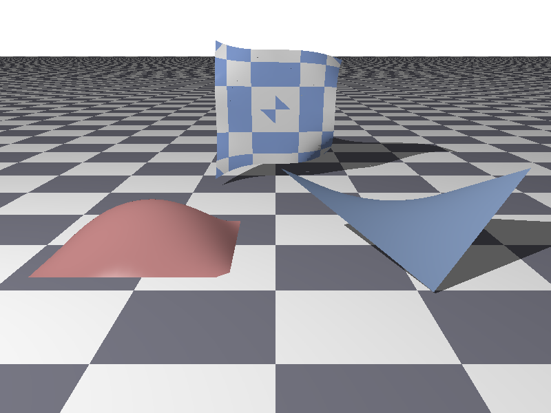
    </a></td>
    <td style="margin-left: 8px; margin-right: 8px; border: none; vertical-align: middle;">
      <a href="Local/patch.igl">Patch Test</a>
    </td>
  </tr>
</table>
