## Gallery of images

All the images collected from the parts of the gallery are shown below.  Clicking on each
thumbnail will show the full-sized image.  Clicking the image title will show the source
`.igl` file that generated it.

<details>
<summary><b>Ray Tracer Challenge Book</b> &mdash; 32 images</summary>

<table style="width: 100%; border: none;">
  <tr style="border: none;">
    <td style="border: none;"><a href="challenge-book/chapter-6/black.png">
      
    </a></td>
    <td style="margin-left: 8px; margin-right: 8px; border: none; vertical-align: middle;">
      <a href="challenge-book/chapter-6/black.igl">Basic Sphere, Black Background</a>
    </td>
  </tr>
  <tr style="border: none;">
    <td style="border: none;"><a href="challenge-book/chapter-6/transparent.png">
      
    </a></td>
    <td style="margin-left: 8px; margin-right: 8px; border: none; vertical-align: middle;">
      <a href="challenge-book/chapter-6/transparent.igl">Basic Sphere, Transparent Background</a>
    </td>
  </tr>
  <tr style="border: none;">
    <td style="border: none;"><a href="challenge-book/chapter-7/no-shadows.png">
      
    </a></td>
    <td style="margin-left: 8px; margin-right: 8px; border: none; vertical-align: middle;">
      <a href="challenge-book/chapter-7/no-shadows.igl">Spheres in a Box, No Shadows</a>
    </td>
  </tr>
  <tr style="border: none;">
    <td style="border: none;"><a href="challenge-book/chapter-8/shadows.png">
      
    </a></td>
    <td style="margin-left: 8px; margin-right: 8px; border: none; vertical-align: middle;">
      <a href="challenge-book/chapter-8/shadows.igl">Spheres in a Box, Shadows</a>
    </td>
  </tr>
  <tr style="border: none;">
    <td style="border: none;"><a href="challenge-book/chapter-9/floor.png">
      
    </a></td>
    <td style="margin-left: 8px; margin-right: 8px; border: none; vertical-align: middle;">
      <a href="challenge-book/chapter-9/floor.igl">Spheres on the Floor</a>
    </td>
  </tr>
  <tr style="border: none;">
    <td style="border: none;"><a href="challenge-book/chapter-10/blend.png">
      
    </a></td>
    <td style="margin-left: 8px; margin-right: 8px; border: none; vertical-align: middle;">
      <a href="challenge-book/chapter-10/blend.igl">Blended Patterns</a>
    </td>
  </tr>
  <tr style="border: none;">
    <td style="border: none;"><a href="challenge-book/chapter-10/gradients.png">
      
    </a></td>
    <td style="margin-left: 8px; margin-right: 8px; border: none; vertical-align: middle;">
      <a href="challenge-book/chapter-10/gradients.igl">Things with Gradients</a>
    </td>
  </tr>
  <tr style="border: none;">
    <td style="border: none;"><a href="challenge-book/chapter-10/patterns.png">
      
    </a></td>
    <td style="margin-left: 8px; margin-right: 8px; border: none; vertical-align: middle;">
      <a href="challenge-book/chapter-10/patterns.igl">Things with Basic Patterns</a>
    </td>
  </tr>
  <tr style="border: none;">
    <td style="border: none;"><a href="challenge-book/chapter-10/patterns2.png">
      
    </a></td>
    <td style="margin-left: 8px; margin-right: 8px; border: none; vertical-align: middle;">
      <a href="challenge-book/chapter-10/patterns2.igl">Showing More Patterns</a>
    </td>
  </tr>
  <tr style="border: none;">
    <td style="border: none;"><a href="challenge-book/chapter-10/patterns3.png">
      
    </a></td>
    <td style="margin-left: 8px; margin-right: 8px; border: none; vertical-align: middle;">
      <a href="challenge-book/chapter-10/patterns3.igl">Showing Even More Patterns</a>
    </td>
  </tr>
  <tr style="border: none;">
    <td style="border: none;"><a href="challenge-book/chapter-10/patterns4.png">
      
    </a></td>
    <td style="margin-left: 8px; margin-right: 8px; border: none; vertical-align: middle;">
      <a href="challenge-book/chapter-10/patterns4.igl">The Solid Shape Patterns</a>
    </td>
  </tr>
  <tr style="border: none;">
    <td style="border: none;"><a href="challenge-book/chapter-10/patterns5.png">
      
    </a></td>
    <td style="margin-left: 8px; margin-right: 8px; border: none; vertical-align: middle;">
      <a href="challenge-book/chapter-10/patterns5.igl">Bozo, Marble and the Angular Patterns</a>
    </td>
  </tr>
  <tr style="border: none;">
    <td style="border: none;"><a href="challenge-book/chapter-10/crackle.png">
      
    </a></td>
    <td style="margin-left: 8px; margin-right: 8px; border: none; vertical-align: middle;">
      <a href="challenge-book/chapter-10/crackle.igl">The Crackle Pattern</a>
    </td>
  </tr>
  <tr style="border: none;">
    <td style="border: none;"><a href="challenge-book/chapter-10/wood.png">
      
    </a></td>
    <td style="margin-left: 8px; margin-right: 8px; border: none; vertical-align: middle;">
      <a href="challenge-book/chapter-10/wood.igl">The Wood Pattern</a>
    </td>
  </tr>
  <tr style="border: none;">
    <td style="border: none;"><a href="challenge-book/chapter-10/planet.png">
      
    </a></td>
    <td style="margin-left: 8px; margin-right: 8px; border: none; vertical-align: middle;">
      <a href="challenge-book/chapter-10/planet.igl">A Planet</a>
    </td>
  </tr>
  <tr style="border: none;">
    <td style="border: none;"><a href="challenge-book/chapter-10/stripes.png">
      
    </a></td>
    <td style="margin-left: 8px; margin-right: 8px; border: none; vertical-align: middle;">
      <a href="challenge-book/chapter-10/stripes.igl">A Floor with Nested Striping</a>
    </td>
  </tr>
  <tr style="border: none;">
    <td style="border: none;"><a href="challenge-book/chapter-11/lake.png">
      
    </a></td>
    <td style="margin-left: 8px; margin-right: 8px; border: none; vertical-align: middle;">
      <a href="challenge-book/chapter-11/lake.igl">A Lake, Kind of</a>
    </td>
  </tr>
  <tr style="border: none;">
    <td style="border: none;"><a href="challenge-book/chapter-11/reflections.png">
      
    </a></td>
    <td style="margin-left: 8px; margin-right: 8px; border: none; vertical-align: middle;">
      <a href="challenge-book/chapter-11/reflections.igl">Glassy Reflections</a>
    </td>
  </tr>
  <tr style="border: none;">
    <td style="border: none;"><a href="challenge-book/chapter-12/cube.png">
      
    </a></td>
    <td style="margin-left: 8px; margin-right: 8px; border: none; vertical-align: middle;">
      <a href="challenge-book/chapter-12/cube.igl">Rectangular Solids</a>
    </td>
  </tr>
  <tr style="border: none;">
    <td style="border: none;"><a href="challenge-book/chapter-12/room.png">
      
    </a></td>
    <td style="margin-left: 8px; margin-right: 8px; border: none; vertical-align: middle;">
      <a href="challenge-book/chapter-12/room.igl">A Room with a Mirror, All Rectangular Solids</a>
    </td>
  </tr>
  <tr style="border: none;">
    <td style="border: none;"><a href="challenge-book/chapter-13/circulars.png">
      
    </a></td>
    <td style="margin-left: 8px; margin-right: 8px; border: none; vertical-align: middle;">
      <a href="challenge-book/chapter-13/circulars.igl">Cylinders and Conics</a>
    </td>
  </tr>
  <tr style="border: none;">
    <td style="border: none;"><a href="challenge-book/chapter-14/hex.png">
      
    </a></td>
    <td style="margin-left: 8px; margin-right: 8px; border: none; vertical-align: middle;">
      <a href="challenge-book/chapter-14/hex.igl">Hexagon from a Repeating Group</a>
    </td>
  </tr>
  <tr style="border: none;">
    <td style="border: none;"><a href="challenge-book/chapter-14/pointy-thing.png">
      
    </a></td>
    <td style="margin-left: 8px; margin-right: 8px; border: none; vertical-align: middle;">
      <a href="challenge-book/chapter-14/pointy-thing.igl">A Pointy Thing</a>
    </td>
  </tr>
  <tr style="border: none;">
    <td style="border: none;"><a href="challenge-book/chapter-15/object-file-no-normals.png">
      
    </a></td>
    <td style="margin-left: 8px; margin-right: 8px; border: none; vertical-align: middle;">
      <a href="challenge-book/chapter-15/object-file-no-normals.igl">A Simple Teddy Bear</a>
    </td>
  </tr>
  <tr style="border: none;">
    <td style="border: none;"><a href="challenge-book/chapter-15/object-file-with-normals.png">
      
    </a></td>
    <td style="margin-left: 8px; margin-right: 8px; border: none; vertical-align: middle;">
      <a href="challenge-book/chapter-15/object-file-with-normals.igl">A Christmas Tree Ornament</a>
    </td>
  </tr>
  <tr style="border: none;">
    <td style="border: none;"><a href="challenge-book/chapter-15/parallelogram.png">
      
    </a></td>
    <td style="margin-left: 8px; margin-right: 8px; border: none; vertical-align: middle;">
      <a href="challenge-book/chapter-15/parallelogram.igl">2D in 3d: Parallelograms</a>
    </td>
  </tr>
  <tr style="border: none;">
    <td style="border: none;"><a href="challenge-book/chapter-15/smooth-triangle.png">
      
    </a></td>
    <td style="margin-left: 8px; margin-right: 8px; border: none; vertical-align: middle;">
      <a href="challenge-book/chapter-15/smooth-triangle.igl">2D in 3d: Smooth Triangles</a>
    </td>
  </tr>
  <tr style="border: none;">
    <td style="border: none;"><a href="challenge-book/chapter-15/triangle.png">
      
    </a></td>
    <td style="margin-left: 8px; margin-right: 8px; border: none; vertical-align: middle;">
      <a href="challenge-book/chapter-15/triangle.igl">2D in 3d: Triangles</a>
    </td>
  </tr>
  <tr style="border: none;">
    <td style="border: none;"><a href="challenge-book/chapter-16/csg.png">
      
    </a></td>
    <td style="margin-left: 8px; margin-right: 8px; border: none; vertical-align: middle;">
      <a href="challenge-book/chapter-16/csg.igl">Basic CSG Examples</a>
    </td>
  </tr>
  <tr style="border: none;">
    <td style="border: none;"><a href="challenge-book/chapter-16/csg2.png">
      
    </a></td>
    <td style="margin-left: 8px; margin-right: 8px; border: none; vertical-align: middle;">
      <a href="challenge-book/chapter-16/csg2.igl">More CSF: A Picture from the Book</a>
    </td>
  </tr>
  <tr style="border: none;">
    <td style="border: none;"><a href="challenge-book/chapter-16/dice.png">
      
    </a></td>
    <td style="margin-left: 8px; margin-right: 8px; border: none; vertical-align: middle;">
      <a href="challenge-book/chapter-16/dice.igl">Three Dice: Another Picture from the Book</a>
    </td>
  </tr>
  <tr style="border: none;">
    <td style="border: none;"><a href="challenge-book/cover.png">
      
    </a></td>
    <td style="margin-left: 8px; margin-right: 8px; border: none; vertical-align: middle;">
      <a href="challenge-book/cover.igl">The Ray Tracer Challenge Cover Art</a>
    </td>
  </tr>
</table>

</details>

<details>
<summary><b>Stuff Invented Here</b> &mdash; 104 images</summary>

<details>
<summary><b>Shapes</b> &mdash; 12 images &middot; the solids a scene names and places</summary>

<table style="width: 100%; border: none;">
  <tr style="border: none;">
    <td style="border: none;"><a href="Local/shapes/torus.png">
      
    </a></td>
    <td style="margin-left: 8px; margin-right: 8px; border: none; vertical-align: middle;">
      <a href="Local/shapes/torus.igl">Torus Test</a>
    </td>
  </tr>
  <tr style="border: none;">
    <td style="border: none;"><a href="Local/shapes/tube.png">
      
    </a></td>
    <td style="margin-left: 8px; margin-right: 8px; border: none; vertical-align: middle;">
      <a href="Local/shapes/tube.igl">Tube Test</a>
    </td>
  </tr>
  <tr style="border: none;">
    <td style="border: none;"><a href="Local/shapes/disc.png">
      
    </a></td>
    <td style="margin-left: 8px; margin-right: 8px; border: none; vertical-align: middle;">
      <a href="Local/shapes/disc.igl">Disc Test</a>
    </td>
  </tr>
  <tr style="border: none;">
    <td style="border: none;"><a href="Local/shapes/generic-shape.png">
      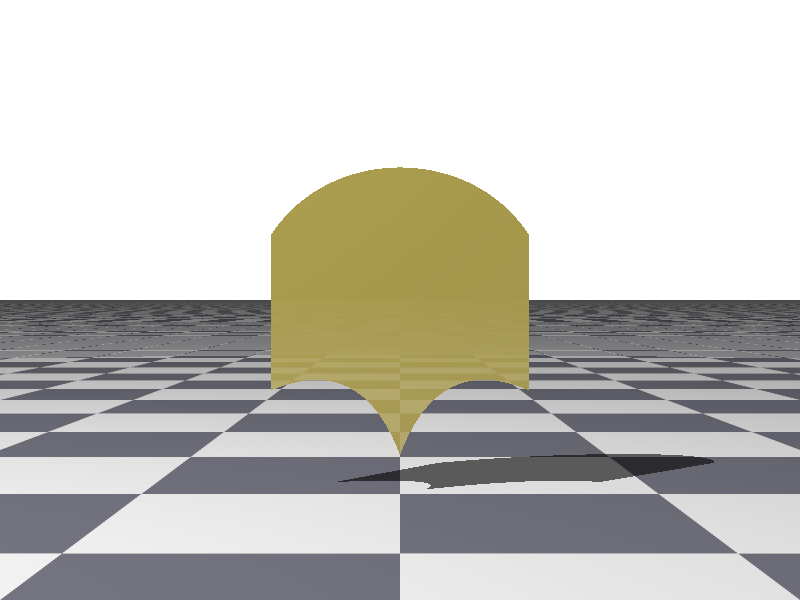
    </a></td>
    <td style="margin-left: 8px; margin-right: 8px; border: none; vertical-align: middle;">
      <a href="Local/shapes/generic-shape.igl">Generic Shape Test</a>
    </td>
  </tr>
  <tr style="border: none;">
    <td style="border: none;"><a href="Local/shapes/egg.png">
      
    </a></td>
    <td style="margin-left: 8px; margin-right: 8px; border: none; vertical-align: middle;">
      <a href="Local/shapes/egg.igl">Egg Test</a>
    </td>
  </tr>
  <tr style="border: none;">
    <td style="border: none;"><a href="Local/shapes/superellipsoid.png">
      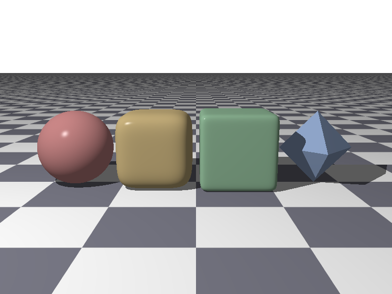
    </a></td>
    <td style="margin-left: 8px; margin-right: 8px; border: none; vertical-align: middle;">
      <a href="Local/shapes/superellipsoid.igl">Superellipsoid Test</a>
    </td>
  </tr>
  <tr style="border: none;">
    <td style="border: none;"><a href="Local/shapes/superellipsoid-concave.png">
      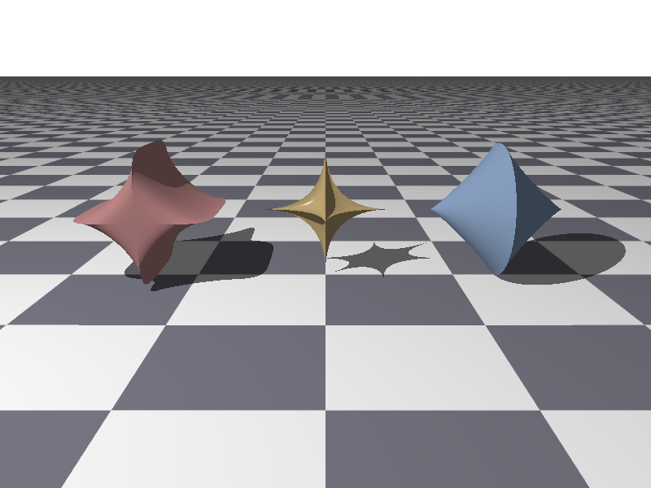
    </a></td>
    <td style="margin-left: 8px; margin-right: 8px; border: none; vertical-align: middle;">
      <a href="Local/shapes/superellipsoid-concave.igl">Superellipsoid Concave Shapes Test</a>
    </td>
  </tr>
  <tr style="border: none;">
    <td style="border: none;"><a href="Local/shapes/patch.png">
      
    </a></td>
    <td style="margin-left: 8px; margin-right: 8px; border: none; vertical-align: middle;">
      <a href="Local/shapes/patch.igl">Patch Test</a>
    </td>
  </tr>
  <tr style="border: none;">
    <td style="border: none;"><a href="Local/shapes/the-utah-teapot.png">
      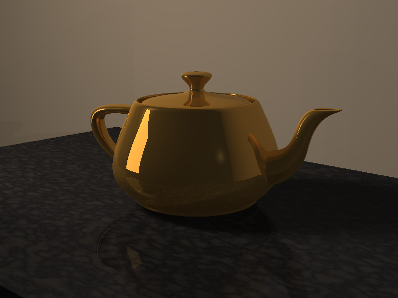
    </a></td>
    <td style="margin-left: 8px; margin-right: 8px; border: none; vertical-align: middle;">
      <a href="Local/shapes/the-utah-teapot.igl">The Utah Teapot</a>
    </td>
  </tr>
  <tr style="border: none;">
    <td style="border: none;"><a href="Local/shapes/what-a-dish-gathers.png">
      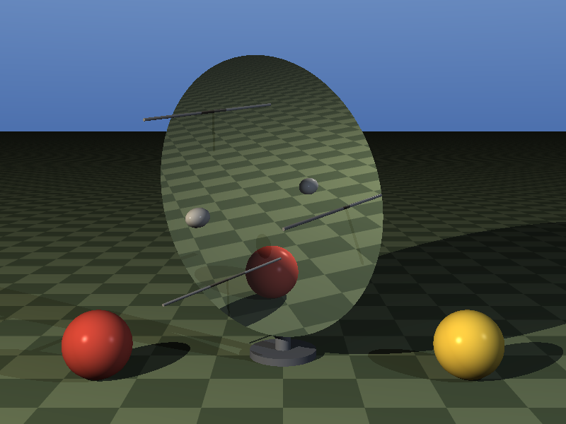
    </a></td>
    <td style="margin-left: 8px; margin-right: 8px; border: none; vertical-align: middle;">
      <a href="Local/shapes/what-a-dish-gathers.igl">What A Dish Gathers</a>
    </td>
  </tr>
  <tr style="border: none;">
    <td style="border: none;"><a href="Local/shapes/surfaces-of-the-second-degree.png">
      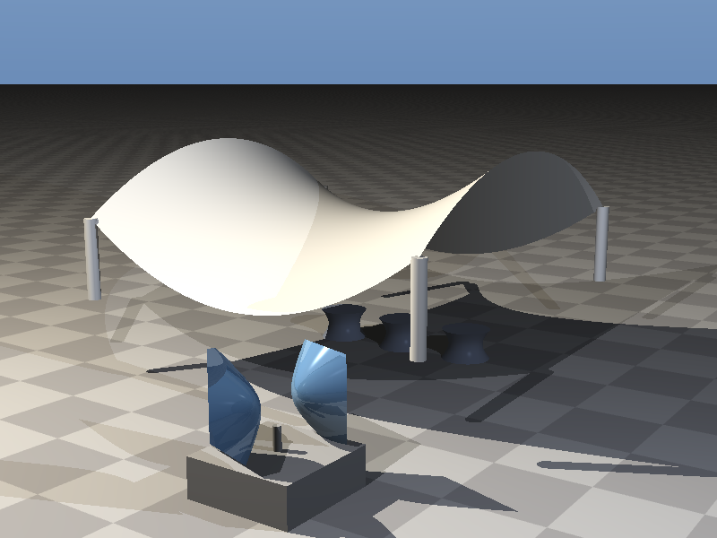
    </a></td>
    <td style="margin-left: 8px; margin-right: 8px; border: none; vertical-align: middle;">
      <a href="Local/shapes/surfaces-of-the-second-degree.igl">Surfaces Of The Second Degree</a>
    </td>
  </tr>
  <tr style="border: none;">
    <td style="border: none;"><a href="Local/shapes/every-line-of-it-is-straight.png">
      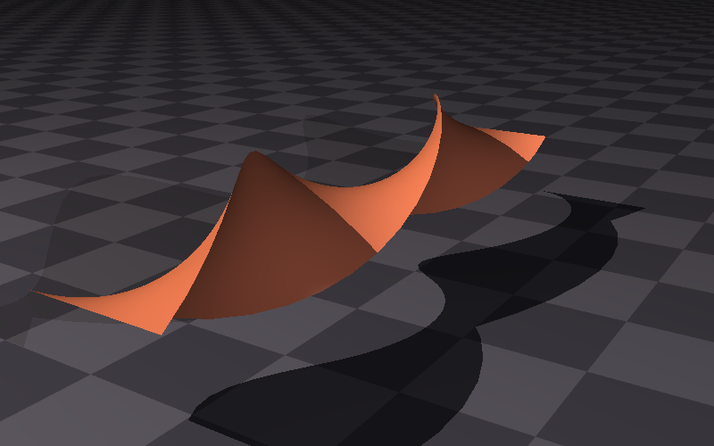
    </a></td>
    <td style="margin-left: 8px; margin-right: 8px; border: none; vertical-align: middle;">
      <a href="Local/shapes/every-line-of-it-is-straight.igl">Every Line Of It Is Straight</a>
    </td>
  </tr>
</table>

</details>

<details>
<summary><b>Blobs</b> &mdash; 3 images &middot; shapes that run into one another</summary>

<table style="width: 100%; border: none;">
  <tr style="border: none;">
    <td style="border: none;"><a href="Local/blobs/blob.png">
      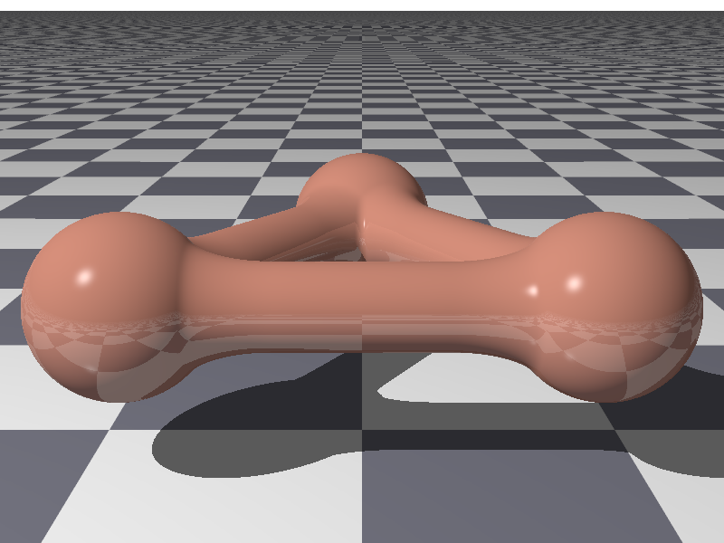
    </a></td>
    <td style="margin-left: 8px; margin-right: 8px; border: none; vertical-align: middle;">
      <a href="Local/blobs/blob.igl">Blob Test</a>
    </td>
  </tr>
  <tr style="border: none;">
    <td style="border: none;"><a href="Local/blobs/blob-negative-strength.png">
      
    </a></td>
    <td style="margin-left: 8px; margin-right: 8px; border: none; vertical-align: middle;">
      <a href="Local/blobs/blob-negative-strength.igl">Blob Negative Strength Test</a>
    </td>
  </tr>
  <tr style="border: none;">
    <td style="border: none;"><a href="Local/blobs/blob-components.png">
      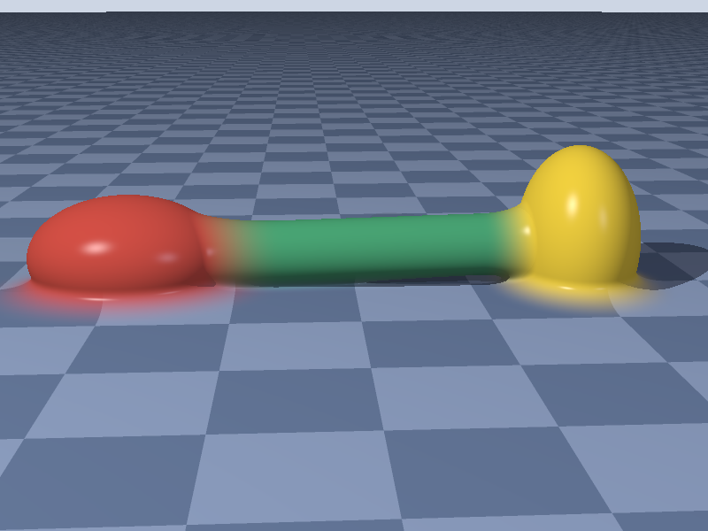
    </a></td>
    <td style="margin-left: 8px; margin-right: 8px; border: none; vertical-align: middle;">
      <a href="Local/blobs/blob-components.igl">Blob Components</a>
    </td>
  </tr>
</table>

</details>

<details>
<summary><b>Equations</b> &mdash; 5 images &middot; surfaces written down rather than assembled</summary>

<table style="width: 100%; border: none;">
  <tr style="border: none;">
    <td style="border: none;"><a href="Local/equations/isosurfaces.png">
      
    </a></td>
    <td style="margin-left: 8px; margin-right: 8px; border: none; vertical-align: middle;">
      <a href="Local/equations/isosurfaces.igl">Isosurfaces</a>
    </td>
  </tr>
  <tr style="border: none;">
    <td style="border: none;"><a href="Local/equations/isosurface-noise.png">
      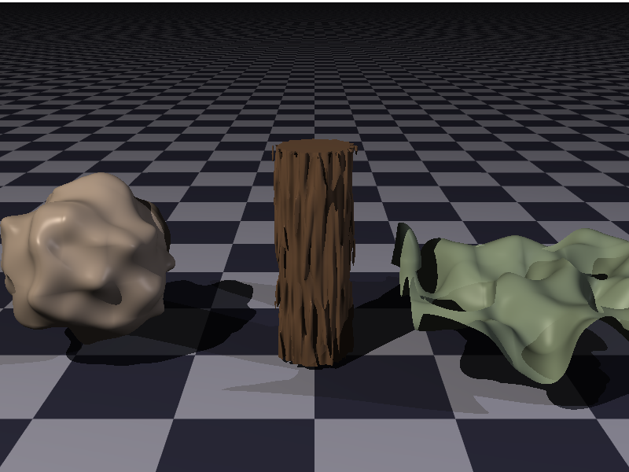
    </a></td>
    <td style="margin-left: 8px; margin-right: 8px; border: none; vertical-align: middle;">
      <a href="Local/equations/isosurface-noise.igl">Isosurfaces Made Rough With Noise</a>
    </td>
  </tr>
  <tr style="border: none;">
    <td style="border: none;"><a href="Local/equations/a-tour-over-the-surface.png">
      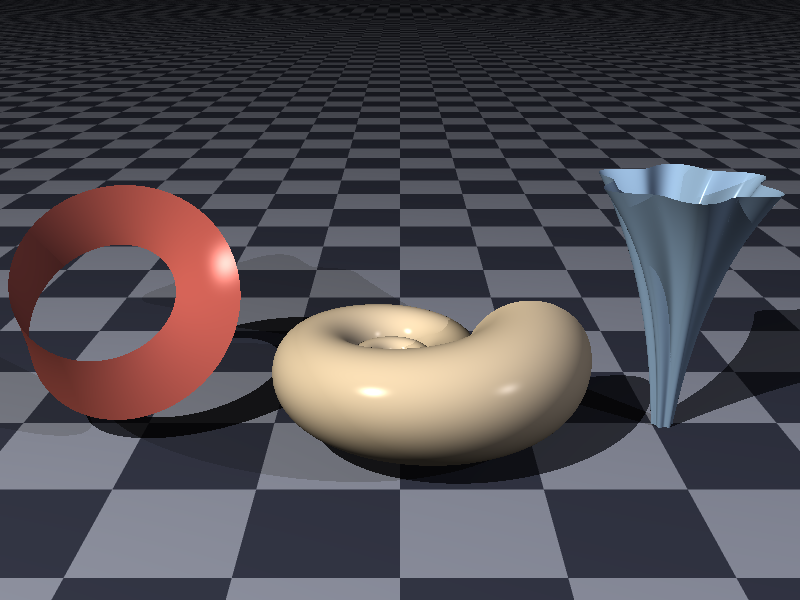
    </a></td>
    <td style="margin-left: 8px; margin-right: 8px; border: none; vertical-align: middle;">
      <a href="Local/equations/a-tour-over-the-surface.igl">A Tour Over The Surface</a>
    </td>
  </tr>
  <tr style="border: none;">
    <td style="border: none;"><a href="Local/equations/a-shape-with-no-equation.png">
      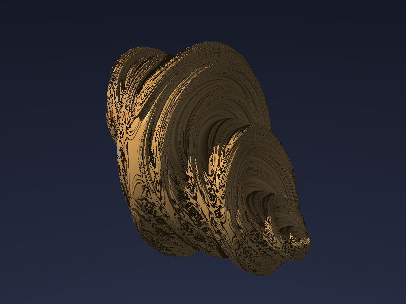
    </a></td>
    <td style="margin-left: 8px; margin-right: 8px; border: none; vertical-align: middle;">
      <a href="Local/equations/a-shape-with-no-equation.igl">A Shape With No Equation</a>
    </td>
  </tr>
  <tr style="border: none;">
    <td style="border: none;"><a href="Local/equations/every-shape-in-one-line.png">
      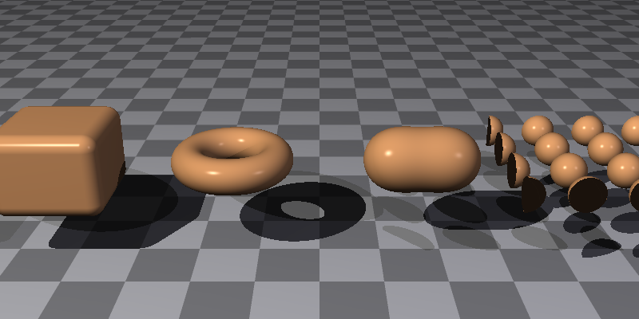
    </a></td>
    <td style="margin-left: 8px; margin-right: 8px; border: none; vertical-align: middle;">
      <a href="Local/equations/every-shape-in-one-line.igl">Every Shape In One Line</a>
    </td>
  </tr>
</table>

</details>

<details>
<summary><b>Terrain</b> &mdash; 5 images &middot; ground, drawn or described</summary>

<table style="width: 100%; border: none;">
  <tr style="border: none;">
    <td style="border: none;"><a href="Local/terrain/heightfield.png">
      
    </a></td>
    <td style="margin-left: 8px; margin-right: 8px; border: none; vertical-align: middle;">
      <a href="Local/terrain/heightfield.igl">Height Field Test</a>
    </td>
  </tr>
  <tr style="border: none;">
    <td style="border: none;"><a href="Local/terrain/dunes.png">
      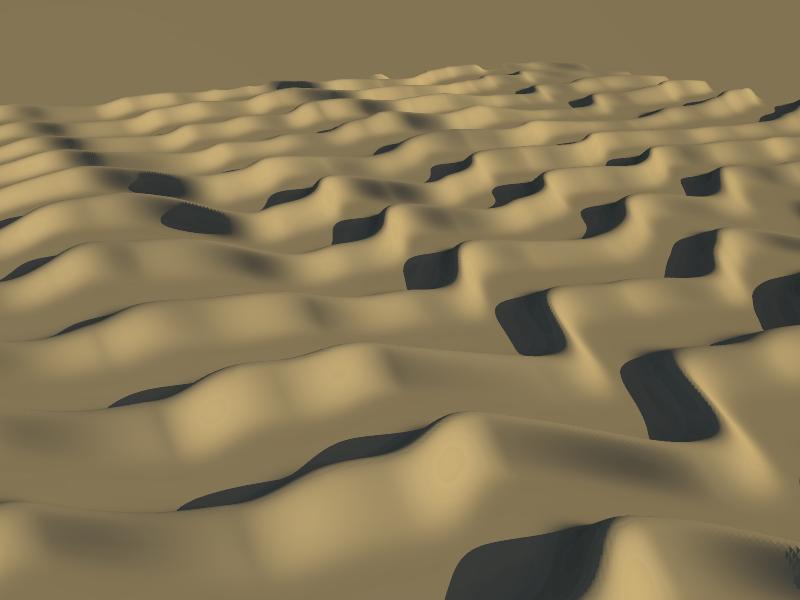
    </a></td>
    <td style="margin-left: 8px; margin-right: 8px; border: none; vertical-align: middle;">
      <a href="Local/terrain/dunes.igl">Dunes</a>
    </td>
  </tr>
  <tr style="border: none;">
    <td style="border: none;"><a href="Local/terrain/island.png">
      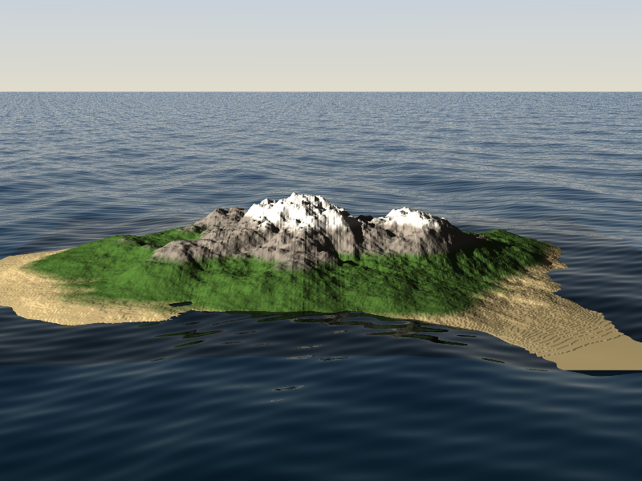
    </a></td>
    <td style="margin-left: 8px; margin-right: 8px; border: none; vertical-align: middle;">
      <a href="Local/terrain/island.igl">Island</a>
    </td>
  </tr>
  <tr style="border: none;">
    <td style="border: none;"><a href="Local/terrain/island-from-a-function.png">
      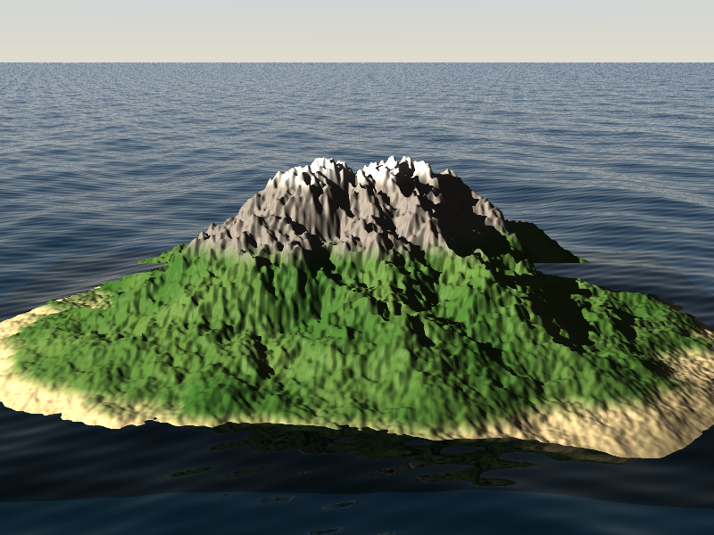
    </a></td>
    <td style="margin-left: 8px; margin-right: 8px; border: none; vertical-align: middle;">
      <a href="Local/terrain/island-from-a-function.igl">Island From A Function</a>
    </td>
  </tr>
  <tr style="border: none;">
    <td style="border: none;"><a href="Local/terrain/swells.png">
      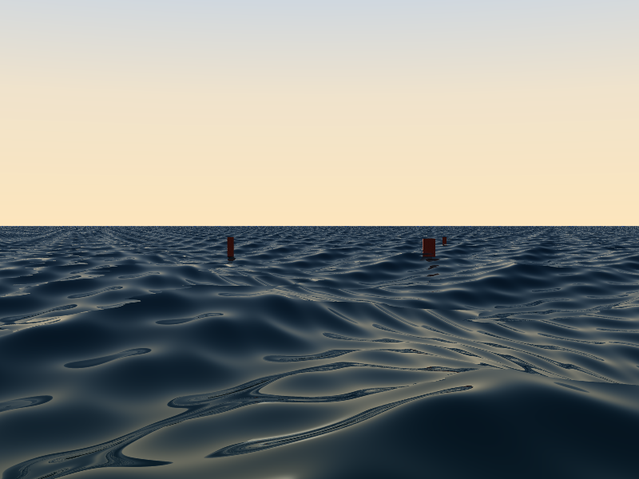
    </a></td>
    <td style="margin-left: 8px; margin-right: 8px; border: none; vertical-align: middle;">
      <a href="Local/terrain/swells.igl">Swells</a>
    </td>
  </tr>
</table>

</details>

<details>
<summary><b>Extrusions</b> &mdash; 7 images &middot; an outline given depth, or turned about an axis</summary>

<table style="width: 100%; border: none;">
  <tr style="border: none;">
    <td style="border: none;"><a href="Local/extrusions/extrusion.png">
      
    </a></td>
    <td style="margin-left: 8px; margin-right: 8px; border: none; vertical-align: middle;">
      <a href="Local/extrusions/extrusion.igl">Extrusion Test</a>
    </td>
  </tr>
  <tr style="border: none;">
    <td style="border: none;"><a href="Local/extrusions/extrusion2.png">
      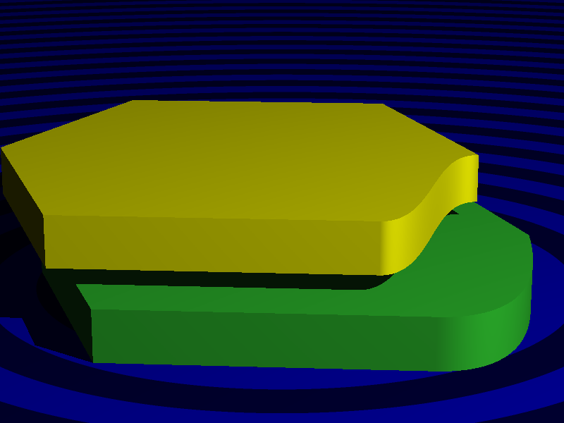
    </a></td>
    <td style="margin-left: 8px; margin-right: 8px; border: none; vertical-align: middle;">
      <a href="Local/extrusions/extrusion2.igl">Another Extrusion Test</a>
    </td>
  </tr>
  <tr style="border: none;">
    <td style="border: none;"><a href="Local/extrusions/lathe.png">
      
    </a></td>
    <td style="margin-left: 8px; margin-right: 8px; border: none; vertical-align: middle;">
      <a href="Local/extrusions/lathe.igl">Lathe Test</a>
    </td>
  </tr>
  <tr style="border: none;">
    <td style="border: none;"><a href="Local/extrusions/lathe-drinking-glass.png">
      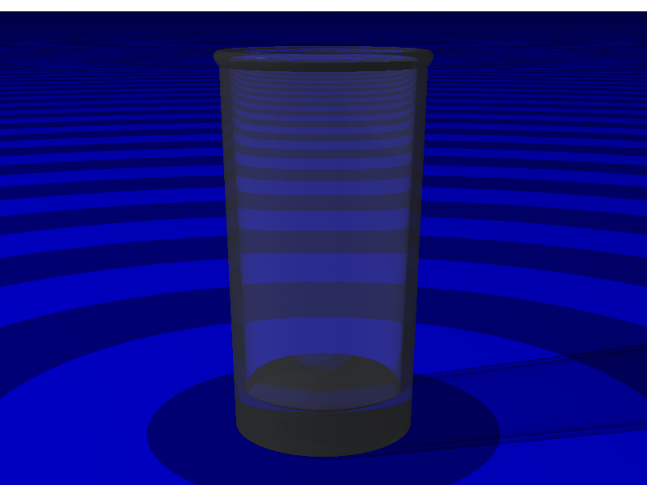
    </a></td>
    <td style="margin-left: 8px; margin-right: 8px; border: none; vertical-align: middle;">
      <a href="Local/extrusions/lathe-drinking-glass.igl">Lathe Drinking Glass Test</a>
    </td>
  </tr>
  <tr style="border: none;">
    <td style="border: none;"><a href="Local/extrusions/lathe-trophy.png">
      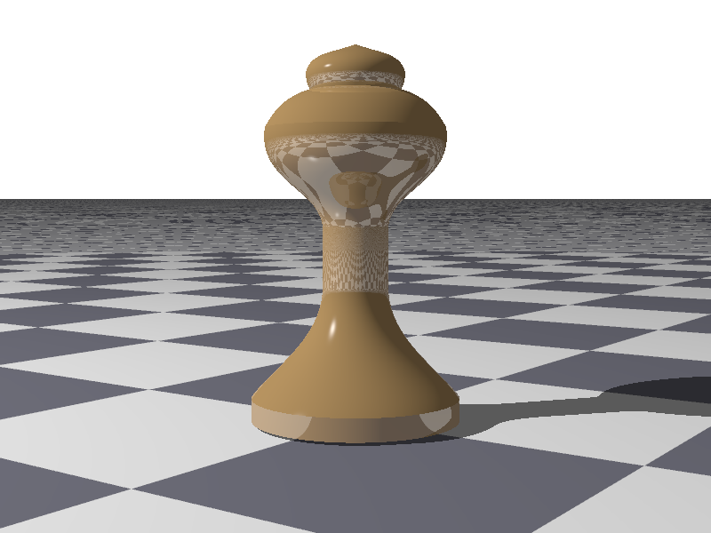
    </a></td>
    <td style="margin-left: 8px; margin-right: 8px; border: none; vertical-align: middle;">
      <a href="Local/extrusions/lathe-trophy.igl">Lathe Trophy Test</a>
    </td>
  </tr>
  <tr style="border: none;">
    <td style="border: none;"><a href="Local/extrusions/text-lathe.png">
      
    </a></td>
    <td style="margin-left: 8px; margin-right: 8px; border: none; vertical-align: middle;">
      <a href="Local/extrusions/text-lathe.igl">Text Lathe Test</a>
    </td>
  </tr>
  <tr style="border: none;">
    <td style="border: none;"><a href="Local/extrusions/nothing-runs-straight-up.png">
      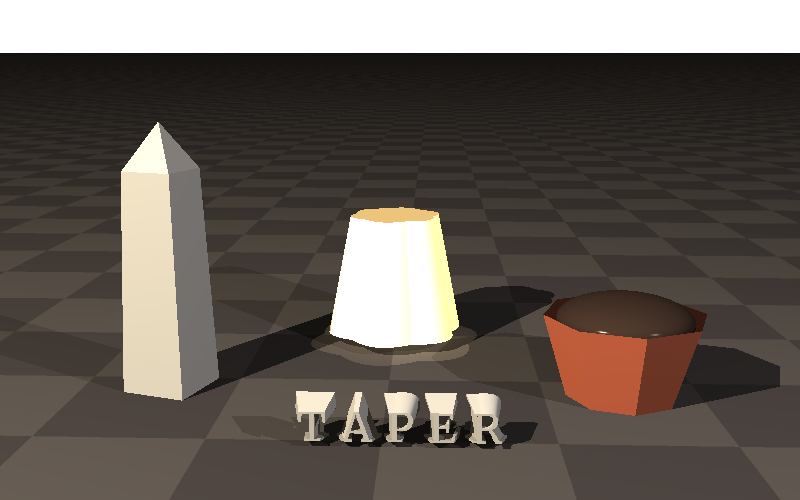
    </a></td>
    <td style="margin-left: 8px; margin-right: 8px; border: none; vertical-align: middle;">
      <a href="Local/extrusions/nothing-runs-straight-up.igl">Nothing Runs Straight Up</a>
    </td>
  </tr>
</table>

</details>

<details>
<summary><b>Paths</b> &mdash; 9 images &middot; outlines, icons, text, and what is swept along them</summary>

<table style="width: 100%; border: none;">
  <tr style="border: none;">
    <td style="border: none;"><a href="Local/paths/text.png">
      
    </a></td>
    <td style="margin-left: 8px; margin-right: 8px; border: none; vertical-align: middle;">
      <a href="Local/paths/text.igl">Text Solid Test</a>
    </td>
  </tr>
  <tr style="border: none;">
    <td style="border: none;"><a href="Local/paths/text-path.png">
      
    </a></td>
    <td style="margin-left: 8px; margin-right: 8px; border: none; vertical-align: middle;">
      <a href="Local/paths/text-path.igl">Text Path Test</a>
    </td>
  </tr>
  <tr style="border: none;">
    <td style="border: none;"><a href="Local/paths/power-cord.png">
      
    </a></td>
    <td style="margin-left: 8px; margin-right: 8px; border: none; vertical-align: middle;">
      <a href="Local/paths/power-cord.igl">Power Cord Test</a>
    </td>
  </tr>
  <tr style="border: none;">
    <td style="border: none;"><a href="Local/paths/sweep.png">
      
    </a></td>
    <td style="margin-left: 8px; margin-right: 8px; border: none; vertical-align: middle;">
      <a href="Local/paths/sweep.igl">Sweep Test</a>
    </td>
  </tr>
  <tr style="border: none;">
    <td style="border: none;"><a href="Local/paths/sweep-conduit.png">
      
    </a></td>
    <td style="margin-left: 8px; margin-right: 8px; border: none; vertical-align: middle;">
      <a href="Local/paths/sweep-conduit.igl">Sweep Conduit Test</a>
    </td>
  </tr>
  <tr style="border: none;">
    <td style="border: none;"><a href="Local/paths/sweep-side.png">
      
    </a></td>
    <td style="margin-left: 8px; margin-right: 8px; border: none; vertical-align: middle;">
      <a href="Local/paths/sweep-side.igl">Sweep Test (Side View)</a>
    </td>
  </tr>
  <tr style="border: none;">
    <td style="border: none;"><a href="Local/paths/sweep-scale.png">
      
    </a></td>
    <td style="margin-left: 8px; margin-right: 8px; border: none; vertical-align: middle;">
      <a href="Local/paths/sweep-scale.igl">Sweep Scale Test</a>
    </td>
  </tr>
  <tr style="border: none;">
    <td style="border: none;"><a href="Local/paths/icons.png">
      
    </a></td>
    <td style="margin-left: 8px; margin-right: 8px; border: none; vertical-align: middle;">
      <a href="Local/paths/icons.igl">FontAwesome Icons</a>
    </td>
  </tr>
  <tr style="border: none;">
    <td style="border: none;"><a href="Local/paths/icons-complex.png">
      
    </a></td>
    <td style="margin-left: 8px; margin-right: 8px; border: none; vertical-align: middle;">
      <a href="Local/paths/icons-complex.igl">FontAwesome Icons, the Intricate Ones</a>
    </td>
  </tr>
</table>

</details>

<details>
<summary><b>L-Systems</b> &mdash; 14 images &middot; plants and curves grown from rules</summary>

<table style="width: 100%; border: none;">
  <tr style="border: none;">
    <td style="border: none;"><a href="Local/l-systems/a-signal-along-a-filament.png">
      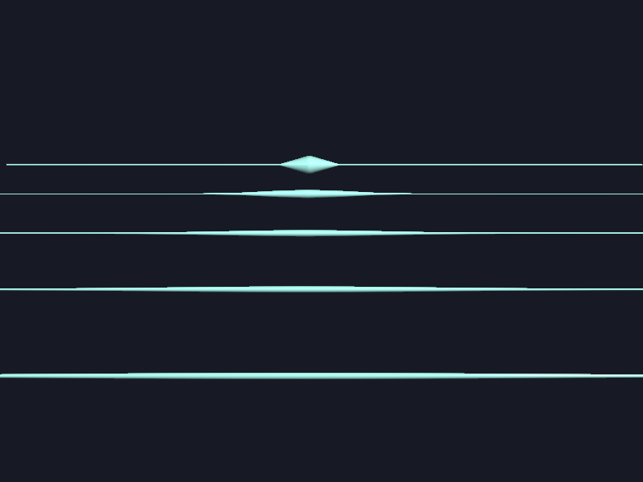
    </a></td>
    <td style="margin-left: 8px; margin-right: 8px; border: none; vertical-align: middle;">
      <a href="Local/l-systems/a-signal-along-a-filament.igl">A Signal Along a Filament</a>
    </td>
  </tr>
  <tr style="border: none;">
    <td style="border: none;"><a href="Local/l-systems/axial.png">
      
    </a></td>
    <td style="margin-left: 8px; margin-right: 8px; border: none; vertical-align: middle;">
      <a href="Local/l-systems/axial.igl">L-System Test: Axial Tree</a>
    </td>
  </tr>
  <tr style="border: none;">
    <td style="border: none;"><a href="Local/l-systems/berry-tree.png">
      
    </a></td>
    <td style="margin-left: 8px; margin-right: 8px; border: none; vertical-align: middle;">
      <a href="Local/l-systems/berry-tree.igl">L-System Test: Berry Tree</a>
    </td>
  </tr>
  <tr style="border: none;">
    <td style="border: none;"><a href="Local/l-systems/bending-under-weight.png">
      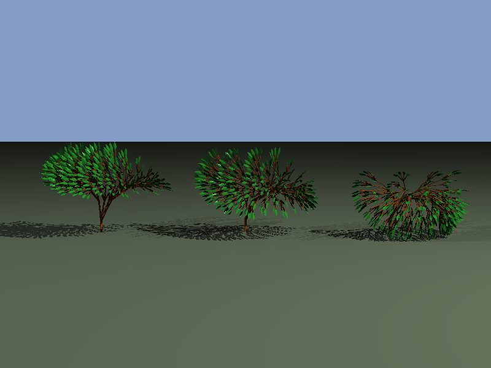
    </a></td>
    <td style="margin-left: 8px; margin-right: 8px; border: none; vertical-align: middle;">
      <a href="Local/l-systems/bending-under-weight.igl">Bending Under Weight</a>
    </td>
  </tr>
  <tr style="border: none;">
    <td style="border: none;"><a href="Local/l-systems/bush.png">
      
    </a></td>
    <td style="margin-left: 8px; margin-right: 8px; border: none; vertical-align: middle;">
      <a href="Local/l-systems/bush.igl">L-System Test: ABOP Bush</a>
    </td>
  </tr>
  <tr style="border: none;">
    <td style="border: none;"><a href="Local/l-systems/context-sensitive.png">
      
    </a></td>
    <td style="margin-left: 8px; margin-right: 8px; border: none; vertical-align: middle;">
      <a href="Local/l-systems/context-sensitive.igl">L-System Test: Context-Sensitive</a>
    </td>
  </tr>
  <tr style="border: none;">
    <td style="border: none;"><a href="Local/l-systems/fruit-tree.png">
      
    </a></td>
    <td style="margin-left: 8px; margin-right: 8px; border: none; vertical-align: middle;">
      <a href="Local/l-systems/fruit-tree.igl">L-System Test: Leaves and Fruit</a>
    </td>
  </tr>
  <tr style="border: none;">
    <td style="border: none;"><a href="Local/l-systems/materials.png">
      
    </a></td>
    <td style="margin-left: 8px; margin-right: 8px; border: none; vertical-align: middle;">
      <a href="Local/l-systems/materials.igl">L-System Test: Materials</a>
    </td>
  </tr>
  <tr style="border: none;">
    <td style="border: none;"><a href="Local/l-systems/lengths-that-are-not-whole.png">
      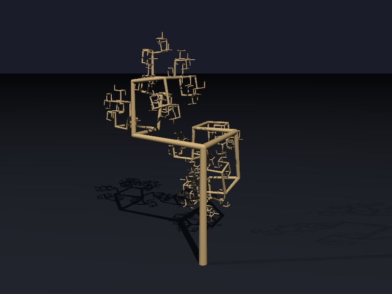
    </a></td>
    <td style="margin-left: 8px; margin-right: 8px; border: none; vertical-align: middle;">
      <a href="Local/l-systems/lengths-that-are-not-whole.igl">Lengths That Are Not Whole</a>
    </td>
  </tr>
  <tr style="border: none;">
    <td style="border: none;"><a href="Local/l-systems/hilbert.png">
      
    </a></td>
    <td style="margin-left: 8px; margin-right: 8px; border: none; vertical-align: middle;">
      <a href="Local/l-systems/hilbert.igl">L-System Test: Hilbert Curve</a>
    </td>
  </tr>
  <tr style="border: none;">
    <td style="border: none;"><a href="Local/l-systems/leaf-tree.png">
      
    </a></td>
    <td style="margin-left: 8px; margin-right: 8px; border: none; vertical-align: middle;">
      <a href="Local/l-systems/leaf-tree.igl">L-System Test: Leafy Tree</a>
    </td>
  </tr>
  <tr style="border: none;">
    <td style="border: none;"><a href="Local/l-systems/pipes-vs-tubes.png">
      
    </a></td>
    <td style="margin-left: 8px; margin-right: 8px; border: none; vertical-align: middle;">
      <a href="Local/l-systems/pipes-vs-tubes.igl">L-System Test: Pipes vs. Tubes</a>
    </td>
  </tr>
  <tr style="border: none;">
    <td style="border: none;"><a href="Local/l-systems/snowflake-2.png">
      
    </a></td>
    <td style="margin-left: 8px; margin-right: 8px; border: none; vertical-align: middle;">
      <a href="Local/l-systems/snowflake-2.igl">L-System Test: Snowflake Outline</a>
    </td>
  </tr>
  <tr style="border: none;">
    <td style="border: none;"><a href="Local/l-systems/snowflake.png">
      
    </a></td>
    <td style="margin-left: 8px; margin-right: 8px; border: none; vertical-align: middle;">
      <a href="Local/l-systems/snowflake.igl">L-System Test: Snowflake</a>
    </td>
  </tr>
</table>

</details>

<details>
<summary><b>Materials</b> &mdash; 7 images &middot; what a surface is made of</summary>

<table style="width: 100%; border: none;">
  <tr style="border: none;">
    <td style="border: none;"><a href="Local/materials/image-map.png">
      
    </a></td>
    <td style="margin-left: 8px; margin-right: 8px; border: none; vertical-align: middle;">
      <a href="Local/materials/image-map.igl">Spherical image pigment test</a>
    </td>
  </tr>
  <tr style="border: none;">
    <td style="border: none;"><a href="Local/materials/metallic.png">
      
    </a></td>
    <td style="margin-left: 8px; margin-right: 8px; border: none; vertical-align: middle;">
      <a href="Local/materials/metallic.igl">Metallic Material Test</a>
    </td>
  </tr>
  <tr style="border: none;">
    <td style="border: none;"><a href="Local/materials/noise.png">
      
    </a></td>
    <td style="margin-left: 8px; margin-right: 8px; border: none; vertical-align: middle;">
      <a href="Local/materials/noise.igl">Pigment Noise Test</a>
    </td>
  </tr>
  <tr style="border: none;">
    <td style="border: none;"><a href="Local/materials/stained-glass.png">
      
    </a></td>
    <td style="margin-left: 8px; margin-right: 8px; border: none; vertical-align: middle;">
      <a href="Local/materials/stained-glass.igl">Filtered Transparency Test</a>
    </td>
  </tr>
  <tr style="border: none;">
    <td style="border: none;"><a href="Local/materials/clarity.png">
      
    </a></td>
    <td style="margin-left: 8px; margin-right: 8px; border: none; vertical-align: middle;">
      <a href="Local/materials/clarity.igl">Clarity Test</a>
    </td>
  </tr>
  <tr style="border: none;">
    <td style="border: none;"><a href="Local/materials/finish.png">
      
    </a></td>
    <td style="margin-left: 8px; margin-right: 8px; border: none; vertical-align: middle;">
      <a href="Local/materials/finish.igl">Surface Finish Test</a>
    </td>
  </tr>
  <tr style="border: none;">
    <td style="border: none;"><a href="Local/materials/normals.png">
      
    </a></td>
    <td style="margin-left: 8px; margin-right: 8px; border: none; vertical-align: middle;">
      <a href="Local/materials/normals.igl">Normal Perturbation</a>
    </td>
  </tr>
</table>

</details>

<details>
<summary><b>Lights</b> &mdash; 5 images &middot; where the light comes from</summary>

<table style="width: 100%; border: none;">
  <tr style="border: none;">
    <td style="border: none;"><a href="Local/lights/lights.png">
      
    </a></td>
    <td style="margin-left: 8px; margin-right: 8px; border: none; vertical-align: middle;">
      <a href="Local/lights/lights.igl">Distant and Spot Lights</a>
    </td>
  </tr>
  <tr style="border: none;">
    <td style="border: none;"><a href="Local/lights/area-light.png">
      
    </a></td>
    <td style="margin-left: 8px; margin-right: 8px; border: none; vertical-align: middle;">
      <a href="Local/lights/area-light.igl">Area Light</a>
    </td>
  </tr>
  <tr style="border: none;">
    <td style="border: none;"><a href="Local/lights/sky-light.png">
      
    </a></td>
    <td style="margin-left: 8px; margin-right: 8px; border: none; vertical-align: middle;">
      <a href="Local/lights/sky-light.igl">A Sky Light</a>
    </td>
  </tr>
  <tr style="border: none;">
    <td style="border: none;"><a href="Local/lights/physical-sky.png">
      
    </a></td>
    <td style="margin-left: 8px; margin-right: 8px; border: none; vertical-align: middle;">
      <a href="Local/lights/physical-sky.igl">A Physical Sky</a>
    </td>
  </tr>
  <tr style="border: none;">
    <td style="border: none;"><a href="Local/lights/times-of-day.png">
      
    </a></td>
    <td style="margin-left: 8px; margin-right: 8px; border: none; vertical-align: middle;">
      <a href="Local/lights/times-of-day.igl">Times of Day</a>
    </td>
  </tr>
</table>

</details>

<details>
<summary><b>Media</b> &mdash; 7 images &middot; light in the air rather than on a surface</summary>

<table style="width: 100%; border: none;">
  <tr style="border: none;">
    <td style="border: none;"><a href="Local/media/medium.png">
      
    </a></td>
    <td style="margin-left: 8px; margin-right: 8px; border: none; vertical-align: middle;">
      <a href="Local/media/medium.igl">A Medium</a>
    </td>
  </tr>
  <tr style="border: none;">
    <td style="border: none;"><a href="Local/media/scattering.png">
      
    </a></td>
    <td style="margin-left: 8px; margin-right: 8px; border: none; vertical-align: middle;">
      <a href="Local/media/scattering.igl">Scattering</a>
    </td>
  </tr>
  <tr style="border: none;">
    <td style="border: none;"><a href="Local/media/density.png">
      
    </a></td>
    <td style="margin-left: 8px; margin-right: 8px; border: none; vertical-align: middle;">
      <a href="Local/media/density.igl">A Shaped Density</a>
    </td>
  </tr>
  <tr style="border: none;">
    <td style="border: none;"><a href="Local/media/multiple-scattering.png">
      
    </a></td>
    <td style="margin-left: 8px; margin-right: 8px; border: none; vertical-align: middle;">
      <a href="Local/media/multiple-scattering.igl">Multiple Scattering</a>
    </td>
  </tr>
  <tr style="border: none;">
    <td style="border: none;"><a href="Local/media/sunlit-cloud.png">
      
    </a></td>
    <td style="margin-left: 8px; margin-right: 8px; border: none; vertical-align: middle;">
      <a href="Local/media/sunlit-cloud.igl">A Sunlit Cloud</a>
    </td>
  </tr>
  <tr style="border: none;">
    <td style="border: none;"><a href="Local/media/pattern-density.png">
      
    </a></td>
    <td style="margin-left: 8px; margin-right: 8px; border: none; vertical-align: middle;">
      <a href="Local/media/pattern-density.igl">Densities From Patterns</a>
    </td>
  </tr>
  <tr style="border: none;">
    <td style="border: none;"><a href="Local/media/a-sea-with-weather-in-it.png">
      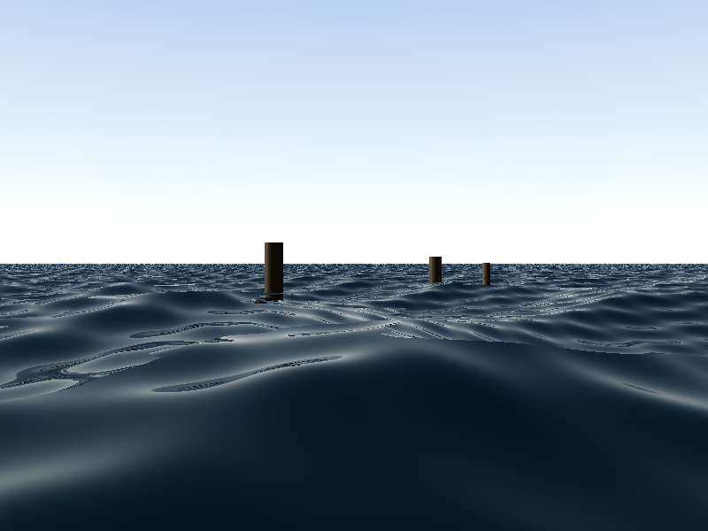
    </a></td>
    <td style="margin-left: 8px; margin-right: 8px; border: none; vertical-align: middle;">
      <a href="Local/media/a-sea-with-weather-in-it.igl">A Sea With Weather In It</a>
    </td>
  </tr>
</table>

</details>

<details>
<summary><b>Cameras</b> &mdash; 3 images &middot; how the picture is taken</summary>

<table style="width: 100%; border: none;">
  <tr style="border: none;">
    <td style="border: none;"><a href="Local/cameras/focal-blur.png">
      
    </a></td>
    <td style="margin-left: 8px; margin-right: 8px; border: none; vertical-align: middle;">
      <a href="Local/cameras/focal-blur.igl">Focal Blur</a>
    </td>
  </tr>
  <tr style="border: none;">
    <td style="border: none;"><a href="Local/cameras/motion-blur.png">
      
    </a></td>
    <td style="margin-left: 8px; margin-right: 8px; border: none; vertical-align: middle;">
      <a href="Local/cameras/motion-blur.igl">Motion Blur</a>
    </td>
  </tr>
  <tr style="border: none;">
    <td style="border: none;"><a href="Local/cameras/fisheye.png">
      
    </a></td>
    <td style="margin-left: 8px; margin-right: 8px; border: none; vertical-align: middle;">
      <a href="Local/cameras/fisheye.igl">Fisheye Camera</a>
    </td>
  </tr>
</table>

</details>

<details>
<summary><b>Scene Building</b> &mdash; 6 images &middot; the language's own ways of saying a thing once</summary>

<table style="width: 100%; border: none;">
  <tr style="border: none;">
    <td style="border: none;"><a href="Local/scene-building/the-hollow-square.png">
      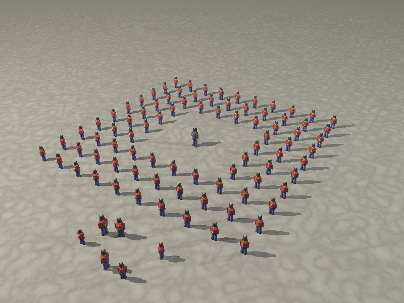
    </a></td>
    <td style="margin-left: 8px; margin-right: 8px; border: none; vertical-align: middle;">
      <a href="Local/scene-building/the-hollow-square.igl">The Hollow Square</a>
    </td>
  </tr>
  <tr style="border: none;">
    <td style="border: none;"><a href="Local/scene-building/two-numbers-and-a-room.png">
      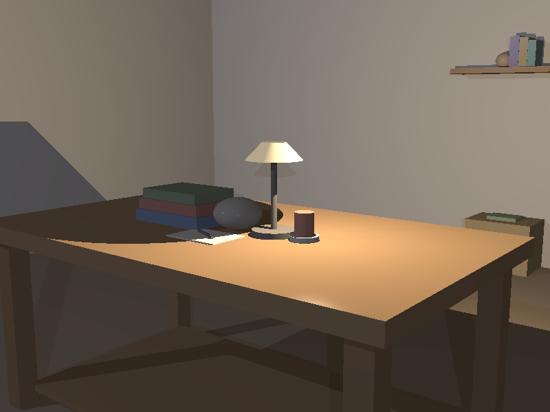
    </a></td>
    <td style="margin-left: 8px; margin-right: 8px; border: none; vertical-align: middle;">
      <a href="Local/scene-building/two-numbers-and-a-room.igl">Two Numbers and a Room</a>
    </td>
  </tr>
  <tr style="border: none;">
    <td style="border: none;"><a href="Local/scene-building/spiral-stair.png">
      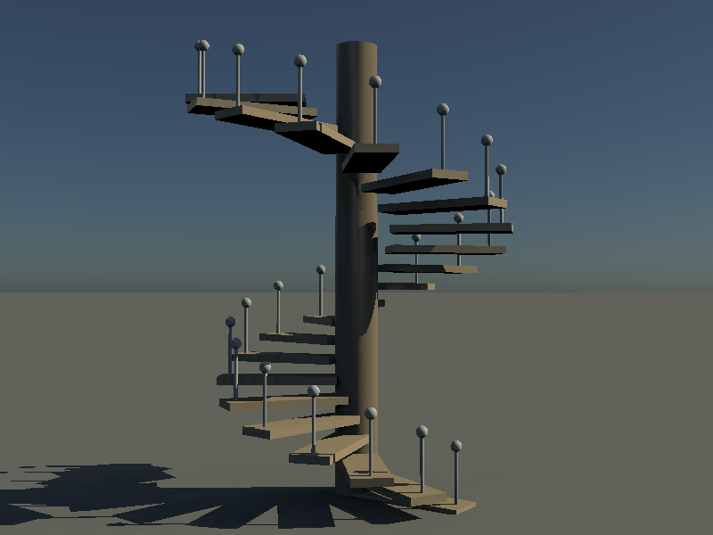
    </a></td>
    <td style="margin-left: 8px; margin-right: 8px; border: none; vertical-align: middle;">
      <a href="Local/scene-building/spiral-stair.igl">A Spiral Stair</a>
    </td>
  </tr>
  <tr style="border: none;">
    <td style="border: none;"><a href="Local/scene-building/shape-vocabulary.png">
      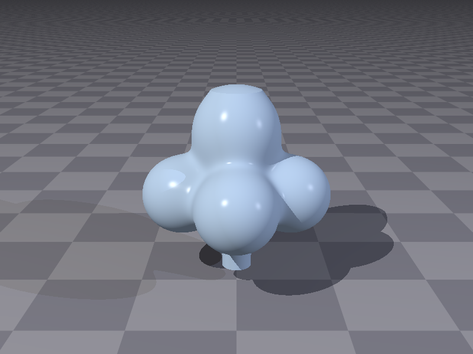
    </a></td>
    <td style="margin-left: 8px; margin-right: 8px; border: none; vertical-align: middle;">
      <a href="Local/scene-building/shape-vocabulary.igl">A Shape Vocabulary</a>
    </td>
  </tr>
  <tr style="border: none;">
    <td style="border: none;"><a href="Local/scene-building/recursive-trees.png">
      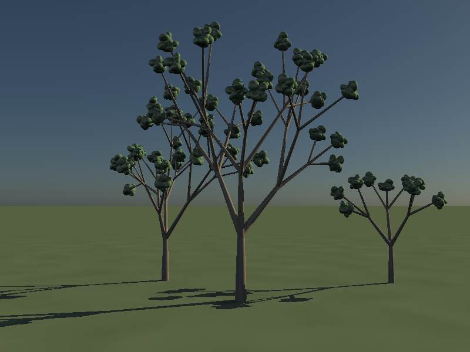
    </a></td>
    <td style="margin-left: 8px; margin-right: 8px; border: none; vertical-align: middle;">
      <a href="Local/scene-building/recursive-trees.igl">Recursive Trees</a>
    </td>
  </tr>
  <tr style="border: none;">
    <td style="border: none;"><a href="Local/scene-building/the-angle-a-plant-uses.png">
      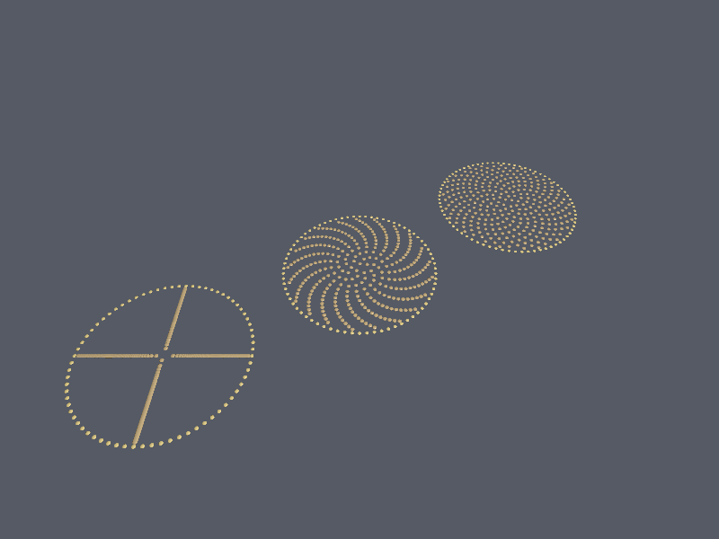
    </a></td>
    <td style="margin-left: 8px; margin-right: 8px; border: none; vertical-align: middle;">
      <a href="Local/scene-building/the-angle-a-plant-uses.igl">The Angle a Plant Uses</a>
    </td>
  </tr>
</table>

</details>

<details>
<summary><b>Towns</b> &mdash; 8 images &middot; streets, buildings, and what runs through them</summary>

<table style="width: 100%; border: none;">
  <tr style="border: none;">
    <td style="border: none;"><a href="Local/towns/a-block-of-buildings.png">
      
    </a></td>
    <td style="margin-left: 8px; margin-right: 8px; border: none; vertical-align: middle;">
      <a href="Local/towns/a-block-of-buildings.igl">A Block of Buildings</a>
    </td>
  </tr>
  <tr style="border: none;">
    <td style="border: none;"><a href="Local/towns/a-street-at-the-edge-of-town.png">
      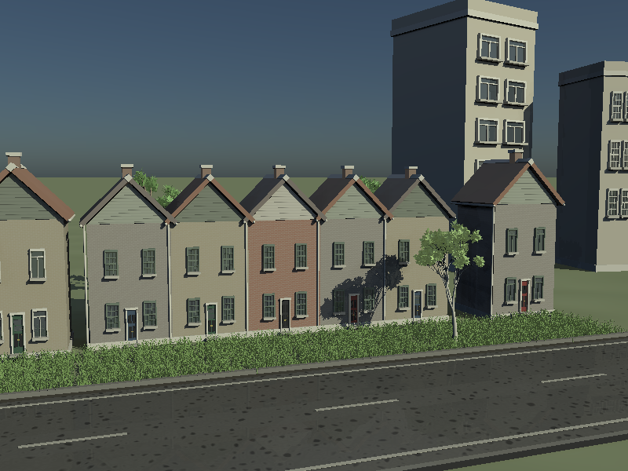
    </a></td>
    <td style="margin-left: 8px; margin-right: 8px; border: none; vertical-align: middle;">
      <a href="Local/towns/a-street-at-the-edge-of-town.igl">A Street at the Edge of Town</a>
    </td>
  </tr>
  <tr style="border: none;">
    <td style="border: none;"><a href="Local/towns/the-house-that-grew.png">
      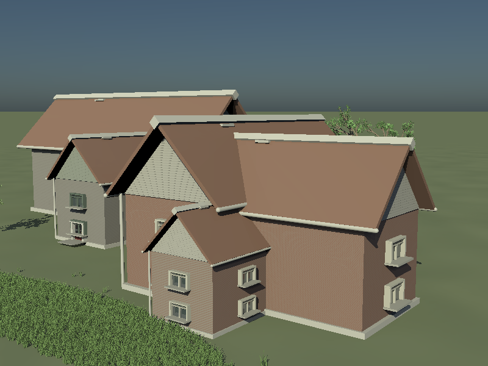
    </a></td>
    <td style="margin-left: 8px; margin-right: 8px; border: none; vertical-align: middle;">
      <a href="Local/towns/the-house-that-grew.igl">The House That Grew</a>
    </td>
  </tr>
  <tr style="border: none;">
    <td style="border: none;"><a href="Local/towns/a-road-through-town.png">
      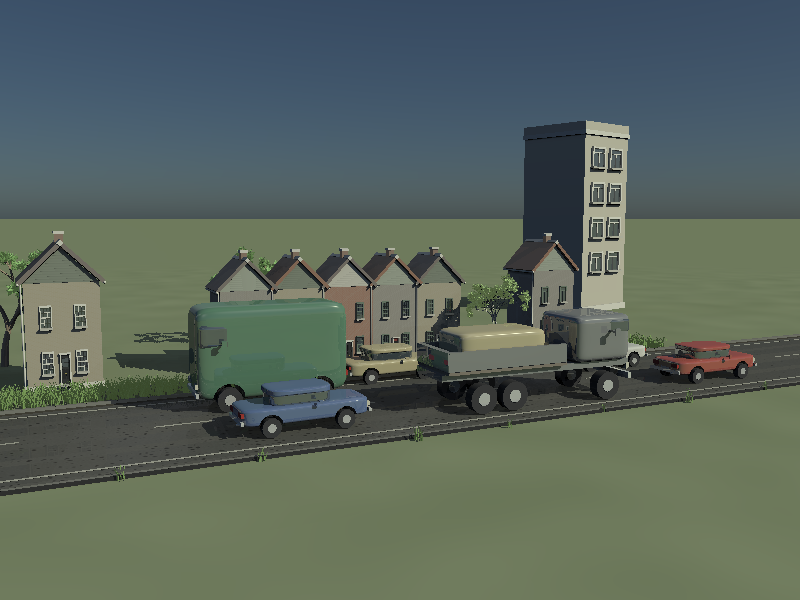
    </a></td>
    <td style="margin-left: 8px; margin-right: 8px; border: none; vertical-align: middle;">
      <a href="Local/towns/a-road-through-town.igl">A Road Through Town</a>
    </td>
  </tr>
  <tr style="border: none;">
    <td style="border: none;"><a href="Local/towns/a-street-after-dark.png">
      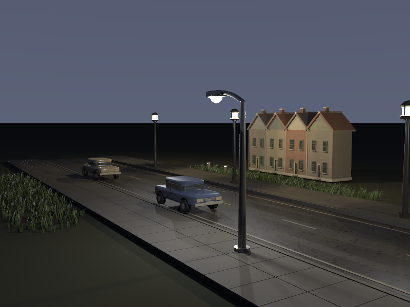
    </a></td>
    <td style="margin-left: 8px; margin-right: 8px; border: none; vertical-align: middle;">
      <a href="Local/towns/a-street-after-dark.igl">A Street After Dark</a>
    </td>
  </tr>
  <tr style="border: none;">
    <td style="border: none;"><a href="Local/towns/the-stop-on-the-corner.png">
      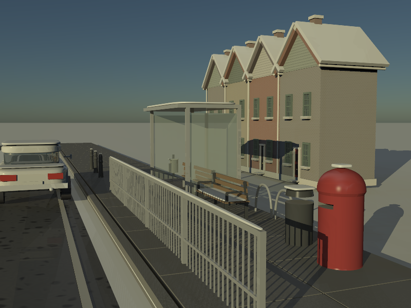
    </a></td>
    <td style="margin-left: 8px; margin-right: 8px; border: none; vertical-align: middle;">
      <a href="Local/towns/the-stop-on-the-corner.igl">The Stop on the Corner</a>
    </td>
  </tr>
  <tr style="border: none;">
    <td style="border: none;"><a href="Local/towns/where-four-roads-meet.png">
      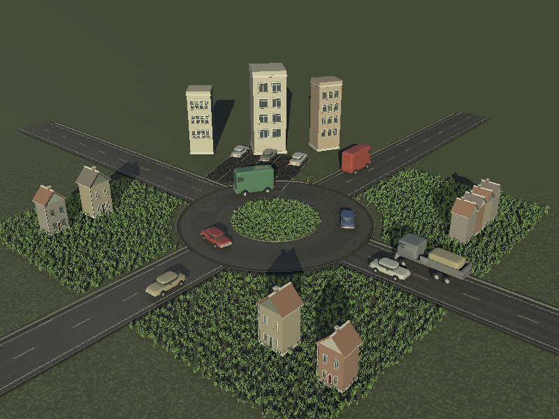
    </a></td>
    <td style="margin-left: 8px; margin-right: 8px; border: none; vertical-align: middle;">
      <a href="Local/towns/where-four-roads-meet.igl">Where Four Roads Meet</a>
    </td>
  </tr>
  <tr style="border: none;">
    <td style="border: none;"><a href="Local/towns/an-engine-on-the-line.png">
      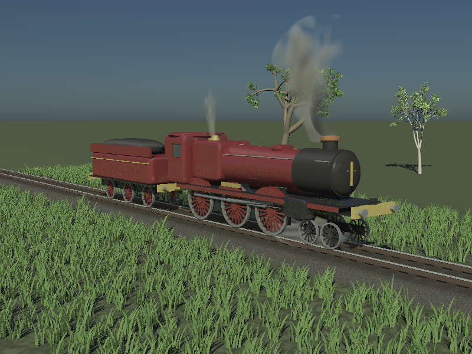
    </a></td>
    <td style="margin-left: 8px; margin-right: 8px; border: none; vertical-align: middle;">
      <a href="Local/towns/an-engine-on-the-line.igl">An Engine on the Line</a>
    </td>
  </tr>
</table>

</details>

<details>
<summary><b>Countryside</b> &mdash; 7 images &middot; trees, ground, weather and fire</summary>

<table style="width: 100%; border: none;">
  <tr style="border: none;">
    <td style="border: none;"><a href="Local/countryside/a-stand-of-trees.png">
      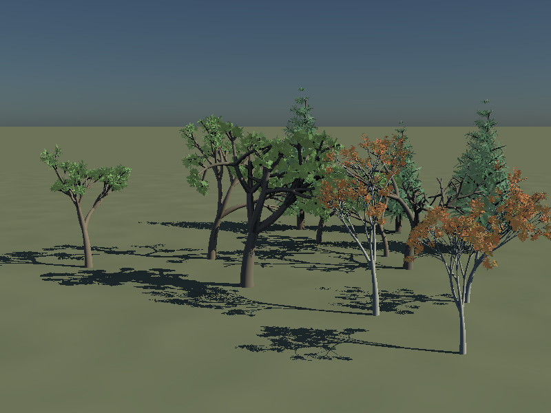
    </a></td>
    <td style="margin-left: 8px; margin-right: 8px; border: none; vertical-align: middle;">
      <a href="Local/countryside/a-stand-of-trees.igl">A Stand of Trees</a>
    </td>
  </tr>
  <tr style="border: none;">
    <td style="border: none;"><a href="Local/countryside/four-seasons.png">
      
    </a></td>
    <td style="margin-left: 8px; margin-right: 8px; border: none; vertical-align: middle;">
      <a href="Local/countryside/four-seasons.igl">Four Seasons</a>
    </td>
  </tr>
  <tr style="border: none;">
    <td style="border: none;"><a href="Local/countryside/a-corner-of-a-field.png">
      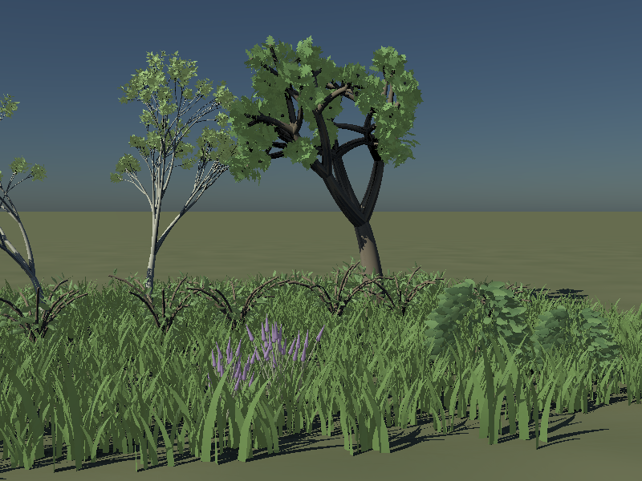
    </a></td>
    <td style="margin-left: 8px; margin-right: 8px; border: none; vertical-align: middle;">
      <a href="Local/countryside/a-corner-of-a-field.igl">A Corner of a Field</a>
    </td>
  </tr>
  <tr style="border: none;">
    <td style="border: none;"><a href="Local/countryside/a-stony-bank.png">
      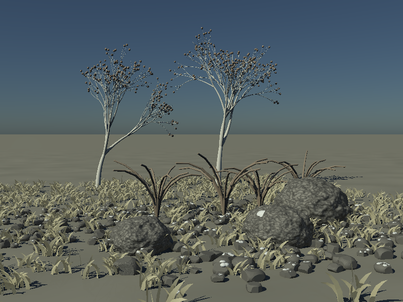
    </a></td>
    <td style="margin-left: 8px; margin-right: 8px; border: none; vertical-align: middle;">
      <a href="Local/countryside/a-stony-bank.igl">A Stony Bank</a>
    </td>
  </tr>
  <tr style="border: none;">
    <td style="border: none;"><a href="Local/countryside/a-fire-in-the-open.png">
      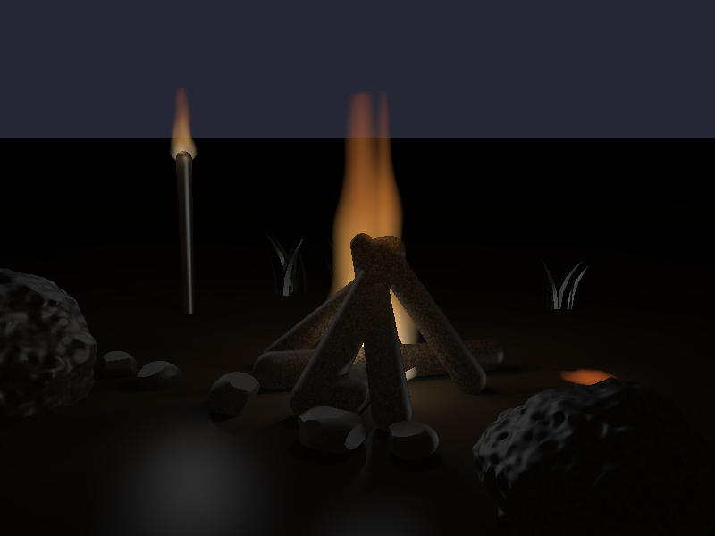
    </a></td>
    <td style="margin-left: 8px; margin-right: 8px; border: none; vertical-align: middle;">
      <a href="Local/countryside/a-fire-in-the-open.igl">A Fire in the Open</a>
    </td>
  </tr>
  <tr style="border: none;">
    <td style="border: none;"><a href="Local/countryside/the-wind-gets-into-everything.png">
      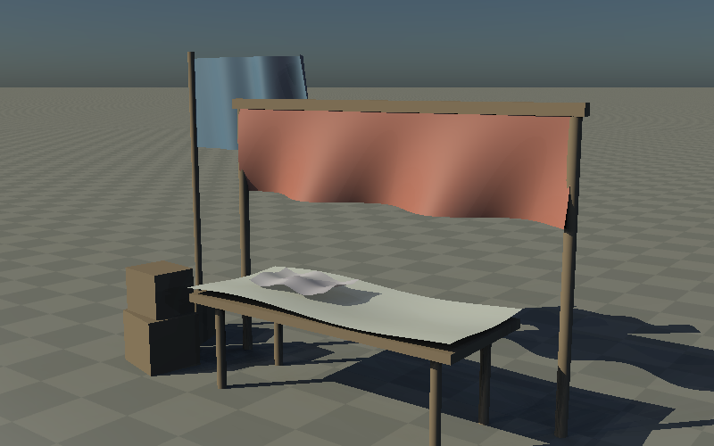
    </a></td>
    <td style="margin-left: 8px; margin-right: 8px; border: none; vertical-align: middle;">
      <a href="Local/countryside/the-wind-gets-into-everything.igl">The Wind Gets Into Everything</a>
    </td>
  </tr>
  <tr style="border: none;">
    <td style="border: none;"><a href="Local/countryside/bare-wood.png">
      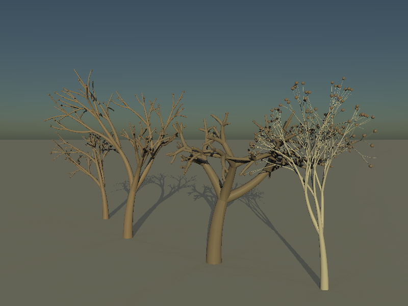
    </a></td>
    <td style="margin-left: 8px; margin-right: 8px; border: none; vertical-align: middle;">
      <a href="Local/countryside/bare-wood.igl">Bare Wood</a>
    </td>
  </tr>
</table>

</details>

<details>
<summary><b>Interiors</b> &mdash; 3 images &middot; rooms, and light indoors</summary>

<table style="width: 100%; border: none;">
  <tr style="border: none;">
    <td style="border: none;"><a href="Local/interiors/candle.png">
      
    </a></td>
    <td style="margin-left: 8px; margin-right: 8px; border: none; vertical-align: middle;">
      <a href="Local/interiors/candle.igl">A Candle</a>
    </td>
  </tr>
  <tr style="border: none;">
    <td style="border: none;"><a href="Local/interiors/candle-by-its-own-light.png">
      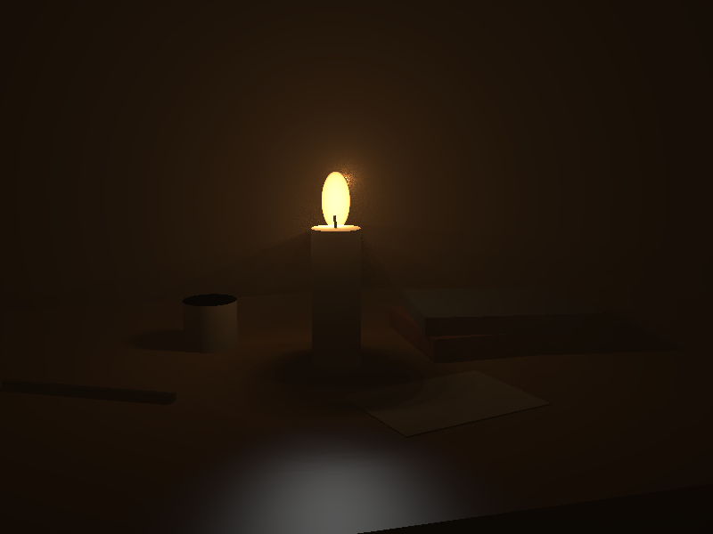
    </a></td>
    <td style="margin-left: 8px; margin-right: 8px; border: none; vertical-align: middle;">
      <a href="Local/interiors/candle-by-its-own-light.igl">A Candle by Its Own Light</a>
    </td>
  </tr>
  <tr style="border: none;">
    <td style="border: none;"><a href="Local/interiors/a-room-after-dark.png">
      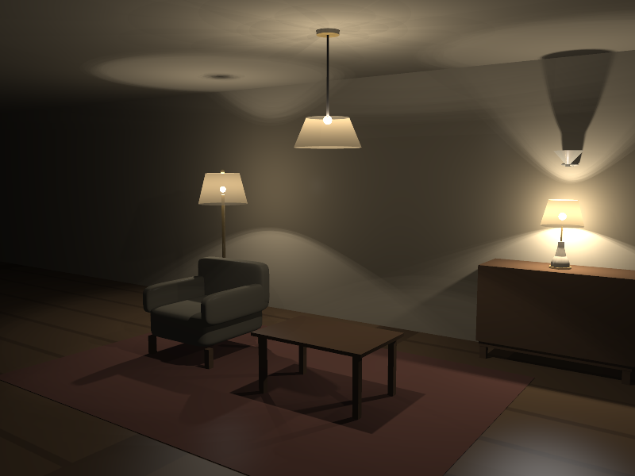
    </a></td>
    <td style="margin-left: 8px; margin-right: 8px; border: none; vertical-align: middle;">
      <a href="Local/interiors/a-room-after-dark.igl">A Room After Dark</a>
    </td>
  </tr>
</table>

</details>

<details>
<summary><b>Solar System</b> &mdash; 3 images &middot; planets dressed in photographs</summary>

<table style="width: 100%; border: none;">
  <tr style="border: none;">
    <td style="border: none;"><a href="Local/solar-system/all.png">
      
    </a></td>
    <td style="margin-left: 8px; margin-right: 8px; border: none; vertical-align: middle;">
      <a href="Local/solar-system/all.igl">The Planets</a>
    </td>
  </tr>
  <tr style="border: none;">
    <td style="border: none;"><a href="Local/solar-system/inner.png">
      
    </a></td>
    <td style="margin-left: 8px; margin-right: 8px; border: none; vertical-align: middle;">
      <a href="Local/solar-system/inner.igl">The Inner Planets</a>
    </td>
  </tr>
  <tr style="border: none;">
    <td style="border: none;"><a href="Local/solar-system/outer.png">
      
    </a></td>
    <td style="margin-left: 8px; margin-right: 8px; border: none; vertical-align: middle;">
      <a href="Local/solar-system/outer.igl">The Outer Planets</a>
    </td>
  </tr>
</table>

</details>


</details>

<details>
<summary><b>Ported from POV-Ray</b> &mdash; 2 images</summary>

<table style="width: 100%; border: none;">
  <tr style="border: none;">
    <td style="border: none;"><a href="POVRay/first.png">
      
    </a></td>
    <td style="margin-left: 8px; margin-right: 8px; border: none; vertical-align: middle;">
      <a href="POVRay/first.igl">The First Image</a>
    </td>
  </tr>
  <tr style="border: none;">
    <td style="border: none;"><a href="POVRay/library-textures.png">
      
    </a></td>
    <td style="margin-left: 8px; margin-right: 8px; border: none; vertical-align: middle;">
      <a href="POVRay/library-textures.igl">POV-Ray Library Textures</a>
    </td>
  </tr>
</table>

</details>

## Re-rendering these

Every scene here renders its own picture from its own file, at its own size and with whatever
antialiasing it needs — so bringing the whole gallery back up to date takes no options and no
list of which scene wants what:

```bash
for scene in $(find gallery -name '*.igl'); do
    picture="${scene%.igl}.png"
    [ -f "$picture" ] || continue
    dotnet run -- -i "$scene" -o "/tmp/$(basename "$picture")" \
        && mv "/tmp/$(basename "$picture")" "$picture"
done
```

It renders to a scratch path and moves the result into place deliberately: a render that fails
part way must not leave a tracked picture truncated or missing.  Expect roughly an hour for the
lot on an idle machine, most of it `a-street-after-dark`.

Nothing checks these for staleness — that would mean rendering them all — so run this after any
change to how things are drawn.  Re-rendering alters a picture's *bytes* even when no pixel
moves, because the scene's `info` block is written into the file, so commit only the ones whose
pixels actually changed.
