## Gallery of images

All the images collected from the parts of the gallery are shown below.  Clicking on each
thumbnail will show the full-sized image.  Clicking the image title will show the source
`.igl` file that generated it.

### Ray Tracer Challenge Book

<table style="width: 100%; border: none;">
  <tr style="border: none;">
    <td style="border: none;"><a href="challenge-book/chapter-6/black.png">
      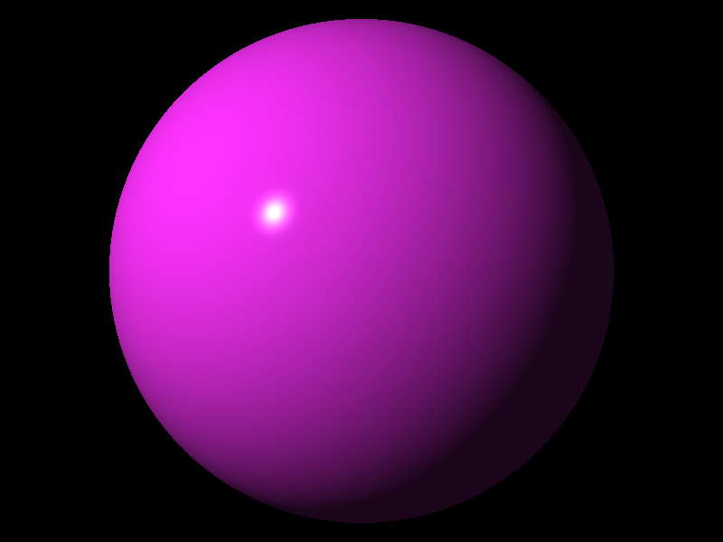
    </a></td>
    <td style="margin-left: 8px; margin-right: 8px; border: none; vertical-align: middle;">
      <a href="challenge-book/chapter-6/black.igl">Basic Sphere, Black Background</a>
    </td>
  </tr>
  <tr style="border: none;">
    <td style="border: none;"><a href="challenge-book/chapter-6/transparent.png">
      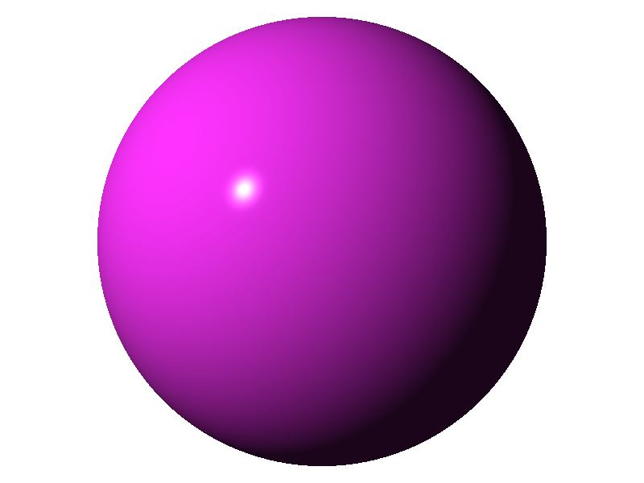
    </a></td>
    <td style="margin-left: 8px; margin-right: 8px; border: none; vertical-align: middle;">
      <a href="challenge-book/chapter-6/transparent.igl">Basic Sphere, Transparent Background</a>
    </td>
  </tr>
  <tr style="border: none;">
    <td style="border: none;"><a href="challenge-book/chapter-7/no-shadows.png">
      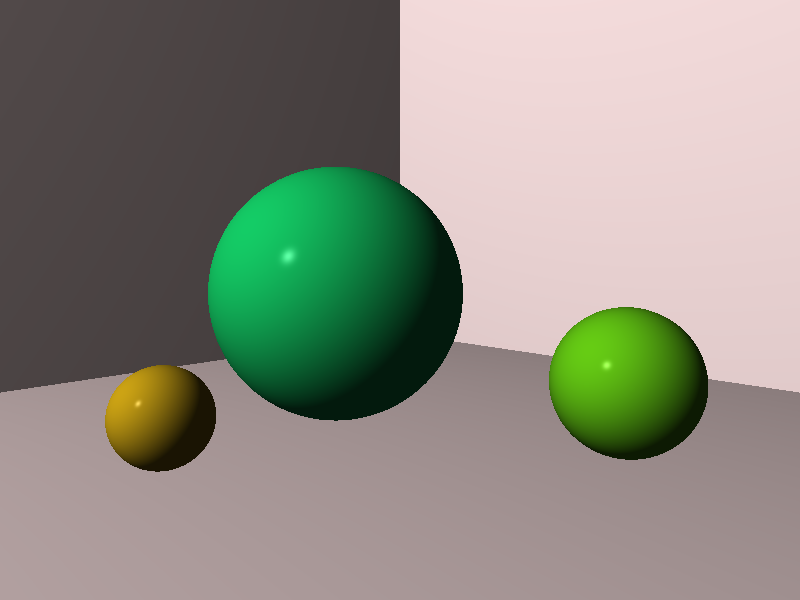
    </a></td>
    <td style="margin-left: 8px; margin-right: 8px; border: none; vertical-align: middle;">
      <a href="challenge-book/chapter-7/no-shadows.igl">Spheres in a Box, No Shadows</a>
    </td>
  </tr>
  <tr style="border: none;">
    <td style="border: none;"><a href="challenge-book/chapter-8/shadows.png">
      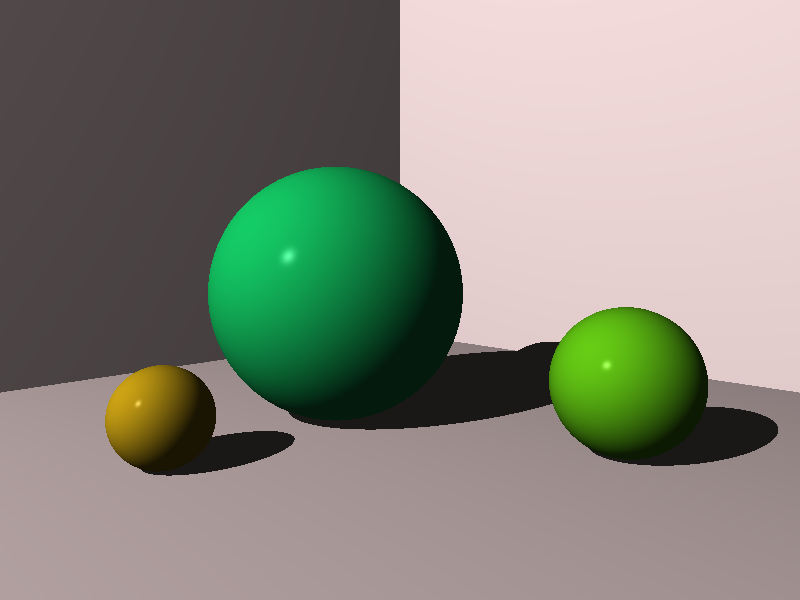
    </a></td>
    <td style="margin-left: 8px; margin-right: 8px; border: none; vertical-align: middle;">
      <a href="challenge-book/chapter-8/shadows.igl">Spheres in a Box, Shadows</a>
    </td>
  </tr>
  <tr style="border: none;">
    <td style="border: none;"><a href="challenge-book/chapter-9/floor.png">
      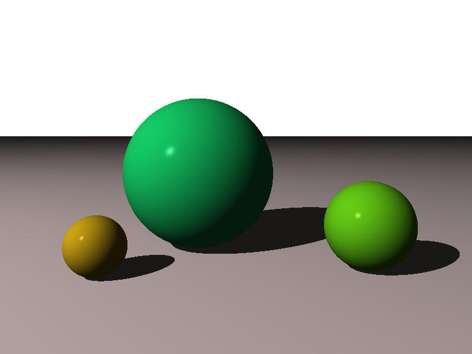
    </a></td>
    <td style="margin-left: 8px; margin-right: 8px; border: none; vertical-align: middle;">
      <a href="challenge-book/chapter-9/floor.igl">Spheres on the Floor</a>
    </td>
  </tr>
  <tr style="border: none;">
    <td style="border: none;"><a href="challenge-book/chapter-10/blend.png">
      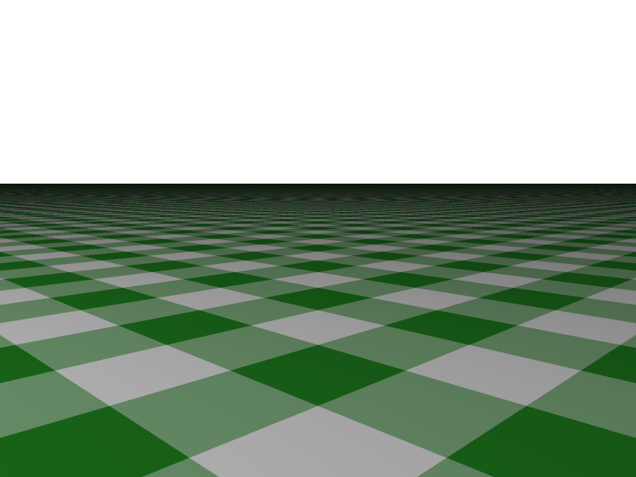
    </a></td>
    <td style="margin-left: 8px; margin-right: 8px; border: none; vertical-align: middle;">
      <a href="challenge-book/chapter-10/blend.igl">Blended Patterns</a>
    </td>
  </tr>
  <tr style="border: none;">
    <td style="border: none;"><a href="challenge-book/chapter-10/gradients.png">
      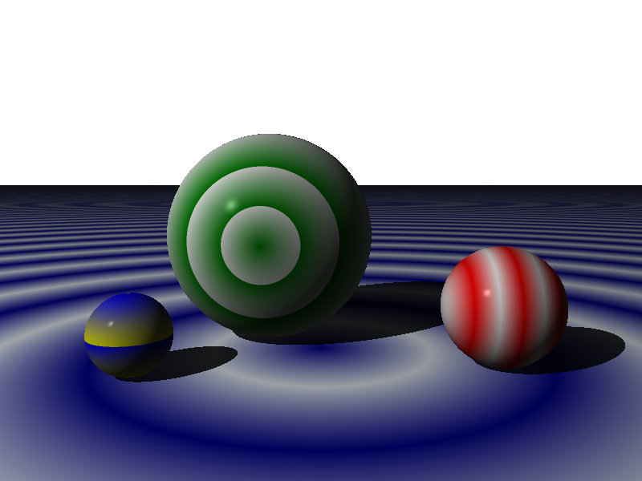
    </a></td>
    <td style="margin-left: 8px; margin-right: 8px; border: none; vertical-align: middle;">
      <a href="challenge-book/chapter-10/gradients.igl">Things with Gradients</a>
    </td>
  </tr>
  <tr style="border: none;">
    <td style="border: none;"><a href="challenge-book/chapter-10/patterns.png">
      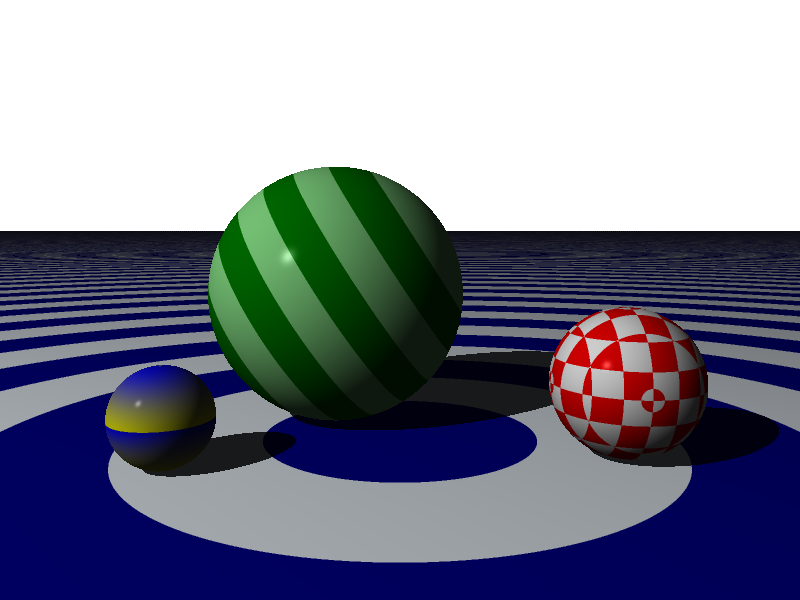
    </a></td>
    <td style="margin-left: 8px; margin-right: 8px; border: none; vertical-align: middle;">
      <a href="challenge-book/chapter-10/patterns.igl">Things with Basic Patterns</a>
    </td>
  </tr>
  <tr style="border: none;">
    <td style="border: none;"><a href="challenge-book/chapter-10/patterns2.png">
      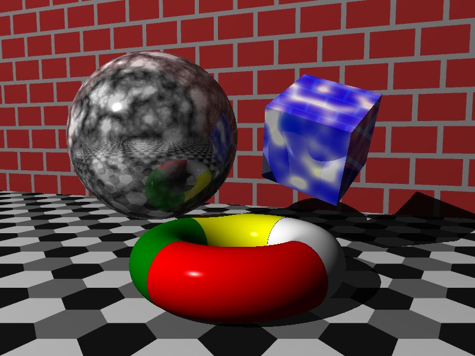
    </a></td>
    <td style="margin-left: 8px; margin-right: 8px; border: none; vertical-align: middle;">
      <a href="challenge-book/chapter-10/patterns2.igl">Showing More Patterns</a>
    </td>
  </tr>
  <tr style="border: none;">
    <td style="border: none;"><a href="challenge-book/chapter-10/patterns3.png">
      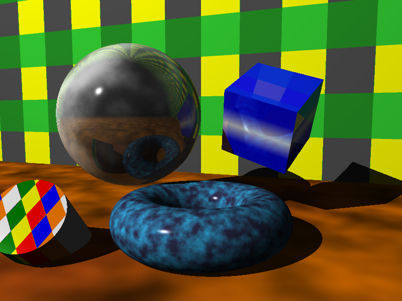
    </a></td>
    <td style="margin-left: 8px; margin-right: 8px; border: none; vertical-align: middle;">
      <a href="challenge-book/chapter-10/patterns3.igl">Showing Even More Patterns</a>
    </td>
  </tr>
  <tr style="border: none;">
    <td style="border: none;"><a href="challenge-book/chapter-10/patterns4.png">
      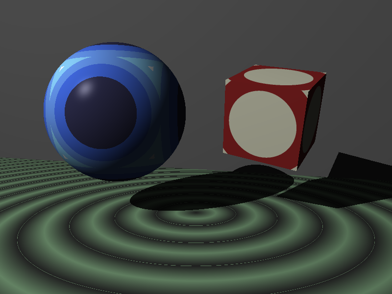
    </a></td>
    <td style="margin-left: 8px; margin-right: 8px; border: none; vertical-align: middle;">
      <a href="challenge-book/chapter-10/patterns4.igl">The Solid Shape Patterns</a>
    </td>
  </tr>
  <tr style="border: none;">
    <td style="border: none;"><a href="challenge-book/chapter-10/patterns5.png">
      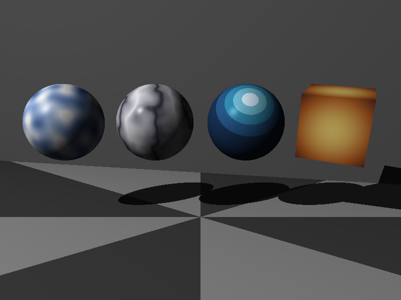
    </a></td>
    <td style="margin-left: 8px; margin-right: 8px; border: none; vertical-align: middle;">
      <a href="challenge-book/chapter-10/patterns5.igl">Bozo, Marble and the Angular Patterns</a>
    </td>
  </tr>
  <tr style="border: none;">
    <td style="border: none;"><a href="challenge-book/chapter-10/crackle.png">
      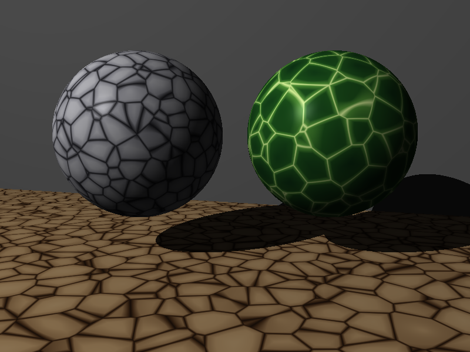
    </a></td>
    <td style="margin-left: 8px; margin-right: 8px; border: none; vertical-align: middle;">
      <a href="challenge-book/chapter-10/crackle.igl">The Crackle Pattern</a>
    </td>
  </tr>
  <tr style="border: none;">
    <td style="border: none;"><a href="challenge-book/chapter-10/wood.png">
      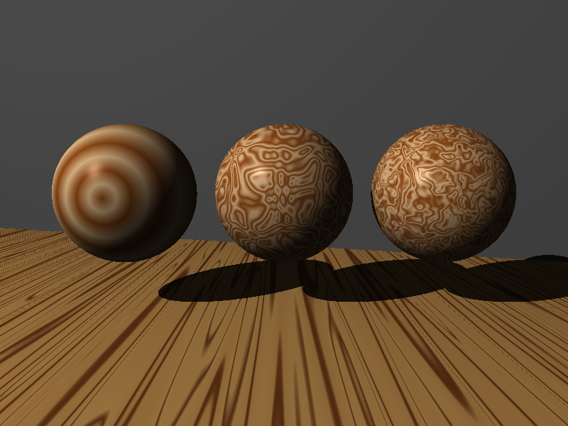
    </a></td>
    <td style="margin-left: 8px; margin-right: 8px; border: none; vertical-align: middle;">
      <a href="challenge-book/chapter-10/wood.igl">The Wood Pattern</a>
    </td>
  </tr>
  <tr style="border: none;">
    <td style="border: none;"><a href="challenge-book/chapter-10/planet.png">
      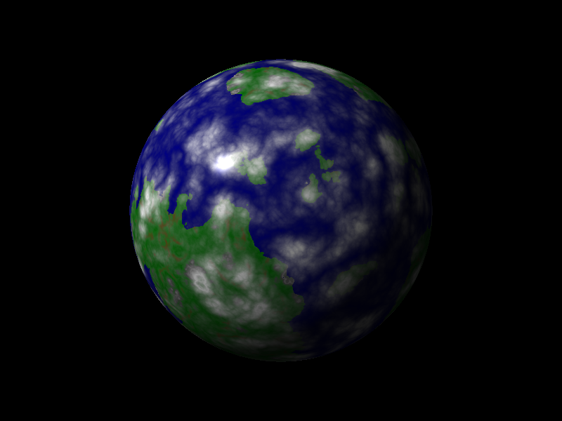
    </a></td>
    <td style="margin-left: 8px; margin-right: 8px; border: none; vertical-align: middle;">
      <a href="challenge-book/chapter-10/planet.igl">A Planet</a>
    </td>
  </tr>
  <tr style="border: none;">
    <td style="border: none;"><a href="challenge-book/chapter-10/stripes.png">
      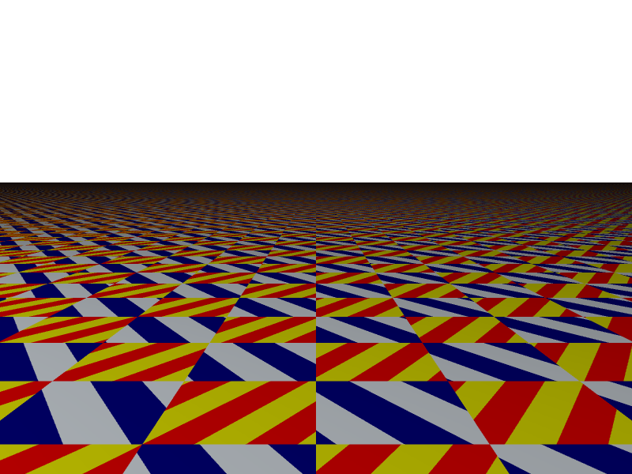
    </a></td>
    <td style="margin-left: 8px; margin-right: 8px; border: none; vertical-align: middle;">
      <a href="challenge-book/chapter-10/stripes.igl">A Floor with Nested Striping</a>
    </td>
  </tr>
  <tr style="border: none;">
    <td style="border: none;"><a href="challenge-book/chapter-11/lake.png">
      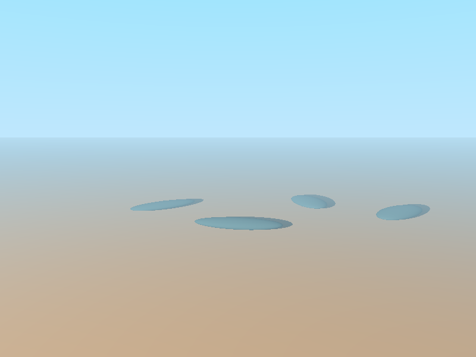
    </a></td>
    <td style="margin-left: 8px; margin-right: 8px; border: none; vertical-align: middle;">
      <a href="challenge-book/chapter-11/lake.igl">A Lake, Kind of</a>
    </td>
  </tr>
  <tr style="border: none;">
    <td style="border: none;"><a href="challenge-book/chapter-11/reflections.png">
      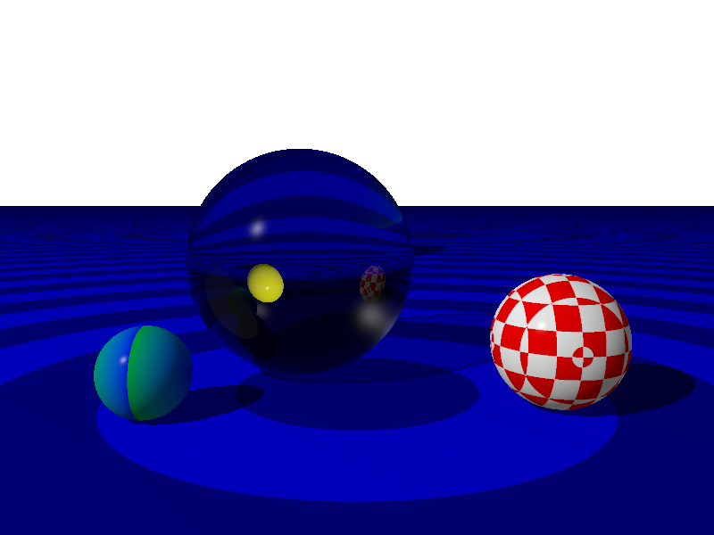
    </a></td>
    <td style="margin-left: 8px; margin-right: 8px; border: none; vertical-align: middle;">
      <a href="challenge-book/chapter-11/reflections.igl">Glassy Reflections</a>
    </td>
  </tr>
  <tr style="border: none;">
    <td style="border: none;"><a href="challenge-book/chapter-12/cube.png">
      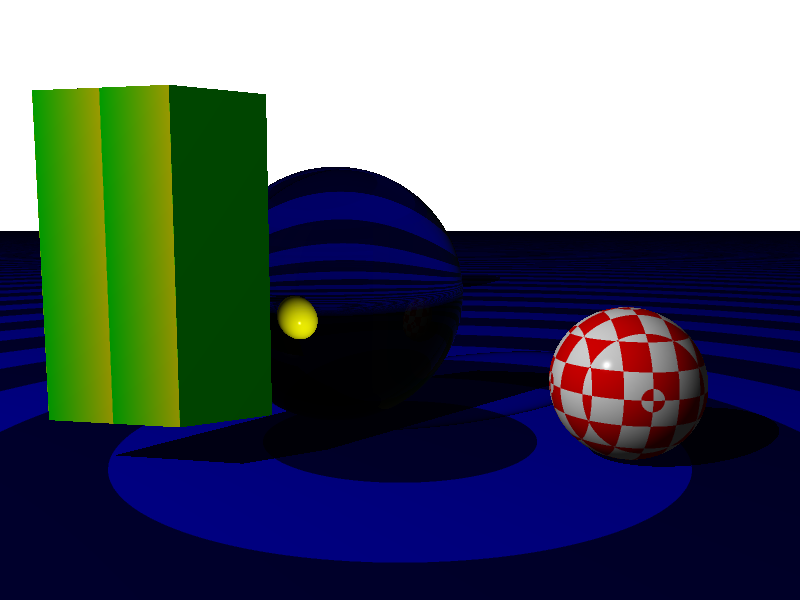
    </a></td>
    <td style="margin-left: 8px; margin-right: 8px; border: none; vertical-align: middle;">
      <a href="challenge-book/chapter-12/cube.igl">Rectangular Solids</a>
    </td>
  </tr>
  <tr style="border: none;">
    <td style="border: none;"><a href="challenge-book/chapter-12/room.png">
      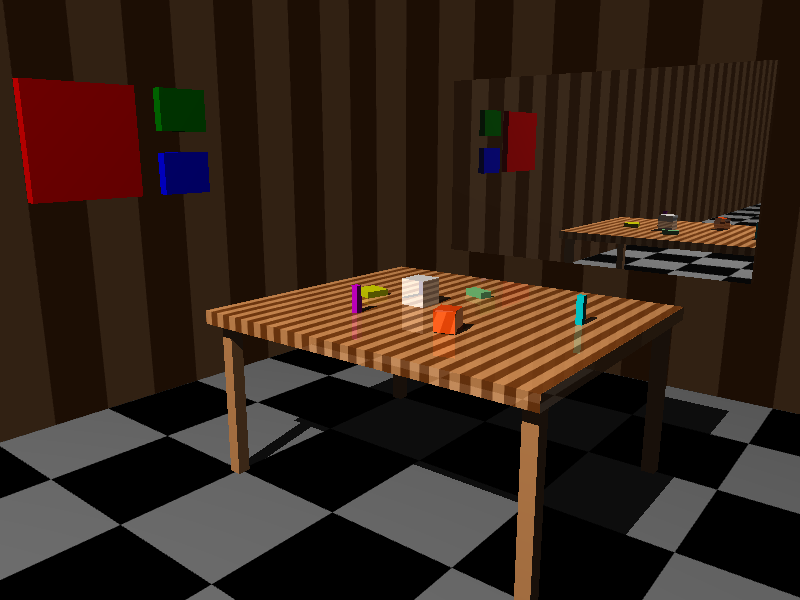
    </a></td>
    <td style="margin-left: 8px; margin-right: 8px; border: none; vertical-align: middle;">
      <a href="challenge-book/chapter-12/room.igl">A Room with a Mirror, All Rectangular Solids</a>
    </td>
  </tr>
  <tr style="border: none;">
    <td style="border: none;"><a href="challenge-book/chapter-13/circulars.png">
      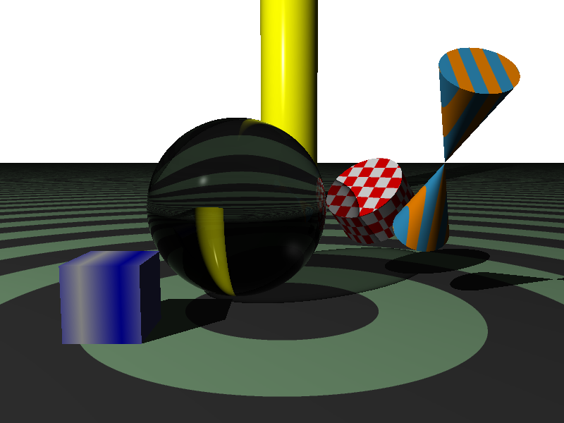
    </a></td>
    <td style="margin-left: 8px; margin-right: 8px; border: none; vertical-align: middle;">
      <a href="challenge-book/chapter-13/circulars.igl">Cylinders and Conics</a>
    </td>
  </tr>
  <tr style="border: none;">
    <td style="border: none;"><a href="challenge-book/chapter-14/hex.png">
      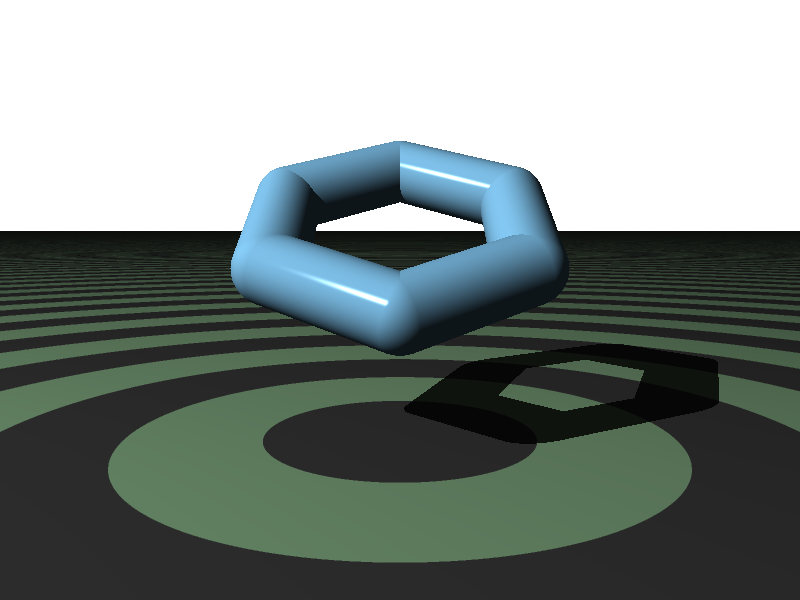
    </a></td>
    <td style="margin-left: 8px; margin-right: 8px; border: none; vertical-align: middle;">
      <a href="challenge-book/chapter-14/hex.igl">Hexagon from a Repeating Group</a>
    </td>
  </tr>
  <tr style="border: none;">
    <td style="border: none;"><a href="challenge-book/chapter-14/pointy-thing.png">
      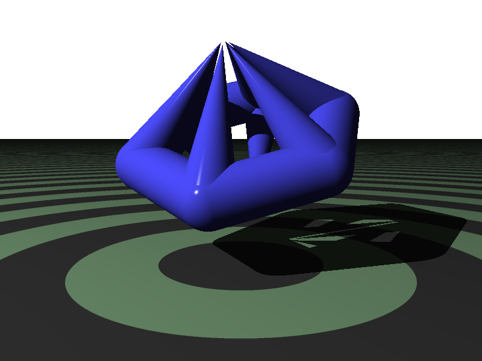
    </a></td>
    <td style="margin-left: 8px; margin-right: 8px; border: none; vertical-align: middle;">
      <a href="challenge-book/chapter-14/pointy-thing.igl">A Pointy Thing</a>
    </td>
  </tr>
  <tr style="border: none;">
    <td style="border: none;"><a href="challenge-book/chapter-15/object-file-no-normals.png">
      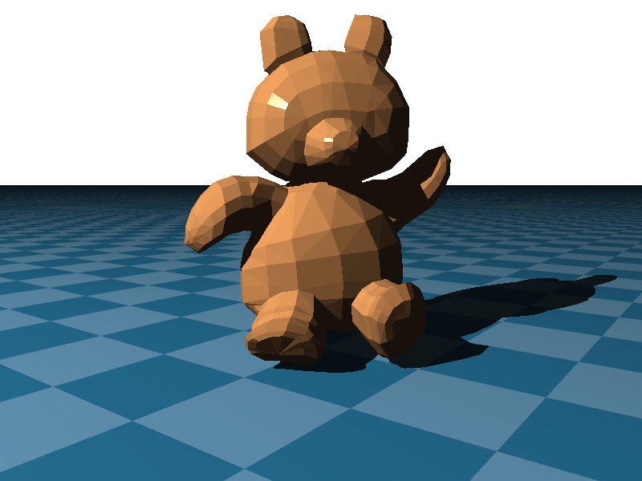
    </a></td>
    <td style="margin-left: 8px; margin-right: 8px; border: none; vertical-align: middle;">
      <a href="challenge-book/chapter-15/object-file-no-normals.igl">A Simple Teddy Bear</a>
    </td>
  </tr>
  <tr style="border: none;">
    <td style="border: none;"><a href="challenge-book/chapter-15/object-file-with-normals.png">
      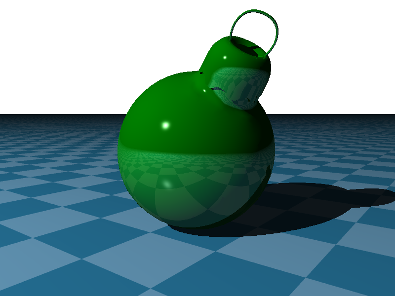
    </a></td>
    <td style="margin-left: 8px; margin-right: 8px; border: none; vertical-align: middle;">
      <a href="challenge-book/chapter-15/object-file-with-normals.igl">A Christmas Tree Ornament</a>
    </td>
  </tr>
  <tr style="border: none;">
    <td style="border: none;"><a href="challenge-book/chapter-15/parallelogram.png">
      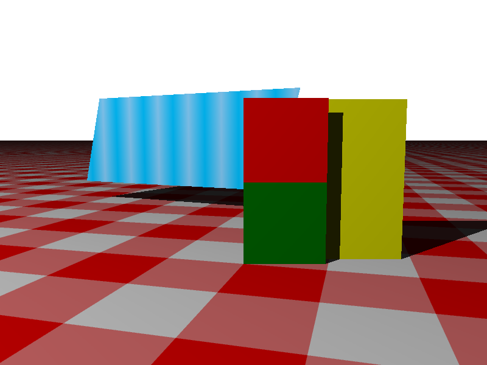
    </a></td>
    <td style="margin-left: 8px; margin-right: 8px; border: none; vertical-align: middle;">
      <a href="challenge-book/chapter-15/parallelogram.igl">2D in 3d: Parallelograms</a>
    </td>
  </tr>
  <tr style="border: none;">
    <td style="border: none;"><a href="challenge-book/chapter-15/smooth-triangle.png">
      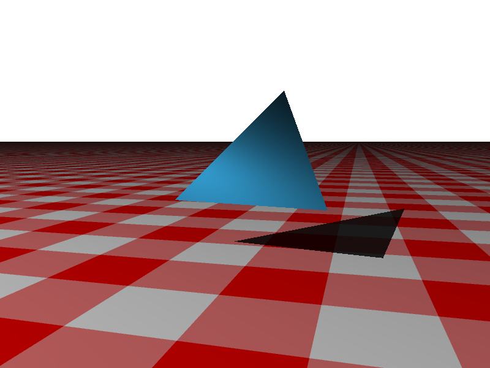
    </a></td>
    <td style="margin-left: 8px; margin-right: 8px; border: none; vertical-align: middle;">
      <a href="challenge-book/chapter-15/smooth-triangle.igl">2D in 3d: Smooth Triangles</a>
    </td>
  </tr>
  <tr style="border: none;">
    <td style="border: none;"><a href="challenge-book/chapter-15/triangle.png">
      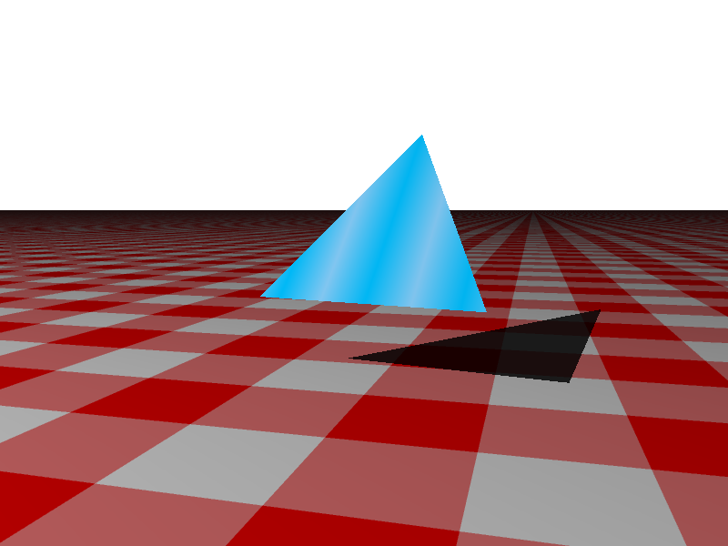
    </a></td>
    <td style="margin-left: 8px; margin-right: 8px; border: none; vertical-align: middle;">
      <a href="challenge-book/chapter-15/triangle.igl">2D in 3d: Triangles</a>
    </td>
  </tr>
  <tr style="border: none;">
    <td style="border: none;"><a href="challenge-book/chapter-16/csg.png">
      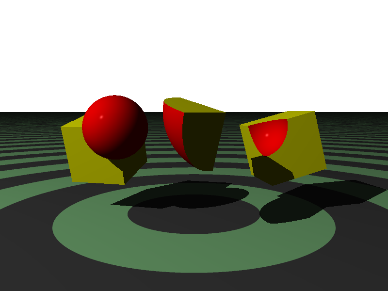
    </a></td>
    <td style="margin-left: 8px; margin-right: 8px; border: none; vertical-align: middle;">
      <a href="challenge-book/chapter-16/csg.igl">Basic CSG Examples</a>
    </td>
  </tr>
  <tr style="border: none;">
    <td style="border: none;"><a href="challenge-book/chapter-16/csg2.png">
      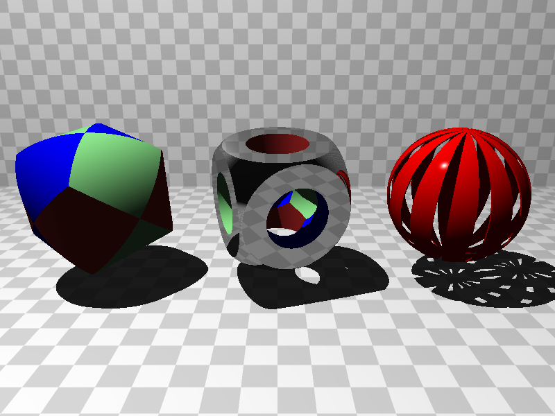
    </a></td>
    <td style="margin-left: 8px; margin-right: 8px; border: none; vertical-align: middle;">
      <a href="challenge-book/chapter-16/csg2.igl">More CSF: A Picture from the Book</a>
    </td>
  </tr>
  <tr style="border: none;">
    <td style="border: none;"><a href="challenge-book/chapter-16/dice.png">
      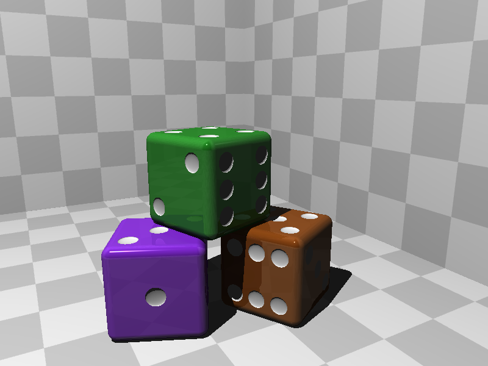
    </a></td>
    <td style="margin-left: 8px; margin-right: 8px; border: none; vertical-align: middle;">
      <a href="challenge-book/chapter-16/dice.igl">Three Dice: Another Picture from the Book</a>
    </td>
  </tr>
  <tr style="border: none;">
    <td style="border: none;"><a href="challenge-book/cover.png">
      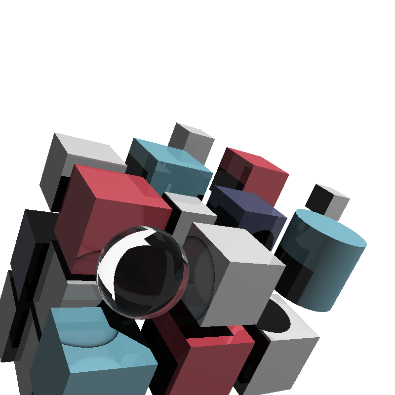
    </a></td>
    <td style="margin-left: 8px; margin-right: 8px; border: none; vertical-align: middle;">
      <a href="challenge-book/cover.igl">The Ray Tracer Challenge Cover Art</a>
    </td>
  </tr>
</table>

### Stuff Invented Here

<table style="width: 100%; border: none;">
  <tr style="border: none;">
    <td style="border: none;"><a href="Local/paths/extrusions/extrusion.png">
      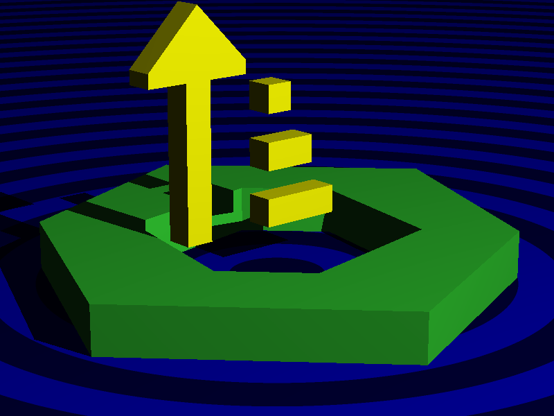
    </a></td>
    <td style="margin-left: 8px; margin-right: 8px; border: none; vertical-align: middle;">
      <a href="Local/paths/extrusions/extrusion.igl">Extrusion Test</a>
    </td>
  </tr>
  <tr style="border: none;">
    <td style="border: none;"></td>
    <td style="margin-left: 8px; margin-right: 8px; border: none; vertical-align: middle;">
      <a href="Local/paths/extrusions/extrusion2.igl">Another Extrusion Test</a>
    </td>
  </tr>
  <tr style="border: none;">
    <td style="border: none;"><a href="Local/paths/extrusions/lathe.png">
      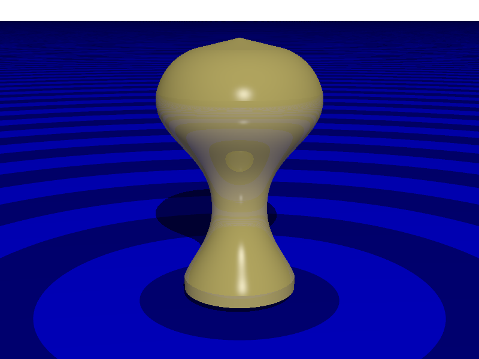
    </a></td>
    <td style="margin-left: 8px; margin-right: 8px; border: none; vertical-align: middle;">
      <a href="Local/paths/extrusions/lathe.igl">Lathe Test</a>
    </td>
  </tr>
  <tr style="border: none;">
    <td style="border: none;"></td>
    <td style="margin-left: 8px; margin-right: 8px; border: none; vertical-align: middle;">
      <a href="Local/paths/extrusions/lathe-drinking-glass.igl">Lathe Drinking Glass Test</a>
    </td>
  </tr>
  <tr style="border: none;">
    <td style="border: none;"></td>
    <td style="margin-left: 8px; margin-right: 8px; border: none; vertical-align: middle;">
      <a href="Local/paths/extrusions/lathe-trophy.igl">Lathe Trophy Test</a>
    </td>
  </tr>
  <tr style="border: none;">
    <td style="border: none;"><a href="Local/surfaces/heightfield.png">
      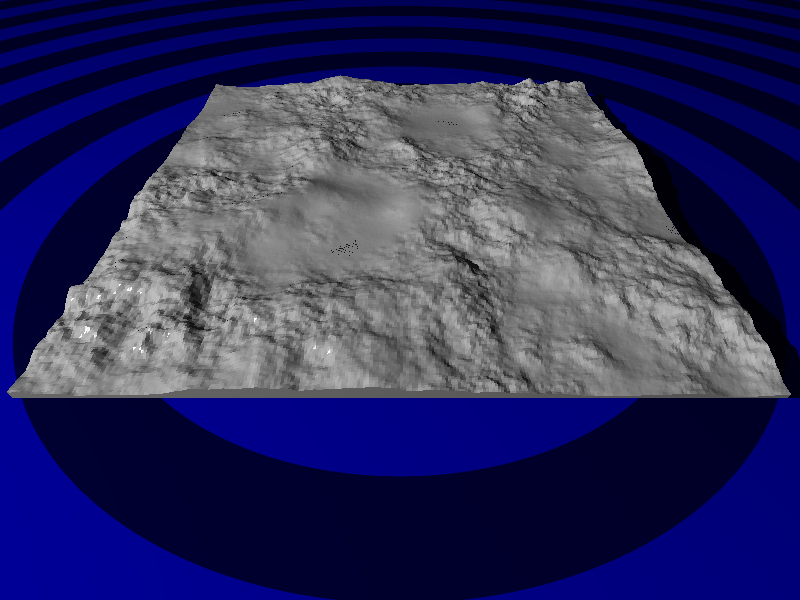
    </a></td>
    <td style="margin-left: 8px; margin-right: 8px; border: none; vertical-align: middle;">
      <a href="Local/surfaces/heightfield.igl">Height Field Test</a>
    </td>
  </tr>
  <tr style="border: none;">
    <td style="border: none;"><a href="Local/materials/image-map.png">
      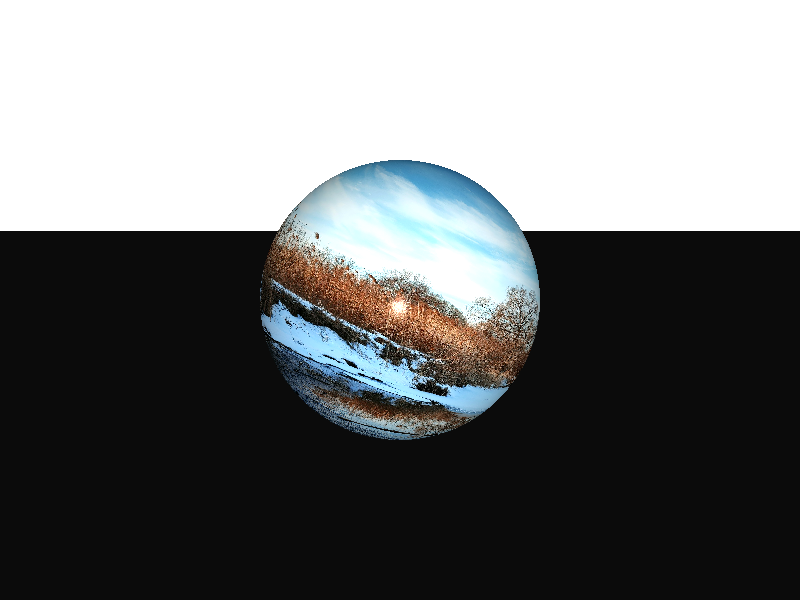
    </a></td>
    <td style="margin-left: 8px; margin-right: 8px; border: none; vertical-align: middle;">
      <a href="Local/materials/image-map.igl">Spherical image pigment test</a>
    </td>
  </tr>
  <tr style="border: none;">
    <td style="border: none;"><a href="Local/l-systems/axial.png">
      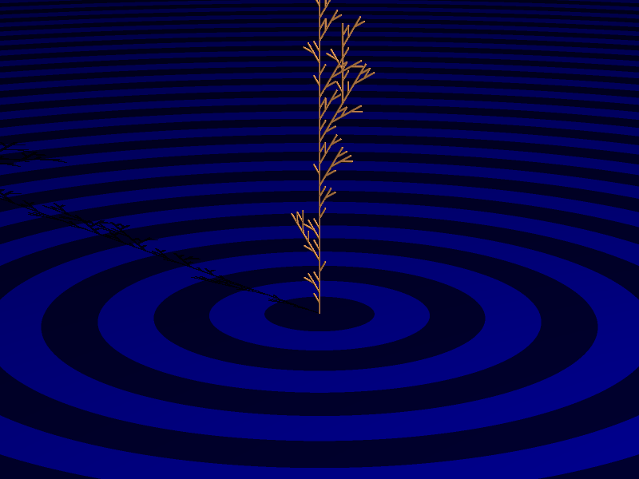
    </a></td>
    <td style="margin-left: 8px; margin-right: 8px; border: none; vertical-align: middle;">
      <a href="Local/l-systems/axial.igl">L-System Test: Axial Tree</a>
    </td>
  </tr>
  <tr style="border: none;">
    <td style="border: none;"><a href="Local/l-systems/berry-tree.png">
      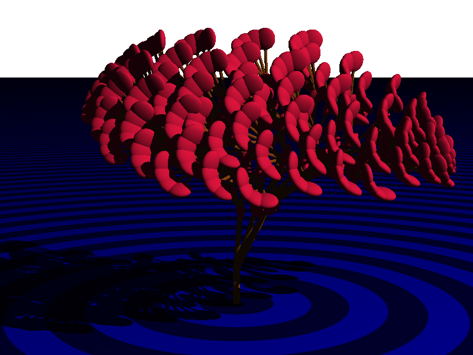
    </a></td>
    <td style="margin-left: 8px; margin-right: 8px; border: none; vertical-align: middle;">
      <a href="Local/l-systems/berry-tree.igl">L-System Test: Berry Tree</a>
    </td>
  </tr>
  <tr style="border: none;">
    <td style="border: none;"><a href="Local/l-systems/bush.png">
      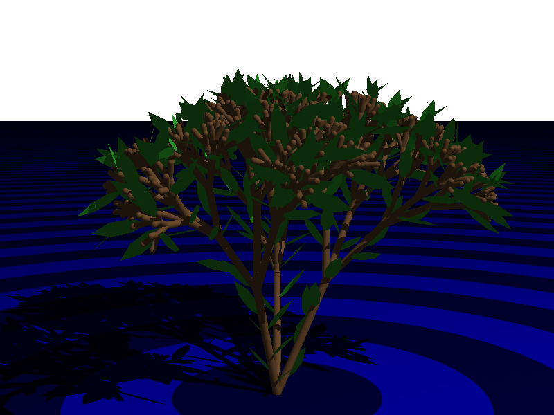
    </a></td>
    <td style="margin-left: 8px; margin-right: 8px; border: none; vertical-align: middle;">
      <a href="Local/l-systems/bush.igl">L-System Test: ABOP Bush</a>
    </td>
  </tr>
  <tr style="border: none;">
    <td style="border: none;"><a href="Local/l-systems/context-sensitive.png">
      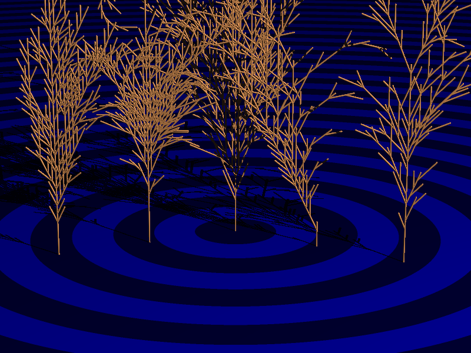
    </a></td>
    <td style="margin-left: 8px; margin-right: 8px; border: none; vertical-align: middle;">
      <a href="Local/l-systems/context-sensitive.igl">L-System Test: Context-Sensitive</a>
    </td>
  </tr>
  <tr style="border: none;">
    <td style="border: none;"><a href="Local/l-systems/fruit-tree.png">
      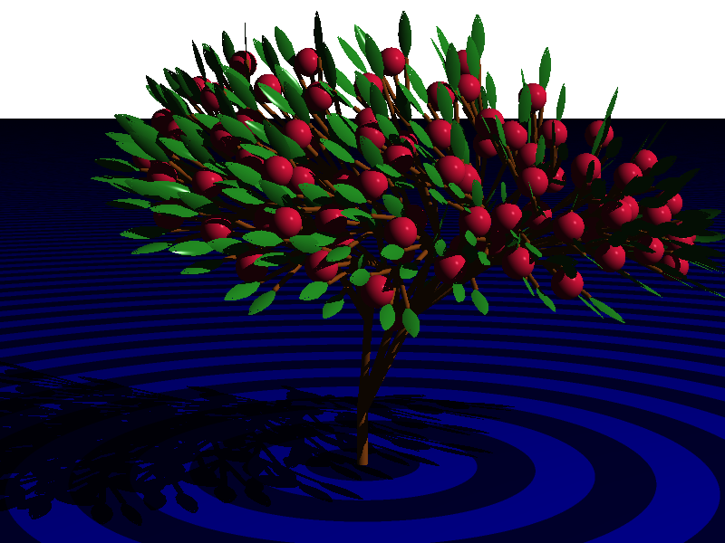
    </a></td>
    <td style="margin-left: 8px; margin-right: 8px; border: none; vertical-align: middle;">
      <a href="Local/l-systems/fruit-tree.igl">L-System Test: Leaves and Fruit</a>
    </td>
  </tr>
  <tr style="border: none;">
    <td style="border: none;"><a href="Local/l-systems/materials.png">
      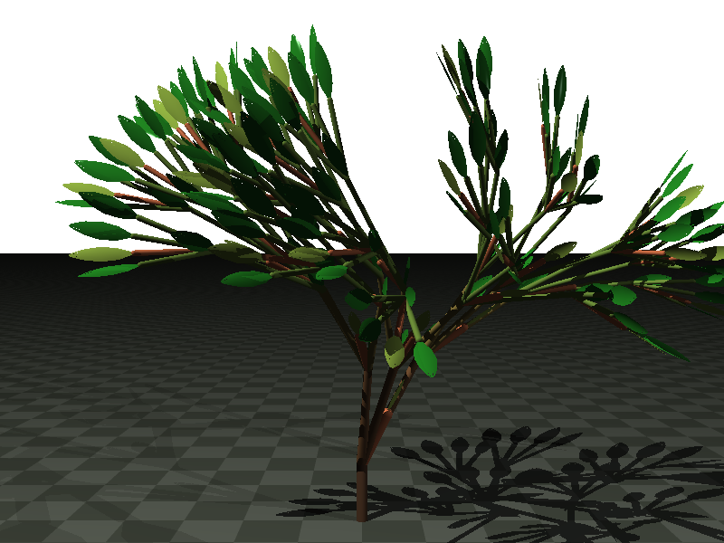
    </a></td>
    <td style="margin-left: 8px; margin-right: 8px; border: none; vertical-align: middle;">
      <a href="Local/l-systems/materials.igl">L-System Test: Materials</a>
    </td>
  </tr>
  <tr style="border: none;">
    <td style="border: none;"><a href="Local/l-systems/hilbert.png">
      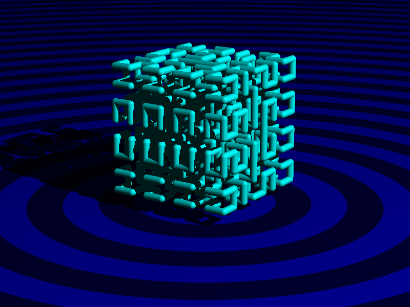
    </a></td>
    <td style="margin-left: 8px; margin-right: 8px; border: none; vertical-align: middle;">
      <a href="Local/l-systems/hilbert.igl">L-System Test: Hilbert Curve</a>
    </td>
  </tr>
  <tr style="border: none;">
    <td style="border: none;"><a href="Local/l-systems/leaf-tree.png">
      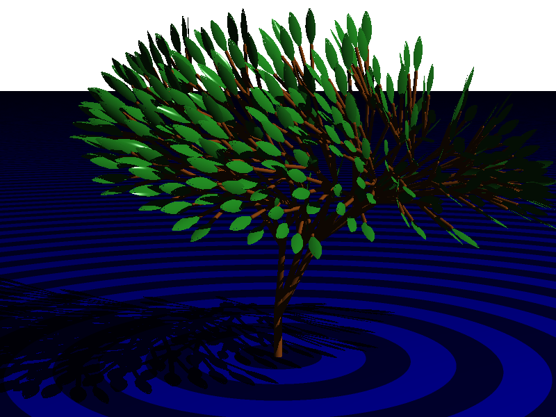
    </a></td>
    <td style="margin-left: 8px; margin-right: 8px; border: none; vertical-align: middle;">
      <a href="Local/l-systems/leaf-tree.igl">L-System Test: Leafy Tree</a>
    </td>
  </tr>
  <tr style="border: none;">
    <td style="border: none;"><a href="Local/l-systems/pipes-vs-tubes.png">
      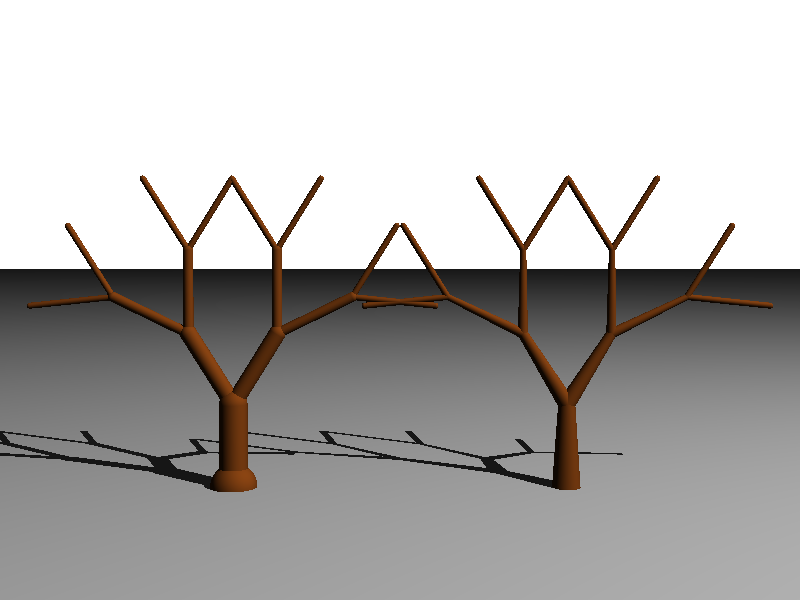
    </a></td>
    <td style="margin-left: 8px; margin-right: 8px; border: none; vertical-align: middle;">
      <a href="Local/l-systems/pipes-vs-tubes.igl">L-System Test: Pipes vs. Tubes</a>
    </td>
  </tr>
  <tr style="border: none;">
    <td style="border: none;"><a href="Local/l-systems/snowflake-2.png">
      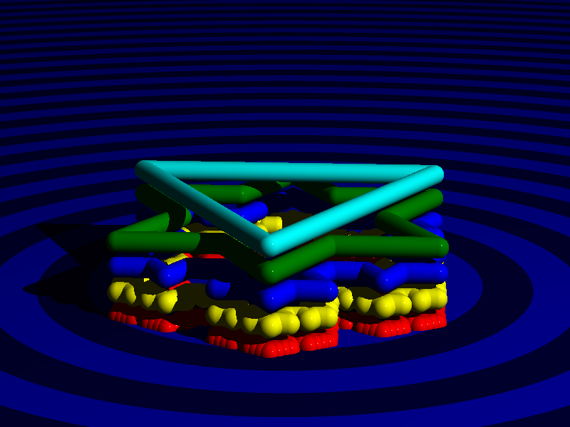
    </a></td>
    <td style="margin-left: 8px; margin-right: 8px; border: none; vertical-align: middle;">
      <a href="Local/l-systems/snowflake-2.igl">L-System Test: Snowflake Outline</a>
    </td>
  </tr>
  <tr style="border: none;">
    <td style="border: none;"><a href="Local/l-systems/snowflake.png">
      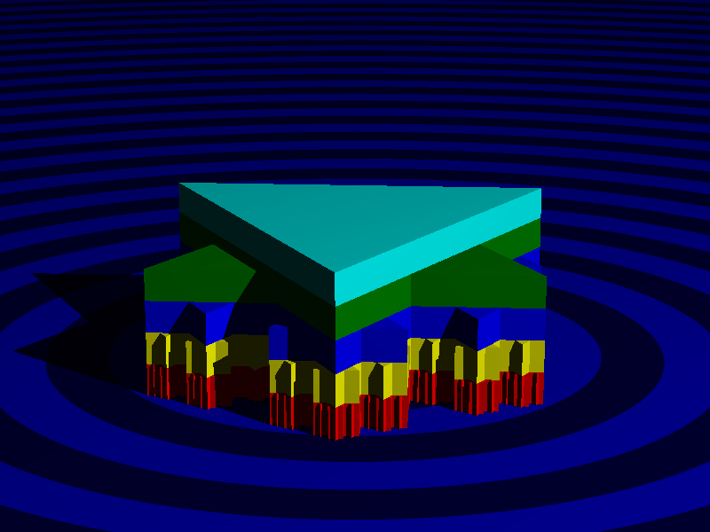
    </a></td>
    <td style="margin-left: 8px; margin-right: 8px; border: none; vertical-align: middle;">
      <a href="Local/l-systems/snowflake.igl">L-System Test: Snowflake</a>
    </td>
  </tr>
  <tr style="border: none;">
    <td style="border: none;"><a href="Local/materials/metallic.png">
      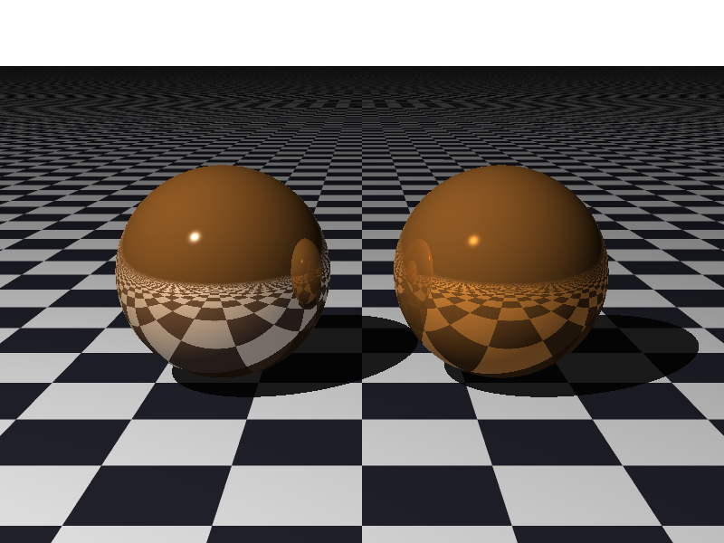
    </a></td>
    <td style="margin-left: 8px; margin-right: 8px; border: none; vertical-align: middle;">
      <a href="Local/materials/metallic.igl">Metallic Material Test</a>
    </td>
  </tr>
  <tr style="border: none;">
    <td style="border: none;"><a href="Local/materials/noise.png">
      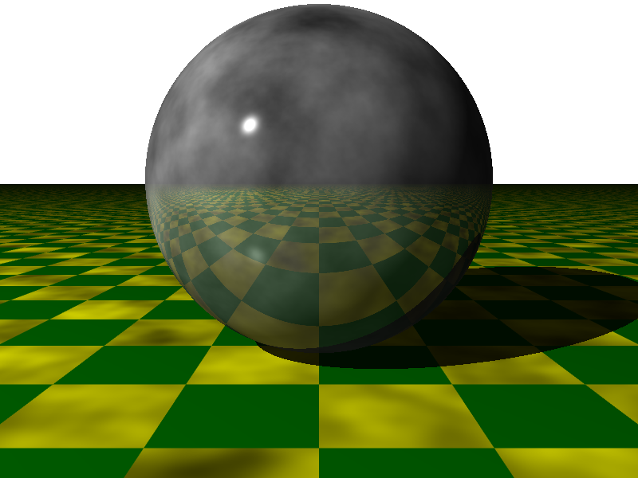
    </a></td>
    <td style="margin-left: 8px; margin-right: 8px; border: none; vertical-align: middle;">
      <a href="Local/materials/noise.igl">Pigment Noise Test</a>
    </td>
  </tr>
  <tr style="border: none;">
    <td style="border: none;"><a href="Local/solar-system/all.png">
      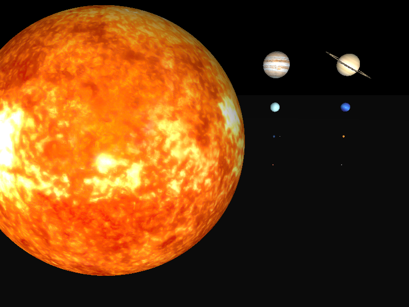
    </a></td>
    <td style="margin-left: 8px; margin-right: 8px; border: none; vertical-align: middle;">
      <a href="Local/solar-system/all.igl">The Planets</a>
    </td>
  </tr>
  <tr style="border: none;">
    <td style="border: none;"><a href="Local/solar-system/inner.png">
      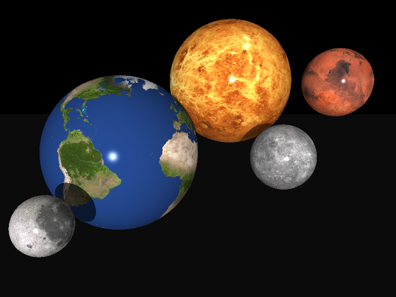
    </a></td>
    <td style="margin-left: 8px; margin-right: 8px; border: none; vertical-align: middle;">
      <a href="Local/solar-system/inner.igl">The Inner Planets</a>
    </td>
  </tr>
  <tr style="border: none;">
    <td style="border: none;"><a href="Local/solar-system/outer.png">
      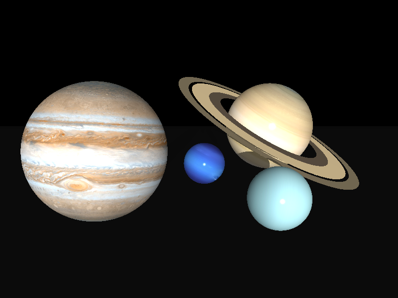
    </a></td>
    <td style="margin-left: 8px; margin-right: 8px; border: none; vertical-align: middle;">
      <a href="Local/solar-system/outer.igl">The Outer Planets</a>
    </td>
  </tr>
  <tr style="border: none;">
    <td style="border: none;"><a href="Local/paths/text.png">
      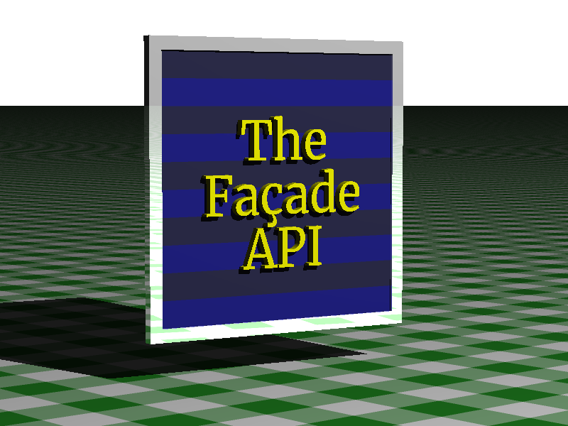
    </a></td>
    <td style="margin-left: 8px; margin-right: 8px; border: none; vertical-align: middle;">
      <a href="Local/paths/text.igl">Text Solid Test</a>
    </td>
  </tr>
  <tr style="border: none;">
    <td style="border: none;"></td>
    <td style="margin-left: 8px; margin-right: 8px; border: none; vertical-align: middle;">
      <a href="Local/paths/text-path.igl">Text Path Test</a>
    </td>
  </tr>
  <tr style="border: none;">
    <td style="border: none;"><a href="Local/paths/text-lathe.png">
      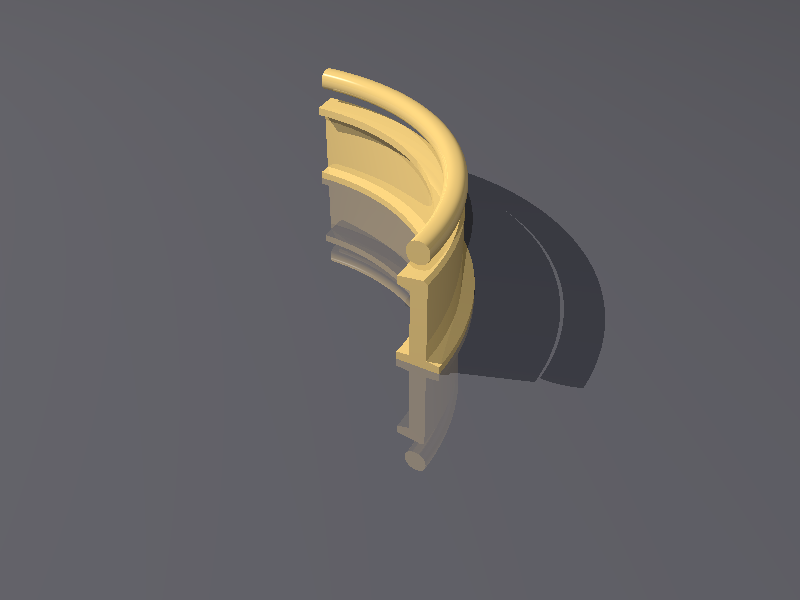
    </a></td>
    <td style="margin-left: 8px; margin-right: 8px; border: none; vertical-align: middle;">
      <a href="Local/paths/text-lathe.igl">Text Lathe Test</a>
    </td>
  </tr>
  <tr style="border: none;">
    <td style="border: none;"><a href="Local/surfaces/torus.png">
      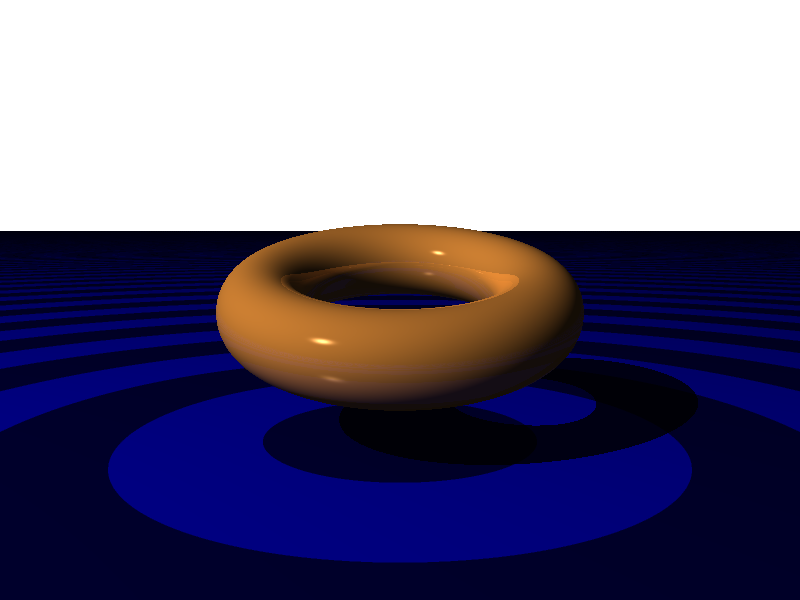
    </a></td>
    <td style="margin-left: 8px; margin-right: 8px; border: none; vertical-align: middle;">
      <a href="Local/surfaces/torus.igl">Torus Test</a>
    </td>
  </tr>
  <tr style="border: none;">
    <td style="border: none;"></td>
    <td style="margin-left: 8px; margin-right: 8px; border: none; vertical-align: middle;">
      <a href="Local/surfaces/blob.igl">Blob Test</a>
    </td>
  </tr>
  <tr style="border: none;">
    <td style="border: none;"><a href="Local/surfaces/blob-negative-strength.png">
      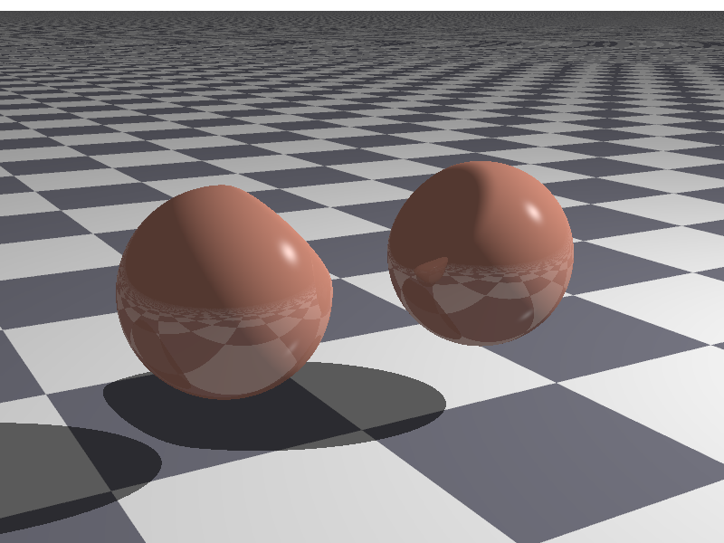
    </a></td>
    <td style="margin-left: 8px; margin-right: 8px; border: none; vertical-align: middle;">
      <a href="Local/surfaces/blob-negative-strength.igl">Blob Negative Strength Test</a>
    </td>
  </tr>
  <tr style="border: none;">
    <td style="border: none;"><a href="Local/surfaces/tube.png">
      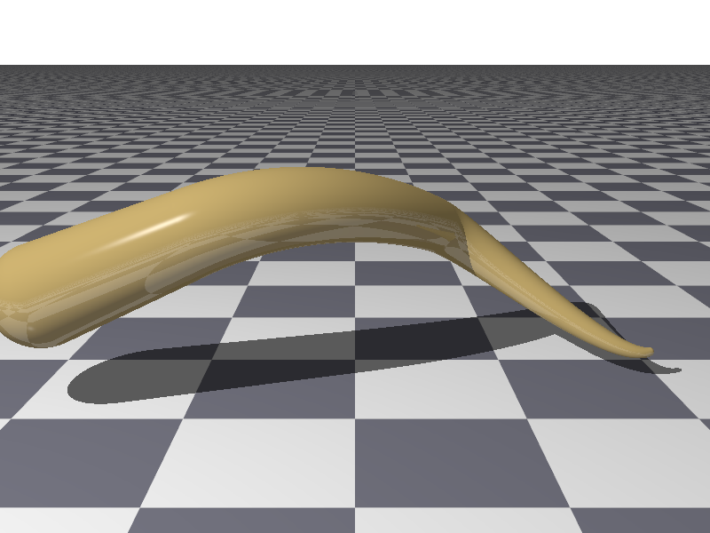
    </a></td>
    <td style="margin-left: 8px; margin-right: 8px; border: none; vertical-align: middle;">
      <a href="Local/surfaces/tube.igl">Tube Test</a>
    </td>
  </tr>
  <tr style="border: none;">
    <td style="border: none;"><a href="Local/paths/power-cord.png">
      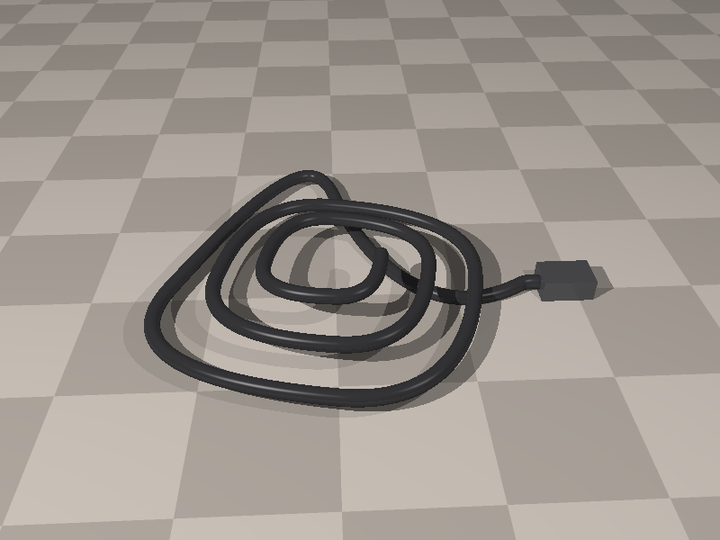
    </a></td>
    <td style="margin-left: 8px; margin-right: 8px; border: none; vertical-align: middle;">
      <a href="Local/paths/power-cord.igl">Power Cord Test</a>
    </td>
  </tr>
  <tr style="border: none;">
    <td style="border: none;"><a href="Local/materials/stained-glass.png">
      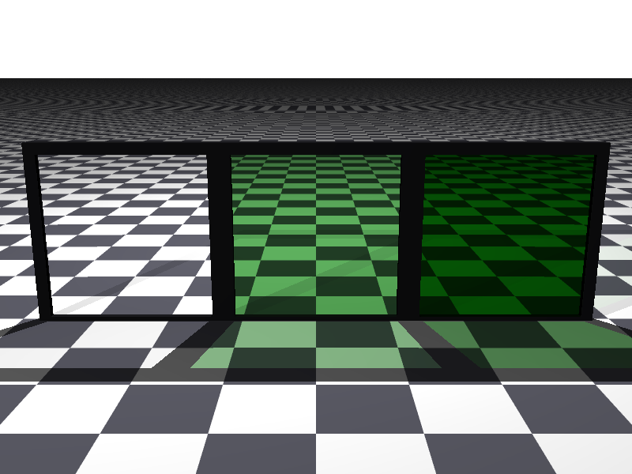
    </a></td>
    <td style="margin-left: 8px; margin-right: 8px; border: none; vertical-align: middle;">
      <a href="Local/materials/stained-glass.igl">Filtered Transparency Test</a>
    </td>
  </tr>
  <tr style="border: none;">
    <td style="border: none;"><a href="Local/materials/clarity.png">
      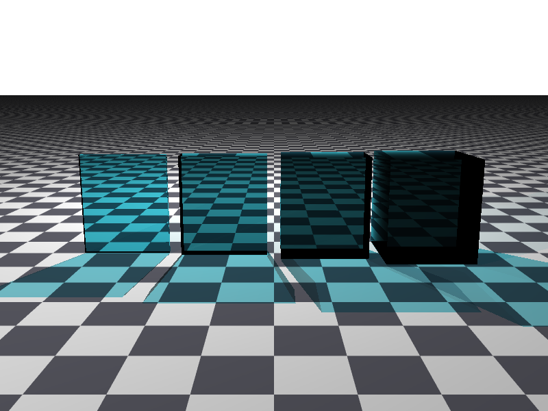
    </a></td>
    <td style="margin-left: 8px; margin-right: 8px; border: none; vertical-align: middle;">
      <a href="Local/materials/clarity.igl">Clarity Test</a>
    </td>
  </tr>
  <tr style="border: none;">
    <td style="border: none;"><a href="Local/materials/finish.png">
      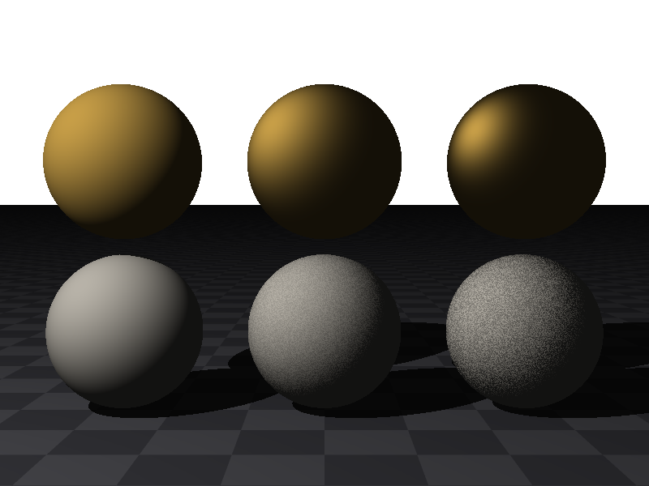
    </a></td>
    <td style="margin-left: 8px; margin-right: 8px; border: none; vertical-align: middle;">
      <a href="Local/materials/finish.igl">Surface Finish Test</a>
    </td>
  </tr>
  <tr style="border: none;">
    <td style="border: none;"><a href="Local/paths/sweep.png">
      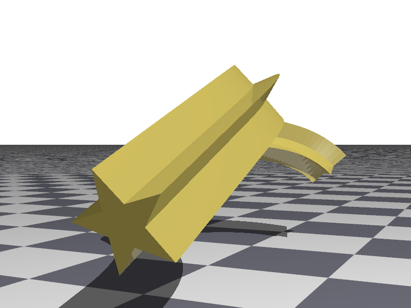
    </a></td>
    <td style="margin-left: 8px; margin-right: 8px; border: none; vertical-align: middle;">
      <a href="Local/paths/sweep.igl">Sweep Test</a>
    </td>
  </tr>
  <tr style="border: none;">
    <td style="border: none;"><a href="Local/paths/sweep-conduit.png">
      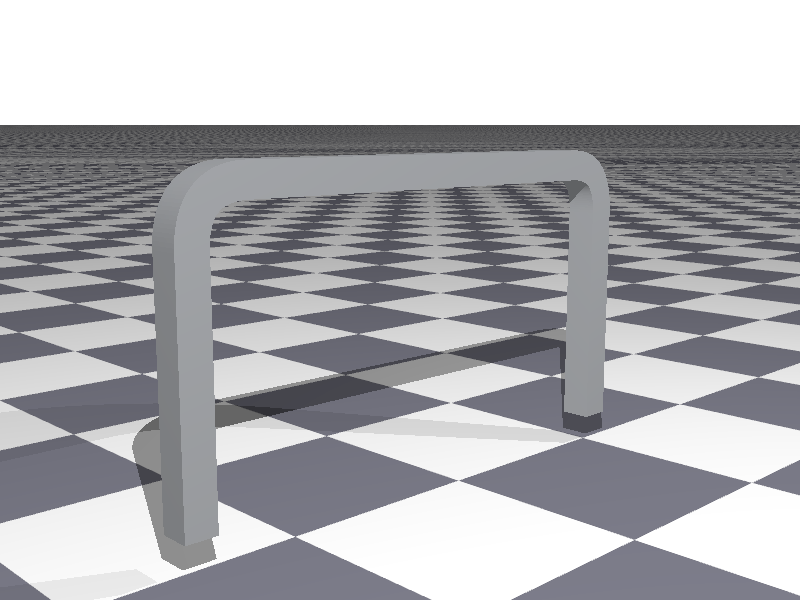
    </a></td>
    <td style="margin-left: 8px; margin-right: 8px; border: none; vertical-align: middle;">
      <a href="Local/paths/sweep-conduit.igl">Sweep Conduit Test</a>
    </td>
  </tr>
  <tr style="border: none;">
    <td style="border: none;"><a href="Local/paths/sweep-side.png">
      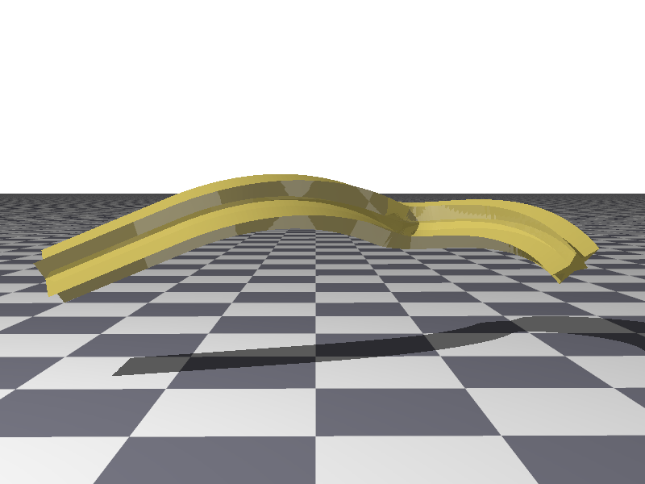
    </a></td>
    <td style="margin-left: 8px; margin-right: 8px; border: none; vertical-align: middle;">
      <a href="Local/paths/sweep-side.igl">Sweep Test (Side View)</a>
    </td>
  </tr>
  <tr style="border: none;">
    <td style="border: none;"><a href="Local/paths/sweep-scale.png">
      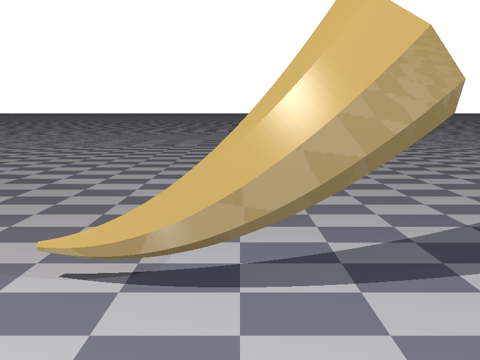
    </a></td>
    <td style="margin-left: 8px; margin-right: 8px; border: none; vertical-align: middle;">
      <a href="Local/paths/sweep-scale.igl">Sweep Scale Test</a>
    </td>
  </tr>
  <tr style="border: none;">
    <td style="border: none;"><a href="Local/surfaces/disc.png">
      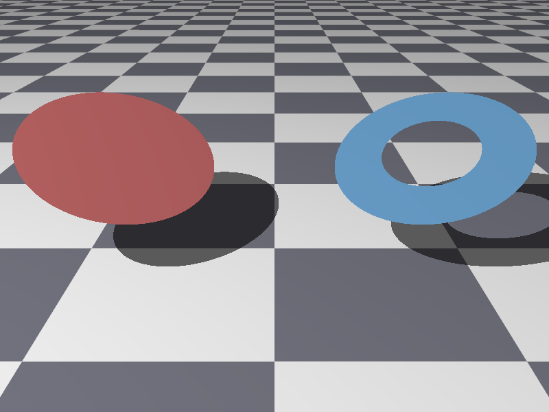
    </a></td>
    <td style="margin-left: 8px; margin-right: 8px; border: none; vertical-align: middle;">
      <a href="Local/surfaces/disc.igl">Disc Test</a>
    </td>
  </tr>
  <tr style="border: none;">
    <td style="border: none;"></td>
    <td style="margin-left: 8px; margin-right: 8px; border: none; vertical-align: middle;">
      <a href="Local/surfaces/generic-shape.igl">Generic Shape Test</a>
    </td>
  </tr>
  <tr style="border: none;">
    <td style="border: none;"><a href="Local/surfaces/egg.png">
      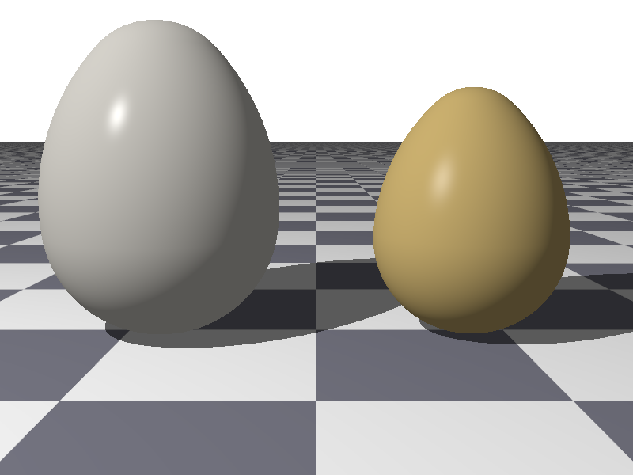
    </a></td>
    <td style="margin-left: 8px; margin-right: 8px; border: none; vertical-align: middle;">
      <a href="Local/surfaces/egg.igl">Egg Test</a>
    </td>
  </tr>
  <tr style="border: none;">
    <td style="border: none;"></td>
    <td style="margin-left: 8px; margin-right: 8px; border: none; vertical-align: middle;">
      <a href="Local/surfaces/superellipsoid.igl">Superellipsoid Test</a>
    </td>
  </tr>
  <tr style="border: none;">
    <td style="border: none;"></td>
    <td style="margin-left: 8px; margin-right: 8px; border: none; vertical-align: middle;">
      <a href="Local/surfaces/superellipsoid-concave.igl">Superellipsoid Concave Shapes Test</a>
    </td>
  </tr>
  <tr style="border: none;">
    <td style="border: none;"><a href="Local/surfaces/patch.png">
      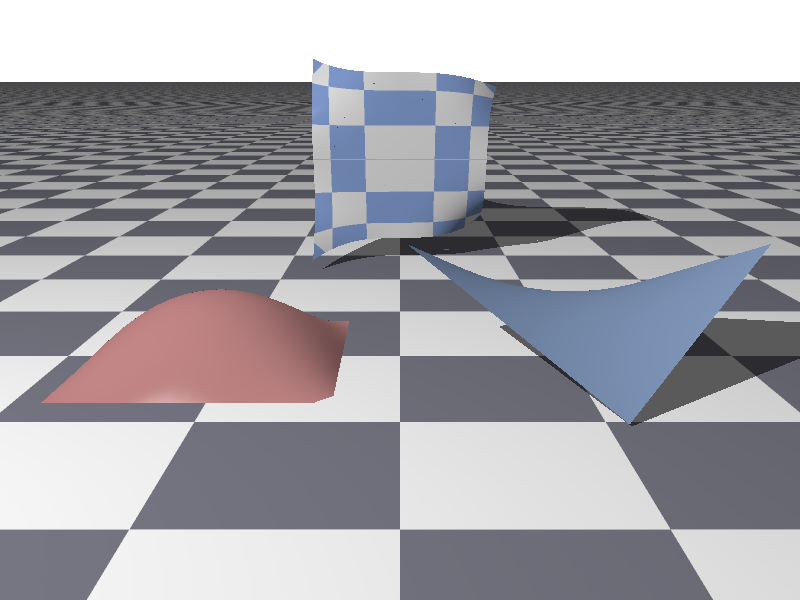
    </a></td>
    <td style="margin-left: 8px; margin-right: 8px; border: none; vertical-align: middle;">
      <a href="Local/surfaces/patch.igl">Patch Test</a>
    </td>
  </tr>
  <tr style="border: none;">
    <td style="border: none;"><a href="Local/materials/normals.png">
      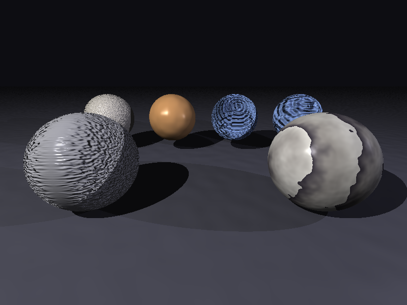
    </a></td>
    <td style="margin-left: 8px; margin-right: 8px; border: none; vertical-align: middle;">
      <a href="Local/materials/normals.igl">Normal Perturbation</a>
    </td>
  </tr>
  <tr style="border: none;">
    <td style="border: none;"><a href="Local/lights/lights.png">
      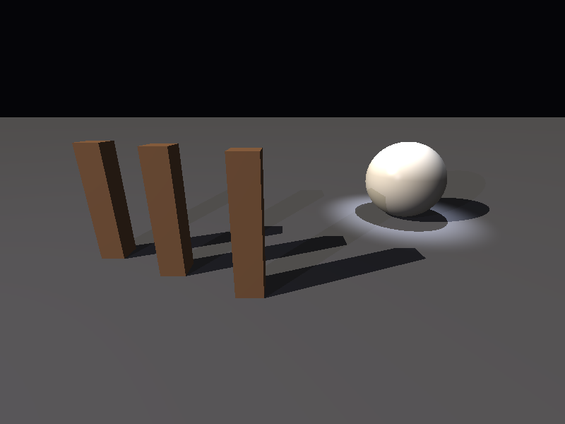
    </a></td>
    <td style="margin-left: 8px; margin-right: 8px; border: none; vertical-align: middle;">
      <a href="Local/lights/lights.igl">Distant and Spot Lights</a>
    </td>
  </tr>
  <tr style="border: none;">
    <td style="border: none;"><a href="Local/lights/area-light.png">
      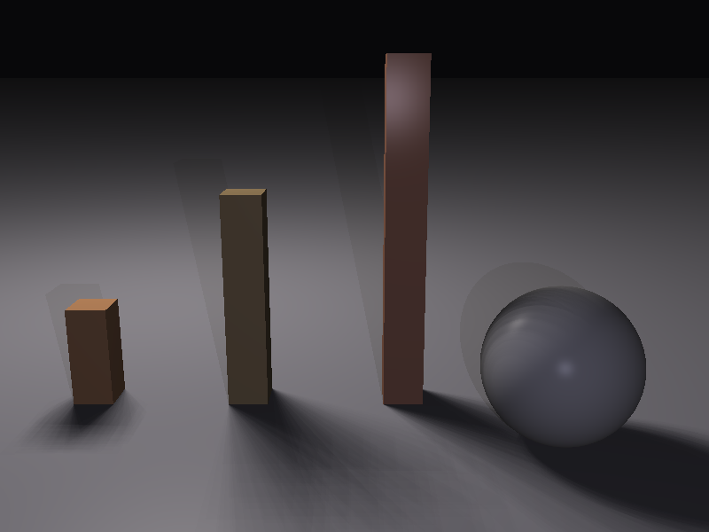
    </a></td>
    <td style="margin-left: 8px; margin-right: 8px; border: none; vertical-align: middle;">
      <a href="Local/lights/area-light.igl">Area Light</a>
    </td>
  </tr>
  <tr style="border: none;">
    <td style="border: none;"><a href="Local/lights/sky-light.png">
      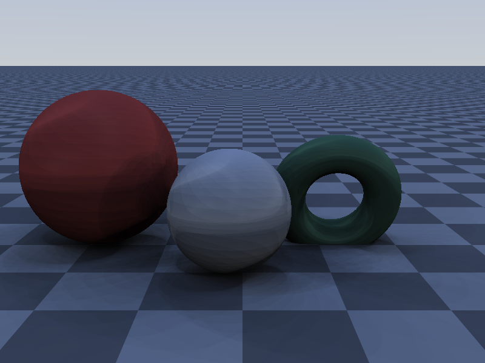
    </a></td>
    <td style="margin-left: 8px; margin-right: 8px; border: none; vertical-align: middle;">
      <a href="Local/lights/sky-light.igl">A Sky Light</a>
    </td>
  </tr>
  <tr style="border: none;">
    <td style="border: none;"><a href="Local/lights/physical-sky.png">
      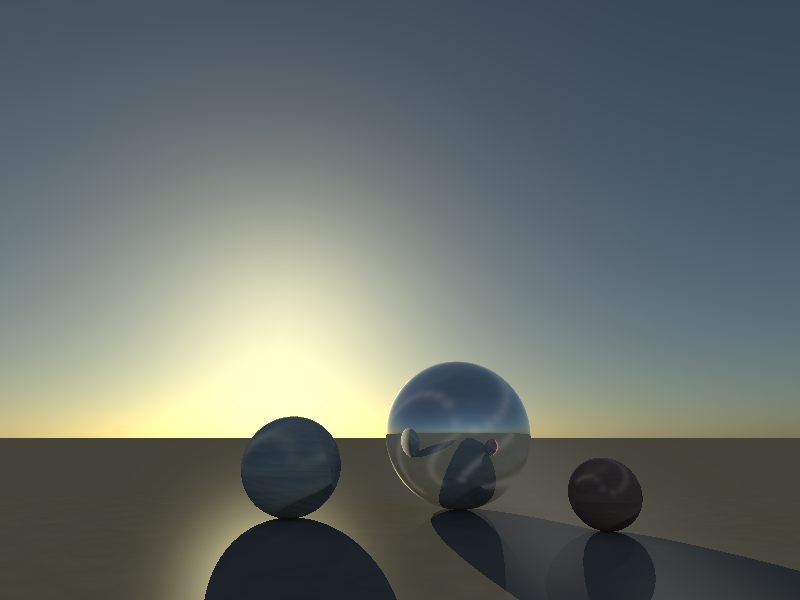
    </a></td>
    <td style="margin-left: 8px; margin-right: 8px; border: none; vertical-align: middle;">
      <a href="Local/lights/physical-sky.igl">A Physical Sky</a>
    </td>
  </tr>
  <tr style="border: none;">
    <td style="border: none;"><a href="Local/lights/candle.png">
      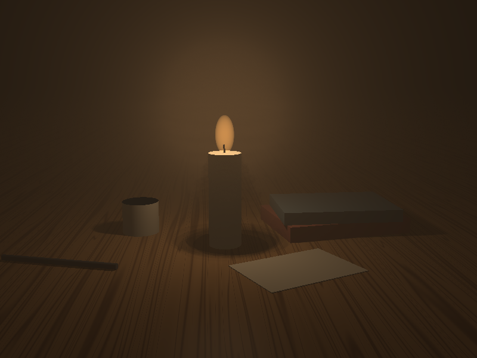
    </a></td>
    <td style="margin-left: 8px; margin-right: 8px; border: none; vertical-align: middle;">
      <a href="Local/lights/candle.igl">A Candle</a>
    </td>
  </tr>
  <tr style="border: none;">
    <td style="border: none;"><a href="Local/cameras/focal-blur.png">
      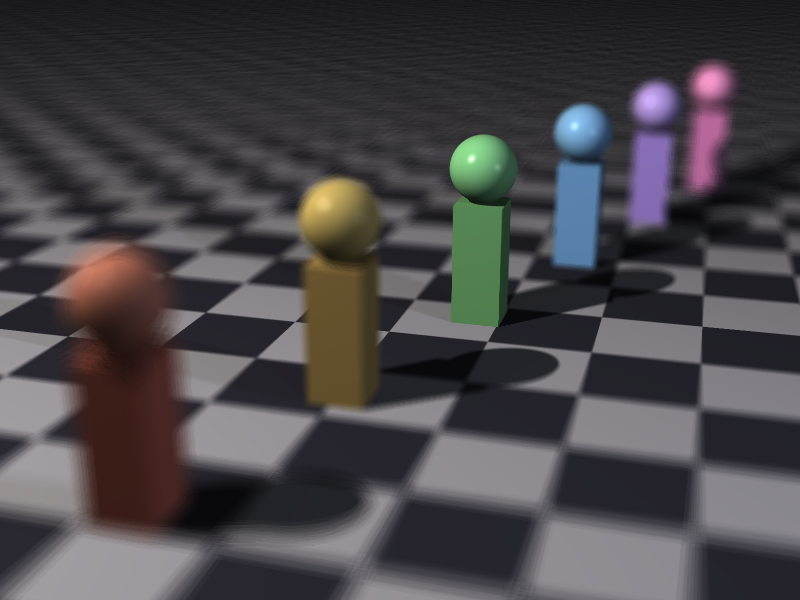
    </a></td>
    <td style="margin-left: 8px; margin-right: 8px; border: none; vertical-align: middle;">
      <a href="Local/cameras/focal-blur.igl">Focal Blur</a>
    </td>
  </tr>
  <tr style="border: none;">
    <td style="border: none;"><a href="Local/cameras/motion-blur.png">
      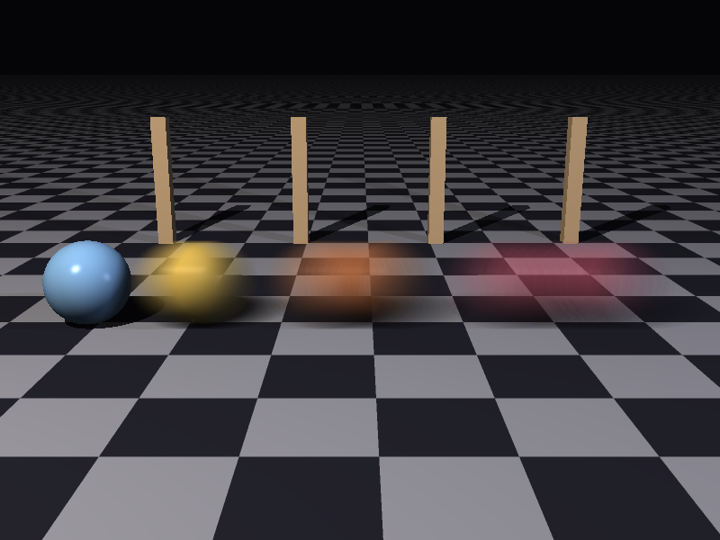
    </a></td>
    <td style="margin-left: 8px; margin-right: 8px; border: none; vertical-align: middle;">
      <a href="Local/cameras/motion-blur.igl">Motion Blur</a>
    </td>
  </tr>
  <tr style="border: none;">
    <td style="border: none;"><a href="Local/cameras/fisheye.png">
      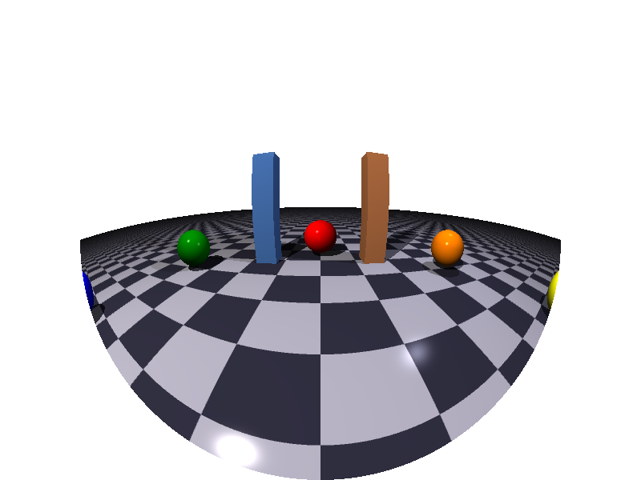
    </a></td>
    <td style="margin-left: 8px; margin-right: 8px; border: none; vertical-align: middle;">
      <a href="Local/cameras/fisheye.igl">Fisheye Camera</a>
    </td>
  </tr>
  <tr style="border: none;">
    <td style="border: none;"></td>
    <td style="margin-left: 8px; margin-right: 8px; border: none; vertical-align: middle;">
      <a href="Local/paths/icons.igl">FontAwesome Icons</a>
    </td>
  </tr>
  <tr style="border: none;">
    <td style="border: none;"></td>
    <td style="margin-left: 8px; margin-right: 8px; border: none; vertical-align: middle;">
      <a href="Local/paths/icons-complex.igl">FontAwesome Icons, the Intricate Ones</a>
    </td>
  </tr>
  <tr style="border: none;">
    <td style="border: none;"><a href="Local/surfaces/isosurfaces.png">
      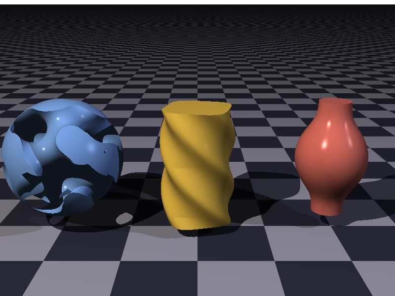
    </a></td>
    <td style="margin-left: 8px; margin-right: 8px; border: none; vertical-align: middle;">
      <a href="Local/surfaces/isosurfaces.igl">Isosurfaces</a>
    </td>
  </tr>
  <tr style="border: none;">
    <td style="border: none;"></td>
    <td style="margin-left: 8px; margin-right: 8px; border: none; vertical-align: middle;">
      <a href="Local/surfaces/isosurface-noise.igl">Isosurfaces Made Rough With Noise</a>
    </td>
  </tr>
  <tr style="border: none;">
    <td style="border: none;"><a href="Local/media/medium.png">
      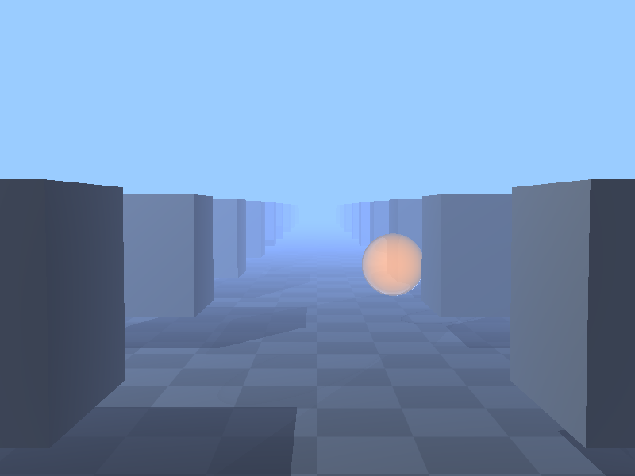
    </a></td>
    <td style="margin-left: 8px; margin-right: 8px; border: none; vertical-align: middle;">
      <a href="Local/media/medium.igl">A Medium</a>
    </td>
  </tr>
  <tr style="border: none;">
    <td style="border: none;"><a href="Local/media/scattering.png">
      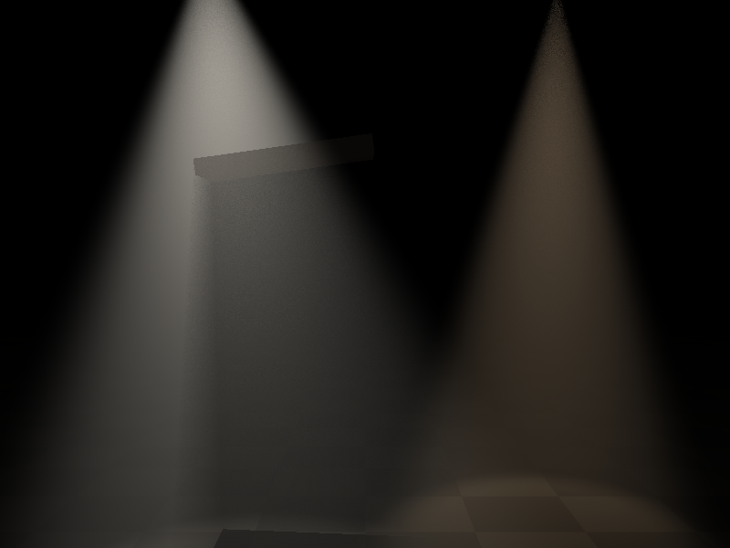
    </a></td>
    <td style="margin-left: 8px; margin-right: 8px; border: none; vertical-align: middle;">
      <a href="Local/media/scattering.igl">Scattering</a>
    </td>
  </tr>
  <tr style="border: none;">
    <td style="border: none;"></td>
    <td style="margin-left: 8px; margin-right: 8px; border: none; vertical-align: middle;">
      <a href="Local/media/density.igl">A Shaped Density</a>
    </td>
  </tr>
  <tr style="border: none;">
    <td style="border: none;"><a href="Local/media/multiple-scattering.png">
      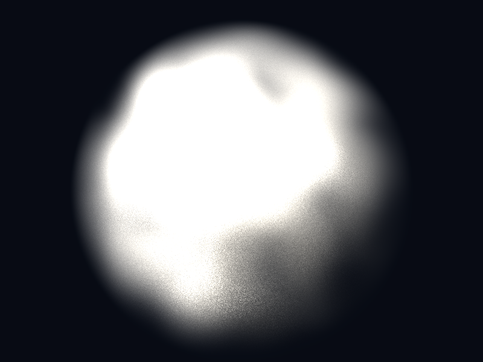
    </a></td>
    <td style="margin-left: 8px; margin-right: 8px; border: none; vertical-align: middle;">
      <a href="Local/media/multiple-scattering.igl">Multiple Scattering</a>
    </td>
  </tr>
  <tr style="border: none;">
    <td style="border: none;"></td>
    <td style="margin-left: 8px; margin-right: 8px; border: none; vertical-align: middle;">
      <a href="Local/media/sunlit-cloud.igl">A Sunlit Cloud</a>
    </td>
  </tr>
  <tr style="border: none;">
    <td style="border: none;"><a href="Local/media/pattern-density.png">
      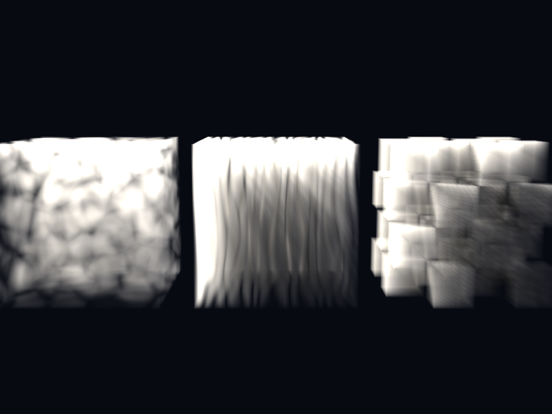
    </a></td>
    <td style="margin-left: 8px; margin-right: 8px; border: none; vertical-align: middle;">
      <a href="Local/media/pattern-density.igl">Densities From Patterns</a>
    </td>
  </tr>
  <tr style="border: none;">
    <td style="border: none;"></td>
    <td style="margin-left: 8px; margin-right: 8px; border: none; vertical-align: middle;">
      <a href="Local/functions/spiral-stair.igl">A Spiral Stair</a>
    </td>
  </tr>
  <tr style="border: none;">
    <td style="border: none;"></td>
    <td style="margin-left: 8px; margin-right: 8px; border: none; vertical-align: middle;">
      <a href="Local/functions/shape-vocabulary.igl">A Shape Vocabulary</a>
    </td>
  </tr>
  <tr style="border: none;">
    <td style="border: none;"></td>
    <td style="margin-left: 8px; margin-right: 8px; border: none; vertical-align: middle;">
      <a href="Local/functions/recursive-trees.igl">Recursive Trees</a>
    </td>
  </tr>
  <tr style="border: none;">
    <td style="border: none;"><a href="Local/lights/times-of-day.png">
      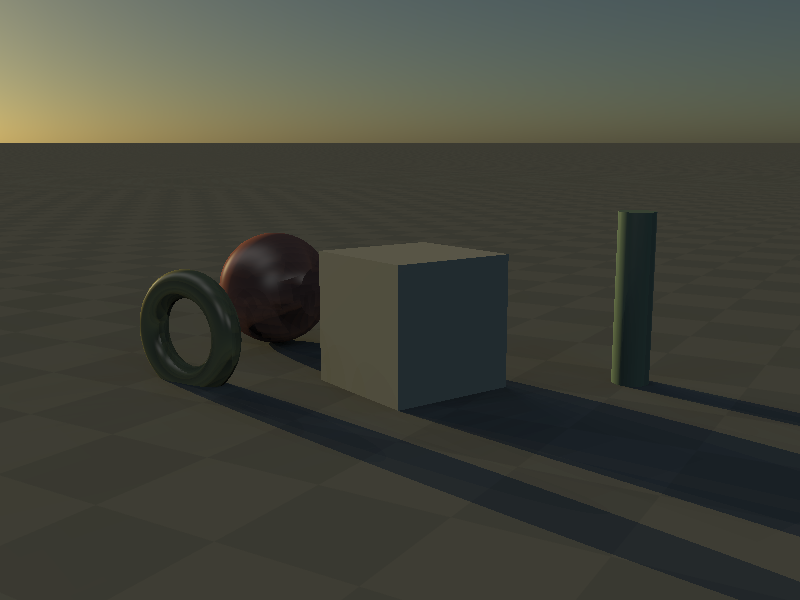
    </a></td>
    <td style="margin-left: 8px; margin-right: 8px; border: none; vertical-align: middle;">
      <a href="Local/lights/times-of-day.igl">Times of Day</a>
    </td>
  </tr>
  <tr style="border: none;">
    <td style="border: none;"><a href="Local/functions/a-stand-of-trees.png">
      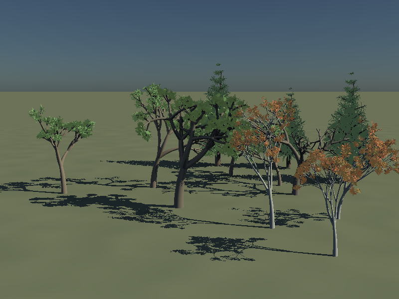
    </a></td>
    <td style="margin-left: 8px; margin-right: 8px; border: none; vertical-align: middle;">
      <a href="Local/functions/a-stand-of-trees.igl">A Stand of Trees</a>
    </td>
  </tr>
  <tr style="border: none;">
    <td style="border: none;"><a href="Local/functions/four-seasons.png">
      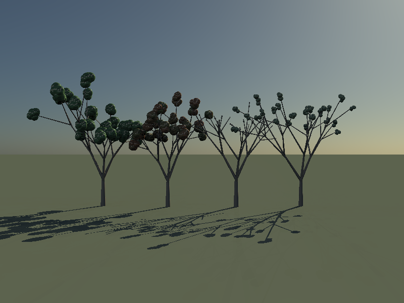
    </a></td>
    <td style="margin-left: 8px; margin-right: 8px; border: none; vertical-align: middle;">
      <a href="Local/functions/four-seasons.igl">Four Seasons</a>
    </td>
  </tr>
  <tr style="border: none;">
    <td style="border: none;"><a href="Local/functions/a-block-of-buildings.png">
      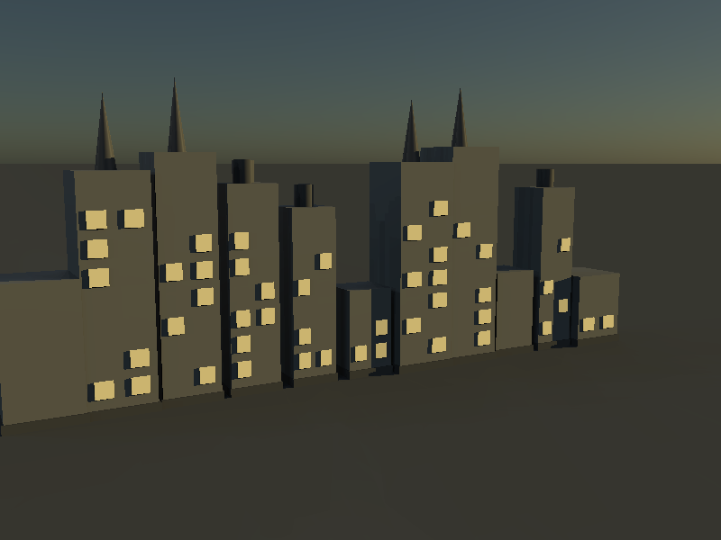
    </a></td>
    <td style="margin-left: 8px; margin-right: 8px; border: none; vertical-align: middle;">
      <a href="Local/functions/a-block-of-buildings.igl">A Block of Buildings</a>
    </td>
  </tr>
</table>

### Ported from POV-Ray

<table style="width: 100%; border: none;">
  <tr style="border: none;">
    <td style="border: none;"><a href="POVRay/first.png">
      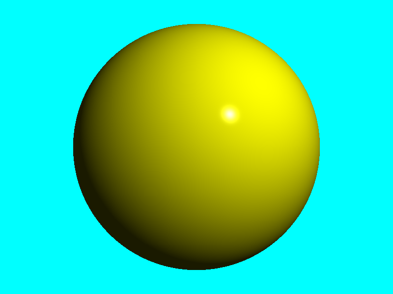
    </a></td>
    <td style="margin-left: 8px; margin-right: 8px; border: none; vertical-align: middle;">
      <a href="POVRay/first.igl">The First Image</a>
    </td>
  </tr>
  <tr style="border: none;">
    <td style="border: none;"><a href="POVRay/library-textures.png">
      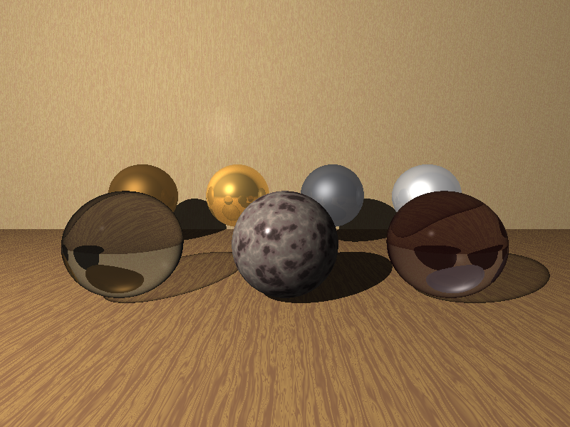
    </a></td>
    <td style="margin-left: 8px; margin-right: 8px; border: none; vertical-align: middle;">
      <a href="POVRay/library-textures.igl">POV-Ray Library Textures</a>
    </td>
  </tr>
</table>
