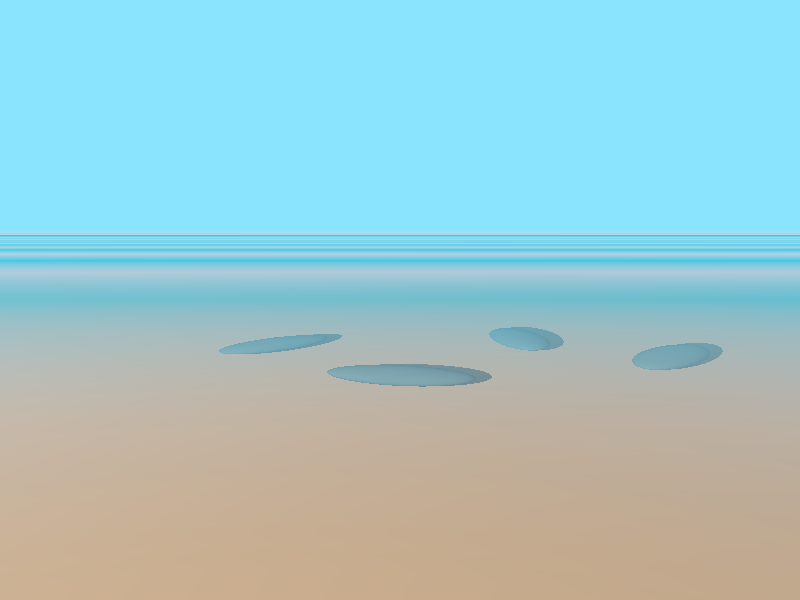
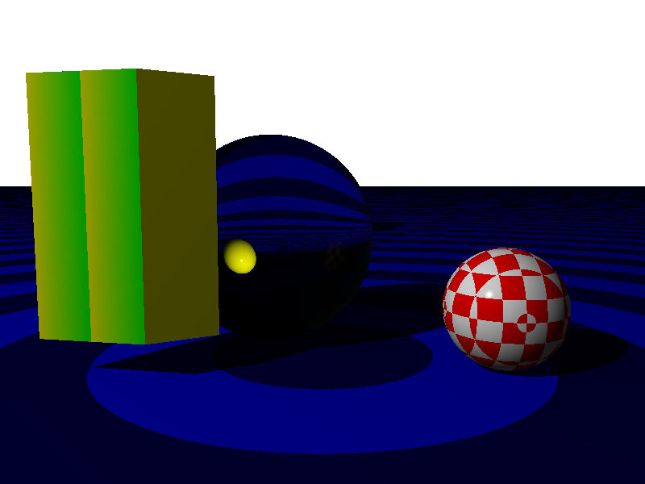
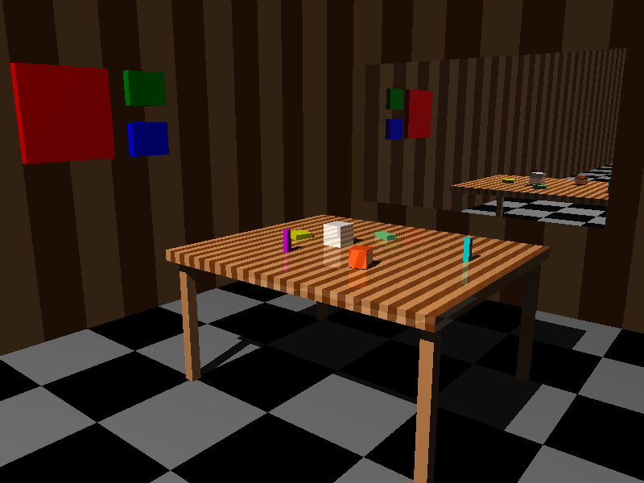
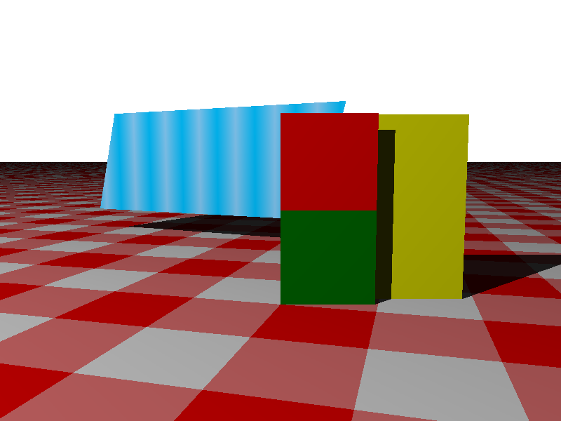
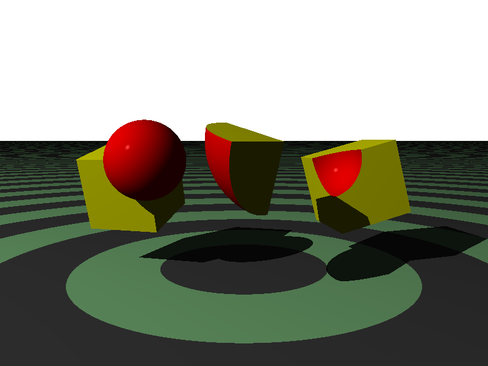
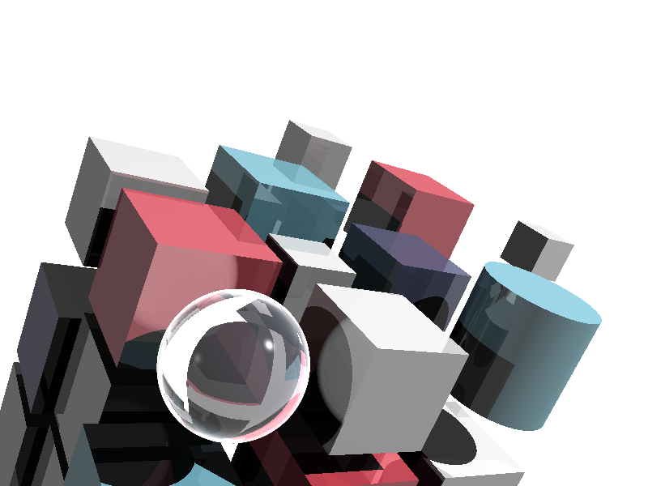
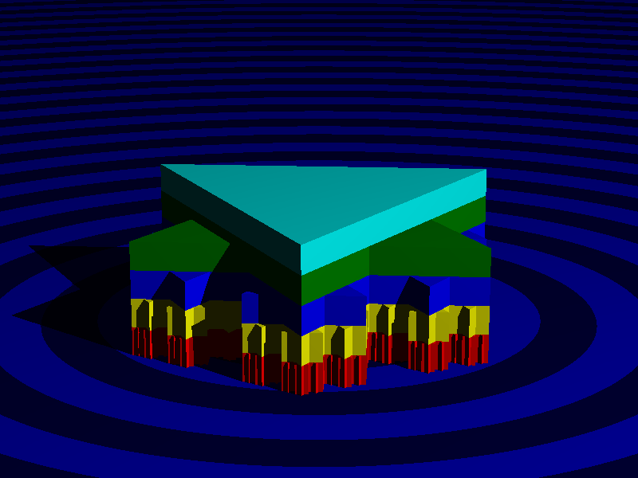
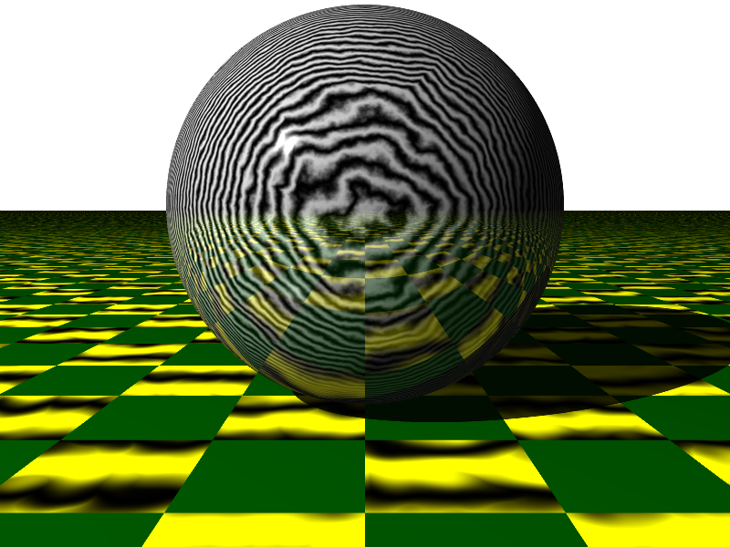
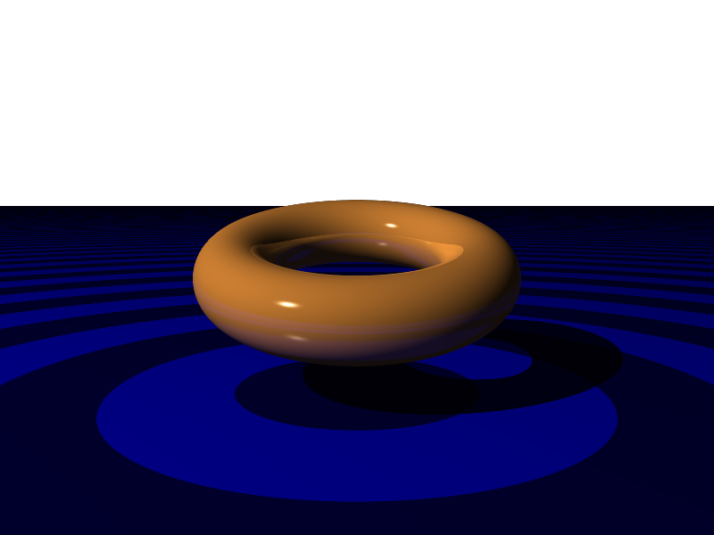

## Gallery of images

All the images collected from the parts of the gallery are shown below.  Clicking on each
thumbnail will show the full sized image.  Clicking the image title will show the source
`.igl` file that generated it.

### Ray Tracer Challenge Book

<table style="width: 100%; border: none;">
  <tr style="border: none;">
    <td style="border: none;"></td>
    <td style="margin-left: 8px; margin-right: 8px; border: none; vertical-align: middle;">
      <a href="challenge-book/chapter-6/black.igl">'Basic Sphere, Black Background</a>
    </td>
  </tr>
  <tr style="border: none;">
    <td style="border: none;"></td>
    <td style="margin-left: 8px; margin-right: 8px; border: none; vertical-align: middle;">
      <a href="challenge-book/chapter-6/transparent.igl">'Basic Sphere, Transparent Background</a>
    </td>
  </tr>
  <tr style="border: none;">
    <td style="border: none;"></td>
    <td style="margin-left: 8px; margin-right: 8px; border: none; vertical-align: middle;">
      <a href="challenge-book/chapter-7/no-shadows.igl">'Spheres in a Box, No Shadows</a>
    </td>
  </tr>
  <tr style="border: none;">
    <td style="border: none;"></td>
    <td style="margin-left: 8px; margin-right: 8px; border: none; vertical-align: middle;">
      <a href="challenge-book/chapter-8/shadows.igl">'Spheres in a Box, Shadows</a>
    </td>
  </tr>
  <tr style="border: none;">
    <td style="border: none;"></td>
    <td style="margin-left: 8px; margin-right: 8px; border: none; vertical-align: middle;">
      <a href="challenge-book/chapter-9/floor.igl">'Spheres on the Floor</a>
    </td>
  </tr>
  <tr style="border: none;">
    <td style="border: none;"></td>
    <td style="margin-left: 8px; margin-right: 8px; border: none; vertical-align: middle;">
      <a href="challenge-book/chapter-10/blend.igl">'Blended Patterns</a>
    </td>
  </tr>
  <tr style="border: none;">
    <td style="border: none;"></td>
    <td style="margin-left: 8px; margin-right: 8px; border: none; vertical-align: middle;">
      <a href="challenge-book/chapter-10/gradients.igl">'Things with Gradients</a>
    </td>
  </tr>
  <tr style="border: none;">
    <td style="border: none;"></td>
    <td style="margin-left: 8px; margin-right: 8px; border: none; vertical-align: middle;">
      <a href="challenge-book/chapter-10/patterns.igl">'Things with Basic Patterns</a>
    </td>
  </tr>
  <tr style="border: none;">
    <td style="border: none;"></td>
    <td style="margin-left: 8px; margin-right: 8px; border: none; vertical-align: middle;">
      <a href="challenge-book/chapter-10/patterns2.igl">'Showing More Patterns</a>
    </td>
  </tr>
  <tr style="border: none;">
    <td style="border: none;"></td>
    <td style="margin-left: 8px; margin-right: 8px; border: none; vertical-align: middle;">
      <a href="challenge-book/chapter-10/patterns3.igl">'Showing Even More Patterns</a>
    </td>
  </tr>
  <tr style="border: none;">
    <td style="border: none;"></td>
    <td style="margin-left: 8px; margin-right: 8px; border: none; vertical-align: middle;">
      <a href="challenge-book/chapter-10/planet.igl">'A Planet</a>
    </td>
  </tr>
  <tr style="border: none;">
    <td style="border: none;"></td>
    <td style="margin-left: 8px; margin-right: 8px; border: none; vertical-align: middle;">
      <a href="challenge-book/chapter-10/stripes.igl">'A Floor with Nested Striping</a>
    </td>
  </tr>
  <tr style="border: none;">
    <td style="border: none;"></td>
    <td style="margin-left: 8px; margin-right: 8px; border: none; vertical-align: middle;">
      <a href="challenge-book/chapter-11/lake.igl">'A Lake, Kind of</a>
    </td>
  </tr>
  <tr style="border: none;">
    <td style="border: none;"></td>
    <td style="margin-left: 8px; margin-right: 8px; border: none; vertical-align: middle;">
      <a href="challenge-book/chapter-11/reflections.igl">'Glassy Reflections</a>
    </td>
  </tr>
  <tr style="border: none;">
    <td style="border: none;"></td>
    <td style="margin-left: 8px; margin-right: 8px; border: none; vertical-align: middle;">
      <a href="challenge-book/chapter-12/cube.igl">'Rectangular Solids</a>
    </td>
  </tr>
  <tr style="border: none;">
    <td style="border: none;"></td>
    <td style="margin-left: 8px; margin-right: 8px; border: none; vertical-align: middle;">
      <a href="challenge-book/chapter-12/room.igl">'A Room with a Mirror, All Rectangular Solids</a>
    </td>
  </tr>
  <tr style="border: none;">
    <td style="border: none;"></td>
    <td style="margin-left: 8px; margin-right: 8px; border: none; vertical-align: middle;">
      <a href="challenge-book/chapter-13/circulars.igl">'Cylinders and Conics</a>
    </td>
  </tr>
  <tr style="border: none;">
    <td style="border: none;"></td>
    <td style="margin-left: 8px; margin-right: 8px; border: none; vertical-align: middle;">
      <a href="challenge-book/chapter-14/hex.igl">'Hexagon from a Repeating Group</a>
    </td>
  </tr>
  <tr style="border: none;">
    <td style="border: none;"></td>
    <td style="margin-left: 8px; margin-right: 8px; border: none; vertical-align: middle;">
      <a href="challenge-book/chapter-14/pointy-thing.igl">'A Pointy Thing</a>
    </td>
  </tr>
  <tr style="border: none;">
    <td style="border: none;"></td>
    <td style="margin-left: 8px; margin-right: 8px; border: none; vertical-align: middle;">
      <a href="challenge-book/chapter-15/object-file-no-normals.igl">'A Simple Teddy Bear</a>
    </td>
  </tr>
  <tr style="border: none;">
    <td style="border: none;"></td>
    <td style="margin-left: 8px; margin-right: 8px; border: none; vertical-align: middle;">
      <a href="challenge-book/chapter-15/object-file-with-normals.igl">'A Christmas Tree Ornament</a>
    </td>
  </tr>
  <tr style="border: none;">
    <td style="border: none;"></td>
    <td style="margin-left: 8px; margin-right: 8px; border: none; vertical-align: middle;">
      <a href="challenge-book/chapter-15/parallelogram.igl">'2D in 3d: Parallelograms</a>
    </td>
  </tr>
  <tr style="border: none;">
    <td style="border: none;"></td>
    <td style="margin-left: 8px; margin-right: 8px; border: none; vertical-align: middle;">
      <a href="challenge-book/chapter-15/smooth-triangle.igl">'2D in 3d: Smooth Triangles</a>
    </td>
  </tr>
  <tr style="border: none;">
    <td style="border: none;"></td>
    <td style="margin-left: 8px; margin-right: 8px; border: none; vertical-align: middle;">
      <a href="challenge-book/chapter-15/triangle.igl">'2D in 3d: Triangles</a>
    </td>
  </tr>
  <tr style="border: none;">
    <td style="border: none;"></td>
    <td style="margin-left: 8px; margin-right: 8px; border: none; vertical-align: middle;">
      <a href="challenge-book/chapter-16/csg.igl">'Basic CSG Examples</a>
    </td>
  </tr>
  <tr style="border: none;">
    <td style="border: none;"></td>
    <td style="margin-left: 8px; margin-right: 8px; border: none; vertical-align: middle;">
      <a href="challenge-book/chapter-16/csg2.igl">'More CSF: A Picture from the Book</a>
    </td>
  </tr>
  <tr style="border: none;">
    <td style="border: none;"></td>
    <td style="margin-left: 8px; margin-right: 8px; border: none; vertical-align: middle;">
      <a href="challenge-book/chapter-16/dice.igl">'Three Dice: Another Picture from the Book</a>
    </td>
  </tr>
  <tr style="border: none;">
    <td style="border: none;"></td>
    <td style="margin-left: 8px; margin-right: 8px; border: none; vertical-align: middle;">
      <a href="challenge-book/cover.igl">The Ray Tracer Challenge Cover Art</a>
    </td>
  </tr>
</table>

### Stuff Invented Here

<table style="width: 100%; border: none;">
  <tr style="border: none;">
    <td style="border: none;"></td>
    <td style="margin-left: 8px; margin-right: 8px; border: none; vertical-align: middle;">
      <a href="Local/extrusion.igl">Extrusion Test</a>
    </td>
  </tr>
  <tr style="border: none;">
    <td style="border: none;"></td>
    <td style="margin-left: 8px; margin-right: 8px; border: none; vertical-align: middle;">
      <a href="Local/extrusion2.igl">Another Extrusion Test</a>
    </td>
  </tr>
  <tr style="border: none;">
    <td style="border: none;"></td>
    <td style="margin-left: 8px; margin-right: 8px; border: none; vertical-align: middle;">
      <a href="Local/l-systems/axial.igl">L-System Test: Axial Tree</a>
    </td>
  </tr>
  <tr style="border: none;">
    <td style="border: none;"></td>
    <td style="margin-left: 8px; margin-right: 8px; border: none; vertical-align: middle;">
      <a href="Local/l-systems/context-sensitive.igl">L-System Test: Context-Sensitive</a>
    </td>
  </tr>
  <tr style="border: none;">
    <td style="border: none;"></td>
    <td style="margin-left: 8px; margin-right: 8px; border: none; vertical-align: middle;">
      <a href="Local/l-systems/hilbert.igl">L-System Test: Hilbert Curve</a>
    </td>
  </tr>
  <tr style="border: none;">
    <td style="border: none;"></td>
    <td style="margin-left: 8px; margin-right: 8px; border: none; vertical-align: middle;">
      <a href="Local/l-systems/snowflake-2.igl">L-System Test: Snowflake Outline</a>
    </td>
  </tr>
  <tr style="border: none;">
    <td style="border: none;"></td>
    <td style="margin-left: 8px; margin-right: 8px; border: none; vertical-align: middle;">
      <a href="Local/l-systems/snowflake.igl">L-System Test: Snowflake</a>
    </td>
  </tr>
  <tr style="border: none;">
    <td style="border: none;"></td>
    <td style="margin-left: 8px; margin-right: 8px; border: none; vertical-align: middle;">
      <a href="Local/noise.igl">Pigment Noise Test</a>
    </td>
  </tr>
  <tr style="border: none;">
    <td style="border: none;"></td>
    <td style="margin-left: 8px; margin-right: 8px; border: none; vertical-align: middle;">
      <a href="Local/text.igl">Text Solid Test</a>
    </td>
  </tr>
  <tr style="border: none;">
    <td style="border: none;"></td>
    <td style="margin-left: 8px; margin-right: 8px; border: none; vertical-align: middle;">
      <a href="Local/torus.igl">Torus Test</a>
    </td>
  </tr>
</table>
