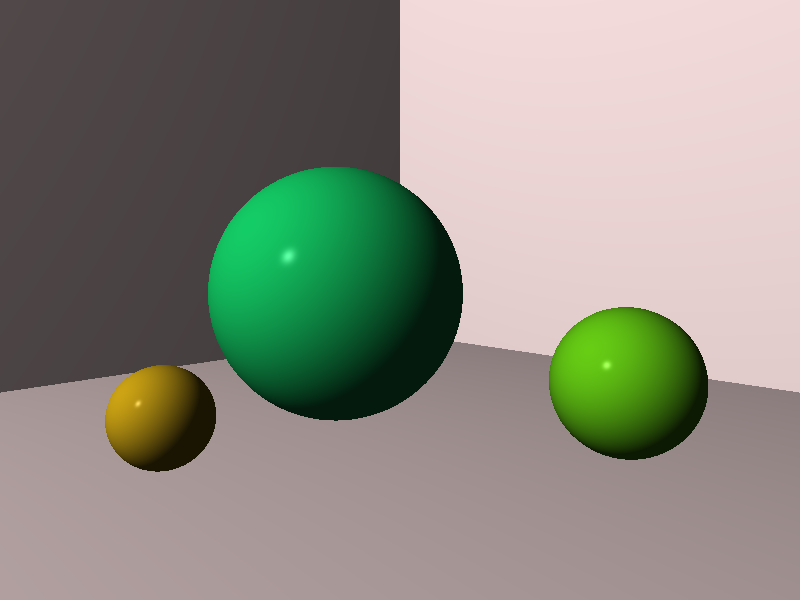
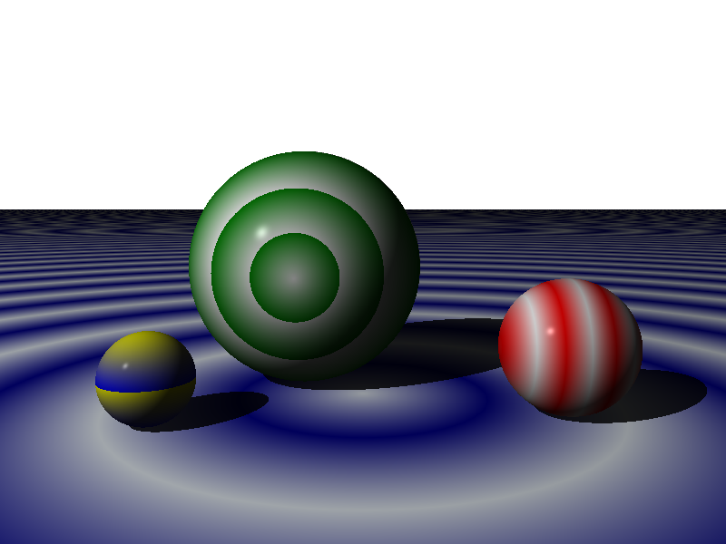
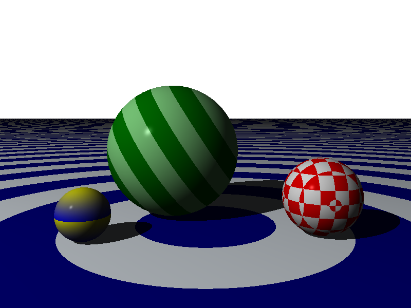

## Gallery of images

All the images collected from the parts of the gallery are shown below.  Clicking on each
will show the source `.igl` file that generated it.

[TOC]

### Ray Tracer Challenge Book

<table style="width: 100%; border: none">
    <tr>
        <td></td>
        <td style="padding-left: 8px;">Basic Sphere, Black Background</td>
    </tr>
</table>
|  | Basic Sphere, Transparent Background

#### Spheres in a Box, No Shadows

#### Spheres in a Box, Shadows

#### Spheres on the Floor

#### Blended Patterns

#### Spheres with Gradients

#### Spheres with Patterns

#### More Patterns

#### Even More Patterns

#### A Planet

#### A Crazily Striped Floor

